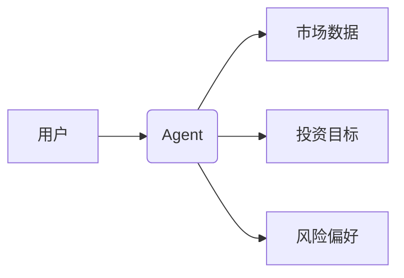
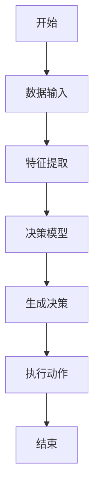
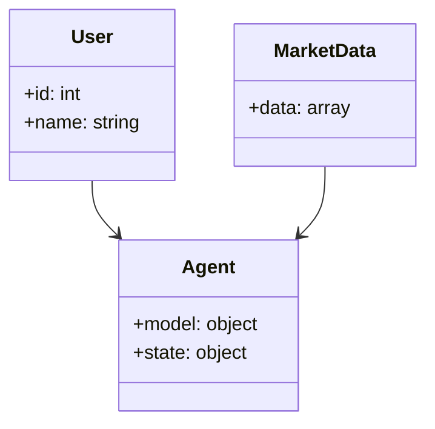
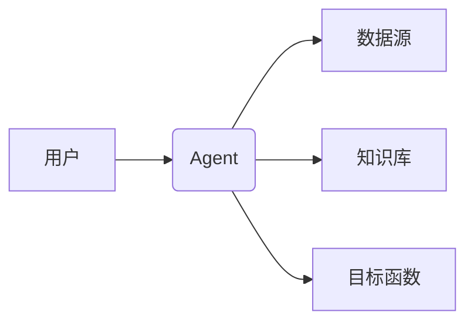
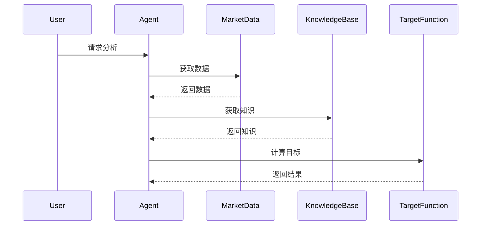

                 


# AI Agent在智能资产管理中的应用

## 关键词：AI Agent、智能资产管理、算法原理、系统架构、项目实战

## 摘要

AI Agent（人工智能代理）作为一类能够感知环境、自主决策并执行任务的智能体，正在逐步改变资产管理行业的传统模式。本文从AI Agent的基本概念出发，分析其在智能资产管理中的应用背景、核心概念、算法原理、系统架构及项目实战，通过具体案例展示其在资产管理中的实际应用价值。文章最后总结了AI Agent在智能资产管理中的最佳实践，为相关从业者提供参考。

---

## 第一部分：AI Agent在智能资产管理中的应用概述

## 第1章：AI Agent的基本概念与背景

### 1.1 AI Agent的定义与特点

#### 1.1.1 AI Agent的定义

AI Agent是一种能够感知环境、自主决策并执行任务的智能体。它能够根据环境反馈不断优化自身行为，以实现预设目标。与传统的算法模型不同，AI Agent具有更强的自主性和适应性。

#### 1.1.2 AI Agent的核心特点

- **自主性**：AI Agent能够独立感知环境并做出决策，无需外部干预。
- **反应性**：能够实时感知环境变化并迅速做出反应。
- **目标导向**：所有行为都围绕实现特定目标展开。
- **学习能力**：通过与环境的交互不断优化自身行为。

#### 1.1.3 AI Agent与传统算法的区别

| 特性            | 传统算法                          | AI Agent                        |
|-----------------|----------------------------------|---------------------------------|
| 执行方式        | 离线计算，按规则处理数据          | 实时感知，动态调整行为          |
| 决策方式        | 基于预设规则，结果确定           | 基于环境反馈，结果可变         |
| 适应性          | 无自适应能力                     | 具备自适应能力                 |

### 1.2 智能资产管理的背景与挑战

#### 1.2.1 资产管理的基本概念

资产管理是指通过科学的配置和管理资产，以实现资产保值、增值的过程。传统资产管理依赖人工经验，存在效率低、决策滞后等问题。

#### 1.2.2 智能化资产管理的需求

- 提高决策效率和准确性
- 实现资产配置的动态优化
- 解决多目标下的复杂决策问题

#### 1.2.3 当前资产管理中的主要挑战

- 数据量大且复杂
- 决策需要实时性
- 需要多目标优化

### 1.3 AI Agent在资产管理中的应用前景

#### 1.3.1 AI Agent的潜在应用场景

- **数据处理**：实时分析市场数据，识别潜在投资机会。
- **决策支持**：根据市场变化动态调整投资组合。
- **风险控制**：实时监控市场风险，制定应对策略。

#### 1.3.2 企业采用AI Agent的优势

- 提高决策效率和准确性
- 实现资产配置的动态优化
- 提升整体投资收益

#### 1.3.3 AI Agent应用的挑战与机遇

- **挑战**：数据隐私、模型解释性、计算资源需求
- **机遇**：技术进步、数据积累、市场需求

---

## 第二部分：AI Agent的核心概念与联系

## 第2章：AI Agent的核心概念与联系

### 2.1 AI Agent的原理与架构

#### 2.1.1 AI Agent的感知层

感知层负责接收环境中的数据，包括市场数据、用户输入等。常用的技术包括自然语言处理和计算机视觉。

#### 2.1.2 AI Agent的决策层

决策层基于感知到的数据，结合目标函数，生成最优决策。常用技术包括强化学习和多目标优化。

#### 2.1.3 AI Agent的执行层

执行层根据决策结果，调用相关服务或API，完成实际操作。

### 2.2 AI Agent与相关技术的对比

#### 2.2.1 AI Agent与传统机器学习模型的对比

| 特性            | 传统机器学习 | AI Agent                 |
|-----------------|--------------|--------------------------|
| 数据依赖        | 高           | 中到高                 |
| 任务目标        | 单一任务     | 多目标                 |
| 环境交互        | 无           | 有                      |

#### 2.2.2 AI Agent与强化学习的对比

| 特性            | 强化学习      | AI Agent                 |
|-----------------|--------------|--------------------------|
| 决策依据        | 状态和动作    | 状态、动作和目标函数     |
| 反馈机制        | 奖励信号      | 多种反馈                |
| 应用场景        | 游戏、机器人   | 资产管理、金融交易       |

#### 2.2.3 AI Agent与知识图谱的对比

| 特性            | 知识图谱      | AI Agent                 |
|-----------------|--------------|--------------------------|
| 核心功能        | 表示知识      | 实现智能决策              |
| 交互方式        | 静态查询      | 动态交互                |

### 2.3 AI Agent的实体关系图



---

## 第三部分：AI Agent的算法原理

## 第3章：AI Agent的算法原理

### 3.1 AI Agent的感知阶段

#### 3.1.1 数据预处理

```python
import pandas as pd
data = pd.read_csv('market_data.csv')
data = data.dropna().astype(float)
```

#### 3.1.2 特征提取

```python
from sklearn.decomposition import PCA
pca = PCA(n_components=10)
features = pca.fit_transform(data)
```

#### 3.1.3 感知模型的构建

```python
import tensorflow as tf
model = tf.keras.Sequential([
    tf.keras.layers.Dense(64, activation='relu'),
    tf.keras.layers.Dense(1, activation='linear')
])
model.compile(optimizer='adam', loss='mse')
model.fit(features, labels, epochs=100)
```

### 3.2 AI Agent的决策阶段

#### 3.2.1 决策树的构建

```python
from sklearn.tree import DecisionTreeClassifier
model = DecisionTreeClassifier()
model.fit(features, labels)
```

#### 3.2.2 基于强化学习的决策

```python
import gym
env = gym.make('StockTrading-v0')
agent = Agent(env.observation_space.shape[0], env.action_space.n)
agent.train(env, num_episodes=1000)
```

#### 3.2.3 多目标优化的决策过程

```latex
$$\text{目标函数：} \quad f(x) = \max(\alpha \cdot x + \beta \cdot y)$$
$$\text{约束条件：} \quad x + y \leq 1$$
```

### 3.3 AI Agent的执行阶段

#### 3.3.1 动作选择

```python
action = agent.predict(state)
```

#### 3.3.2 动作执行

```python
env.step(action)
```

#### 3.3.3 执行结果的反馈

```python
reward = env.get_reward()
agent.update_model(reward)
```

### 3.4 算法流程图



---

## 第四部分：AI Agent的系统分析与架构设计

## 第4章：AI Agent的系统分析与架构设计

### 4.1 系统功能设计



### 4.2 系统架构设计



### 4.3 系统接口设计



---

## 第五部分：AI Agent的项目实战

## 第5章：AI Agent的项目实战

### 5.1 环境安装

```bash
pip install numpy pandas scikit-learn tensorflow gym
```

### 5.2 核心代码实现

```python
class Agent:
    def __init__(self, input_dim, output_dim):
        self.model = self.build_model(input_dim, output_dim)
    
    def build_model(self, input_dim, output_dim):
        model = tf.keras.Sequential([
            tf.keras.layers.Dense(64, activation='relu', input_dim=input_dim),
            tf.keras.layers.Dense(output_dim, activation='linear')
        ])
        return model
    
    def train(self, env, num_episodes=100):
        for _ in range(num_episodes):
            state = env.reset()
            while not env.done:
                action = self.predict(state)
                next_state, reward, done = env.step(action)
                self.update_model(reward)
```

### 5.3 实际案例分析

```python
env = StockTradingEnv(initial_balance=10000)
agent = Agent(state_shape, action_shape)
agent.train(env, num_episodes=1000)
```

### 5.4 项目小结

通过实际案例，我们可以看到AI Agent在资产管理中的强大能力。它能够实时分析市场数据，动态调整投资策略，显著提高投资收益。

---

## 第六部分：AI Agent的最佳实践

## 第6章：AI Agent的最佳实践

### 6.1 小结

AI Agent作为一种新兴的技术，正在逐步改变资产管理行业的传统模式。它能够实时感知环境、自主决策并执行任务，显著提高了资产管理的效率和准确性。

### 6.2 注意事项

- 数据隐私和安全问题需要高度重视
- 模型的解释性和透明度需要进一步提升
- 需要结合具体业务场景进行优化

### 6.3 拓展阅读

- 《强化学习：理论与算法》
- 《知识图谱：概念、方法与应用》
- 《智能系统与AI Agent》

---

通过本文的详细讲解，我们深入探讨了AI Agent在智能资产管理中的应用，从理论到实践，为相关从业者提供了宝贵的参考和指导。希望未来随着技术的进步，AI Agent能够在资产管理领域发挥更大的作用。

