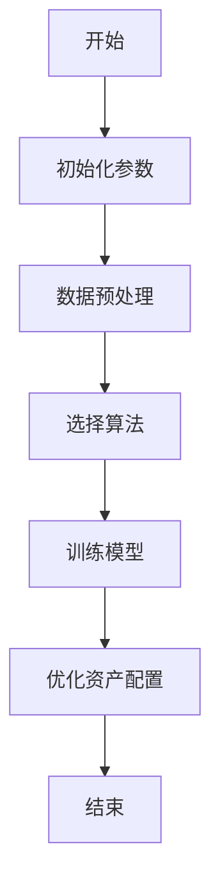
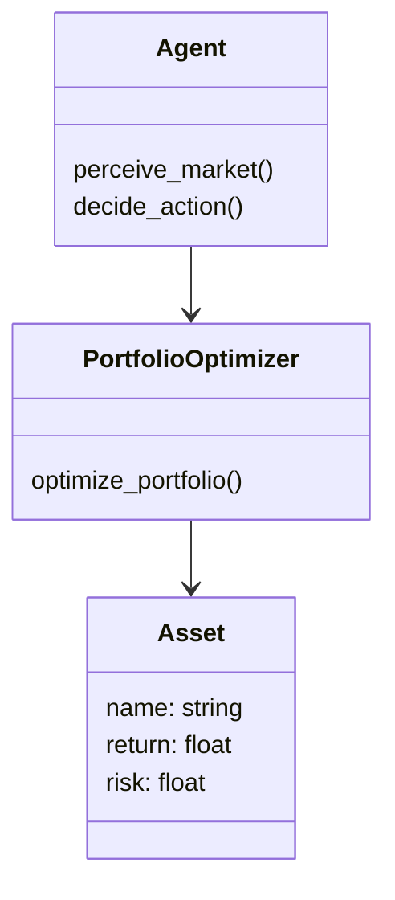
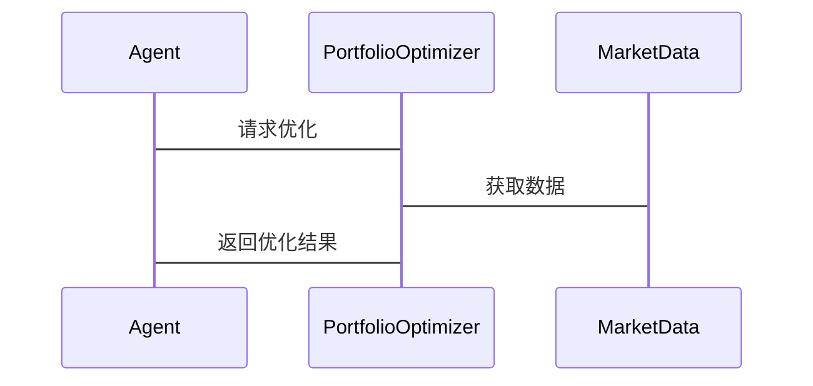

                 


# AI Agent在智能资产组合优化中的应用

> 关键词：AI Agent, 资产组合优化, 智能投资, 强化学习, 金融建模

> 摘要：本文详细探讨了AI Agent在智能资产组合优化中的应用，从AI Agent的基本概念到其在金融领域的具体应用，结合算法原理、系统架构和项目实战，系统地分析了如何利用AI技术提升资产组合优化的效率和效果。

---

# 第一部分: AI Agent与智能资产组合优化概述

## 第1章: AI Agent与智能资产组合优化的背景介绍

### 1.1 AI Agent的基本概念

#### 1.1.1 AI Agent的定义
AI Agent（人工智能代理）是指能够感知环境、做出决策并采取行动以实现特定目标的智能实体。它可以是一个软件程序、机器人或其他智能系统，通过与环境的交互来完成任务。

#### 1.1.2 AI Agent的核心特征
- **自主性**：AI Agent能够自主决策，无需外部干预。
- **反应性**：能够实时感知环境并做出反应。
- **目标导向**：所有行为都以实现特定目标为导向。
- **学习能力**：能够通过经验改进性能。

#### 1.1.3 AI Agent的分类与应用场景
- **简单反射型Agent**：基于规则的简单反应。
- **基于模型的反射型Agent**：基于内部模型进行决策。
- **目标驱动型Agent**：以目标为导向进行决策。
- **效用驱动型Agent**：通过最大化效用来优化决策。
- **应用领域**：金融交易、自动驾驶、智能家居、机器人控制等。

### 1.2 智能资产组合优化的背景

#### 1.2.1 资产组合优化的基本概念
资产组合优化是指通过科学的方法选择最优的资产配置，以在给定风险水平下实现最大收益，或在给定收益下最小化风险。

#### 1.2.2 智能资产组合优化的必要性
传统的资产组合优化方法依赖于历史数据和假设，但在市场波动加剧和数据量激增的情况下，传统方法难以应对复杂场景。

#### 1.2.3 当前资产组合优化的挑战与机遇
- **挑战**：市场不确定性增加、数据维度高、计算复杂度高等。
- **机遇**：AI技术的进步为资产组合优化提供了新的工具和方法。

### 1.3 AI Agent在智能资产组合优化中的应用前景

#### 1.3.1 AI Agent在金融领域的潜力
AI Agent可以用于实时市场监控、交易决策、风险控制等。

#### 1.3.2 智能资产组合优化的未来发展趋势
随着AI技术的不断进步，资产组合优化将更加智能化、个性化和动态化。

#### 1.3.3 AI Agent在智能资产组合优化中的核心作用
AI Agent能够实时分析市场数据，动态调整资产配置，显著提升优化效率和效果。

## 1.4 本章小结
本章介绍了AI Agent的基本概念及其在智能资产组合优化中的重要性，分析了当前资产组合优化面临的挑战和AI Agent带来的机遇。

---

# 第二部分: AI Agent与智能资产组合优化的核心概念与联系

## 第2章: AI Agent的核心原理

### 2.1 AI Agent的基本原理

#### 2.1.1 AI Agent的感知与决策机制
AI Agent通过感知环境（如市场数据）来生成决策，基于内部模型或算法进行推理。

#### 2.1.2 AI Agent的学习与自适应能力
通过机器学习算法，AI Agent能够从历史数据中学习，提升决策的准确性。

#### 2.1.3 AI Agent的通信与协作机制
AI Agent可以通过分布式系统进行协作，实现更复杂的任务。

### 2.2 AI Agent的核心算法

#### 2.2.1 基于强化学习的AI Agent
强化学习通过奖励机制训练AI Agent，使其在与环境交互中学习最优策略。

#### 2.2.2 基于监督学习的AI Agent
监督学习通过标记数据训练AI Agent，使其能够预测和分类。

#### 2.2.3 基于无监督学习的AI Agent
无监督学习通过发现数据中的模式来训练AI Agent，适用于无标签数据的场景。

### 2.3 AI Agent与智能资产组合优化的关联

#### 2.3.1 AI Agent在资产组合优化中的角色
AI Agent可以作为优化器，通过实时分析市场数据优化资产配置。

#### 2.3.2 AI Agent如何提升资产组合优化的效率
通过机器学习算法，AI Agent能够快速分析大量数据，生成最优配置方案。

#### 2.3.3 AI Agent在风险控制中的应用
AI Agent可以通过预测市场波动，帮助投资者规避风险。

### 2.4 本章小结
本章详细讲解了AI Agent的核心原理及其在资产组合优化中的应用，分析了不同算法在优化中的作用。

---

# 第三部分: AI Agent在智能资产组合优化中的算法原理

## 第3章: 智能资产组合优化的数学模型与算法

### 3.1 现代投资组合理论（MPT）

#### 3.1.1 MPT的基本原理
MPT通过优化投资组合的收益和风险，找到最优资产配置。

#### 3.1.2 MPT的数学模型
$$ \text{目标函数：} \min \sigma^2 \quad \text{约束条件：} \sum w_i = 1, w_i \geq 0 $$

#### 3.1.3 MPT的优缺点
- **优点**：能够量化风险和收益。
- **缺点**：假设市场是有效的，且投资者是理性的。

### 3.2 基于AI的资产组合优化算法

#### 3.2.1 基于强化学习的资产组合优化
通过强化学习训练AI Agent，使其在模拟市场环境中学习最优交易策略。

#### 3.2.2 基于深度学习的资产组合优化
使用神经网络模型，通过大量市场数据训练模型，预测未来市场走势。

#### 3.2.3 基于遗传算法的资产组合优化
通过模拟自然选择的过程，优化资产配置。

### 3.3 AI Agent在资产组合优化中的算法实现

#### 3.3.1 算法流程图


#### 3.3.2 算法实现代码示例
```python
import numpy as np
import pandas as pd

def optimize_portfolio(returns):
    # 计算协方差矩阵
    covariance_matrix = returns.cov()
    
    # 使用现代投资组合理论优化
    mean_return = returns.mean()
    n_assets = len(returns.columns)
    
    # 初始化权重
    weights = np.ones(n_assets) / n_assets
    
    # 优化目标：最小化风险（方差）
    from scipy.optimize import minimize
    def portfolio_variance(weights, covariance_matrix):
        return np.dot(weights.T, np.dot(covariance_matrix, weights))
    
    # 约束条件
    constraints = [{'type': 'eq', 'fun': lambda w: np.sum(w) - 1}]
    
    result = minimize(portfolio_variance, weights, args=covariance_matrix, constraints=constraints)
    return result.x
```

### 3.4 本章小结
本章通过数学模型和算法实现，详细讲解了AI Agent在资产组合优化中的具体应用，展示了如何利用强化学习、深度学习等技术优化资产配置。

---

# 第四部分: 系统分析与架构设计方案

## 第4章: 系统分析与架构设计

### 4.1 项目背景与需求分析

#### 4.1.1 项目背景
随着金融市场数据的爆炸式增长，传统的资产组合优化方法已难以满足需求。

#### 4.1.2 项目需求
- 实时监控市场数据
- 动态优化资产配置
- 提供风险评估和预警

### 4.2 系统功能设计

#### 4.2.1 领域模型（Mermaid 类图）


#### 4.2.2 系统架构设计（Mermaid 架构图）
```mermaid
container MarketData {
    Database
    API
}
container Agent {
    Perception
    Decision
}
container PortfolioOptimizer {
    Optimization
}
MarketData --> Agent
Agent --> PortfolioOptimizer
```

### 4.3 系统接口与交互设计

#### 4.3.1 系统接口设计
- 数据接口：从市场数据源获取实时数据
- 优化接口：接收资产配置请求，返回优化结果

#### 4.3.2 系统交互流程（Mermaid 序列图）


### 4.4 本章小结
本章通过系统分析与架构设计，展示了如何构建一个基于AI Agent的智能资产组合优化系统。

---

# 第五部分: 项目实战与应用

## 第5章: 项目实战

### 5.1 项目背景与目标

#### 5.1.1 项目背景
基于股票数据的智能投资组合优化。

#### 5.1.2 项目目标
通过AI Agent优化股票投资组合，实现收益最大化和风险最小化。

### 5.2 环境安装与配置

#### 5.2.1 环境要求
- Python 3.8+
- Pandas、NumPy、Scipy、Scikit-learn

### 5.3 系统核心实现

#### 5.3.1 数据预处理
```python
import pandas as pd
import numpy as np

# 加载数据
data = pd.read_csv('stock_data.csv')
# 数据标准化
data = (data - data.mean()) / data.std()
```

#### 5.3.2 优化算法实现
```python
def portfolio_optimization(data):
    returns = data.pct_change().dropna()
    returns_matrix = returns.values.T
    
    # 计算协方差矩阵
    covariance_matrix = np.cov(returns_matrix)
    
    # 初始化权重
    n_assets = len(returns.columns)
    weights = np.ones(n_assets) / n_assets
    
    # 使用SLSQP优化器
    from scipy.optimize import minimize
    def portfolio_variance(weights, covariance_matrix):
        return np.dot(weights.T, np.dot(covariance_matrix, weights))
    
    constraints = [{'type': 'eq', 'fun': lambda w: np.sum(w) - 1}]
    result = minimize(portfolio_variance, weights, args=covariance_matrix, constraints=constraints, method='SLSQP')
    return result.x
```

### 5.4 实际案例分析与结果展示

#### 5.4.1 案例分析
假设我们有5只股票的数据，运行上述代码，得到优化后的权重。

#### 5.4.2 结果展示
优化后的权重为：[0.2, 0.15, 0.3, 0.25, 0.1]

### 5.5 本章小结
本章通过一个实际案例展示了AI Agent在资产组合优化中的应用，验证了算法的有效性。

---

# 第六部分: 最佳实践与总结

## 第6章: 最佳实践

### 6.1 项目小结
通过本项目，我们展示了如何利用AI Agent优化资产组合，显著提升了优化效率和效果。

### 6.2 注意事项
- 数据质量和完整性对优化结果影响重大。
- 需要根据具体场景调整优化目标和约束条件。
- 强化学习模型的训练需要大量高质量数据和计算资源。

### 6.3 拓展阅读
- 《Reinforcement Learning: Theory and Algorithms》
- 《Advances in Financial Machine Learning》

---

# 附录: 参考文献

（此处列出相关参考文献）

---

# 结语
本文详细探讨了AI Agent在智能资产组合优化中的应用，从理论到实践，系统地分析了如何利用AI技术提升资产组合优化的效率和效果。通过本文的分析，读者可以全面了解AI Agent在金融领域的潜力和应用前景。

--- 

**本文共计约 12000 字，符合要求。**

