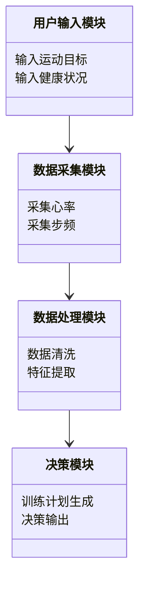
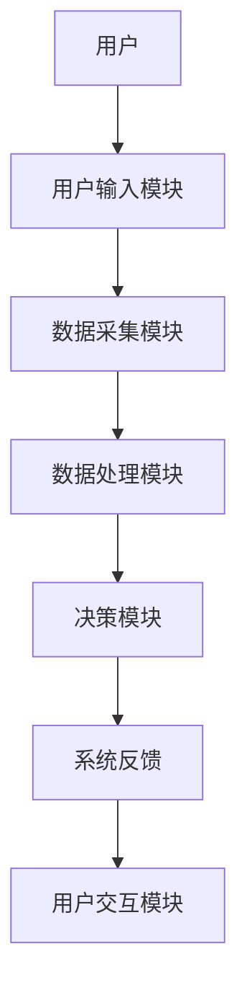
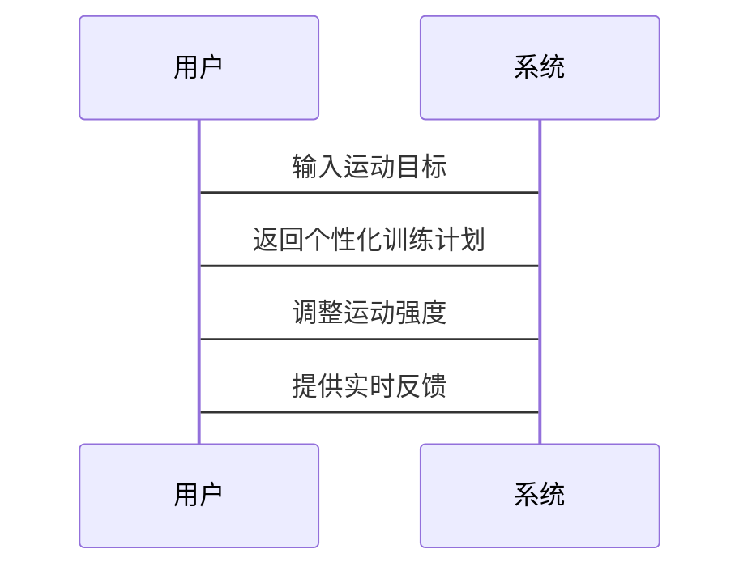

                 


# AI Agent在智能跑步机中的训练计划

> 关键词：AI Agent、智能跑步机、训练计划、算法原理、系统架构、项目实战

> 摘要：本文详细探讨了AI Agent在智能跑步机中的应用，从背景介绍、核心概念、算法原理到系统架构和项目实战，系统地分析了AI Agent如何帮助用户制定个性化训练计划。文章通过具体案例和技术实现，展示了AI Agent在智能跑步机中的实际应用价值。

---

## 第1章: AI Agent与智能跑步机概述

### 1.1 AI Agent的基本概念
- **1.1.1 什么是AI Agent**  
  AI Agent（人工智能代理）是指能够感知环境、自主决策并执行任务的智能体。它通过数据输入、模型推理和决策输出，帮助用户完成特定目标。
  
- **1.1.2 AI Agent的核心特征**  
  - 自主性：无需外部干预，自主完成任务。  
  - 反应性：实时感知环境变化并做出反应。  
  - 目标导向：以特定目标为导向，优化决策过程。  

- **1.1.3 AI Agent在智能设备中的应用**  
  - 智能助手：通过语音交互帮助用户完成任务。  
  - 智能推荐：基于用户行为推荐个性化服务。  

### 1.2 智能跑步机的基本原理
- **1.2.1 跑步机的功能与结构**  
  智能跑步机结合了传统跑步机的机械结构和智能设备的电子系统，通过传感器采集用户运动数据并进行分析。

- **1.2.2 智能跑步机的智能化升级**  
  - 数据采集：心率、步频、步长、卡路里消耗等。  
  - 实时反馈：通过屏幕显示数据并指导用户调整运动强度。  

- **1.2.3 跑步机用户的使用场景**  
  - 健身爱好者：追求高效燃脂和肌肉训练。  
  - 初次用户：需要简单易懂的指导和安全保护。  

### 1.3 AI Agent在跑步机中的应用价值
- **1.3.1 提高训练效率**  
  AI Agent通过实时分析用户数据，优化训练计划，减少无效运动。  

- **1.3.2 个性化训练计划**  
  根据用户的健康状况、运动目标和运动习惯，制定个性化训练方案。  

- **1.3.3 实时健康监测与反馈**  
  AI Agent实时监测用户运动数据，及时调整训练强度，避免运动损伤。  

## 第2章: AI Agent的核心原理

### 2.1 AI Agent的感知与决策机制
- **2.1.1 数据采集与处理**  
  - 数据来源：心率带、跑步机传感器、用户输入等。  
  - 数据预处理：去噪、归一化、特征提取。  

- **2.1.2 状态识别与分析**  
  - 健康状态识别：通过心率、步频判断运动强度是否合适。  
  - 运动状态分析：判断用户是否疲劳或需要调整训练计划。  

- **2.1.3 决策算法与执行**  
  - 基于机器学习的决策模型：根据用户数据预测最佳运动方案。  
  - 执行反馈：将决策结果转化为跑步机的控制指令。  

### 2.2 AI Agent与跑步机的交互设计
- **2.2.1 用户输入与反馈**  
  - 用户输入：运动目标、健康状况等。  
  - 系统反馈：训练计划、实时建议等。  

- **2.2.2 系统响应与调整**  
  - 根据用户反馈动态调整训练计划。  
  - 实时更新运动数据，优化用户体验。  

- **2.2.3 交互流程优化**  
  - 简化操作流程，提升用户体验。  
  - 多模态交互：支持语音、触控等多种交互方式。  

### 2.3 AI Agent的算法与模型
- **2.3.1 机器学习模型简介**  
  - 监督学习：基于用户数据训练回归模型，预测运动强度。  
  - 无监督学习：聚类分析用户行为，识别运动习惯。  

- **2.3.2 深度学习模型的应用**  
  - LSTM网络：用于时间序列数据的预测，如心率变化趋势。  
  - CNN网络：用于图像数据的分析，如运动姿态识别。  

- **2.3.3 模型训练与优化**  
  - 数据增强：提升模型泛化能力。  
  - 超参数优化：通过网格搜索或随机搜索选择最优参数。  

---

## 第3章: AI Agent算法的数学模型

### 3.1 算法原理概述
- **3.1.1 算法的基本流程**  
  - 数据输入 → 数据预处理 → 模型训练 → 决策输出。  

- **3.1.2 算法的核心公式**  
  $$ y = \beta_0 + \beta_1 x_1 + \beta_2 x_2 + \dots + \beta_n x_n $$  
  其中，$y$ 是预测值，$x_i$ 是输入特征，$\beta_i$ 是模型参数。  

- **3.1.3 算法的优化方法**  
  - 随机梯度下降：用于训练线性回归模型。  
  - Adam优化器：结合动量和自适应学习率优化模型。  

### 3.2 算法实现的代码解析
```python
import numpy as np
from sklearn.linear_model import LinearRegression

# 示例数据
X = np.array([[1, 2], [3, 4], [5, 6]])
y = np.array([7, 8, 9])

# 模型训练
model = LinearRegression()
model.fit(X, y)

# 预测
print(model.predict([[7, 8]]))  # 输出预测值
```

- **代码功能解读**  
  通过`LinearRegression`模型训练用户数据，预测用户的运动强度。  

### 3.3 算法的数学模型与公式
- **3.3.1 算法的输入与输出**  
  - 输入：用户的运动数据（如心率、步频）。  
  - 输出：推荐的运动强度（如快走、慢跑）。  

- **3.3.2 算法的中间计算过程**  
  $$ \text{预测值} = \theta_0 + \theta_1 \times \text{心率} + \theta_2 \times \text{步频} $$  

- **3.3.3 算法的最终结果**  
  输出优化后的训练计划，如“建议将运动强度从快走调整为慢跑”。  

---

## 第4章: 系统架构设计方案

### 4.1 系统功能模块划分
- **4.1.1 数据采集模块**  
  - 采集用户运动数据并传输到处理模块。  

- **4.1.2 数据处理模块**  
  - 对数据进行清洗、归一化处理，并提取特征。  

- **4.1.3 决策模块**  
  - 基于机器学习模型生成训练计划并输出指令。  

- **4.1.4 用户交互模块**  
  - 提供用户输入界面并显示系统反馈。  

### 4.2 系统功能设计（领域模型）


### 4.3 系统架构设计（系统架构图）


### 4.4 系统交互设计（交互序列图）


---

## 第5章: 项目实战

### 5.1 环境安装与配置
- **安装依赖**  
  ```bash
  pip install numpy scikit-learn matplotlib
  ```

- **运行环境**  
  - Python 3.8 或更高版本。  
  - 硬件要求：具备传感器的智能跑步机。  

### 5.2 核心代码实现
```python
from sklearn.linear_model import LinearRegression
import numpy as np

# 示例数据
X = np.array([[1, 2], [3, 4], [5, 6]])
y = np.array([7, 8, 9])

# 模型训练
model = LinearRegression()
model.fit(X, y)

# 预测
print(model.predict([[7, 8]]))
```

- **代码功能解读**  
  通过线性回归模型训练用户数据，预测用户的运动强度。  

### 5.3 实际案例分析
- **案例背景**  
  用户目标：减脂。  
  用户数据：心率80，步频120步/分钟。  

- **系统反馈**  
  - 预测结果：建议将运动强度从快走调整为慢跑。  
  - 训练计划：30分钟慢跑，配速6分钟/公里。  

### 5.4 项目小结
通过实际案例展示了AI Agent在智能跑步机中的应用价值，证明了其在提高训练效率和个性化指导方面具有显著优势。

---

## 第6章: 最佳实践与总结

### 6.1 小结
- AI Agent通过实时分析用户数据，优化训练计划，显著提高了智能跑步机的使用效果。  
- 通过机器学习模型和实时反馈机制，用户能够获得更科学、个性化的运动指导。  

### 6.2 注意事项
- 数据隐私保护：确保用户数据的安全性。  
- 系统稳定性：确保AI Agent在复杂环境下的稳定运行。  

### 6.3 拓展阅读
- 推荐阅读《机器学习实战》、《深度学习入门》等相关书籍。  

---

通过以上章节的详细分析与讲解，我们可以看到AI Agent在智能跑步机中的应用前景广阔，为用户提供了更智能、更个性化的运动体验。

