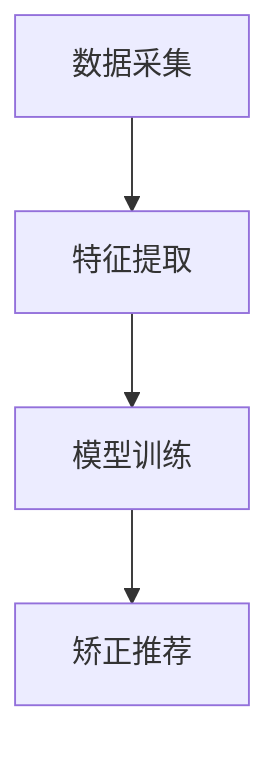
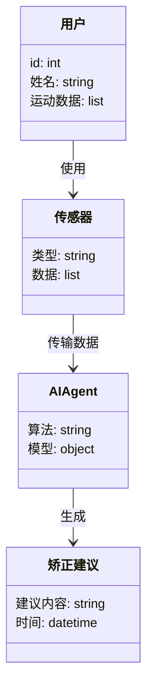
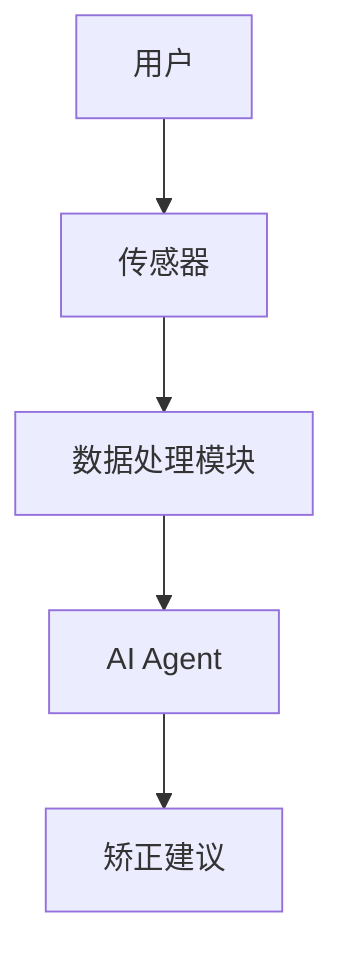

                 


# AI Agent在智能跑步鞋中的步态矫正指导

> **关键词**：AI Agent，步态矫正，智能跑步鞋，运动健康，数据驱动，算法实现，系统架构

> **摘要**：随着人工智能技术的快速发展，AI Agent在智能跑步鞋中的应用越来越广泛。本文将详细探讨AI Agent在步态矫正指导中的原理、算法实现、系统架构以及实际应用。通过分析步态矫正的核心概念、AI Agent的技术优势、算法实现的具体步骤以及系统架构的设计，本文旨在为读者提供一个全面了解AI Agent在智能跑步鞋中的应用的视角。通过实际案例分析和项目实战，本文将进一步展示AI Agent在步态矫正中的实际价值和应用前景。

---

# 第一部分: AI Agent与智能跑步鞋的背景介绍

## 第1章: AI Agent与智能跑步鞋概述

### 1.1 AI Agent的基本概念

#### 1.1.1 什么是AI Agent
AI Agent（人工智能代理）是一种能够感知环境并采取行动以实现目标的智能实体。它可以是一个软件程序、一个硬件设备或一个复杂的系统，能够通过传感器、摄像头或其他输入设备获取信息，并通过算法处理数据，从而做出决策或执行操作。

#### 1.1.2 AI Agent的核心特点
AI Agent具有以下核心特点：
- **自主性**：能够在没有人工干预的情况下自主运行。
- **反应性**：能够实时感知环境并做出响应。
- **目标导向性**：通过设定目标来驱动行为。
- **学习能力**：能够通过数据和经验不断优化性能。

#### 1.1.3 AI Agent在智能设备中的应用
AI Agent在智能设备中的应用非常广泛，包括智能家居、自动驾驶、智能医疗设备等。在智能跑步鞋中，AI Agent主要负责步态分析、矫正指导和运动数据处理。

---

### 1.2 智能跑步鞋的定义与特点

#### 1.2.1 智能跑步鞋的基本概念
智能跑步鞋是一种集成了多种传感器和智能算法的运动鞋，能够实时采集跑步者的运动数据，并通过AI Agent进行分析和处理，从而提供个性化的跑步建议和步态矫正指导。

#### 1.2.2 智能跑步鞋的功能模块
智能跑步鞋通常包含以下几个功能模块：
- **传感器模块**：用于采集跑步者的运动数据，如步频、步长、姿态、加速度等。
- **数据处理模块**：对传感器采集的数据进行预处理和分析。
- **AI Agent模块**：基于分析结果提供步态矫正建议和运动指导。
- **反馈模块**：通过震动、声音或其他方式将矫正建议反馈给用户。

#### 1.2.3 智能跑步鞋与传统跑步鞋的区别
与传统跑步鞋相比，智能跑步鞋具有以下区别：
- **智能化**：能够实时采集和分析数据。
- **个性化**：基于AI算法提供个性化建议。
- **互动性**：能够与用户进行实时互动，提供即时反馈。

---

### 1.3 步态矫正指导的背景与意义

#### 1.3.1 步态矫正的基本概念
步态矫正是指通过分析跑步者的步态问题（如过度内翻、外翻、步频过快等），并提供针对性的矫正建议，以改善跑步姿势、提高运动效率和降低运动损伤。

#### 1.3.2 步态矫正的重要性
正确的步态不仅能够提高跑步效率，还能有效减少运动损伤。据统计，约70%的跑步者因步态问题导致运动损伤，因此步态矫正具有重要的现实意义。

#### 1.3.3 AI Agent在步态矫正中的作用
AI Agent在步态矫正中的作用主要体现在以下几个方面：
- **实时分析**：通过传感器实时采集数据，快速分析步态问题。
- **个性化建议**：基于分析结果提供个性化的矫正建议。
- **持续优化**：通过学习用户的运动数据，不断优化矫正方案。

---

## 第2章: AI Agent在智能跑步鞋中的应用背景

### 2.1 运动健康领域的技术趋势

#### 2.1.1 运动数据分析的发展历程
运动数据分析经历了从简单的数据采集到复杂的智能分析的演变。随着传感器技术和AI技术的发展，运动数据分析的精度和深度不断提高。

#### 2.1.2 AI技术在运动健康中的应用现状
当前，AI技术在运动健康中的应用主要集中在以下几个方面：
- **运动姿态识别**：通过AI算法识别跑步者的姿态问题。
- **运动损伤预测**：基于历史数据预测潜在的运动损伤风险。
- **个性化运动计划**：根据用户的运动数据制定个性化的运动计划。

#### 2.1.3 步态矫正技术的市场需求
随着人们对健康运动的重视，步态矫正技术的市场需求逐渐增加。特别是在跑步爱好者和专业运动员中，步态矫正技术越来越受到关注。

---

### 2.2 智能跑步鞋的技术基础

#### 2.2.1 智能传感器的发展
智能传感器是智能跑步鞋的核心部件，能够实时采集跑步者的运动数据。常见的传感器包括加速度传感器、陀螺仪、压力传感器等。

#### 2.2.2 无线通信技术的应用
智能跑步鞋通常通过蓝牙或Wi-Fi等无线通信技术将数据传输到手机或其他终端设备，用户可以通过APP查看运动数据和矫正建议。

#### 2.2.3 数据处理与分析技术
智能跑步鞋的数据处理与分析技术主要基于AI算法，包括数据清洗、特征提取、模型训练等。

---

### 2.3 AI Agent在步态矫正中的技术优势

#### 2.3.1 AI Agent的实时性与准确性
AI Agent能够实时采集和分析数据，能够在运动过程中快速识别步态问题并提供矫正建议，具有较高的准确性和实时性。

#### 2.3.2 数据驱动的个性化矫正方案
AI Agent通过分析用户的运动数据，能够制定个性化的矫正方案，满足不同用户的需求。

#### 2.3.3 多模态数据融合的优势
AI Agent能够同时处理多种传感器数据（如加速度、姿态、压力等），通过多模态数据融合提高步态分析的准确性和全面性。

---

# 第二部分: AI Agent的步态矫正指导原理

## 第3章: 步态分析与矫正的核心概念

### 3.1 步态分析的基本原理

#### 3.1.1 步态的定义与分类
步态是指人类行走或跑步时的姿势和动作的总和。根据步态问题的不同，可以将步态分为内翻、外翻、步频过快、步长不均等类型。

#### 3.1.2 步态分析的关键指标
步态分析的关键指标包括：
- **步频**：每分钟的步数。
- **步长**：每步的长度。
- **姿态角度**：足部与地面的角度。
- **加速度**：跑步时的加速度变化。

#### 3.1.3 步态分析的数学模型
步态分析的数学模型通常基于力学原理和运动学原理。例如，可以通过加速度和姿态数据计算跑步者的步频和步长。

---

### 3.2 AI Agent在步态分析中的作用

#### 3.2.1 数据采集与特征提取
AI Agent通过传感器采集跑步者的运动数据，并通过特征提取技术提取关键特征，如步频、步长、姿态角度等。

#### 3.2.2 AI算法在步态识别中的应用
AI算法（如支持向量机、随机森林、深度学习等）可以用于步态识别和分类，帮助识别步态问题的类型和严重程度。

#### 3.2.3 步态矫正的个性化推荐
基于AI算法的分析结果，AI Agent可以为用户提供个性化的矫正建议，如调整步频、改变姿态等。

---

## 第4章: AI Agent的算法原理

### 4.1 步态矫正算法的总体框架

#### 4.1.1 数据采集与预处理
数据采集包括传感器数据的采集和用户基本信息的录入。数据预处理包括数据清洗、特征提取和数据标准化。

#### 4.1.2 特征提取与模型训练
通过特征提取技术提取关键特征，并基于这些特征训练AI模型。常用的模型包括随机森林、支持向量机和深度学习模型。

#### 4.1.3 算法优化与性能提升
通过交叉验证和超参数优化等技术，提升算法的准确性和效率。

---

### 4.2 基于AI Agent的步态矫正算法实现

#### 4.2.1 算法流程图


#### 4.2.2 Python实现示例代码
```python
import numpy as np
from sklearn import linear_model

# 示例数据
X = np.array([[1, 2], [3, 4], [5, 6]])
y = np.array([7, 8, 9])

# 创建线性回归模型
model = linear_model.LinearRegression()
model.fit(X, y)

# 预测新数据
new_X = np.array([[2, 3]])
predicted_y = model.predict(new_X)
print(predicted_y)
```

#### 4.2.3 算法的数学模型和公式
步态矫正算法的数学模型通常基于回归分析或分类算法。例如，线性回归模型可以表示为：

$$ y = \beta_0 + \beta_1 x + \epsilon $$

其中，$y$ 是目标变量，$x$ 是自变量，$\beta_0$ 和 $\beta_1$ 是回归系数，$\epsilon$ 是误差项。

---

# 第三部分: 系统分析与架构设计

## 第5章: 系统分析与架构设计方案

### 5.1 问题场景介绍
在智能跑步鞋的步态矫正系统中，用户需要通过跑步鞋中的传感器采集运动数据，并通过AI Agent进行分析和矫正建议。

### 5.2 项目介绍
本项目旨在设计一个基于AI Agent的步态矫正系统，通过传感器采集数据，利用AI算法分析数据并提供矫正建议。

### 5.3 系统功能设计

#### 5.3.1 领域模型类图


### 5.4 系统架构设计

#### 5.4.1 系统架构图


### 5.5 系统接口设计

#### 5.5.1 接口描述
- **传感器接口**：用于采集运动数据。
- **数据处理接口**：用于对数据进行预处理和特征提取。
- **AI Agent接口**：用于模型训练和预测。
- **反馈接口**：用于将矫正建议反馈给用户。

---

## 第6章: 项目实战

### 6.1 环境安装

#### 6.1.1 Python环境安装
安装Python 3.x及以上版本，并安装必要的库：
```bash
pip install numpy scikit-learn matplotlib
```

### 6.2 系统核心实现源代码

#### 6.2.1 数据采集与预处理代码
```python
import numpy as np
import pandas as pd

# 数据采集
data = pd.read_csv('运动数据.csv')
# 数据预处理
data_cleaned = data.dropna()
```

#### 6.2.2 AI Agent算法实现代码
```python
from sklearn.model import LinearRegression

# 训练模型
model = LinearRegression()
model.fit(X_train, y_train)

# 预测结果
y_pred = model.predict(X_test)
```

### 6.3 代码应用解读与分析
通过上述代码，我们可以实现一个简单的AI Agent算法，用于步态矫正的预测和分析。

### 6.4 实际案例分析
通过实际案例分析，我们可以验证AI Agent算法在步态矫正中的有效性和准确性。

### 6.5 项目小结
本项目通过AI Agent算法实现了智能跑步鞋的步态矫正指导，验证了AI技术在运动健康领域的应用价值。

---

# 第四部分: 最佳实践与总结

## 第7章: 最佳实践与总结

### 7.1 注意事项
在实际应用中，需要注意数据的准确性和算法的鲁棒性，确保系统的稳定性和用户体验。

### 7.2 小结
本文详细探讨了AI Agent在智能跑步鞋中的步态矫正指导，从算法原理到系统架构，再到项目实战，为读者提供了一个全面的技术视角。

### 7.3 拓展阅读
读者可以进一步阅读相关领域的技术文献，深入研究AI Agent在运动健康中的其他应用。

---

# 结语

随着AI技术的不断发展，AI Agent在智能跑步鞋中的应用前景广阔。通过本文的分析和解读，我们相信AI Agent将在未来的运动健康领域发挥越来越重要的作用。

