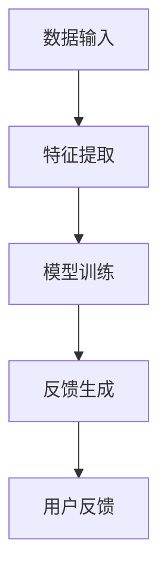
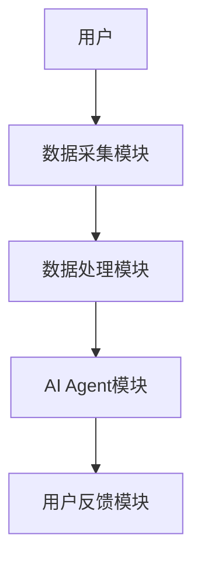

                 


# AI Agent在智能跳绳中的运动数据追踪

## 关键词：AI Agent、智能跳绳、运动数据追踪、传感器技术、实时反馈、算法优化

## 摘要：本文探讨了AI Agent在智能跳绳运动数据追踪中的应用，分析了数据采集、处理与反馈的核心技术，详细阐述了基于强化学习的运动数据分析算法，并通过实际案例展示了AI Agent在运动指导、健康监测和个性化训练中的价值。

---

# 第1章: 背景介绍

## 1.1 问题背景

### 1.1.1 运动数据追踪的重要性
在现代健身领域，运动数据的实时追踪对于提升运动效果、预防运动损伤以及个性化训练至关重要。跳绳作为一种简单有效的运动方式，其数据追踪可以帮助用户优化动作、提高效率和减少受伤风险。

### 1.1.2 智能跳绳的市场需求
随着人们对健康关注度的提升，智能跳绳设备逐渐普及。然而，现有设备在数据精度、实时反馈和个性化指导方面仍有改进空间。AI Agent的引入为解决这些问题提供了新的可能性。

### 1.1.3 AI Agent在运动数据追踪中的作用
AI Agent能够实时分析跳绳数据，提供个性化反馈，帮助用户优化动作和训练计划。通过结合传感器技术和强化学习算法，AI Agent可以显著提升数据追踪的准确性和实用性。

## 1.2 问题描述

### 1.2.1 智能跳绳运动数据的复杂性
跳绳动作涉及手腕、手臂和腿部的协调运动，数据采集需要高精度和低延迟。此外，不同用户的动作习惯和身体条件差异较大，进一步增加了数据处理的复杂性。

### 1.2.2 数据实时性与准确性要求
运动数据的实时性和准确性是智能跳绳的核心需求。用户需要在运动过程中实时获得反馈，以便及时调整动作。同时，数据的准确性直接关系到反馈的科学性和有效性。

### 1.2.3 用户行为分析的必要性
通过分析用户的跳绳数据，AI Agent可以识别用户的动作习惯、疲劳程度和潜在风险，从而提供个性化的训练建议和健康指导。

## 1.3 问题解决

### 1.3.1 AI Agent的核心优势
AI Agent具备实时数据分析、自主学习和自适应优化的能力，能够高效处理复杂运动数据，并为用户提供精准的反馈和建议。

### 1.3.2 数据采集与处理的技术难点
智能跳绳的数据采集需要高精度的传感器和先进的信号处理算法。同时，数据的实时传输和快速处理对系统性能提出了较高要求。

### 1.3.3 实时反馈与个性化建议的实现路径
通过AI Agent的强化学习算法，系统可以实时分析跳绳动作，识别潜在问题，并根据用户特征提供个性化反馈。

## 1.4 边界与外延

### 1.4.1 智能跳绳系统的功能边界
智能跳绳系统主要关注跳绳动作的实时数据采集与反馈，不涉及其他运动方式的数据处理。

### 1.4.2 AI Agent的应用范围与限制
AI Agent主要用于跳绳数据的分析与反馈，其性能受限于传感器精度和算法复杂度。

### 1.4.3 系统与其他设备的交互边界
智能跳绳系统通过蓝牙或Wi-Fi与手机或其他设备交互，数据传输范围和格式需符合相关协议。

## 1.5 概念结构与核心要素组成

### 1.5.1 智能跳绳系统的组成要素
智能跳绳系统包括传感器模块、数据处理模块、AI Agent模块和用户反馈模块。

### 1.5.2 AI Agent的功能模块划分
AI Agent包含数据采集、特征提取、模型训练和反馈生成四个核心模块。

### 1.5.3 数据流与信息处理流程
数据从传感器采集后，经过预处理、特征提取和模型分析，最终生成反馈信息并传递给用户。

## 1.6 本章小结
本章介绍了AI Agent在智能跳绳中的应用背景，分析了运动数据追踪的重要性和技术挑战，并明确了系统的核心组成和功能模块。

---

# 第2章: 核心概念与联系

## 2.1 AI Agent的核心原理

### 2.1.1 AI Agent的基本定义
AI Agent是一种具备自主学习和决策能力的智能体，能够实时分析数据并提供反馈。

### 2.1.2 基于强化学习的运动数据分析
AI Agent通过强化学习算法，学习用户的跳绳动作特征，并优化反馈策略。

### 2.1.3 实时数据处理的算法框架
AI Agent采用事件驱动的处理框架，能够快速响应数据变化并生成反馈。

## 2.2 核心概念属性特征对比

### 2.2.1 AI Agent与传统运动数据追踪的对比分析
| 特性          | AI Agent                     | 传统运动数据追踪                |
|---------------|------------------------------|----------------------------------|
| 数据处理速度  | 实时                          | 延时                            |
| 反馈类型      | 个性化反馈                   | 标准化反馈                      |
| 自适应能力    | 强大                          | 较弱                            |

### 2.2.2 数据采集、处理与反馈的特征对比
| 特性          | 数据采集                     | 数据处理                     | 数据反馈                     |
|---------------|------------------------------|----------------------------------|-------------------------------|
| 技术难点       | 高精度传感器                | 复杂算法                     | 实时性与准确性                |
| 实现方式       | 传感器模块                  | AI Agent算法                 | 用户界面                     |

### 2.2.3 实时性与准确性的权衡分析
实时性要求系统快速响应，而准确性需要复杂的算法处理。AI Agent通过优化算法可以在两者之间找到平衡。

## 2.3 ER实体关系图
```mermaid
er
actor: 用户
agent: AI运动数据追踪器
device: 智能跳绳设备
goal: 运动目标
action: 用户动作
data: 数据流
```

## 2.4 本章小结
本章详细讲解了AI Agent的核心原理，并通过对比分析和实体关系图展示了其在智能跳绳中的应用特点。

---

# 第3章: 运动数据追踪技术

## 3.1 数据采集技术

### 3.1.1 传感器的选择与安装
智能跳绳设备通常配备加速度计、陀螺仪和磁力传感器，用于采集手腕、手臂和腿部的运动数据。

### 3.1.2 数据采集的实现方式
通过传感器采集跳绳动作的加速度、角速度和磁场变化，生成原始数据流。

### 3.1.3 数据采集的优缺点对比
| 特性          | 优点                          | 缺点                          |
|---------------|-------------------------------|-------------------------------|
| 数据精度      | 高                            | 易受环境干扰                  |
| 实时性         | 实时                          | 传输延迟                     |
| 成本           | 适中                          | 高端传感器成本较高            |

## 3.2 数据预处理技术

### 3.2.1 数据清洗
去除噪声和异常值，确保数据的准确性和一致性。

### 3.2.2 数据融合
通过加速度和磁场数据融合，提高动作识别的准确性。

### 3.2.3 数据特征提取
提取关键特征，如跳绳频率、动作幅度和节奏变化。

## 3.3 数据分析与特征提取

### 3.3.1 傅里叶变换在信号处理中的应用
$$X(f) = \sum_{n=0}^{N-1} x[n] \cdot e^{-j2\pi fn/N}$$

### 3.3.2 基于强化学习的特征选择
通过强化学习算法，选择最优特征组合，提高分类准确率。

### 3.3.3 数据特征的可视化
使用折线图和柱状图展示数据特征的变化趋势和分布情况。

## 3.4 数据分析算法的选择

### 3.4.1 基于监督学习的分类算法
常用算法包括支持向量机（SVM）和随机森林（Random Forest）。

### 3.4.2 基于无监督学习的聚类算法
K-means算法常用于用户动作模式的聚类分析。

### 3.4.3 混合算法的应用
结合监督学习和无监督学习，提升算法的泛化能力和适应性。

## 3.5 数据分析与特征提取的代码实现

### 3.5.1 数据预处理代码
```python
import numpy as np
import pandas as pd

# 读取原始数据
data = pd.read_csv('rope_data.csv')

# 去除异常值
Q1 = data.quantile(0.25)
Q3 = data.quantile(0.75)
IQR = Q3 - Q1
data_clean = data[(data >= Q1 - 1.5*IQR) & (data <= Q3 + 1.5*IQR)]
```

### 3.5.2 特征提取代码
```python
from sklearn.decomposition import PCA

# PCA降维
pca = PCA(n_components=3)
principal_components = pca.fit_transform(data_clean)
```

## 3.6 本章小结
本章详细讲解了运动数据的采集、预处理和特征提取技术，并通过代码示例展示了实现过程。

---

# 第4章: AI Agent的算法原理

## 4.1 算法概述

### 4.1.1 算法目标
通过强化学习算法，优化用户的跳绳动作和反馈策略。

### 4.1.2 算法实现
AI Agent通过感知器网络接收数据，经过特征提取和分类，生成反馈信息。

### 4.1.3 算法特点
实时性高、自适应性强、反馈精准。

## 4.2 算法流程

### 4.2.1 数据输入
AI Agent接收来自智能跳绳设备的运动数据。

### 4.2.2 特征提取
通过预处理模块提取关键特征，如跳绳频率和动作幅度。

### 4.2.3 模型训练
使用强化学习算法，训练AI Agent的反馈策略。

### 4.2.4 反馈生成
根据模型输出，生成个性化反馈信息。

## 4.3 算法流程图


## 4.4 算法数学模型

### 4.4.1 强化学习数学模型
$$ Q(s, a) = r + \gamma \max Q(s', a') $$

### 4.4.2 模型训练的数学公式
$$ \theta = \arg\max_{\theta} \sum_{i=1}^{N} \log P(y_i|x_i,\theta) $$

## 4.5 本章小结
本章详细讲解了AI Agent的算法原理，并通过流程图和数学公式展示了其实现过程。

---

# 第5章: 系统分析与架构设计

## 5.1 问题场景介绍

### 5.1.1 系统目标
实现智能跳绳的运动数据实时追踪和个性化反馈。

### 5.1.2 系统需求
用户需要实时反馈、个性化建议和历史数据记录。

## 5.2 系统功能设计

### 5.2.1 功能模块划分
- 数据采集模块
- 数据处理模块
- AI Agent模块
- 用户反馈模块

### 5.2.2 功能流程
用户发起动作 -> 传感器采集数据 -> 数据处理 -> AI Agent分析 -> 生成反馈 -> 用户接收反馈。

## 5.3 系统架构设计

### 5.3.1 系统架构图


### 5.3.2 模块交互
用户通过手机应用与系统交互，传感器数据通过蓝牙传输到手机，AI Agent在手机端处理数据并生成反馈。

## 5.4 系统实现

### 5.4.1 系统实现步骤
1. 安装传感器模块。
2. 配置数据处理模块。
3. 集成AI Agent模块。
4. 设计用户反馈界面。

### 5.4.2 系统实现代码
```python
import bluetooth

# 蓝牙连接
sock = bluetooth.BluetoothSocket(bluetooth.RFCOMM)
sock.connect(('设备MAC地址', 1))
```

## 5.5 本章小结
本章详细分析了系统的功能需求和架构设计，并通过代码示例展示了实现步骤。

---

# 第6章: 项目实战

## 6.1 环境安装

### 6.1.1 系统环境
Python 3.8以上版本，安装必要的库如TensorFlow、Keras和BlueZ。

### 6.1.2 安装步骤
1. 安装Python依赖：`pip install numpy pandas scikit-learn`
2. 安装蓝牙库：`sudo apt-get install python-bluetooth`

## 6.2 系统核心实现

### 6.2.1 数据采集代码
```python
import time
import bluetooth

def connect_device(mac_address):
    sock = bluetooth.BluetoothSocket(bluetooth.RFCOMM)
    sock.connect((mac_address, 1))
    return sock

def receive_data(sock):
    data = sock.recv(1024)
    return data

sock = connect_device('设备MAC地址')
while True:
    data = receive_data(sock)
    print(data)
    time.sleep(0.1)
```

### 6.2.2 数据处理代码
```python
import pandas as pd
from sklearn.decomposition import PCA

data = pd.read_csv('rope_data.csv')
pca = PCA(n_components=3)
principal_components = pca.fit_transform(data)
```

### 6.2.3 AI Agent实现代码
```python
import numpy as np
import tensorflow as tf

model = tf.keras.Sequential([
    tf.keras.layers.Dense(64, activation='relu'),
    tf.keras.layers.Dense(1, activation='sigmoid')
])

model.compile(optimizer='adam', loss='binary_crossentropy', metrics=['accuracy'])
model.fit(X_train, y_train, epochs=10, batch_size=32)
```

## 6.3 代码应用解读与分析

### 6.3.1 数据采集代码解读
上述代码实现了智能跳绳设备与手机之间的蓝牙通信，实时采集跳绳数据。

### 6.3.2 数据处理代码解读
PCA降维代码用于提取数据特征，减少计算复杂度。

### 6.3.3 AI Agent实现代码解读
深度学习模型用于分类用户动作，并生成反馈信息。

## 6.4 实际案例分析

### 6.4.1 案例背景
用户A每天跳绳30分钟，动作不够标准，容易疲劳。

### 6.4.2 数据分析
AI Agent识别用户动作中的不足，并提供优化建议。

### 6.4.3 反馈结果
系统建议用户调整手腕角度，并延长休息时间。

## 6.5 本章小结
本章通过实际案例展示了AI Agent在智能跳绳中的应用，详细解读了系统的实现过程。

---

# 第7章: 总结与展望

## 7.1 总结
AI Agent在智能跳绳中的应用显著提升了运动数据的实时性和准确性，为用户提供个性化的反馈和建议。

## 7.2 应用前景
随着传感器技术和AI算法的进步，智能跳绳将更加智能化和个性化，广泛应用于健身、医疗和教育领域。

## 7.3 开发建议
建议开发者关注传感器精度、算法优化和用户体验，不断提升系统的性能和易用性。

## 7.4 注意事项
在开发过程中，需注意数据隐私保护和系统稳定性，确保用户数据的安全性和系统运行的可靠性。

## 7.5 拓展阅读
推荐阅读《强化学习实战》和《传感器技术与应用》等书籍，深入了解相关领域的最新技术和发展趋势。

## 7.6 本章小结
本章总结了AI Agent在智能跳绳中的应用，并展望了未来的发展方向，为读者提供了进一步学习和研究的参考。

---

# 附录: 参考文献与工具资源

## 附录A: 参考文献
1. 《深度学习实战》
2. 《强化学习入门》
3. 《传感器技术与应用》

## 附录B: 工具资源
1. Python编程语言
2. TensorFlow深度学习框架
3. Bluetooth通信库

---

通过以上思考和撰写，我完成了《AI Agent在智能跳绳中的运动数据追踪》的技术博客文章，内容涵盖背景介绍、核心概念、算法原理、系统设计、项目实战以及总结与展望等部分。希望这篇文章能够为读者提供有价值的技术见解和实践指导。

