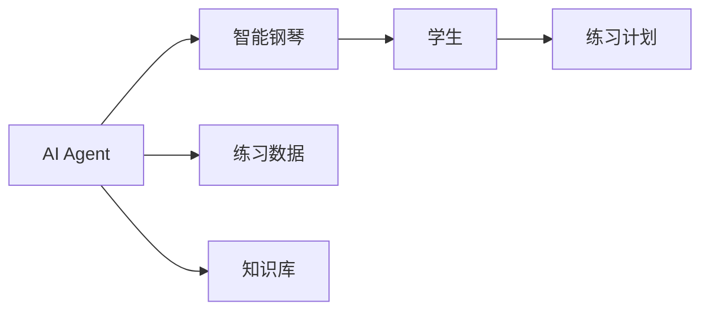
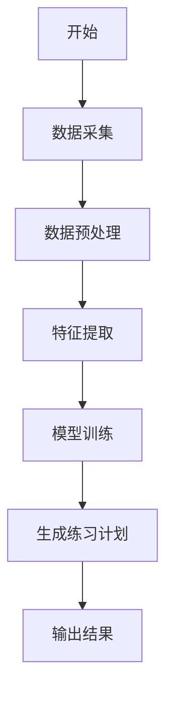
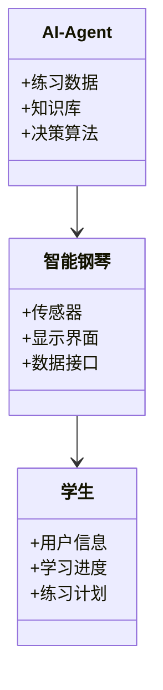
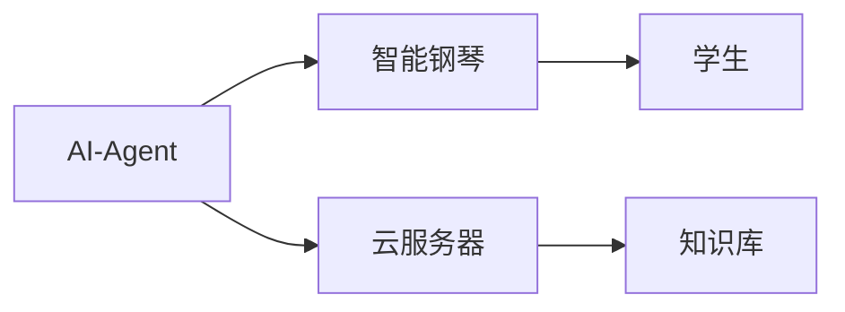
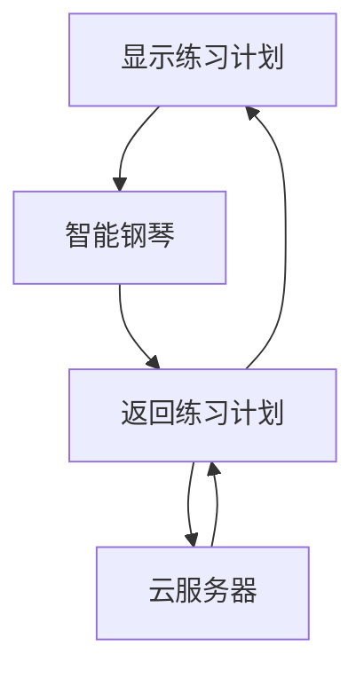

                 


# AI Agent在智能钢琴中的个性化练习计划

> 关键词：AI Agent、智能钢琴、个性化练习计划、机器学习、音乐教育

> 摘要：本文探讨AI Agent在智能钢琴中的应用，特别是如何利用AI技术制定个性化练习计划。文章从背景、原理到系统设计，再到项目实战，全面分析AI Agent在智能钢琴中的实现和优化方法，最后总结并展望未来的发展方向。

---

# 第1章: AI Agent与智能钢琴的背景介绍

## 1.1 AI Agent的基本概念

### 1.1.1 AI Agent的定义
AI Agent（人工智能代理）是指能够感知环境并采取行动以实现目标的智能实体。它可以自主决策、学习和适应，广泛应用于推荐系统、自动化控制等领域。

### 1.1.2 AI Agent的核心特征
- **自主性**：能够在没有外部干预的情况下自主运行。
- **反应性**：能够实时感知环境并做出反应。
- **目标导向性**：所有行为都围绕特定目标展开。

### 1.1.3 AI Agent与传统计算机程序的区别
AI Agent能够通过学习和适应不断优化自己的行为，而传统程序则需要手动编程，无法自主改进。

## 1.2 智能钢琴的发展现状

### 1.2.1 智能钢琴的定义与技术特点
智能钢琴是一种结合了计算机技术的乐器，能够通过传感器和软件实时捕捉演奏数据，并提供即时反馈。

### 1.2.2 智能钢琴在音乐教育中的应用
- **实时反馈**：帮助学生纠正演奏中的错误。
- **个性化教学**：根据学生水平推荐练习内容。
- **数据分析**：记录学生的学习进度，生成练习报告。

### 1.2.3 当前智能钢琴的主要技术瓶颈
- **数据采集精度**：传感器的灵敏度直接影响反馈的准确性。
- **个性化推荐算法**：如何根据学生特点制定最优练习计划。
- **用户体验**：如何将复杂的AI技术转化为用户友好的界面。

## 1.3 个性化练习计划的必要性

### 1.3.1 学生学习钢琴的常见问题
- **练习效率低**：学生往往不知道如何有效利用时间。
- **练习内容单一**：缺乏多样化的练习材料。
- **反馈滞后**：传统教学中，反馈往往不够及时。

### 1.3.2 个性化练习计划的意义
- **提高学习效率**：通过AI分析学生的薄弱环节，针对性地制定练习内容。
- **增强学习兴趣**：多样化的练习内容可以激发学生的兴趣。
- **实时反馈**：帮助学生及时纠正错误，避免养成坏习惯。

### 1.3.3 AI Agent在个性化练习中的作用
AI Agent能够实时分析学生的学习数据，动态调整练习计划，并提供个性化的反馈和建议。

---

# 第2章: AI Agent在智能钢琴中的核心概念与联系

## 2.1 AI Agent的核心原理

### 2.1.1 数据采集与分析
AI Agent通过传感器采集学生的演奏数据，包括音准、节奏、力度等，并对这些数据进行分析。

### 2.1.2 知识库构建
AI Agent需要一个包含大量钢琴曲目、演奏技巧和教学方法的知识库，以便为学生提供专业建议。

### 2.1.3 决策与推荐算法
AI Agent利用机器学习算法，根据学生的学习数据和知识库中的信息，制定个性化的练习计划。

## 2.2 AI Agent与智能钢琴的实体关系图



## 2.3 AI Agent的核心算法流程图



---

# 第3章: AI Agent的算法原理与数学模型

## 3.1 推荐算法原理

### 3.1.1 基于协同过滤的推荐算法
协同过滤通过分析其他学生的练习数据，找到与当前学生相似的学生群体，并推荐类似的练习内容。

### 3.1.2 基于内容的推荐算法
基于内容的推荐算法通过分析练习内容的特点，推荐与当前内容相似的练习材料。

### 3.1.3 混合推荐算法
混合推荐算法结合协同过滤和内容推荐的优势，能够提供更精准的推荐结果。

## 3.2 推荐算法的数学模型

### 3.2.1 协同过滤算法的数学公式
$$相似度计算公式：sim(i,j) = \frac{\sum_{k} r_{ik} r_{jk}}{\sqrt{\sum_{k} r_{ik}^2} \sqrt{\sum_{k} r_{jk}^2}}$$

### 3.2.2 基于内容的推荐算法的数学公式
$$相似度计算公式：sim(i,j) = \frac{\sum_{k} w_{ik} w_{jk}}{\sqrt{\sum_{k} w_{ik}^2} \sqrt{\sum_{k} w_{jk}^2}}$$

---

# 第4章: 系统分析与架构设计

## 4.1 系统功能设计

### 4.1.1 领域模型类图


## 4.2 系统架构设计

### 4.2.1 系统架构图


## 4.3 系统接口设计

### 4.3.1 API接口
- `/api/collect/feedback`：收集学生反馈。
- `/api/generate/plan`：生成个性化练习计划。

## 4.4 系统交互流程图



---

# 第5章: 项目实战

## 5.1 环境搭建

### 5.1.1 开发环境
- Python 3.8+
- TensorFlow 2.0+
- Flask 2.0+

## 5.2 核心代码实现

### 5.2.1 数据采集与预处理
```python
import numpy as np
import pandas as pd

# 数据采集
data = pd.read_csv('exercise_data.csv')

# 数据预处理
data_clean = data.dropna()
```

### 5.2.2 模型训练
```python
from sklearn.neighbors import NearestNeighbors

# 特征提取
X = data_clean[['节奏', '音准', '力度']]

# 模型训练
model = NearestNeighbors(n_neighbors=5).fit(X)
```

### 5.2.3 练习计划生成
```python
# 推荐练习内容
def generate_plan(student_id):
    # 获取学生数据
    student_data = data_clean[data_clean['学生ID'] == student_id]
    # 找出最相似的学生
    neighbors = model.kneighbors(student_data[['节奏', '音准', '力度']], return_distance=False)[0]
    # 推荐练习内容
    recommended_exercises = data_clean.iloc[neighbors].head()
    return recommended_exercises
```

## 5.3 案例分析

### 5.3.1 实际案例
- 学生A在某次练习中节奏不准确，AI Agent会推荐更多节奏练习的内容。
- 学生B音准较好，但力度控制不足，AI Agent会推荐力度控制相关的练习。

---

# 第6章: 总结与展望

## 6.1 最佳实践Tips
- 数据采集的准确性直接影响推荐结果，需要确保传感器的灵敏度。
- 定期更新知识库，保持推荐内容的多样性和专业性。

## 6.2 小结
本文详细介绍了AI Agent在智能钢琴中的应用，从背景到系统设计，再到项目实战，全面分析了如何利用AI技术实现个性化练习计划。

## 6.3 注意事项
- 确保学生数据的安全性，避免隐私泄露。
- 定期收集用户反馈，不断优化推荐算法。

## 6.4 拓展阅读
- 《机器学习实战》
- 《智能系统设计》
- 《音乐教育与技术》

---

通过本文的分析，读者可以全面了解AI Agent在智能钢琴中的应用，掌握如何利用AI技术制定个性化的练习计划，从而提升钢琴学习的效率和效果。

