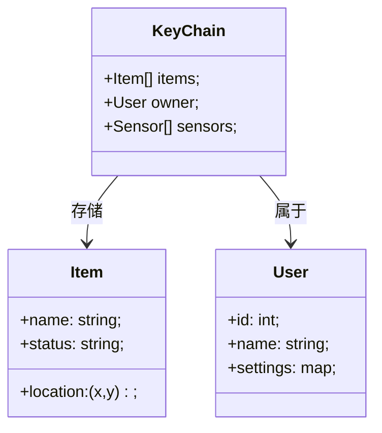
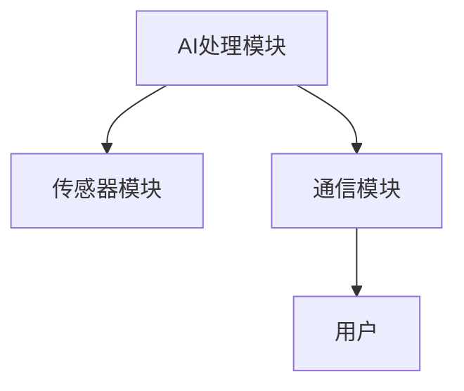

                 


# AI Agent在智能钥匙链中的物品追踪功能

> 关键词：AI Agent, 智能钥匙链, 物品追踪, 算法原理, 系统架构

> 摘要：本文深入探讨了AI Agent在智能钥匙链中的物品追踪功能，从问题背景、核心概念、算法原理到系统架构设计，再到项目实战，全面解析了如何利用AI技术实现智能钥匙链的物品追踪功能。文章详细分析了AI Agent的基本概念、物品追踪的技术挑战、算法实现的数学模型、系统架构设计以及实际项目案例，为读者提供了从理论到实践的全面指导。

---

# 第1章: 背景介绍

## 1.1 问题背景

### 1.1.1 物品追踪的现实需求
在日常生活中，人们常常会遇到钥匙、钱包等重要物品丢失的问题，这不仅会带来不便，还可能引发财产损失。传统的钥匙链功能单一，无法满足人们对物品追踪的智能化需求。随着物联网和人工智能技术的快速发展，人们对智能设备的功能提出了更高的要求，物品追踪功能成为智能钥匙链的重要组成部分。

### 1.1.2 AI Agent在智能钥匙链中的作用
AI Agent（人工智能代理）是一种能够感知环境、自主决策并执行任务的智能实体。在智能钥匙链中，AI Agent可以实时监测物品的位置信息，通过传感器收集数据，并结合AI算法进行分析和预测，帮助用户快速找到丢失的物品。

### 1.1.3 智能钥匙链的发展趋势
智能钥匙链正逐步从传统的机械装置向智能化、网络化的方向发展。随着AI技术的不断进步，未来的智能钥匙链将具备更多智能化功能，如自动记录物品位置、智能提醒、远程追踪等，为用户提供更加便捷的服务。

## 1.2 技术背景

### 1.2.1 AI Agent的基本概念
AI Agent是一种能够感知环境、自主决策并执行任务的智能实体。它具备以下特点：
- **自主性**：能够自主决策，无需人工干预。
- **反应性**：能够实时感知环境并做出反应。
- **目标导向**：以实现特定目标为导向。

### 1.2.2 智能钥匙链的技术基础
智能钥匙链的核心技术包括：
- **传感器技术**：用于感知物品的位置信息。
- **无线通信技术**：如蓝牙、Wi-Fi，用于数据的传输。
- **AI算法**：用于数据分析和位置预测。

### 1.2.3 物品追踪的技术挑战
物品追踪的核心技术挑战包括：
- **定位精度**：如何在复杂的环境中准确定位物品。
- **数据处理**：如何高效处理大量传感器数据。
- **隐私保护**：如何在追踪过程中保护用户隐私。

## 1.3 应用价值与意义

### 1.3.1 提高生活效率的重要性
通过AI Agent实现物品追踪，用户可以快速找到丢失的物品，减少因物品丢失带来的不便，提高生活效率。

### 1.3.2 降低丢失物品的风险
智能钥匙链的物品追踪功能可以实时监测物品的位置，当物品偏离预设范围时，系统会及时发出提醒，从而降低物品丢失的风险。

### 1.3.3 智能钥匙链的市场前景
随着人们对智能化设备的需求不断增加，智能钥匙链市场前景广阔，尤其是在智能家居、物联网等领域，具备极大的发展潜力。

## 1.4 本章小结
本章从问题背景、技术背景和应用价值三个方面，详细介绍了AI Agent在智能钥匙链中的物品追踪功能的重要性和必要性。通过本章的分析，读者可以理解为什么需要在智能钥匙链中引入AI Agent，以及AI Agent在物品追踪中的重要作用。

---

# 第2章: 核心概念与联系

## 2.1 AI Agent的核心概念

### 2.1.1 AI Agent的定义与特征
AI Agent是一种能够感知环境、自主决策并执行任务的智能实体。其主要特征包括：
- **自主性**：能够自主决策，无需人工干预。
- **反应性**：能够实时感知环境并做出反应。
- **目标导向**：以实现特定目标为导向。

### 2.1.2 智能钥匙链的功能模块
智能钥匙链的功能模块包括：
- **传感器模块**：用于感知物品的位置信息。
- **通信模块**：用于与用户或其他设备进行数据传输。
- **AI处理模块**：用于数据分析和位置预测。

### 2.1.3 物品追踪的实现原理
物品追踪的实现原理包括：
- **数据采集**：通过传感器采集物品的位置信息。
- **数据传输**：通过通信模块将数据传输到AI处理模块。
- **数据分析**：通过AI算法对数据进行分析和处理，得到物品的位置信息。

## 2.2 核心概念对比分析

### 2.2.1 AI Agent与传统钥匙链的对比
| 特性       | AI Agent智能钥匙链 | 传统钥匙链 |
|------------|--------------------|------------|
| 功能       | 具备物品追踪功能   | 无         |
| 自主性      | 高度自主           | 无         |
| 智能性      | 具备AI功能         | 无         |

### 2.2.2 物品追踪与位置定位的对比
| 特性       | 物品追踪         | 位置定位     |
|------------|------------------|-------------|
| 目标       | 找到丢失物品     | 确定位置信息 |
| 方法       | 传感器 + AI算法 | 传感器 + 算法 |
| 精度       | 高               | 中等         |

### 2.2.3 智能设备与AI技术的结合
智能设备与AI技术的结合主要体现在：
- **数据处理**：通过AI算法对传感器数据进行处理，得到更准确的位置信息。
- **智能决策**：通过AI算法进行决策，例如当物品丢失时，自动发出警报。

## 2.3 实体关系与架构图

### 2.3.1 ER实体关系图
```mermaid
erd
    title 实体关系图
    KeyChain
    Item
    User
    relation KeyChain - Item: 存储关系
    relation KeyChain - User: 使用关系
```

### 2.3.2 领域模型图


## 2.4 本章小结
本章通过对比分析，详细解释了AI Agent的基本概念、智能钥匙链的功能模块以及物品追踪的实现原理。同时，通过ER图和领域模型图，展示了智能钥匙链的实体关系和系统架构，为后续章节的分析奠定了基础。

---

# 第3章: 算法原理

## 3.1 算法原理概述

### 3.1.1 定位算法的选择
在物品追踪中，常用的定位算法包括：
- **蓝牙定位**：通过蓝牙信号强度进行定位。
- **Wi-Fi定位**：通过Wi-Fi信号强度进行定位。
- **RSSI（接收信号强度指示）**：通过接收信号强度进行定位。

### 3.1.2 算法实现的数学模型
定位算法的核心是通过传感器数据计算物品的位置。常用的数学模型包括：
- **三角定位**：通过多个传感器的信号强度进行定位。
- **加权平均法**：通过加权平均计算物品的位置。

### 3.1.3 算法流程
定位算法的实现流程包括：
1. 数据采集：通过传感器采集物品的位置信息。
2. 数据预处理：对采集到的数据进行预处理，去除噪声。
3. 数据分析：通过数学模型计算物品的位置。
4. 结果输出：输出物品的位置信息。

## 3.2 算法实现的代码示例

### 3.2.1 蓝牙定位代码示例
```python
import bluetooth

def find_item():
    nearby_devices = bluetooth.discover_devices()
    for device in nearby_devices:
        print("Device found: %s" % device[0])
        print("Device name: %s" % device[1])
    return nearby_devices

if __name__ == "__main__":
    find_item()
```

### 3.2.2 Wi-Fi定位代码示例
```python
import wifi

def scan_wifi():
    networks = wifi.scanSSID()
    for network in networks:
        print("Network found: %s" % network)

if __name__ == "__main__":
    scan_wifi()
```

### 3.2.3 RSSI定位代码示例
```python
import numpy as np

def calculate_rssi(tx_power, distance):
    return tx_power - 10 * np.log10(distance)

distance = 1  # 假设距离为1米
tx_power = 10  # 假设发射功率为10dBm
rssi = calculate_rssi(tx_power, distance)
print("RSSI: %d" % rssi)
```

## 3.3 算法优化与实现

### 3.3.1 算法优化
为了提高定位精度，可以在算法中引入以下优化措施：
- **加权平均**：对多个传感器的数据进行加权平均，提高定位精度。
- **过滤算法**：通过滤波算法（如Kalman滤波）去除噪声，提高数据质量。

### 3.3.2 算法实现
通过传感器数据和数学模型，实现物品的位置追踪。以下是具体的实现步骤：
1. 传感器数据采集：通过蓝牙或Wi-Fi传感器采集物品的位置信息。
2. 数据预处理：对采集到的数据进行预处理，去除噪声。
3. 数据分析：通过数学模型计算物品的位置。
4. 结果输出：输出物品的位置信息。

## 3.4 本章小结
本章详细介绍了定位算法的选择、数学模型的建立以及算法实现的代码示例。通过优化算法，可以提高定位精度，为后续章节的系统架构设计奠定基础。

---

# 第4章: 系统架构设计

## 4.1 问题场景介绍

### 4.1.1 系统功能需求
智能钥匙链的系统功能需求包括：
- **物品追踪**：实时监测物品的位置信息。
- **警报提醒**：当物品丢失时，发出警报提醒。
- **数据存储**：存储物品的位置信息。

### 4.1.2 系统性能要求
系统性能要求包括：
- **定位精度**：定位精度要求在1米以内。
- **响应时间**：系统响应时间要求在1秒以内。
- **数据存储**：支持长时间的数据存储。

## 4.2 系统功能设计

### 4.2.1 系统功能模块
智能钥匙链的系统功能模块包括：
- **传感器模块**：用于采集物品的位置信息。
- **通信模块**：用于与用户或其他设备进行数据传输。
- **AI处理模块**：用于数据分析和位置预测。

### 4.2.2 系统功能流程
系统功能流程包括：
1. 传感器采集数据：通过传感器采集物品的位置信息。
2. 数据传输：通过通信模块将数据传输到AI处理模块。
3. 数据分析：通过AI算法对数据进行分析和处理，得到物品的位置信息。
4. 输出结果：输出物品的位置信息。

## 4.3 系统架构设计

### 4.3.1 系统架构图


### 4.3.2 接口设计
系统接口设计包括：
- **传感器接口**：用于与传感器模块进行数据交互。
- **通信接口**：用于与通信模块进行数据交互。

### 4.3.3 交互流程
系统交互流程包括：
1. 用户通过通信模块发送指令。
2. AI处理模块接收指令并进行处理。
3. AI处理模块通过传感器模块采集数据。
4. 数据处理后，AI处理模块通过通信模块将结果反馈给用户。

## 4.4 本章小结
本章通过系统功能需求、系统架构设计以及接口设计，详细介绍了智能钥匙链的系统设计过程。通过本章的分析，读者可以理解智能钥匙链的系统架构以及各模块之间的交互关系。

---

# 第5章: 项目实战

## 5.1 环境安装

### 5.1.1 系统要求
系统要求包括：
- **操作系统**：支持Linux、Windows、macOS。
- **硬件要求**：支持蓝牙或Wi-Fi传感器的设备。
- **软件要求**：安装Python编程语言和相关库（如bluetooth、wifi）。

### 5.1.2 开发工具安装
开发工具安装包括：
- **Python安装**：安装Python编程语言。
- **库安装**：安装bluetooth、wifi等库。

## 5.2 核心代码实现

### 5.2.1 传感器数据采集代码
```python
import bluetooth

def find_item():
    nearby_devices = bluetooth.discover_devices()
    for device in nearby_devices:
        print("Device found: %s" % device[0])
        print("Device name: %s" % device[1])
    return nearby_devices

if __name__ == "__main__":
    find_item()
```

### 5.2.2 数据分析与处理代码
```python
import numpy as np

def calculate_rssi(tx_power, distance):
    return tx_power - 10 * np.log10(distance)

distance = 1  # 假设距离为1米
tx_power = 10  # 假设发射功率为10dBm
rssi = calculate_rssi(tx_power, distance)
print("RSSI: %d" % rssi)
```

### 5.2.3 系统交互代码
```python
import bluetooth

def find_item():
    nearby_devices = bluetooth.discover_devices()
    for device in nearby_devices:
        print("Device found: %s" % device[0])
        print("Device name: %s" % device[1])
    return nearby_devices

if __name__ == "__main__":
    find_item()
```

## 5.3 功能解读与分析

### 5.3.1 系统功能解读
系统功能解读包括：
- **物品追踪**：实时监测物品的位置信息。
- **警报提醒**：当物品丢失时，发出警报提醒。
- **数据存储**：存储物品的位置信息。

### 5.3.2 系统功能分析
系统功能分析包括：
- **定位精度**：定位精度要求在1米以内。
- **响应时间**：系统响应时间要求在1秒以内。
- **数据存储**：支持长时间的数据存储。

## 5.4 案例分析与实现

### 5.4.1 案例分析
案例分析包括：
- **场景1**：用户丢失钥匙，系统通过蓝牙传感器定位钥匙的位置，并发出警报提醒。
- **场景2**：用户忘记带钥匙，系统通过传感器数据提醒用户。

### 5.4.2 实现步骤
实现步骤包括：
1. 传感器数据采集：通过蓝牙或Wi-Fi传感器采集物品的位置信息。
2. 数据预处理：对采集到的数据进行预处理，去除噪声。
3. 数据分析：通过AI算法对数据进行分析和处理，得到物品的位置信息。
4. 结果输出：输出物品的位置信息。

## 5.5 本章小结
本章通过项目实战，详细介绍了智能钥匙链的环境安装、核心代码实现、系统功能解读以及案例分析。通过本章的分析，读者可以理解智能钥匙链的实现过程以及实际应用中的注意事项。

---

# 第6章: 最佳实践与小结

## 6.1 最佳实践

### 6.1.1 开发建议
开发建议包括：
- **传感器选择**：选择合适的传感器，确保定位精度。
- **算法优化**：通过优化算法提高定位精度。
- **数据存储**：选择合适的存储方案，确保数据安全。

### 6.1.2 代码优化
代码优化包括：
- **模块化设计**：将代码模块化，便于维护和扩展。
- **性能优化**：通过优化代码提高系统性能。

## 6.2 小结

### 6.2.1 核心内容回顾
本文详细介绍了AI Agent在智能钥匙链中的物品追踪功能，从问题背景、核心概念、算法原理到系统架构设计，再到项目实战，全面解析了如何利用AI技术实现智能钥匙链的物品追踪功能。

### 6.2.2 注意事项
在实际开发中，需要注意以下几点：
- **传感器选择**：选择合适的传感器，确保定位精度。
- **算法优化**：通过优化算法提高定位精度。
- **数据存储**：选择合适的存储方案，确保数据安全。

## 6.3 拓展阅读

### 6.3.1 相关技术领域
相关技术领域包括：
- **物联网技术**：物联网技术在智能钥匙链中的应用。
- **AI技术**：AI技术在智能设备中的应用。

### 6.3.2 热门技术方向
热门技术方向包括：
- **边缘计算**：边缘计算在智能设备中的应用。
- **5G技术**：5G技术在物联网中的应用。

## 6.4 本章小结
本章通过总结全文，提出了智能钥匙链开发的最佳实践建议，并展望了相关技术领域的发展趋势，为读者提供了从理论到实践的全面指导。

---

# 结语

通过本文的详细分析，读者可以全面了解AI Agent在智能钥匙链中的物品追踪功能的实现过程。从问题背景到系统架构设计，再到项目实战，本文为读者提供了从理论到实践的全面指导。希望本文能够为智能钥匙链的开发提供有价值的参考和借鉴。

