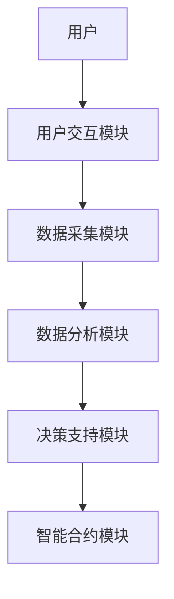
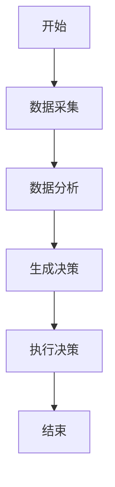

                 


# AI Agent在智能钱包中的个人财务健康顾问

> **关键词**: AI Agent, 智能钱包, 个人财务健康顾问, 机器学习, 区块链  
> 
> **摘要**: 本文深入探讨了AI Agent在智能钱包中的应用，特别是在个人财务健康顾问方面的创新与实践。通过结合区块链技术与机器学习算法，AI Agent能够实时分析用户的财务状况，提供智能化的建议和决策支持，帮助用户优化财务管理，降低风险，实现财务健康目标。文章从核心概念、算法原理、系统架构到项目实战，全面解析了这一技术的实现过程与实际应用。

---

## 第一部分: 引言

### 第1章: 背景介绍

#### 1.1 AI Agent的定义与特点
AI Agent（人工智能代理）是一种能够感知环境、自主决策并执行任务的智能实体。其核心特点包括：
- **自主性**: 能够独立决策，无需人工干预。
- **反应性**: 能够实时感知环境变化并做出响应。
- **目标导向**: 以特定目标为导向，优化决策过程。
- **学习能力**: 通过数据学习和优化，提升决策精度。

#### 1.2 智能钱包的概念与功能
智能钱包是一种结合区块链技术的数字钱包，具备以下功能：
- **数字资产存储**: 支持多种数字资产的存储与管理。
- **智能合约执行**: 通过区块链智能合约实现自动化的交易与支付。
- **数据安全性**: 利用区块链的去中心化特性，确保资产安全。
- **隐私保护**: 支持用户隐私保护机制，防止数据泄露。

#### 1.3 个人财务健康顾问的背景与重要性
个人财务健康顾问的目标是帮助用户优化财务管理，降低风险，实现财务目标。随着数字化技术的快速发展，AI Agent在智能钱包中的应用为个人财务健康顾问提供了新的可能性。

---

## 第二部分: 核心概念与技术原理

### 第2章: 核心概念解析

#### 2.1 AI Agent在智能钱包中的角色
AI Agent在智能钱包中主要扮演以下几个角色：
- **数据分析师**: 分析用户的交易记录、收支状况，提供财务报告。
- **决策支持系统**: 根据分析结果，提供智能化的财务建议。
- **风险预警系统**: 监测用户的财务风险，及时发出预警。

#### 2.2 个人财务健康顾问的核心任务
个人财务健康顾问的核心任务包括：
- **支出分析与优化**: 分析用户的支出结构，提出优化建议。
- **收入预测与规划**: 预测用户的收入变化，制定财务计划。
- **财产分配与税务优化**: 帮助用户优化财产分配，降低税务负担。

#### 2.3 AI Agent与智能钱包的交互流程
AI Agent与智能钱包的交互流程可以分为以下几个步骤：
1. **数据采集**: 收集用户的交易记录、资产信息等数据。
2. **数据分析**: 对数据进行清洗、建模与分析。
3. **决策支持**: 根据分析结果，生成财务建议。
4. **用户反馈**: 根据用户反馈，优化决策模型。

### 第3章: AI Agent的核心算法与实现

#### 3.1 基于规则的决策系统
基于规则的决策系统是一种简单的AI Agent实现方式，通过预定义的规则对用户行为进行判断与决策。例如：
- 如果用户的某项支出超过预算，则发出预警。

#### 3.2 强化学习算法
强化学习是一种通过试错机制优化决策的算法。AI Agent通过与环境的交互，不断优化其决策策略。例如：
- 在智能钱包中，AI Agent可以通过强化学习优化用户的资产分配策略。

#### 3.3 监督学习算法
监督学习是一种基于历史数据进行预测的算法。AI Agent可以通过监督学习预测用户的收入变化，从而制定财务计划。

### 第4章: 区块链技术与智能合约

#### 4.1 区块链技术在智能钱包中的应用
区块链技术为智能钱包提供了去中心化、不可篡改的特性，确保了资产的安全性与透明性。

#### 4.2 智能合约的功能与优势
智能合约是一种自动执行的数字合约，能够根据预设条件自动执行交易。其优势包括：
- **自动执行**: 无需人工干预。
- **透明性**: 合约内容公开透明。
- **不可篡改**: 数据存储在区块链上，无法被篡改。

---

## 第三部分: 系统架构与实现

### 第5章: 系统架构设计

#### 5.1 系统功能模块
智能钱包中的AI Agent系统可以分为以下几个功能模块：
- **用户交互模块**: 提供用户与AI Agent的交互界面。
- **数据采集模块**: 收集用户的交易记录、资产信息等数据。
- **数据分析模块**: 对数据进行清洗、建模与分析。
- **决策支持模块**: 根据分析结果，生成财务建议。
- **智能合约模块**: 执行预设的智能合约。

#### 5.2 系统架构图
以下是系统的架构图：



### 第6章: 系统实现细节

#### 6.1 数据采集与处理
数据采集是AI Agent的核心环节，主要包括以下步骤：
1. **数据采集**: 通过API接口采集用户的交易记录、资产信息等数据。
2. **数据清洗**: 对采集到的数据进行去噪与标准化处理。
3. **数据建模**: 根据数据分析需求，建立相应的数据模型。

#### 6.2 AI Agent的决策算法实现
以下是AI Agent的决策算法实现流程图：



### 第7章: 项目实战

#### 7.1 环境安装
以下是项目实战所需的环境安装步骤：
1. **安装Python**: 安装Python 3.8以上版本。
2. **安装TensorFlow**: 使用命令 `pip install tensorflow` 安装TensorFlow。
3. **安装Flask**: 使用命令 `pip install Flask` 安装Flask。

#### 7.2 核心代码实现
以下是AI Agent的核心代码实现：

```python
import pandas as pd
import numpy as np
from sklearn.model import LinearSVC
from flask import Flask, request, jsonify

# 数据预处理
def preprocess_data(data):
    # 假设data是一个DataFrame
    # 进行数据清洗和特征工程
    return processed_data

# 模型训练
def train_model(X, y):
    model = LinearSVC()
    model.fit(X, y)
    return model

# API接口
app = Flask(__name__)
model = None

@app.route('/api/predict', methods=['POST'])
def predict():
    global model
    if model is None:
        return jsonify({'error': 'model not trained'}), 400
    data = request.json
    # 数据处理
    processed_data = preprocess_data(data)
    # 预测
    prediction = model.predict(processed_data)
    return jsonify({'prediction': prediction.tolist()})

if __name__ == '__main__':
    app.run(debug=True)
```

#### 7.3 代码解读与分析
1. **数据预处理**: 代码中定义了一个`preprocess_data`函数，用于对数据进行清洗和特征工程。
2. **模型训练**: 使用`LinearSVC`模型进行训练，返回训练好的模型。
3. **API接口**: 使用Flask框架搭建了一个简单的API接口，用于接收数据并返回预测结果。

---

## 第四部分: 总结与展望

### 第8章: 总结与展望

#### 8.1 总结
本文详细探讨了AI Agent在智能钱包中的应用，特别是个人财务健康顾问方面的创新与实践。通过结合区块链技术与机器学习算法，AI Agent能够实时分析用户的财务状况，提供智能化的建议和决策支持，帮助用户优化财务管理，降低风险，实现财务健康目标。

#### 8.2 未来展望
随着技术的不断进步，AI Agent在智能钱包中的应用将更加广泛和深入。未来的研究方向包括：
- **提升算法精度**: 通过优化算法，提高AI Agent的决策精度。
- **增强隐私保护**: 进一步加强用户隐私保护，确保数据安全。
- **拓展应用场景**: 在更多领域中应用AI Agent技术，提升用户体验。

---

## 结语

AI Agent在智能钱包中的应用为个人财务健康顾问提供了新的可能性。通过结合区块链技术与机器学习算法，AI Agent能够实时分析用户的财务状况，提供智能化的建议和决策支持，帮助用户优化财务管理，降低风险，实现财务健康目标。未来，随着技术的不断进步，AI Agent在智能钱包中的应用将更加广泛和深入，为用户带来更智能化、更个性化的财务管理体验。

