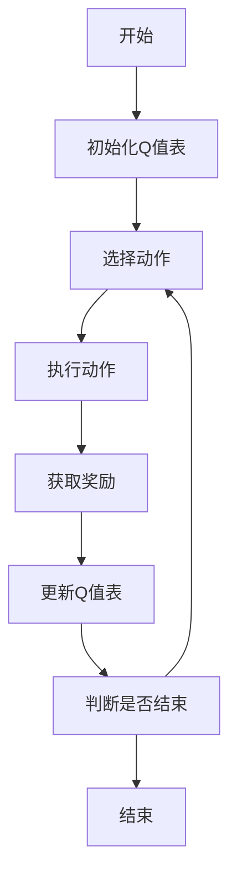
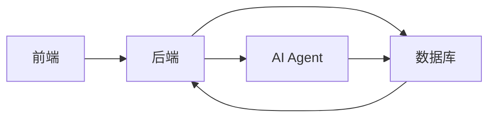

                 


# AI Agent在智能钱包中的支出预算管理

## 关键词：
AI Agent, 智能钱包, 支出预算管理, 人工智能, 区块链技术

## 摘要：
本文探讨了AI Agent在智能钱包中的支出预算管理应用，详细分析了AI Agent的核心原理、算法实现、系统架构设计以及实际项目中的应用。通过结合强化学习和监督学习等算法，展示了AI Agent如何优化支出预算管理的效率和准确性。文章还提供了具体的代码实现和案例分析，帮助读者更好地理解和应用这些技术。

---

# 第1章: AI Agent与智能钱包概述

## 1.1 AI Agent的基本概念

### 1.1.1 AI Agent的定义
AI Agent（人工智能代理）是一种能够感知环境、自主决策并执行任务的智能实体。它能够通过学习和自适应能力，优化决策过程，以实现特定目标。

### 1.1.2 AI Agent的核心特性
- **自主性**：AI Agent能够自主决策，无需外部干预。
- **反应性**：能够实时感知环境并做出反应。
- **学习能力**：通过数据学习，不断优化决策策略。
- **可扩展性**：能够适应不同规模和复杂度的任务。

### 1.1.3 AI Agent与传统预算管理的区别
传统预算管理依赖人工制定和调整预算，而AI Agent能够实时分析支出数据、预测未来消费，并自动调整预算，从而提高效率和准确性。

## 1.2 智能钱包的基本概念

### 1.2.1 智能钱包的定义
智能钱包是一种结合了区块链技术和人工智能的数字钱包，能够提供更加智能化的金融管理服务，包括支出预算管理、资产分配和风险管理等。

### 1.2.2 智能钱包的主要功能
- **支出管理**：实时监控和管理支出，提供预算建议。
- **资产分配**：根据用户的财务状况和目标，自动分配资产。
- **风险管理**：通过分析市场和用户行为，识别和规避潜在风险。

### 1.2.3 智能钱包与传统钱包的对比
传统钱包仅用于存储和交易数字货币，而智能钱包能够通过AI Agent实现智能化的财务管理，提供更高级的服务。

## 1.3 AI Agent在智能钱包中的应用背景

### 1.3.1 支出预算管理的重要性
支出预算管理是个人和企业财务管理的重要组成部分，能够帮助用户合理分配资金，避免超支和浪费。

### 1.3.2 AI Agent在支出预算管理中的优势
- **实时性**：AI Agent能够实时分析用户的支出数据，提供即时的预算建议。
- **准确性**：通过机器学习算法，AI Agent能够准确预测未来的支出和收入，优化预算分配。
- **个性化**：AI Agent可以根据用户的消费习惯和财务目标，提供个性化的预算管理服务。

### 1.3.3 当前市场中的应用现状
目前，许多智能钱包已经开始集成AI Agent技术，提供更加智能化的支出预算管理服务。然而，如何进一步优化算法和系统架构，仍然是一个重要的研究方向。

## 1.4 本章小结
本章介绍了AI Agent和智能钱包的基本概念，并分析了AI Agent在智能钱包中的应用背景。通过对比传统预算管理和智能钱包的预算管理，展示了AI Agent在支出预算管理中的优势和潜力。

---

# 第2章: AI Agent的核心原理

## 2.1 AI Agent的核心概念

### 2.1.1 AI Agent的决策机制
AI Agent的决策机制主要包括感知环境、分析数据、制定决策和执行操作几个步骤。通过强化学习和监督学习等算法，AI Agent能够不断优化决策策略。

### 2.1.2 AI Agent的学习机制
AI Agent通过监督学习和强化学习等方法，不断优化自身的知识库和决策模型。监督学习通过标记数据进行训练，而强化学习则通过奖励机制来优化决策。

### 2.1.3 AI Agent的自适应能力
AI Agent能够根据环境的变化和用户的需求，自适应地调整自身的决策策略，以实现更好的预算管理效果。

## 2.2 AI Agent的算法原理

### 2.2.1 常见的AI Agent算法
- **强化学习**：通过奖励机制优化决策策略。
- **监督学习**：通过标记数据进行训练，提高预测准确性。
- **聚类分析**：将用户支出数据进行分类，识别消费模式。

### 2.2.2 基于强化学习的AI Agent
强化学习是一种通过与环境交互来优化决策策略的方法。AI Agent通过与用户的支出数据交互，逐步优化预算管理策略。

### 2.2.3 基于监督学习的AI Agent
监督学习通过标记数据训练模型，AI Agent能够根据历史支出数据，预测未来的支出情况，并提供预算建议。

## 2.3 AI Agent的核心算法实现

### 2.3.1 Q-Learning算法
Q-Learning是一种经典的强化学习算法，通过更新Q值表来优化决策策略。

$$ Q(s, a) = Q(s, a) + \alpha \cdot (r + \gamma \cdot \max Q(s', a') - Q(s, a)) $$

其中：
- $s$：当前状态
- $a$：当前动作
- $r$：奖励
- $\gamma$：折扣因子
- $\alpha$：学习率

### 2.3.2 算法实现的流程图


## 2.4 本章小结
本章详细介绍了AI Agent的核心原理，包括决策机制、学习机制和自适应能力。通过Q-Learning算法的实现，展示了AI Agent如何通过强化学习优化支出预算管理。

---

# 第3章: 系统分析与架构设计

## 3.1 系统分析

### 3.1.1 问题场景介绍
在智能钱包中，用户希望AI Agent能够实时监控支出数据，提供预算建议，并自动调整预算。

### 3.1.2 系统功能设计
- **数据采集**：实时采集用户的支出数据。
- **数据分析**：通过机器学习算法分析数据，识别消费模式。
- **预算建议**：根据分析结果，提供个性化的预算建议。
- **预算调整**：根据用户的反馈，自动调整预算。

### 3.1.3 系统架构设计


### 3.1.4 系统接口设计
- **API接口**：前端与后端通过API接口进行数据交互。
- **数据库接口**：后端通过数据库接口访问数据。

## 3.2 系统交互流程

### 3.2.1 系统交互流程图


## 3.3 本章小结
本章通过系统分析和架构设计，展示了AI Agent在智能钱包中的实现方式。通过Mermaid图，清晰地展示了系统各部分之间的交互关系。

---

# 第4章: 项目实战

## 4.1 环境安装

### 4.1.1 安装Python
```bash
python --version
```

### 4.1.2 安装依赖库
```bash
pip install numpy scikit-learn matplotlib
```

## 4.2 核心代码实现

### 4.2.1 Q-Learning算法实现
```python
import numpy as np

class AI_Agent:
    def __init__(self, state_space, action_space):
        self.state_space = state_space
        self.action_space = action_space
        self.Q = np.zeros((state_space, action_space))
    
    def choose_action(self, state):
        if np.random.uniform(0, 1) < 0.1:
            return np.random.randint(0, self.action_space)
        else:
            return np.argmax(self.Q[state])
    
    def update_Q(self, state, action, reward, next_state):
        alpha = 0.1
        gamma = 0.9
        self.Q[state, action] += alpha * (reward + gamma * np.max(self.Q[next_state]) - self.Q[state, action])
```

### 4.2.2 数据处理与分析
```python
import pandas as pd

data = pd.read_csv('expenditure.csv')
data.head()
```

## 4.3 实际案例分析

### 4.3.1 数据分析
通过分析用户的支出数据，识别出用户的消费模式和潜在的超支风险。

### 4.3.2 预算建议
AI Agent根据分析结果，提供个性化的预算建议，并实时调整预算。

## 4.4 项目小结
本章通过实际案例展示了AI Agent在智能钱包中的应用，详细讲解了项目的实现过程和实际效果。

---

# 第5章: 最佳实践与总结

## 5.1 最佳实践

### 5.1.1 算法优化
- 使用分布式计算优化算法性能。
- 通过数据增强技术提高模型的鲁棒性。

### 5.1.2 系统优化
- 优化数据库设计，提高查询效率。
- 使用缓存技术减少重复计算。

## 5.2 注意事项
- 确保数据安全，避免用户隐私泄露。
- 定期更新模型，保持预算管理的准确性。

## 5.3 拓展阅读
- 《强化学习实战》
- 《智能系统设计与实现》

## 5.4 本章小结
本章总结了AI Agent在智能钱包中的应用经验，并提出了优化建议和注意事项，帮助读者更好地实现和应用这些技术。

---

# 结语
本文详细探讨了AI Agent在智能钱包中的支出预算管理应用，通过理论分析和实际案例，展示了AI Agent如何优化支出预算管理的效率和准确性。未来，随着人工智能技术的不断发展，AI Agent在智能钱包中的应用将更加广泛和深入。

--- 

以上是一个详细的目录大纲和文章结构，您可以根据需要进一步扩展每个章节的内容，添加更多的技术细节和实际案例分析。

