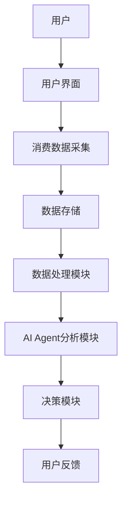

                 


# AI Agent在智能钱包中的消费分析

## 关键词：
- AI Agent
- 智能钱包
- 消费分析
- 机器学习
- 深度学习
- 系统架构

## 摘要：
本文详细探讨了AI Agent在智能钱包中的消费分析应用。从AI Agent的基本概念到消费分析的核心算法，再到系统架构设计和项目实战，全面解析了AI Agent在智能钱包中的技术实现和应用价值。通过具体案例分析和代码实现，展示了AI Agent如何帮助智能钱包实现智能化消费分析，为用户提供更高效、更精准的消费决策支持。

---

## 第四章: AI Agent消费分析的系统架构设计

### 4.3 系统架构对比与选择
#### 4.3.1 模块化架构与微服务架构对比
- **模块化架构**：适合小型项目，模块之间相对独立，易于开发和维护。
- **微服务架构**：适合大型项目，具有更好的扩展性和灵活性，但需要处理跨服务通信的问题。

#### 4.3.2 其他架构风格的对比
- **单体架构**：适合小型项目，但扩展性较差。
- **事件驱动架构**：适合需要实时响应的场景，如智能钱包中的实时消费提醒。

#### 4.3.3 架构选择的依据
- 项目规模：小型项目选择模块化架构，大型项目选择微服务架构。
- 性能需求：对实时性要求高的场景选择事件驱动架构。
- 可扩展性：需要频繁迭代和扩展的项目选择微服务架构。

### 4.4 系统架构设计实现
#### 4.4.1 系统架构图


#### 4.4.2 实现细节
- **用户界面**：提供直观的操作界面，展示消费数据和AI Agent的分析结果。
- **数据采集模块**：通过API接口从智能钱包获取消费数据。
- **数据存储**：使用数据库存储消费数据，支持高效的查询和更新。
- **数据处理模块**：对数据进行清洗、特征提取和预处理。
- **AI Agent分析模块**：基于机器学习模型进行消费行为分析和预测。
- **决策模块**：根据分析结果生成消费建议，并通过用户界面反馈给用户。

---

## 第五章: AI Agent消费分析的项目实战

### 5.1 项目环境搭建
#### 5.1.1 环境需求
- **操作系统**：Windows、Linux或macOS
- **编程语言**：Python 3.8+
- **开发工具**：PyCharm或VS Code
- **依赖库**：TensorFlow、Scikit-learn、Pandas、NumPy

#### 5.1.2 安装依赖
```bash
pip install numpy pandas scikit-learn tensorflow
```

### 5.2 数据采集与处理
#### 5.2.1 数据采集
```python
import pandas as pd
import numpy as np

# 从数据库中读取消费数据
data = pd.read_sql_query("SELECT * FROM consumption_data", connection)
```

#### 5.2.2 数据清洗与特征提取
```python
# 删除缺失值
data.dropna(inplace=True)

# 提取特征
features = data[['amount', 'category', 'time']]
target = data['is_fraud']
```

### 5.3 模型训练与部署
#### 5.3.1 模型训练
```python
from sklearn.ensemble import RandomForestClassifier
from sklearn.metrics import accuracy_score

# 训练模型
model = RandomForestClassifier()
model.fit(features, target)

# 预测
predictions = model.predict(features)
print("Accuracy:", accuracy_score(target, predictions))
```

#### 5.3.2 模型部署
```python
import joblib

# 保存模型
joblib.dump(model, 'consumption_model.pkl')

# 加载模型
loaded_model = joblib.load('consumption_model.pkl')
```

### 5.4 项目实战总结
- **数据采集**：确保数据的完整性和准确性。
- **特征工程**：选择合适的特征对模型性能至关重要。
- **模型选择**：根据具体场景选择合适的算法，如随机森林适合特征较多的场景。
- **模型部署**：使用模型部署工具（如Flask）构建API，方便调用。

---

## 第六章: AI Agent消费分析的系统优化与扩展

### 6.1 系统性能优化
#### 6.1.1 数据处理优化
- 使用分布式计算框架（如Spark）处理大数据量。
- 优化数据预处理步骤，减少计算时间。

#### 6.1.2 模型优化
- 调参：使用网格搜索优化模型参数。
- 增量学习：在新数据到来时，逐步更新模型，保持模型的实时性。

### 6.2 系统可扩展性
#### 6.2.1 功能扩展
- 实时消费提醒：基于AI Agent的实时分析，向用户推送消费提醒。
- 消费预测：基于历史数据，预测未来的消费趋势。

#### 6.2.2 技术扩展
- 引入边缘计算：在本地设备上进行初步分析，减少云端依赖。
- 使用图神经网络：处理复杂的关系数据，如社交网络中的消费行为。

### 6.3 系统维护与迭代
- 定期更新模型：根据新数据和业务需求，重新训练模型。
- 监控系统性能：实时监控系统运行状态，及时发现和解决问题。

---

## 第七章: 总结与展望

### 7.1 总结
本文详细探讨了AI Agent在智能钱包中的消费分析应用，从核心概念到系统架构，再到项目实战，全面解析了AI Agent在消费分析中的技术实现和应用价值。通过具体的案例分析和代码实现，展示了AI Agent如何帮助智能钱包实现智能化消费分析。

### 7.2 展望
随着AI技术的不断进步，AI Agent在智能钱包中的应用将更加广泛和深入。未来的研究方向包括：
- **实时性提升**：通过边缘计算和实时数据处理，提升消费分析的实时性。
- **模型优化**：引入更先进的算法，如图神经网络和强化学习，提升模型的准确性和可解释性。
- **用户体验优化**：通过自然语言处理和人机交互技术，提升用户的消费分析体验。

---

## 附录
### 附录A: 项目代码示例
```python
import pandas as pd
from sklearn.ensemble import RandomForestClassifier
from sklearn.metrics import accuracy_score
import joblib

# 数据采集
data = pd.read_csv('consumption.csv')

# 数据清洗
data.dropna(inplace=True)

# 特征提取
features = data[['amount', 'category', 'time']]
target = data['is_fraud']

# 模型训练
model = RandomForestClassifier()
model.fit(features, target)

# 模型评估
predictions = model.predict(features)
print("Accuracy:", accuracy_score(target, predictions))

# 模型保存
joblib.dump(model, 'consumption_model.pkl')
```

### 附录B: 系统架构图


---

通过本文的详细讲解，读者可以全面了解AI Agent在智能钱包中的消费分析应用，并能够实际操作相关技术，为智能钱包的智能化发展提供技术支持。

