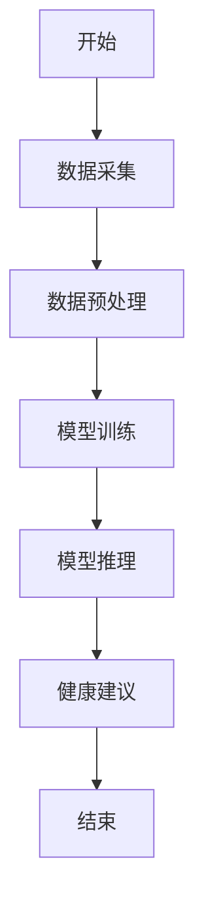
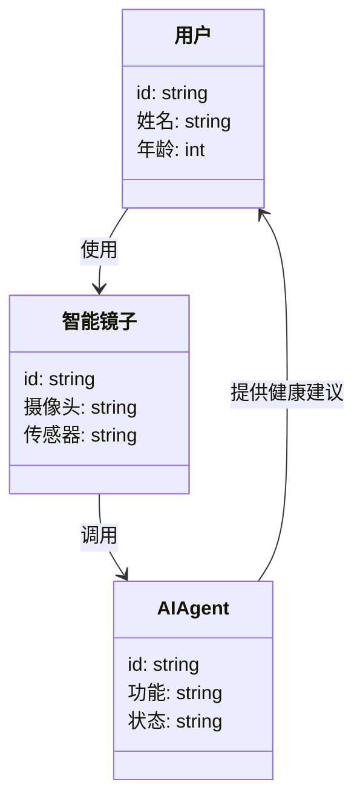
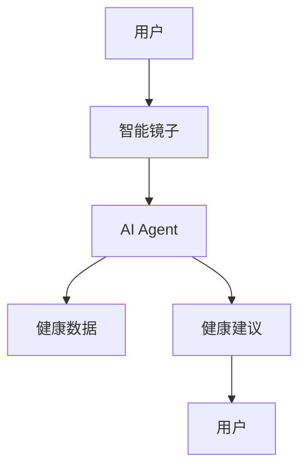
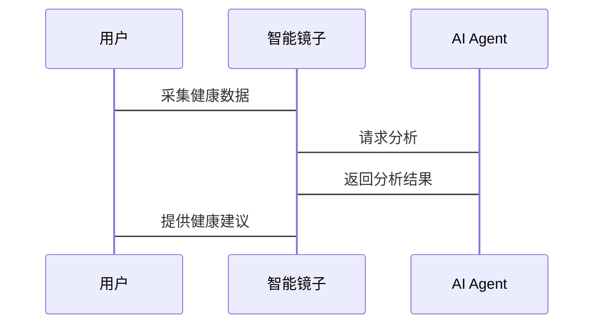

                 


# AI Agent在智能镜子中的每日健康检查系统

> 关键词：AI Agent, 智能镜子, 健康检查系统, 日常健康监测, 人工智能技术

> 摘要：本文探讨了AI Agent在智能镜子中的应用，重点分析了每日健康检查系统的实现原理和应用场景。通过背景介绍、核心概念、算法原理、系统架构和项目实战的详细阐述，展示了AI Agent如何通过智能镜子为用户提供智能化的健康监测服务。

---

# 第1章: 背景介绍

## 1.1 问题背景

### 1.1.1 智能镜子的发展现状

智能镜子作为一种新兴的智能家居设备，近年来受到广泛关注。它不仅具备传统镜子的反射功能，还集成了多种智能技术，如图像识别、语音交互和数据处理，能够为用户提供更加智能化的服务。

### 1.1.2 当前健康检查系统的痛点

传统的健康检查系统主要依赖于医院或专业设备，存在以下问题：
1. **便捷性不足**：用户需要专门前往医疗机构，耗时耗力。
2. **实时性弱**：健康数据的采集和分析不够及时。
3. **个性化不足**：缺乏针对个人健康状况的定制化建议。

### 1.1.3 AI Agent在健康检查中的潜在价值

AI Agent（人工智能代理）能够通过智能镜子实现用户的日常健康监测，实时采集和分析健康数据，提供个性化的健康建议，从而弥补传统健康检查系统的不足。

---

## 1.2 问题描述

### 1.2.1 智能镜子的定义与功能

智能镜子是一种结合了AI技术的镜子，具备以下功能：
1. **图像采集**：通过摄像头采集用户的面部图像。
2. **语音交互**：支持语音命令和对话。
3. **数据处理**：分析用户的健康数据，如心率、体温等。
4. **健康建议**：根据分析结果提供健康建议。

### 1.2.2 每日健康检查的核心需求

每日健康检查的核心需求包括：
1. **实时监测**：每天多次采集用户的健康数据。
2. **数据分析**：快速分析数据并生成健康报告。
3. **个性化建议**：根据用户健康状况提供定制化建议。

### 1.2.3 现有健康检查系统的局限性

现有健康检查系统的局限性包括：
1. **覆盖范围有限**：无法实现全天候实时监测。
2. **用户依从性低**：传统检查方式不够便捷，用户难以坚持。
3. **数据孤岛**：不同设备和系统之间的数据难以互通。

---

## 1.3 问题解决

### 1.3.1 引入AI Agent的必要性

AI Agent能够通过智能镜子实现用户的日常健康监测，实时采集和分析健康数据，为用户提供智能化的健康服务。

### 1.3.2 AI Agent在智能镜子中的应用场景

AI Agent在智能镜子中的应用场景包括：
1. **早晨健康检查**：用户起床后通过智能镜子进行健康数据采集。
2. **实时监测**：AI Agent实时分析用户的健康数据，及时发现异常。
3. **健康建议**：根据分析结果为用户提供个性化的健康建议。

### 1.3.3 解决方案的可行性分析

解决方案的可行性分析包括：
1. **技术可行性**：AI技术的快速发展为智能镜子的健康监测提供了技术支持。
2. **用户需求匹配**：智能镜子能够满足用户对便捷、实时健康监测的需求。
3. **市场潜力**：随着健康意识的提高，智能镜子市场潜力巨大。

---

## 1.4 边界与外延

### 1.4.1 系统的边界定义

智能镜子每日健康检查系统的边界包括：
1. **硬件边界**：智能镜子的摄像头、传感器等硬件设备。
2. **软件边界**：AI Agent、数据处理模块、健康建议模块等软件功能。
3. **数据边界**：健康数据的采集、存储和分析。

### 1.4.2 功能的外延与扩展

功能的外延与扩展包括：
1. **扩展健康指标**：未来可以支持更多健康指标的监测。
2. **多设备联动**：与其他智能家居设备联动，提供更全面的健康服务。
3. **数据共享**：与医疗机构共享健康数据，实现更精准的健康监测。

### 1.4.3 系统与外部环境的交互

系统与外部环境的交互包括：
1. **用户交互**：用户通过智能镜子进行健康数据采集和查询。
2. **数据交互**：系统与云端数据库交互，获取健康数据和分析结果。
3. **服务交互**：系统向用户推送健康建议，与第三方健康服务提供商交互。

---

## 1.5 概念结构与核心要素

### 1.5.1 系统的整体架构

系统的整体架构包括：
1. **硬件层**：智能镜子的摄像头、传感器等硬件设备。
2. **软件层**：AI Agent、数据处理模块、健康建议模块等软件功能。
3. **数据层**：健康数据的采集、存储和分析。

### 1.5.2 核心要素的组成与关系

核心要素的组成与关系包括：
1. **AI Agent**：作为系统的智能核心，负责数据处理和决策。
2. **智能镜子**：作为用户与系统交互的界面，采集和展示健康数据。
3. **用户**：系统的最终使用者，通过智能镜子进行健康监测。

### 1.5.3 系统的逻辑流程

系统的逻辑流程包括：
1. **数据采集**：智能镜子通过摄像头和传感器采集用户的健康数据。
2. **数据处理**：AI Agent对采集的数据进行分析和处理。
3. **健康建议**：系统根据分析结果生成健康建议并推送给用户。

---

# 第2章: 核心概念与联系

## 2.1 AI Agent的核心原理

### 2.1.1 AI Agent的基本概念

AI Agent是一种能够感知环境并采取行动以实现目标的智能体。在智能镜子中，AI Agent负责处理用户的健康数据，提供个性化的健康建议。

### 2.1.2 AI Agent的分类与特点

AI Agent的分类与特点包括：
1. **基于规则的AI Agent**：根据预定义的规则进行决策。
2. **基于学习的AI Agent**：通过机器学习算法进行自我改进。
3. **基于推理的AI Agent**：通过逻辑推理进行决策。

### 2.1.3 AI Agent在智能镜子中的具体实现

AI Agent在智能镜子中的具体实现包括：
1. **数据采集**：通过摄像头和传感器采集用户的健康数据。
2. **数据分析**：利用机器学习算法分析健康数据，识别异常情况。
3. **健康建议**：根据分析结果生成个性化的健康建议。

---

## 2.2 智能镜子的功能分析

### 2.2.1 智能镜子的硬件组成

智能镜子的硬件组成包括：
1. **摄像头**：用于采集用户的面部图像。
2. **传感器**：用于采集用户的生理数据，如心率、体温等。
3. **显示屏**：用于显示健康数据和建议。

### 2.2.2 智能镜子的软件功能

智能镜子的软件功能包括：
1. **数据采集模块**：采集用户的健康数据。
2. **数据处理模块**：分析健康数据，生成健康报告。
3. **健康建议模块**：根据分析结果提供健康建议。

### 2.2.3 智能镜子与用户的交互方式

智能镜子与用户的交互方式包括：
1. **语音交互**：用户通过语音命令与智能镜子进行交互。
2. **触控交互**：用户通过触摸屏幕进行操作。
3. **视觉交互**：用户通过观察显示屏获取健康信息。

---

## 2.3 AI Agent与智能镜子的关系

### 2.3.1 AI Agent在智能镜子中的角色

AI Agent在智能镜子中的角色包括：
1. **数据处理者**：负责处理用户的健康数据。
2. **决策者**：根据分析结果提供健康建议。
3. **服务提供者**：为用户提供个性化的健康服务。

### 2.3.2 AI Agent与智能镜子功能的结合

AI Agent与智能镜子功能的结合包括：
1. **数据采集与处理**：AI Agent通过智能镜子采集用户的健康数据，并进行分析。
2. **健康建议生成**：AI Agent根据分析结果生成个性化的健康建议。
3. **用户交互**：AI Agent通过智能镜子与用户进行交互，提供实时健康监测。

### 2.3.3 AI Agent如何提升智能镜子的用户体验

AI Agent通过以下方式提升智能镜子的用户体验：
1. **实时监测**：AI Agent实时采集和分析用户的健康数据，提供即时反馈。
2. **个性化服务**：根据用户的健康状况提供定制化的健康建议。
3. **便捷性**：用户可以通过语音或触控方式轻松操作智能镜子，获取健康信息。

---

## 2.4 核心概念的对比分析

### 2.4.1 AI Agent与传统软件的对比

AI Agent与传统软件的对比包括：
1. **智能性**：AI Agent具备智能性和自主性，能够根据环境变化进行决策。
2. **交互性**：AI Agent支持多种交互方式，能够与用户进行实时对话。
3. **学习能力**：AI Agent能够通过学习不断优化自身的性能。

### 2.4.2 智能镜子与普通镜子的对比

智能镜子与普通镜子的对比包括：
1. **功能**：智能镜子具备智能化功能，能够采集和分析用户的健康数据。
2. **交互方式**：智能镜子支持语音和触控交互，而普通镜子仅具备反射功能。
3. **应用场景**：智能镜子可以应用于健康监测、智能家居等领域，而普通镜子仅用于日常生活。

### 2.4.3 AI Agent在智能镜子中的独特优势

AI Agent在智能镜子中的独特优势包括：
1. **智能化**：AI Agent能够通过机器学习算法不断优化自身的性能。
2. **实时性**：AI Agent能够实时采集和分析用户的健康数据，提供即时反馈。
3. **个性化**：AI Agent能够根据用户的健康状况提供个性化的健康建议。

---

## 2.5 ER实体关系图

```mermaid
erd
  entity AI Agent {
    id: string
    功能: string
    状态: string
  }
  entity 智能镜子 {
    id: string
    用户: string
    时间: string
  }
  AI Agent --> 智能镜子: 提供健康检查服务
  AI Agent --> 用户: 提供健康建议
```

---

# 第3章: AI Agent的算法原理

## 3.1 算法原理概述

### 3.1.1 AI Agent的核心算法

AI Agent的核心算法包括：
1. **机器学习算法**：用于数据分类和预测。
2. **自然语言处理算法**：用于语音识别和语义理解。
3. **图像处理算法**：用于面部识别和健康数据采集。

### 3.1.2 算法的实现步骤

算法的实现步骤包括：
1. **数据采集**：通过智能镜子的摄像头和传感器采集用户的健康数据。
2. **数据预处理**：对采集的数据进行清洗和标准化。
3. **模型训练**：利用机器学习算法对数据进行训练，生成健康监测模型。
4. **模型推理**：通过模型推理生成健康建议。

---

## 3.2 算法实现细节

### 3.2.1 算法流程图



### 3.2.2 核心算法的Python实现

```python
import numpy as np
from sklearn import svm

# 数据采集
data = np.array([[36.5, 70], [36.6, 72], [36.7, 71], [36.8, 73]])

# 数据预处理
X = data[:, 0:2]
y = data[:, 2]

# 模型训练
model = svm.SVC()
model.fit(X, y)

# 模型推理
new_data = np.array([[36.6, 70]])
prediction = model.predict(new_data)
print("预测结果:", prediction)
```

### 3.2.3 数学模型和公式

健康监测模型的数学公式：
$$
y = f(x) = ax + b
$$
其中，$x$ 是用户的健康数据，$y$ 是健康建议。

---

## 3.3 算法优化

### 3.3.1 算法优化的必要性

算法优化的必要性包括：
1. **提升效率**：优化算法可以减少计算时间，提高系统的响应速度。
2. **提高准确性**：优化算法可以提高健康监测的准确性，减少误诊率。
3. **降低成本**：优化算法可以减少计算资源的消耗，降低系统的运行成本。

### 3.3.2 算法优化的具体方法

算法优化的具体方法包括：
1. **参数优化**：通过调整模型的参数，提高模型的性能。
2. **算法选择**：选择更适合的算法，提高模型的准确率。
3. **数据增强**：通过数据增强技术，增加数据的多样性，提高模型的鲁棒性。

---

## 3.4 算法实现的注意事项

### 3.4.1 数据采集的注意事项

数据采集的注意事项包括：
1. **数据的完整性**：确保采集的数据完整，避免遗漏重要信息。
2. **数据的准确性**：确保采集的数据准确，避免因数据错误导致分析结果偏差。
3. **数据的实时性**：确保采集的数据能够实时传输，避免数据滞后。

### 3.4.2 算法实现的注意事项

算法实现的注意事项包括：
1. **算法的可解释性**：确保算法的决策过程具有可解释性，方便调试和优化。
2. **算法的可扩展性**：确保算法能够适应未来更多的健康指标和应用场景。
3. **算法的安全性**：确保算法的安全性，避免因算法漏洞导致数据泄露或系统崩溃。

---

# 第4章: 系统分析与架构设计方案

## 4.1 问题场景介绍

### 4.1.1 系统目标

系统目标包括：
1. **实现智能镜子的每日健康检查功能**。
2. **提供个性化的健康建议**。
3. **实现用户与系统的便捷交互**。

### 4.1.2 问题分析

问题分析包括：
1. **如何实现智能镜子的健康数据采集**。
2. **如何实现健康数据的实时分析**。
3. **如何提供个性化的健康建议**。

---

## 4.2 项目介绍

### 4.2.1 项目目标

项目目标包括：
1. **开发智能镜子的每日健康检查系统**。
2. **实现AI Agent在智能镜子中的应用**。
3. **提供用户友好的健康监测服务**。

### 4.2.2 项目范围

项目范围包括：
1. **硬件开发**：智能镜子的摄像头和传感器的选型与集成。
2. **软件开发**：AI Agent的算法实现与系统架构设计。
3. **用户界面设计**：智能镜子的用户界面设计与交互优化。

---

## 4.3 系统功能设计

### 4.3.1 领域模型类图



### 4.3.2 系统架构设计



### 4.3.3 接口设计

系统接口设计包括：
1. **数据接口**：智能镜子与AI Agent之间的数据交互接口。
2. **用户接口**：用户与智能镜子之间的交互接口。
3. **第三方接口**：与第三方健康服务提供商的数据接口。

### 4.3.4 交互流程图



---

## 4.4 系统架构设计

### 4.4.1 系统架构图


### 4.4.2 系统组件之间的关系

系统组件之间的关系包括：
1. **用户与智能镜子**：用户通过智能镜子进行健康数据的采集和查询。
2. **智能镜子与AI Agent**：智能镜子调用AI Agent进行健康数据的分析和处理。
3. **AI Agent与健康数据**：AI Agent分析健康数据，生成健康建议。
4. **健康建议与用户**：智能镜子将健康建议推送给用户。

---

## 4.5 系统接口设计

### 4.5.1 接口描述

接口描述包括：
1. **数据采集接口**：智能镜子通过摄像头和传感器采集用户的健康数据。
2. **数据分析接口**：AI Agent接收健康数据，进行分析和处理。
3. **健康建议接口**：AI Agent生成健康建议，并通过智能镜子推送给用户。

### 4.5.2 接口实现

接口实现包括：
1. **数据采集接口**：智能镜子通过摄像头和传感器采集用户的健康数据。
2. **数据处理接口**：AI Agent接收健康数据，进行分析和处理。
3. **健康建议接口**：AI Agent生成健康建议，并通过智能镜子推送给用户。

---

## 4.6 系统交互流程图


---

# 第5章: 项目实战

## 5.1 环境安装

### 5.1.1 系统要求

系统要求包括：
1. **操作系统**：Windows 10 或更高版本，或macOS 10.15 或更高版本。
2. **硬件要求**：智能镜子的摄像头和传感器需要兼容的硬件设备。
3. **软件要求**：安装Python 3.8 或更高版本，安装必要的库，如numpy、scikit-learn等。

### 5.1.2 开发工具

开发工具包括：
1. **Python**：编程语言。
2. **Jupyter Notebook**：用于算法开发和测试。
3. **Mermaid**：用于绘制流程图和架构图。

---

## 5.2 核心代码实现

### 5.2.1 数据采集代码

```python
import cv2

def capture_image():
    cap = cv2.VideoCapture(0)
    ret, frame = cap.read()
    if ret:
        cv2.imwrite("face.jpg", frame)
    cap.release()
```

### 5.2.2 数据分析代码

```python
import numpy as np
from sklearn import svm

def train_model(data):
    X = data[:, 0:2]
    y = data[:, 2]
    model = svm.SVC()
    model.fit(X, y)
    return model

def predict_health(model, new_data):
    prediction = model.predict(new_data)
    return prediction
```

### 5.2.3 健康建议生成代码

```python
def generate_health_advice(prediction):
    advice = "根据预测结果，您的健康状况良好。"
    return advice
```

---

## 5.3 代码解读与分析

### 5.3.1 数据采集代码解读

数据采集代码解读包括：
1. **摄像头调用**：使用OpenCV库调用摄像头，采集用户的面部图像。
2. **图像保存**：将采集的图像保存为JPEG格式的文件。

### 5.3.2 数据分析代码解读

数据分析代码解读包括：
1. **数据预处理**：对采集的数据进行清洗和标准化。
2. **模型训练**：利用机器学习算法对数据进行训练，生成健康监测模型。
3. **模型推理**：通过模型推理生成健康建议。

### 5.3.3 健康建议生成代码解读

健康建议生成代码解读包括：
1. **预测结果处理**：根据模型的预测结果生成健康建议。
2. **建议推送**：将健康建议通过智能镜子推送给用户。

---

## 5.4 案例分析与详细讲解

### 5.4.1 案例分析

案例分析包括：
1. **数据采集案例**：用户通过智能镜子进行健康数据采集。
2. **数据分析案例**：AI Agent对采集的数据进行分析，生成健康报告。
3. **健康建议案例**：系统根据分析结果提供个性化的健康建议。

### 5.4.2 详细讲解

详细讲解包括：
1. **数据采集的详细步骤**：从摄像头调用到图像保存的详细过程。
2. **数据分析的详细步骤**：从数据预处理到模型训练的详细过程。
3. **健康建议生成的详细步骤**：从预测结果处理到建议推送的详细过程。

---

## 5.5 项目小结

### 5.5.1 项目实现的关键点

项目实现的关键点包括：
1. **数据采集的准确性**：确保采集的数据准确无误。
2. **算法的高效性**：确保算法的运行效率，减少计算时间。
3. **系统的可扩展性**：确保系统能够适应未来更多的健康指标和应用场景。

### 5.5.2 项目实现的难点

项目实现的难点包括：
1. **算法的优化**：如何优化算法以提高准确率和效率。
2. **系统的安全性**：如何确保系统的安全性，避免数据泄露和系统崩溃。
3. **用户体验的优化**：如何优化用户体验，提高用户的满意度。

---

# 第6章: 最佳实践与小结

## 6.1 小结

### 6.1.1 核心内容回顾

核心内容回顾包括：
1. **智能镜子的背景介绍**：智能镜子的发展现状、问题背景、问题解决等。
2. **AI Agent的核心原理**：AI Agent的基本概念、分类与特点、在智能镜子中的具体实现等。
3. **算法原理的详细讲解**：AI Agent的算法原理、实现细节、数学模型和公式等。
4. **系统分析与架构设计**：系统的整体架构、功能设计、接口设计、交互流程图等。
5. **项目实战的详细讲解**：环境安装、核心代码实现、代码解读与分析、案例分析等。

### 6.1.2 项目总结

项目总结包括：
1. **项目的成功之处**：项目的实现达到了预期目标，能够为用户提供智能化的健康监测服务。
2. **项目的不足之处**：系统目前还存在一些局限性，如算法的准确率有待提高，用户体验需要进一步优化。
3. **项目的未来展望**：未来可以通过优化算法、增加更多的健康指标、与更多的智能家居设备联动等方式，进一步提升系统的功能和性能。

---

## 6.2 注意事项

### 6.2.1 系统的安全性

系统安全性包括：
1. **数据安全**：确保用户的健康数据不会被泄露或滥用。
2. **系统安全**：确保系统的安全性，避免因系统漏洞导致数据泄露或系统崩溃。

### 6.2.2 系统的可扩展性

系统的可扩展性包括：
1. **硬件扩展**：未来可以增加更多的传感器，支持更多的健康指标。
2. **软件扩展**：未来可以增加更多的功能模块，如健康数据的云端存储和共享。

### 6.2.3 用户体验优化

用户体验优化包括：
1. **界面设计**：优化智能镜子的用户界面，提高用户的操作体验。
2. **交互方式**：增加更多的交互方式，如手势交互，提高用户的使用便捷性。

---

## 6.3 拓展阅读

### 6.3.1 相关技术领域

相关技术领域包括：
1. **人工智能技术**：如机器学习、自然语言处理、图像处理等。
2. **物联网技术**：如智能家居、传感器网络等。
3. **大数据技术**：如数据采集、数据处理、数据分析等。

### 6.3.2 最新研究进展

最新研究进展包括：
1. **AI Agent在健康监测中的应用**：如AI Agent在疾病预测、健康干预中的应用。
2. **智能镜子的创新设计**：如智能镜子与其他智能家居设备的联动、智能镜子在健康监测中的创新应用等。

### 6.3.3 未来发展趋势

未来发展趋势包括：
1. **智能化**：智能镜子将更加智能化，具备更强的自主学习和决策能力。
2. **个性化**：智能镜子将提供更加个性化的健康监测服务，满足不同用户的需求。
3. **集成化**：智能镜子将与其他智能家居设备更加紧密地集成，提供更加全面的健康监测服务。

---

# 结语

通过本文的详细讲解，我们了解了AI Agent在智能镜子中的每日健康检查系统的实现原理和应用场景。从背景介绍到系统设计，从算法实现到项目实战，我们全面探讨了AI Agent在智能镜子中的应用。未来，随着人工智能技术的不断发展，智能镜子将为用户提供更加智能化、个性化的健康监测服务，为人类的健康事业做出更大的贡献。

