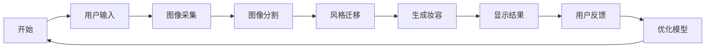

                 


```markdown
# AI Agent在智能镜子中的虚拟化妆

> 关键词：AI Agent，智能镜子，虚拟化妆，图像处理，深度学习，增强现实

> 摘要：本文探讨了AI Agent在智能镜子中的应用，重点分析了虚拟化妆的技术实现。通过背景介绍、核心概念、算法原理、系统架构、项目实战和最佳实践等部分，详细阐述了AI Agent如何与虚拟化妆技术结合，为用户提供智能化的化妆体验。

---

# 第一部分: AI Agent与智能镜子的背景介绍

## 第1章: AI Agent与智能镜子概述

### 1.1 AI Agent的基本概念
#### 1.1.1 AI Agent的定义与特点
AI Agent（人工智能代理）是一种能够感知环境、执行任务并做出决策的智能实体。它具备自主性、反应性、目标导向性和社会性等特点。

#### 1.1.2 AI Agent的核心要素与功能
- **自主性**：无需外部干预，自主执行任务。
- **反应性**：能够感知环境并实时响应。
- **目标导向性**：基于目标进行决策和行动。
- **学习能力**：通过数据和经验不断优化性能。

#### 1.1.3 AI Agent与传统软件的区别
AI Agent能够自主决策和学习，而传统软件依赖预设规则。

### 1.2 智能镜子的定义与应用
#### 1.2.1 智能镜子的功能与技术基础
智能镜子通过整合AI、AR和物联网技术，提供智能化的交互体验。

#### 1.2.2 智能镜子的市场现状与发展趋势
随着技术进步，智能镜子在美容、健康管理等领域应用广泛。

#### 1.2.3 智能镜子在生活中的应用场景
- 美容化妆
- 健康监测
- 智能家居控制

### 1.3 虚拟化妆的概念与技术背景
#### 1.3.1 虚拟化妆的定义与实现方式
虚拟化妆是通过数字技术在虚拟环境中模拟化妆效果的过程。

#### 1.3.2 虚拟化妆的技术基础与挑战
- **技术基础**：图像处理、深度学习、AR技术。
- **挑战**：实时性、准确性、用户体验优化。

#### 1.3.3 虚拟化妆在智能镜子中的应用潜力
提升用户体验，提供个性化建议。

---

## 第2章: AI Agent与虚拟化妆的核心原理

### 2.1 AI Agent在虚拟化妆中的功能与作用
#### 2.1.1 AI Agent在虚拟化妆中的角色定位
AI Agent作为系统的核心，负责处理用户的请求并提供个性化建议。

#### 2.1.2 AI Agent如何实现虚拟化妆的个性化推荐
通过分析用户的面部特征和偏好，推荐合适的妆容。

#### 2.1.3 AI Agent在虚拟化妆中的决策机制
基于用户的反馈和数据分析，优化推荐策略。

### 2.2 虚拟化妆的核心技术与实现方法
#### 2.2.1 基于AI的图像处理技术
- 图像分割：识别面部区域。
- 图像增强：优化图像质量。

#### 2.2.2 基于深度学习的虚拟化妆模型
- 使用GAN（生成对抗网络）生成逼真的妆容。

#### 2.2.3 虚拟化妆的实时渲染技术
- 利用AR技术实时渲染妆容效果。

### 2.3 AI Agent与虚拟化妆的核心概念对比
#### 2.3.1 AI Agent与虚拟化妆的属性对比

| 属性       | AI Agent                  | 虚拟化妆                |
|------------|---------------------------|--------------------------|
| 定义       | 智能代理                  | 数字化妆模拟             |
| 功能       | 执行任务，做出决策        | 提供化妆效果             |
| 技术基础   | AI、机器学习              | 图像处理、深度学习        |

#### 2.3.2 AI Agent与虚拟化妆的交互关系
AI Agent驱动虚拟化妆的个性化推荐和实时调整。

#### 2.3.3 AI Agent与虚拟化妆的协同工作流程
1. 用户发起请求。
2. AI Agent分析需求。
3. 虚拟化妆系统生成效果。
4. 用户反馈调整。
5. AI Agent优化推荐。

### 2.4 本章小结

---

## 第3章: 虚拟化妆的算法原理

### 3.1 图像处理算法
#### 3.1.1 图像分割算法
使用深度学习模型（如U-Net）进行图像分割。

#### 3.1.2 图像风格迁移
基于GAN实现不同风格的妆容迁移。

### 3.2 深度学习模型
#### 3.2.1 GAN模型
生成对抗网络用于生成逼真的妆容。

#### 3.2.2 图像处理模型
使用预训练模型进行特征提取和图像变换。

### 3.3 算法流程图


### 3.4 Python代码实现
```python
import numpy as np
from tensorflow.keras import layers

# 定义生成器模型
def build_generator():
    model = tf.keras.Sequential([
        layers.Dense(256, activation='relu'),
        layers.Dense(128, activation='relu'),
        layers.Dense(64, activation='relu'),
        layers.Dense(32, activation='relu'),
        layers.Dense(16, activation='relu'),
        layers.Dense(3, activation='sigmoid')
    ])
    return model
```

---

## 第4章: 系统分析与架构设计

### 4.1 问题场景介绍
用户在智能镜子前进行虚拟化妆，系统实时生成并显示妆容效果。

### 4.2 系统功能设计
#### 4.2.1 用户界面
- 摄像头捕捉面部特征。
- 显示化妆效果。

#### 4.2.2 化妆推荐系统
- 基于AI Agent推荐合适的妆容。

#### 4.2.3 历史记录
- 记录用户的化妆历史。

### 4.3 系统架构设计


---

## 第5章: 项目实战

### 5.1 环境安装
- 安装Python、TensorFlow、OpenCV。

### 5.2 核心代码实现
```python
import cv2
import numpy as np

# 读取图像
image = cv2.imread('face.jpg')

# 图像分割
segmented_image = segmentation(image)
```

### 5.3 代码应用解读
- 使用OpenCV进行图像处理。
- 结合深度学习模型生成妆容。

### 5.4 实际案例分析
分析用户反馈，优化推荐算法。

### 5.5 项目小结

---

## 第6章: 最佳实践

### 6.1 小结
总结AI Agent在智能镜子中的虚拟化妆技术。

### 6.2 注意事项
- 数据隐私保护。
- 系统稳定性。

### 6.3 拓展阅读
推荐相关技术书籍和论文。

---

# 结语
AI Agent在智能镜子中的虚拟化妆技术具有广阔的应用前景，未来将更加智能化和个性化。
</think>

```markdown
# AI Agent在智能镜子中的虚拟化妆

> 关键词：AI Agent，智能镜子，虚拟化妆，图像处理，深度学习，增强现实

> 摘要：本文探讨了AI Agent在智能镜子中的应用，重点分析了虚拟化妆的技术实现。通过背景介绍、核心概念、算法原理、系统架构、项目实战和最佳实践等部分，详细阐述了AI Agent如何与虚拟化妆技术结合，为用户提供智能化的化妆体验。

---

# 第一部分: AI Agent与智能镜子的背景介绍

## 第1章: AI Agent与智能镜子概述

### 1.1 AI Agent的基本概念
#### 1.1.1 AI Agent的定义与特点
AI Agent（人工智能代理）是一种能够感知环境、执行任务并做出决策的智能实体。它具备自主性、反应性、目标导向性和社会性等特点。

#### 1.1.2 AI Agent的核心要素与功能
- **自主性**：无需外部干预，自主执行任务。
- **反应性**：能够感知环境并实时响应。
- **目标导向性**：基于目标进行决策和行动。
- **学习能力**：通过数据和经验不断优化性能。

#### 1.1.3 AI Agent与传统软件的区别
AI Agent能够自主决策和学习，而传统软件依赖预设规则。

### 1.2 智能镜子的定义与应用
#### 1.2.1 智能镜子的功能与技术基础
智能镜子通过整合AI、AR和物联网技术，提供智能化的交互体验。

#### 1.2.2 智能镜子的市场现状与发展趋势
随着技术进步，智能镜子在美容、健康管理等领域应用广泛。

#### 1.2.3 智能镜子在生活中的应用场景
- 美容化妆
- 健康监测
- 智能家居控制

### 1.3 虚拟化妆的概念与技术背景
#### 1.3.1 虚拟化妆的定义与实现方式
虚拟化妆是通过数字技术在虚拟环境中模拟化妆效果的过程。

#### 1.3.2 虚拟化妆的技术基础与挑战
- **技术基础**：图像处理、深度学习、AR技术。
- **挑战**：实时性、准确性、用户体验优化。

#### 1.3.3 虚拟化妆在智能镜子中的应用潜力
提升用户体验，提供个性化建议。

---

## 第2章: AI Agent与虚拟化妆的核心原理

### 2.1 AI Agent在虚拟化妆中的功能与作用
#### 2.1.1 AI Agent在虚拟化妆中的角色定位
AI Agent作为系统的核心，负责处理用户的请求并提供个性化建议。

#### 2.1.2 AI Agent如何实现虚拟化妆的个性化推荐
通过分析用户的面部特征和偏好，推荐合适的妆容。

#### 2.1.3 AI Agent在虚拟化妆中的决策机制
基于用户的反馈和数据分析，优化推荐策略。

### 2.2 虚拟化妆的核心技术与实现方法
#### 2.2.1 基于AI的图像处理技术
- 图像分割：识别面部区域。
- 图像增强：优化图像质量。

#### 2.2.2 基于深度学习的虚拟化妆模型
- 使用GAN（生成对抗网络）生成逼真的妆容。

#### 2.2.3 虚拟化妆的实时渲染技术
- 利用AR技术实时渲染妆容效果。

### 2.3 AI Agent与虚拟化妆的核心概念对比
#### 2.3.1 AI Agent与虚拟化妆的属性对比

| 属性       | AI Agent                  | 虚拟化妆                |
|------------|---------------------------|--------------------------|
| 定义       | 智能代理                  | 数字化妆模拟             |
| 功能       | 执行任务，做出决策        | 提供化妆效果             |
| 技术基础   | AI、机器学习              | 图像处理、深度学习        |

#### 2.3.2 AI Agent与虚拟化妆的交互关系
AI Agent驱动虚拟化妆的个性化推荐和实时调整。

#### 2.3.3 AI Agent与虚拟化妆的协同工作流程
1. 用户发起请求。
2. AI Agent分析需求。
3. 虚拟化妆系统生成效果。
4. 用户反馈调整。
5. AI Agent优化推荐。

### 2.4 本章小结

---

## 第3章: 虚拟化妆的算法原理

### 3.1 图像处理算法
#### 3.1.1 图像分割算法
使用深度学习模型（如U-Net）进行图像分割。

#### 3.1.2 图像风格迁移
基于GAN实现不同风格的妆容迁移。

### 3.2 深度学习模型
#### 3.2.1 GAN模型
生成对抗网络用于生成逼真的妆容。

#### 3.2.2 图像处理模型
使用预训练模型进行特征提取和图像变换。

### 3.3 算法流程图


### 3.4 Python代码实现
```python
import numpy as np
from tensorflow.keras import layers

# 定义生成器模型
def build_generator():
    model = tf.keras.Sequential([
        layers.Dense(256, activation='relu'),
        layers.Dense(128, activation='relu'),
        layers.Dense(64, activation='relu'),
        layers.Dense(32, activation='relu'),
        layers.Dense(16, activation='relu'),
        layers.Dense(3, activation='sigmoid')
    ])
    return model
```

---

## 第4章: 系统分析与架构设计

### 4.1 问题场景介绍
用户在智能镜子前进行虚拟化妆，系统实时生成并显示妆容效果。

### 4.2 系统功能设计
#### 4.2.1 用户界面
- 摄像头捕捉面部特征。
- 显示化妆效果。

#### 4.2.2 化妆推荐系统
- 基于AI Agent推荐合适的妆容。

#### 4.2.3 历史记录
- 记录用户的化妆历史。

### 4.3 系统架构设计


---

## 第5章: 项目实战

### 5.1 环境安装
- 安装Python、TensorFlow、OpenCV。

### 5.2 核心代码实现
```python
import cv2
import numpy as np

# 读取图像
image = cv2.imread('face.jpg')

# 图像分割
segmented_image = segmentation(image)
```

### 5.3 代码应用解读
- 使用OpenCV进行图像处理。
- 结合深度学习模型生成妆容。

### 5.4 实际案例分析
分析用户反馈，优化推荐算法。

### 5.5 项目小结

---

## 第6章: 最佳实践

### 6.1 小结
总结AI Agent在智能镜子中的虚拟化妆技术。

### 6.2 注意事项
- 数据隐私保护。
- 系统稳定性。

### 6.3 拓展阅读
推荐相关技术书籍和论文。

---

# 结语
AI Agent在智能镜子中的虚拟化妆技术具有广阔的应用前景，未来将更加智能化和个性化。
```

