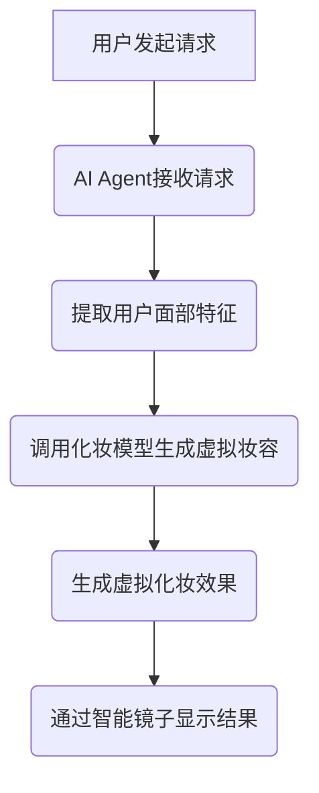
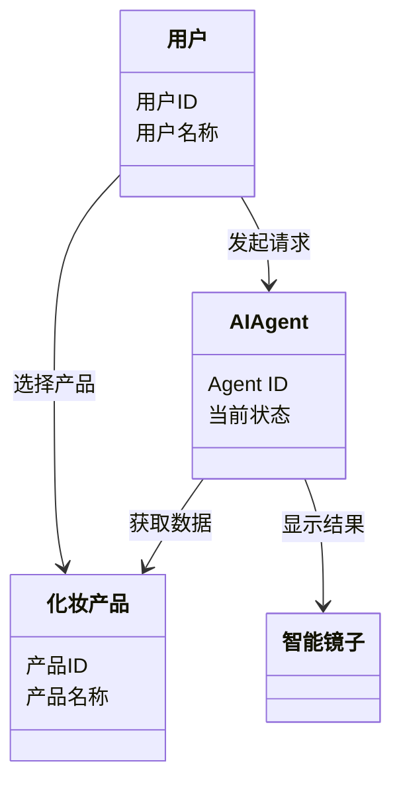

                 


# AI Agent在智能镜子中的虚拟化妆试验

> **关键词**: AI Agent, 智能镜子, 虚拟化妆, 计算机视觉, 机器学习  
> **摘要**: 本文探讨了AI Agent在智能镜子中的虚拟化妆应用，分析了其技术原理、系统架构和实现方案，详细讲解了从用户需求到技术实现的全过程，并通过实际案例展示了AI Agent在虚拟化妆中的潜力和优势。

---

## 第一部分: AI Agent在智能镜子中的虚拟化妆试验背景介绍

### 第1章: 问题背景与问题描述

#### 1.1 问题背景
##### 1.1.1 AI Agent与智能镜子的结合
AI Agent（人工智能代理）是一种能够感知环境、自主决策并执行任务的智能实体。智能镜子作为一种新兴的交互设备，结合AI Agent，可以为用户提供智能化的化妆建议和虚拟试妆服务。

##### 1.1.2 虚拟化妆技术的发展现状
虚拟化妆技术近年来快速发展，主要依赖于计算机视觉和增强现实（AR）技术。用户可以通过摄像头和屏幕实时看到虚拟的化妆效果，但传统方法通常需要人工调整参数，缺乏智能化。

##### 1.1.3 问题提出的背景与意义
随着AI技术的进步，用户对智能化化妆体验的需求日益增长。传统虚拟化妆技术依赖人工操作，效率低下且体验不佳。通过引入AI Agent，可以实现智能化、个性化的化妆推荐和试妆体验。

#### 1.2 问题描述
##### 1.2.1 虚拟化妆的核心问题
虚拟化妆的核心问题在于如何准确模拟真实化妆效果，并根据用户的面部特征和妆容需求提供个性化建议。

##### 1.2.2 AI Agent在智能镜子中的角色
AI Agent在智能镜子中扮演决策者和执行者的角色，负责接收用户的输入、分析需求、调用化妆算法，并通过镜子显示虚拟化妆效果。

##### 1.2.3 用户需求与技术挑战
用户需求主要集中在快速获取个性化化妆建议和实时试妆体验。技术挑战包括如何高效处理图像数据、优化算法性能以及确保系统的稳定性和安全性。

---

### 第2章: 问题解决与边界分析

#### 2.1 问题解决思路
##### 2.1.1 AI Agent在虚拟化妆中的作用
AI Agent通过分析用户的面部特征和化妆需求，调用预训练的化妆模型，生成虚拟化妆效果，并实时反馈给用户。

##### 2.1.2 智能镜子的硬件与软件架构
智能镜子的硬件包括摄像头、显示屏和嵌入式计算单元。软件架构分为数据采集、算法处理和用户交互三个部分。

##### 2.1.3 虚拟化妆的实现流程
虚拟化妆的实现流程包括图像采集、面部特征提取、妆容生成和效果展示。

#### 2.2 边界与外延
##### 2.2.1 系统的边界定义
系统边界包括智能镜子的硬件和软件部分，以及AI Agent的决策和执行功能。

##### 2.2.2 相关技术的外延扩展
相关技术包括计算机视觉、深度学习和增强现实技术。

##### 2.2.3 与其他系统的接口定义
系统与其他系统的接口包括用户输入接口、化妆模型接口和用户反馈接口。

---

## 第二部分: AI Agent与虚拟化妆的算法原理

### 第3章: 核心概念与联系

#### 3.1 核心概念原理
##### 3.1.1 AI Agent的核心原理
AI Agent通过感知环境、分析需求、调用算法和执行操作来实现功能。

##### 3.1.2 虚拟化妆的实现原理
虚拟化妆基于图像处理和AR技术，通过在用户面部图像上叠加虚拟妆容来实现效果。

##### 3.1.3 智能镜子的交互机制
智能镜子通过摄像头采集用户面部图像，AI Agent分析图像并生成虚拟化妆效果，最终通过屏幕显示给用户。

#### 3.2 核心概念对比表
| **核心概念** | **AI Agent** | **虚拟化妆** | **智能镜子** |
|--------------|--------------|--------------|--------------|
| **核心功能** | 感知与决策 | 虚拟试妆 | 实时显示 |
| **技术基础** | 机器学习 | 计算机视觉 | 图像处理 |
| **用户交互** | 无直接交互 | 用户输入 | 显示反馈 |

#### 3.3 ER实体关系图
```mermaid
erDiagram
    用户员 {
        <属性> 用户ID
        <属性> 用户名称
    }
    化妆产品 {
        <属性> 产品ID
        <属性> 产品名称
    }
    AI Agent {
        <属性> Agent ID
        <属性> 状态
    }
    用户 --> 化妆产品 : 选择产品
    用户 --> AI Agent : 发起请求
    AI Agent --> 化妆产品 : 获取数据
    AI Agent --> 智能镜子 : 显示结果
```

---

### 第4章: 算法原理与流程图

#### 4.1 算法原理
##### 4.1.1 基于深度学习的图像处理
虚拟化妆的核心算法是基于深度学习的图像生成模型，常用的模型包括卷积神经网络（CNN）和生成对抗网络（GAN）。

##### 4.1.2 AI Agent的决策机制
AI Agent通过分析用户的面部特征和化妆需求，调用预训练的化妆模型生成虚拟化妆效果。

#### 4.2 算法流程图


#### 4.3 Python代码实现
```python
import cv2
import numpy as np
from tensorflow.keras.models import load_model

# 加载预训练模型
model = load_model('妆容生成模型.h5')

# 摄像头采集用户图像
cap = cv2.VideoCapture(0)
while True:
    ret, frame = cap.read()
    if not ret:
        continue
    # 提取用户面部特征
    face_cascade = cv2.CascadeClassifier('haarcascade_frontalface_default.xml')
    faces = face_cascade.detectMultiScale(frame, 1.3, 5)
    for (x, y, w, h) in faces:
        # 调用化妆模型生成虚拟妆容
        face_img = frame[y:y+h, x:x+w]
        face_img = cv2.resize(face_img, (224, 224))
        face_img = np.expand_dims(face_img, axis=0)
        face_img = face_img.astype('float32') / 255.0
        predicted妆容 = model.predict(face_img)
        # 显示结果
        cv2.rectangle(frame, (x, y), (x + w, y + h), (255, 0, 0), 2)
        cv2.imshow('虚拟化妆效果', predicted妆容)
    if cv2.waitKey(1) == ord('q'):
        break
cap.release()
cv2.destroyAllWindows()
```

#### 4.4 数学模型与公式
虚拟化妆的数学模型基于图像生成的卷积神经网络，核心公式如下：
$$
\text{输出} = \text{卷积}(\text{输入}, \text{滤镜})
$$
生成对抗网络的损失函数为：
$$
\mathcal{L}(\text{生成器}, \text{判别器}) = \mathbb{E}[\log(D(x))] + \mathbb{E}[\log(1 - D(G(z)))]
$$

---

## 第三部分: 系统分析与架构设计方案

### 第5章: 系统功能设计

#### 5.1 系统功能模块
智能镜子虚拟化妆系统的主要功能模块包括：
1. 用户输入与图像采集
2. 面部特征提取与分析
3. 虚拟化妆生成与展示
4. 用户反馈与调整

#### 5.2 领域模型类图


#### 5.3 系统架构设计
智能镜子的系统架构分为前端和后端两部分：
- 前端：摄像头和显示屏，负责图像采集和结果展示。
- 后端：AI Agent和化妆模型，负责图像处理和算法计算。

#### 5.4 系统接口设计
- 用户接口：摄像头和触摸屏
- 系统接口：AI Agent与化妆模型的接口
- 交互流程：用户输入 -> 数据采集 -> 算法处理 -> 结果展示

---

## 第四部分: 项目实战

### 第6章: 环境安装与代码实现

#### 6.1 环境安装
需要安装的软件包括：
- Python 3.8+
- OpenCV
- TensorFlow
- Keras

#### 6.2 核心代码实现
```python
import cv2
import numpy as np
from tensorflow.keras.models import load_model

# 加载预训练模型
model = load_model('妆容生成模型.h5')

# 摄像头采集用户图像
cap = cv2.VideoCapture(0)
while True:
    ret, frame = cap.read()
    if not ret:
        continue
    # 提取用户面部特征
    face_cascade = cv2.CascadeClassifier('haarcascade_frontalface_default.xml')
    faces = face_cascade.detectMultiScale(frame, 1.3, 5)
    for (x, y, w, h) in faces:
        # 调用化妆模型生成虚拟妆容
        face_img = frame[y:y+h, x:x+w]
        face_img = cv2.resize(face_img, (224, 224))
        face_img = np.expand_dims(face_img, axis=0)
        face_img = face_img.astype('float32') / 255.0
        predicted妆容 = model.predict(face_img)
        # 显示结果
        cv2.rectangle(frame, (x, y), (x + w, y + h), (255, 0, 0), 2)
        cv2.imshow('虚拟化妆效果', predicted妆容)
    if cv2.waitKey(1) == ord('q'):
        break
cap.release()
cv2.destroyAllWindows()
```

#### 6.3 案例分析与解读
通过实际案例分析，展示AI Agent在虚拟化妆中的应用效果和优势，验证系统的可行性和用户体验。

#### 6.4 项目总结
总结项目的实现过程，分析系统的优势和不足，并提出改进方向。

---

## 第五部分: 总结与展望

### 第7章: 最佳实践与注意事项

#### 7.1 最佳实践
- 确保硬件设备的性能，避免图像处理延迟
- 定期更新化妆模型，保持算法的先进性
- 提供多语言支持，提升用户体验

#### 7.2 注意事项
- 注意数据隐私和安全
- 确保系统的稳定性和可靠性
- 提供用户友好的交互界面

### 第8章: 拓展阅读与进一步思考

#### 8.1 拓展阅读
推荐相关书籍和论文，帮助读者深入了解AI Agent和虚拟化妆技术。

#### 8.2 进一步思考
探讨AI Agent在其他领域的潜在应用，如医疗诊断、智能客服等。

---

## 总结

通过本文的详细讲解，我们了解了AI Agent在智能镜子中的虚拟化妆应用，从技术原理到系统实现，再到实际案例分析，全面展示了AI技术在化妆领域的巨大潜力。未来，随着AI技术的不断进步，虚拟化妆体验将更加智能化和个性化，为用户带来更高效、更便捷的服务。

