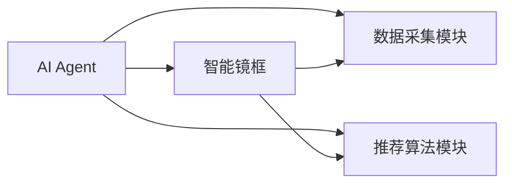
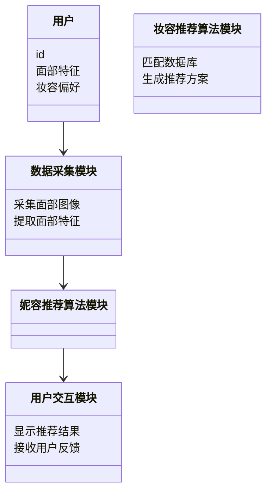
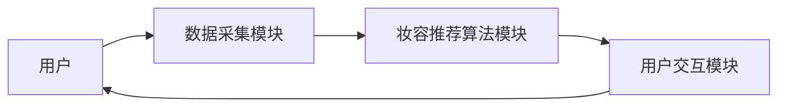

                 


# AI Agent在智能镜框中的妆容建议

## 关键词：AI Agent, 智能镜框, 妆容建议, 人机交互, 人工智能, 图像识别

## 摘要：
本文探讨了AI Agent在智能镜框中的妆容建议应用。从AI Agent的基本概念到智能镜框的技术背景，详细分析了妆容建议智能化的需求与技术挑战。通过核心概念的对比、算法原理的讲解、系统架构的设计，结合项目实战案例，全面展示了AI Agent在智能镜框中的妆容建议的实现过程与实际应用效果。

---

# 第1章: AI Agent与智能镜框概述

## 1.1 AI Agent的基本概念

### 1.1.1 AI Agent的定义与特点
AI Agent（人工智能代理）是指能够感知环境、自主决策并执行任务的智能实体。其特点包括：
- **自主性**：能够在没有外部干预的情况下独立运行。
- **反应性**：能够实时感知环境并做出反应。
- **主动性**：主动寻找问题并提供解决方案。
- **社交能力**：能够与其他系统或用户进行交互。

### 1.1.2 AI Agent的核心功能与应用场景
AI Agent的核心功能包括：
- **感知**：通过传感器或数据输入获取环境信息。
- **推理**：基于知识库或算法对信息进行分析和推理。
- **决策**：根据推理结果做出最优决策。
- **执行**：通过执行机构或接口将决策转化为具体操作。

应用场景包括智能助手、自动驾驶、智能客服、智能家居等。

### 1.1.3 AI Agent与传统计算机程序的区别
AI Agent与传统程序的区别主要体现在：
- **自主性**：AI Agent能够自主决策，而传统程序通常需要明确的指令。
- **学习能力**：AI Agent可以通过数据学习和优化，而传统程序依赖于固定的逻辑。
- **交互能力**：AI Agent能够与环境或用户进行动态交互，而传统程序通常是单向执行。

## 1.2 智能镜框的概念与技术背景

### 1.2.1 智能镜框的定义与功能
智能镜框是一种结合了AI技术的智能硬件设备，通常集成摄像头、传感器和显示屏，能够通过图像识别、语音交互等方式为用户提供智能化的服务。其主要功能包括：
- **人脸识别**：识别用户的面部特征。
- **图像分析**：分析用户的皮肤状况、五官特征等。
- **妆容建议**：根据用户的面部特征和需求，推荐适合的妆容方案。
- **个性化设置**：根据用户的偏好调整显示内容和建议。

### 1.2.2 智能镜框的技术基础
智能镜框的技术基础包括：
- **图像识别**：利用AI技术识别和分析图像。
- **自然语言处理**：支持语音交互和语义理解。
- **云计算**：通过云端计算提供强大的数据处理能力。
- **物联网**：实现设备之间的互联互通。

### 1.2.3 智能镜框的应用场景与用户需求
智能镜框的主要应用场景包括：
- **美容美妆**：为用户提供个性化的妆容建议。
- **健康管理**：通过面部特征分析用户的健康状况。
- **时尚搭配**：推荐适合用户的服装和配饰。

用户需求主要集中在个性化服务、便捷性、准确性等方面。

## 1.3 妆容建议的智能化需求

### 1.3.1 妆容建议的传统方式与局限性
传统妆容建议主要依赖于人工经验，存在以下局限性：
- **主观性**：不同化妆师可能给出不同的建议。
- **效率低**：人工分析耗时较长。
- **覆盖面窄**：难以覆盖所有可能的用户需求。

### 1.3.2 智能化妆容建议的优势
AI Agent在智能镜框中的应用，能够实现以下优势：
- **高效性**：通过算法快速分析用户面部特征。
- **准确性**：基于大量数据进行精准分析。
- **个性化**：根据用户需求提供定制化建议。
- **便捷性**：用户可以通过智能镜框随时获取建议。

### 1.3.3 AI Agent在妆容建议中的角色与价值
AI Agent在妆容建议中扮演着关键角色：
- **数据采集**：通过摄像头和传感器采集用户面部数据。
- **数据分析**：利用算法对数据进行分析和处理。
- **结果输出**：将分析结果转化为具体的妆容建议。

其价值在于通过智能化手段提升用户体验，降低人工成本，实现个性化服务。

---

## 1.4 本章小结
本章介绍了AI Agent的基本概念及其在智能镜框中的应用背景，分析了传统妆容建议的局限性以及AI Agent在智能镜框中的优势和价值。为后续章节的深入分析奠定了基础。

---

# 第2章: AI Agent在智能镜框中的问题背景

## 2.1 妆容建议的核心问题

### 2.1.1 用户需求分析
用户在使用智能镜框时，通常有以下需求：
- **个性化建议**：用户希望得到适合自己面部特征的妆容建议。
- **实时反馈**：用户希望快速获得妆容建议的反馈。
- **便捷性**：用户希望在不需要专业人员的情况下，轻松获得妆容建议。

### 2.1.2 妆容建议的关键挑战
实现智能化妆容建议面临以下关键挑战：
- **数据采集**：如何准确采集用户的面部特征数据。
- **算法精度**：如何确保妆容推荐算法的准确性和实时性。
- **用户体验**：如何设计友好的用户界面和交互方式。

### 2.1.3 AI Agent在妆容建议中的解决方案
AI Agent可以通过以下方式解决上述问题：
- **高效数据处理**：利用AI算法快速处理面部数据。
- **精准推荐**：基于用户数据推荐最优妆容方案。
- **实时反馈**：通过交互界面实时向用户反馈建议。

## 2.2 AI Agent在智能镜框中的技术挑战

### 2.2.1 数据采集与处理的难点
智能镜框的数据采集涉及以下难点：
- **光照影响**：不同光照条件下面部特征的采集难度不同。
- **数据质量**：需要确保采集的数据准确、清晰。
- **隐私保护**：如何在采集和处理数据时保护用户隐私。

### 2.2.2 算法模型的精度与效率问题
AI Agent的算法模型需要在以下方面进行优化：
- **模型精度**：确保妆容推荐的准确性。
- **计算效率**：保证实时反馈的响应速度。
- **模型可解释性**：便于用户理解推荐结果的原因。

### 2.2.3 用户隐私与数据安全的保护
智能镜框涉及用户面部数据，数据安全是重中之重：
- **数据加密**：对采集的数据进行加密处理。
- **权限控制**：确保只有授权用户可以访问数据。
- **合规性**：遵守相关法律法规，保护用户隐私。

## 2.3 本章小结
本章分析了AI Agent在智能镜框中实现妆容建议的核心问题和面临的挑战，为后续章节的技术实现提供了问题背景和方向。

---

# 第3章: AI Agent与智能镜框的核心概念

## 3.1 AI Agent的核心原理

### 3.1.1 知识表示与推理
知识表示是AI Agent的核心基础，常见的表示方法包括：
- **规则表示**：通过预定义的规则进行推理。
- **语义网络**：通过概念间的语义关系进行推理。
- **概率推理**：基于概率模型进行推理。

### 3.1.2 行为规划与决策
行为规划是AI Agent实现智能决策的关键步骤：
- **目标设定**：明确AI Agent的目标。
- **路径规划**：通过算法规划最优路径。
- **决策执行**：根据规划结果执行具体操作。

### 3.1.3 人机交互与反馈机制
人机交互是AI Agent与用户进行信息交换的重要方式：
- **输入方式**：支持语音、触摸等多种输入方式。
- **输出方式**：通过屏幕、语音等方式反馈结果。
- **反馈机制**：根据用户反馈调整AI Agent的行为。

## 3.2 智能镜框的技术架构

### 3.2.1 硬件设备的功能与作用
智能镜框的硬件设备包括：
- **摄像头**：用于采集用户面部图像。
- **显示屏**：用于显示妆容建议和相关界面。
- **传感器**：用于采集环境数据，如光线强度。

### 3.2.2 软件系统的组成与流程
智能镜框的软件系统包括：
- **数据采集模块**：负责采集用户数据。
- **算法处理模块**：对数据进行分析和处理。
- **交互界面模块**：与用户进行信息交换。

### 3.2.3 网络通信与数据传输
智能镜框需要通过网络实现数据的上传和下载，通常采用：
- **无线通信**：如Wi-Fi、蓝牙等。
- **云端处理**：将数据上传至云端进行处理。

## 3.3 AI Agent在智能镜框中的功能模块

### 3.3.1 数据采集与分析模块
数据采集与分析模块负责：
- **面部特征提取**：提取用户的面部特征，如五官位置、肤色等。
- **数据分析**：基于AI算法对数据进行分析和处理。

### 3.3.2 妆容推荐算法模块
妆容推荐算法模块负责：
- **数据匹配**：将用户数据与数据库中的妆容方案进行匹配。
- **推荐结果生成**：根据匹配结果生成最优妆容建议。

### 3.3.3 用户交互与反馈模块
用户交互与反馈模块负责：
- **用户输入**：接收用户的输入指令。
- **结果反馈**：将妆容建议通过显示屏或语音反馈给用户。

## 3.4 本章小结
本章详细阐述了AI Agent的核心原理和智能镜框的技术架构，分析了AI Agent在智能镜框中的功能模块及其作用。

---

# 第4章: AI Agent与智能镜框的核心概念关系

## 4.1 核心概念的属性对比

### 4.1.1 AI Agent与智能镜框的功能对比
| 功能 | AI Agent | 智能镜框 |
|------|-----------|-----------|
| 数据采集 | 内置传感器 | 集成摄像头和传感器 |
| 数据处理 | 依赖算法模型 | 依赖AI算法和云端计算 |
| 用户交互 | 支持多种交互方式 | 支持语音和触控交互 |

### 4.1.2 数据采集与处理的特征对比
| 特征 | AI Agent | 智能镜框 |
|------|-----------|-----------|
| 采集方式 | 多样化 | 以摄像头为主 |
| 数据类型 | 包括图像、语音等 | 主要为图像数据 |
| 处理速度 | 依赖算法效率 | 依赖云端计算能力 |

### 4.1.3 算法模型的性能对比
| 性能指标 | AI Agent | 智能镜框 |
|----------|-----------|-----------|
| 精度 | 高 | 较高 |
| 效率 | 高 | 较高 |
| 可扩展性 | 较好 | 较好 |

## 4.2 实体关系图

### 4.2.1 AI Agent与智能镜框的实体关系图


### 4.2.2 核心概念的实体关系图


---

## 4.3 本章小结
本章通过属性对比和实体关系图，分析了AI Agent与智能镜框在核心概念上的联系和区别，帮助读者更好地理解两者的相互作用。

---

# 第5章: AI Agent在智能镜框中的算法原理

## 5.1 算法原理概述

### 5.1.1 基于图像识别的妆容推荐算法
基于图像识别的妆容推荐算法主要步骤如下：
1. **面部特征提取**：通过AI算法提取用户的面部特征，如五官位置、肤色等。
2. **数据匹配**：将提取的特征与数据库中的妆容方案进行匹配。
3. **推荐结果生成**：根据匹配结果生成最优妆容建议。

### 5.1.2 基于K-近邻算法（KNN）的妆容推荐
KNN算法是一种常用的分类算法，适用于基于距离的匹配问题。其基本步骤如下：
1. **数据预处理**：对用户数据进行标准化处理。
2. **计算距离**：计算用户数据与数据库中每个样本之间的距离。
3. **选择邻居**：选取距离最近的K个样本。
4. **分类预测**：根据邻居的类别进行预测。

### 5.1.3 算法流程图


## 5.2 算法实现细节

### 5.2.1 Python实现KNN算法
```python
import numpy as np
from sklearn.neighbors import NearestNeighbors

# 数据预处理
X = np.array([[x1, y1], [x2, y2], ...])  # 用户数据
nbrs = NearestNeighbors(n_neighbors=3, algorithm='ball_tree').fit(X)
distances, indices = nbrs.kneighbors(new_user_data)
```

### 5.2.2 算法数学模型
KNN算法的数学模型如下：
$$
\text{距离} = \sqrt{\sum_{i=1}^{n} (x_i - y_i)^2}
$$
其中，$x_i$是用户数据，$y_i$是数据库中的样本数据。

### 5.2.3 算法优化
为了提高KNN算法的效率，可以采用以下优化措施：
- **局部敏感哈希（LSH）**：通过哈希函数将数据映射到低维空间。
- **空间划分**：将数据划分为多个区域，减少计算距离的范围。

## 5.3 本章小结
本章详细讲解了AI Agent在智能镜框中的算法原理，重点分析了基于图像识别的妆容推荐算法及其实现细节。

---

# 第6章: AI Agent在智能镜框中的系统分析与架构设计

## 6.1 问题场景介绍

### 6.1.1 系统目标
系统目标是通过AI Agent实现智能镜框的妆容建议功能，为用户提供个性化的化妆方案。

### 6.1.2 系统范围
系统范围包括：
- 数据采集模块
- 妆容推荐算法模块
- 用户交互模块

## 6.2 项目介绍

### 6.2.1 项目目标
项目目标是开发一款基于AI Agent的智能镜框，实现高效的妆容建议功能。

### 6.2.2 项目范围
项目范围包括：
- 系统设计
- 算法实现
- 界面设计

## 6.3 系统功能设计

### 6.3.1 领域模型设计


### 6.3.2 系统架构设计


## 6.4 本章小结
本章通过系统分析与架构设计，明确了AI Agent在智能镜框中的实现方式和系统结构。

---

# 第7章: AI Agent在智能镜框中的项目实战

## 7.1 环境安装

### 7.1.1 系统要求
- 操作系统：Windows/Mac/Linux
- Python版本：Python 3.6以上
- 额外依赖：安装numpy、scikit-learn等库

### 7.1.2 安装步骤
1. 安装Python环境。
2. 安装所需库：
```bash
pip install numpy scikit-learn
```

## 7.2 系统核心实现

### 7.2.1 核心代码实现
```python
from sklearn.neighbors import NearestNeighbors
import cv2

# 数据预处理
def preprocess_data(data):
    # 对数据进行标准化处理
    return data / 255.0

# KNN算法实现
def knn_recommendation(user_data, database, n_neighbors=3):
    model = NearestNeighbors(n_neighbors=n_neighbors, algorithm='ball_tree').fit(database)
    distances, indices = model.kneighbors(user_data)
    return indices[:, 0]  # 返回最近的样本索引
```

### 7.2.2 代码应用解读与分析
- **数据预处理**：对用户数据进行标准化处理，确保数据在相同范围内。
- **KNN算法实现**：通过scikit-learn库实现KNN算法，找到与用户数据最匹配的妆容方案。

## 7.3 案例分析

### 7.3.1 案例背景
假设我们有一个包含1000种妆容方案的数据库，用户希望通过智能镜框获取适合自己的妆容建议。

### 7.3.2 实施步骤
1. 用户通过智能镜框采集面部图像。
2. 数据采集模块提取用户的面部特征。
3. 妮容推荐算法模块通过KNN算法匹配数据库中的妆容方案。
4. 用户交互模块将推荐结果反馈给用户。

## 7.4 本章小结
本章通过项目实战，展示了AI Agent在智能镜框中的具体实现过程，帮助读者更好地理解系统的实际应用。

---

# 第8章: AI Agent在智能镜框中的最佳实践

## 8.1 最佳实践Tips

### 8.1.1 数据采集注意事项
- 确保数据采集环境的光线充足且均匀。
- 定期更新数据库，保证数据的多样性和准确性。

### 8.1.2 算法优化建议
- 根据具体需求调整KNN算法的参数，如K值的选择。
- 使用更高效的算法，如基于深度学习的推荐算法。

## 8.2 小结
通过本章的内容，读者可以掌握AI Agent在智能镜框中的最佳实践方法，为实际应用提供参考。

---

# 总结

本文从AI Agent的基本概念出发，详细分析了其在智能镜框中的妆容建议应用。通过核心概念的对比、算法原理的讲解、系统架构的设计，结合项目实战案例，全面展示了AI Agent在智能镜框中的妆容建议的实现过程与实际应用效果。希望本文能够为相关领域的研究和实践提供有价值的参考。

