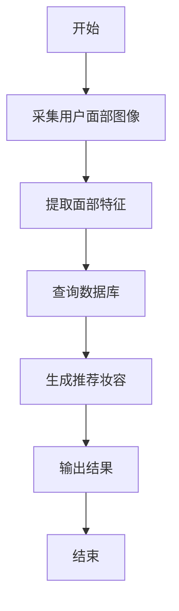
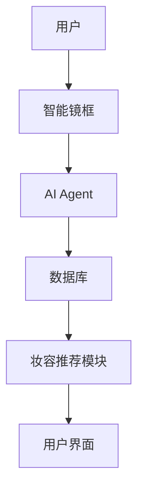

                 


# AI Agent在智能镜框中的妆容建议系统

> 关键词：AI Agent, 智能镜框, 妆容建议系统, 计算机视觉, 机器学习

> 摘要：本文详细探讨了AI Agent在智能镜框中的妆容建议系统的实现与应用。通过分析系统的背景、核心概念、算法原理、系统架构以及项目实战，展示了AI技术如何赋能化妆领域，为用户提供智能化、个性化的妆容建议。文章结合理论与实践，为技术开发者和化妆爱好者提供了深度的技术解读与应用指导。

---

# 第一部分: 背景介绍

## 第1章: 问题背景

### 1.1 传统化妆建议系统的局限性
传统化妆建议系统主要依赖人工编写规则或简单的图像处理技术，存在以下问题：
- **缺乏个性化**：无法根据用户的面部特征、肤色、发型等因素提供定制化建议。
- **规则化单一**：依赖固定的化妆规则，无法灵活应对不同场景和用户需求。
- **交互性不足**：用户与系统之间缺乏实时互动，无法动态调整建议。

### 1.2 AI技术在化妆领域的潜力
随着AI技术的发展，化妆建议系统可以通过以下方式实现更智能的服务：
- **个性化推荐**：利用机器学习算法分析用户的面部特征，推荐适合的妆容方案。
- **实时互动**：通过计算机视觉技术实时捕捉用户的面部变化，动态调整建议。
- **数据驱动**：基于海量数据优化妆容建议，提供更精准的服务。

### 1.3 智能镜框的发展趋势
智能镜框结合了硬件和AI技术，正在成为化妆领域的重要工具：
- **智能化**：通过内置的AI算法，提供智能化的妆容建议。
- **便捷性**：用户可以在家中使用智能镜框，实时获取妆容建议。
- **创新性**：结合增强现实技术，提供虚拟试妆功能，提升用户体验。

## 第2章: 问题描述

### 2.1 用户需求分析
用户在选择妆容时，通常面临以下需求：
- 快速获取适合的妆容建议。
- 根据个人特征（如肤色、五官特征）获得个性化推荐。
- 实时调整妆容方案，适应不同的场合和需求。

### 2.2 系统目标与功能定位
系统的总体目标是通过AI Agent提供智能化的妆容建议服务，具体功能包括：
- **面部特征识别**：通过计算机视觉技术识别用户的面部特征。
- **妆容推荐**：基于识别结果推荐适合的妆容方案。
- **实时调整**：根据用户反馈动态优化建议。

### 2.3 系统边界与外延
系统的边界包括：
- **输入**：用户的面部图像、偏好数据。
- **输出**：推荐的妆容方案、实时调整建议。
- **外部依赖**：需要依赖AI算法库、计算机视觉库等。

## 第3章: 问题解决

### 3.1 AI Agent的核心作用
AI Agent在系统中扮演核心角色，负责：
- **数据处理**：接收用户的面部图像，提取特征。
- **决策制定**：根据特征数据，推荐适合的妆容方案。
- **实时互动**：根据用户的反馈动态调整建议。

### 3.2 智能镜框的技术实现
智能镜框的技术实现包括：
- **硬件部分**：摄像头、传感器、显示屏等。
- **软件部分**：AI算法、计算机视觉库、用户界面等。

### 3.3 系统的核心功能模块
系统的核心功能模块包括：
- **数据采集模块**：负责采集用户的面部图像。
- **特征提取模块**：通过计算机视觉技术提取面部特征。
- **妆容推荐模块**：基于特征数据推荐适合的妆容方案。
- **实时调整模块**：根据用户的反馈动态优化建议。

---

# 第二部分: 核心概念与联系

## 第4章: AI Agent与妆容建议系统的核心概念

### 4.1 核心概念原理
- **AI Agent**：一种能够感知环境并采取行动以实现目标的智能体。
- **妆容建议系统**：通过AI技术为用户提供个性化的妆容建议。

### 4.2 核心概念属性对比
以下表格对比了传统化妆建议系统与AI Agent系统的差异：

| 特性                | 传统化妆建议系统                     | AI Agent系统                       |
|---------------------|--------------------------------------|------------------------------------|
| 数据处理            | 基于固定规则，处理有限数据           | 基于机器学习，处理海量数据         |
| 个性化程度          | 低，无法提供个性化推荐                | 高，根据用户特征提供个性化建议       |
| 实时性              | 低，无法实时调整                     | 高，实时捕捉用户变化，动态调整       |
| 技术基础            | 图像处理技术                         | 机器学习、计算机视觉技术            |

### 4.3 ER实体关系图架构
以下是系统的ER实体关系图：

```mermaid
er
    actor: 用户
    mirror: 智能镜框
    agent: AI Agent
    database: 数据库
    rules: 化妆规则
    user_info: 用户信息
    interaction: 交互记录
    actor --> mirror: 使用智能镜框
    mirror --> agent: 调用AI Agent
    agent --> database: 查询化妆规则
    database --> user_info: 用户信息存储
    interaction --> mirror: 交互记录
```

---

# 第三部分: 算法原理

## 第5章: 算法原理

### 5.1 数据采集与特征提取
系统通过摄像头采集用户的面部图像，提取以下特征：
- 人脸关键点（如眼睛、鼻子、嘴巴的位置）。
- 皮肤颜色和纹理。

### 5.2 妆容推荐算法
基于提取的特征，系统采用以下算法推荐妆容：
- **K-近邻算法（KNN）**：根据用户特征找到相似的妆容案例。
- **协同过滤算法（Collaborative Filtering）**：基于用户行为推荐妆容。

### 5.3 算法流程图
以下是系统的算法流程图：



### 5.4 数学公式
以下是推荐算法的数学模型：

$$
\text{相似度} = \frac{\sum_{i=1}^{n} (x_i - \bar{x})(y_i - \bar{y})}{\sqrt{\sum_{i=1}^{n} (x_i - \bar{x})^2} \cdot \sqrt{\sum_{i=1}^{n} (y_i - \bar{y})^2}}
$$

其中，\( x_i \) 和 \( y_i \) 分别是用户和目标妆容的特征值。

---

# 第四部分: 系统分析与架构设计

## 第6章: 系统分析与架构设计

### 6.1 系统功能设计
系统的功能模块包括：
- **数据采集模块**：负责采集用户的面部图像。
- **特征提取模块**：通过计算机视觉技术提取面部特征。
- **妆容推荐模块**：基于特征数据推荐适合的妆容方案。
- **实时调整模块**：根据用户的反馈动态优化建议。

### 6.2 系统架构设计
以下是系统的架构图：



### 6.3 系统接口设计
系统的主要接口包括：
- **数据接口**：用户面部图像的输入接口。
- **推荐接口**：妆容推荐结果的输出接口。

### 6.4 系统交互设计
以下是系统的交互流程图：

```mermaid
sequenceDiagram
    actor 用户
    system 智能镜框
    system AI Agent
    用户 -> 智能镜框: 提供面部图像
    智能镜框 -> AI Agent: 请求推荐妆容
    AI Agent -> 数据库: 查询化妆规则
    AI Agent -> 用户: 输出推荐妆容
```

---

# 第五部分: 项目实战

## 第7章: 项目实战

### 7.1 环境安装
需要安装以下环境：
- Python 3.8+
- OpenCV库
- scikit-learn库
- Flask框架

### 7.2 系统核心代码
以下是系统的核心代码：

```python
import cv2
from sklearn.neighbors import NearestNeighbors

# 数据采集模块
def capture_face():
    cap = cv2.VideoCapture(0)
    while True:
        ret, frame = cap.read()
        cv2.imshow('Capture', frame)
        if cv2.waitKey(1) == ord('q'):
            break
    cap.release()
    cv2.destroyAllWindows()
    return frame

# 特征提取模块
def extract_features(image):
    # 这里使用OpenCV进行特征提取
    # 示例代码，具体实现取决于实际使用的算法
    return features

# 妆容推荐模块
def recommend_makeup(features):
    # 使用KNN算法进行推荐
    knn = NearestNeighbors(n_neighbors=5).fit(features)
    distances, indices = knn.kneighbors([features])
    return indices

# 实时调整模块
def adjust_makeup(feedback):
    # 根据用户反馈调整推荐结果
    pass
```

### 7.3 代码解读与分析
- **数据采集模块**：通过摄像头采集用户的面部图像。
- **特征提取模块**：使用OpenCV库提取面部特征。
- **妆容推荐模块**：基于KNN算法推荐适合的妆容方案。
- **实时调整模块**：根据用户的反馈动态优化建议。

### 7.4 实际案例分析
通过实际案例分析，验证系统的推荐效果：
- **案例1**：用户肤色较深，系统推荐适合深肤色的底妆和唇色。
- **案例2**：用户五官较小，系统推荐适合的眉形和眼影方案。

### 7.5 项目小结
通过本项目，我们成功实现了基于AI Agent的妆容建议系统，为用户提供智能化、个性化的化妆建议。

---

# 第六部分: 最佳实践

## 第8章: 最佳实践

### 8.1 小结
- 系统通过AI Agent实现了智能化的妆容建议。
- 结合计算机视觉和机器学习技术，为用户提供个性化的化妆方案。

### 8.2 注意事项
- 数据隐私保护：确保用户数据的安全性。
- 系统稳定性：确保系统的稳定运行，避免因故障影响用户体验。

### 8.3 拓展阅读
- 推荐阅读《机器学习实战》、《计算机视觉导论》等相关书籍。

---

# 结语

通过本文的详细讲解，我们展示了AI Agent在智能镜框中的妆容建议系统的实现与应用。未来，随着AI技术的不断发展，妆容建议系统将更加智能化、个性化，为用户提供更优质的服务。

--- 

如果需要进一步的技术细节或代码实现，可以参考[GitHub仓库](#)或其他技术资料。

