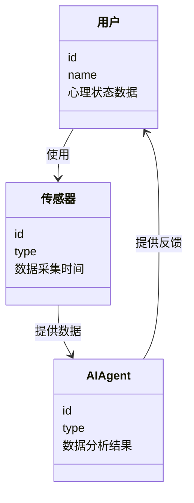
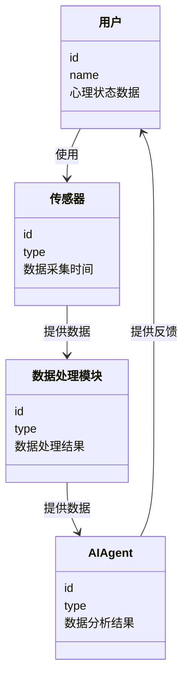
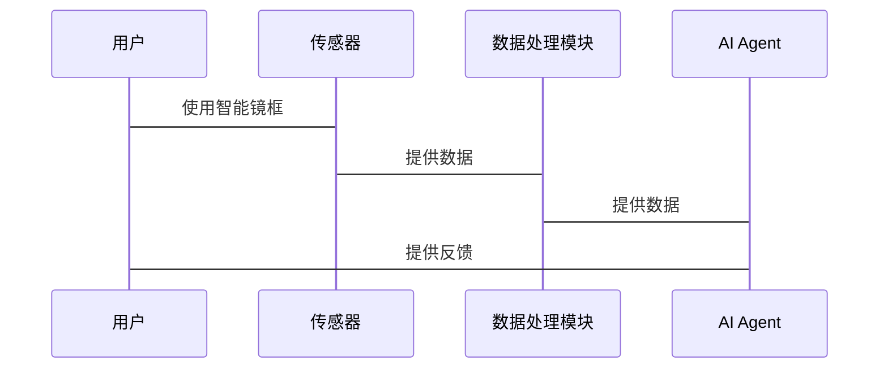

                 


```markdown
# AI Agent在智能镜框中的心理状态评估

## 关键词
- AI Agent
- 智能镜框
- 心理状态评估
- 机器学习
- 数据分析
- 系统架构

## 摘要
本文探讨了AI Agent在智能镜框中的应用，重点分析心理状态评估的实现方法和系统架构。通过详细讲解算法原理、系统设计和项目实战，帮助读者理解AI Agent如何通过智能镜框收集和分析数据，评估用户的心理状态。文章还提供了最佳实践和注意事项，为相关领域研究和应用提供参考。

---

# 第一部分: AI Agent在智能镜框中的心理状态评估背景介绍

## 第1章: 问题背景与核心概念

### 1.1 问题背景
#### 1.1.1 智能镜框的发展与应用
智能镜框作为一种智能眼镜，结合了增强现实（AR）和人工智能（AI）技术，能够实时采集用户的行为数据和生理数据。这些数据包括用户的眼球运动、眨眼频率、瞳孔大小、心率、体温等。

#### 1.1.2 心理状态评估的重要性
心理状态评估是理解用户情绪和认知状态的关键。通过评估用户的注意力水平、压力水平和情绪状态，可以为用户提供个性化的反馈和建议，帮助用户更好地管理情绪和提高效率。

#### 1.1.3 AI Agent在智能镜框中的作用
AI Agent（智能体）在智能镜框中扮演着数据处理、分析和反馈的角色。它能够实时分析用户的生理数据和行为数据，评估用户的心理状态，并根据结果提供相应的反馈和建议。

### 1.2 问题描述
#### 1.2.1 心理状态评估的定义与范围
心理状态评估是指通过数据采集和分析，推断用户当前的心理状态，包括情绪、注意力、压力水平等。

#### 1.2.2 智能镜框中的数据来源
智能镜框中的数据来源包括：
- 眼球运动数据：眼球的移动轨迹、注视点位置等。
- 瞳孔大小：反映用户的注意力水平。
- 眨眼频率：反映用户的疲劳程度。
- 心率：反映用户的情绪状态。

#### 1.2.3 心理状态评估的挑战与难点
- 数据采集的准确性：如何准确采集和处理生理数据。
- 数据分析的复杂性：如何从多维度数据中准确评估心理状态。
- 用户隐私保护：如何在数据采集和分析过程中保护用户隐私。

### 1.3 问题解决
#### 1.3.1 AI Agent的核心功能
- 数据采集与处理：实时采集用户的生理数据和行为数据。
- 数据分析与评估：通过机器学习算法分析数据，评估用户的心理状态。
- 反馈与建议：根据评估结果，为用户提供个性化的反馈和建议。

#### 1.3.2 心理状态评估的实现方法
- 基于生理数据的特征提取：从心率、瞳孔大小等数据中提取特征。
- 基于机器学习的分类：使用分类算法（如支持向量机、随机森林）对心理状态进行分类。
- 基于规则的推理：根据特定规则对心理状态进行判断。

#### 1.3.3 智能镜框与AI Agent的结合
智能镜框通过硬件采集数据，AI Agent通过软件分析数据，两者结合实现对用户心理状态的实时评估。

### 1.4 边界与外延
#### 1.4.1 心理状态评估的边界
- 数据采集范围：仅限于用户佩戴智能镜框时的生理数据。
- 评估范围：仅限于情绪、注意力和压力水平。
- 应用场景：仅限于需要心理状态评估的场景，如工作、学习和娱乐。

#### 1.4.2 AI Agent的功能边界
- 数据处理：仅处理智能镜框采集的数据。
- 分析功能：仅评估用户的心理状态。
- 反馈功能：仅提供与心理状态相关的反馈和建议。

#### 1.4.3 智能镜框的应用场景与外延
- 应用场景：教育、工作、娱乐等领域。
- 外延：未来可能扩展到医疗、康复等领域。

### 1.5 核心概念组成
#### 1.5.1 心理状态评估的核心要素
- 数据采集：生理数据、行为数据。
- 数据分析：特征提取、分类算法。
- 反馈机制：个性化反馈、建议。

#### 1.5.2 AI Agent的关键组件
- 数据采集模块：采集用户的生理数据和行为数据。
- 数据分析模块：分析数据，评估心理状态。
- 反馈模块：根据评估结果，提供反馈和建议。

#### 1.5.3 智能镜框的技术架构
- 硬件层：包括传感器、摄像头、显示屏等。
- 软件层：包括数据采集、分析和反馈模块。
- 应用层：提供用户界面和交互功能。

---

## 第2章: 核心概念与联系

### 2.1 核心概念原理
#### 2.1.1 AI Agent的工作原理
AI Agent通过数据采集模块实时采集用户的生理数据和行为数据，然后通过数据分析模块对数据进行特征提取和分类，最后通过反馈模块提供个性化的反馈和建议。

#### 2.1.2 心理状态评估的原理
心理状态评估通过分析用户的生理数据和行为数据，推断用户的情绪、注意力和压力水平。

#### 2.1.3 智能镜框的技术原理
智能镜框通过硬件采集数据，通过软件分析数据，结合AI Agent实现对用户心理状态的实时评估。

### 2.2 核心概念对比
#### 2.2.1 心理状态评估与生理数据的关系
心理状态评估依赖于生理数据，但不仅仅是生理数据的简单反映。通过分析生理数据，可以推断用户的心理状态，但需要结合其他数据进行综合分析。

#### 2.2.2 AI Agent与传统算法的对比
AI Agent通过机器学习算法实现对数据的深度分析，能够处理复杂的数据关系。传统算法通常基于规则，处理简单的问题。

#### 2.2.3 智能镜框与其他智能设备的对比
智能镜框与其他智能设备相比，具有更高的数据采集精度和实时性，能够更准确地评估用户的心理状态。

### 2.3 实体关系图
```mermaid
erDiagram
    user {
        id
        name
        心理状态数据
    }
    sensor {
        id
        type
        数据采集时间
    }
    AI Agent {

        id
        type
        数据分析结果
    }
    user -> sensor: 使用
    sensor -> AI Agent: 提供数据
    AI Agent -> user: 提供反馈
```

### 2.4 系统架构图


---

## 第3章: 算法原理

### 3.1 特征提取
#### 3.1.1 生理数据的特征提取
从心率、瞳孔大小等数据中提取特征，如心率变异性、瞳孔变化率等。

#### 3.1.2 行为数据的特征提取
从眼球运动数据中提取特征，如注视点位置、眼球运动轨迹等。

### 3.2 机器学习模型
#### 3.2.1 支持向量机（SVM）
支持向量机是一种常用的分类算法，适用于小规模数据集。

#### 3.2.2 随机森林（Random Forest）
随机森林是一种基于决策树的集成算法，适用于大规模数据集。

#### 3.2.3 算法实现
```python
from sklearn.svm import SVC
from sklearn.ensemble import RandomForestClassifier

# 数据预处理
X_train, y_train = preprocess_data()

# 使用支持向量机
svm_model = SVC()
svm_model.fit(X_train, y_train)

# 使用随机森林
rf_model = RandomForestClassifier()
rf_model.fit(X_train, y_train)
```

### 3.3 算法优化
#### 3.3.1 超参数调优
使用网格搜索（Grid Search）进行超参数调优。

#### 3.3.2 模型评估
使用交叉验证评估模型的性能。

---

## 第4章: 系统分析与架构设计

### 4.1 问题场景介绍
智能镜框需要实时采集用户的生理数据和行为数据，通过AI Agent分析数据，评估用户的心理状态，并提供反馈。

### 4.2 项目介绍
本项目旨在开发一个基于AI Agent的智能镜框系统，实现对用户心理状态的实时评估。

### 4.3 系统功能设计
#### 4.3.1 领域模型


#### 4.3.2 系统架构图


### 4.4 接口设计
智能镜框与AI Agent之间的数据接口设计，包括数据格式、传输协议等。

### 4.5 交互流程


---

## 第5章: 项目实战

### 5.1 环境安装
安装必要的开发环境，如Python、机器学习库（scikit-learn、TensorFlow）等。

### 5.2 系统核心实现
实现AI Agent的核心功能，包括数据采集、分析和反馈。

### 5.3 代码应用解读
解读核心代码，分析其功能和实现细节。

### 5.4 实际案例分析
通过实际案例分析，展示AI Agent在智能镜框中的应用效果。

### 5.5 项目小结
总结项目实现的关键点和经验教训。

---

## 第6章: 最佳实践与小结

### 6.1 小结
总结全文内容，强调AI Agent在智能镜框中的重要性和实现方法。

### 6.2 注意事项
提醒读者在实际应用中需要注意的问题，如数据隐私、算法优化等。

### 6.3 拓展阅读
推荐相关领域的书籍和论文，供读者进一步学习和研究。

---

## 附录
### 附录A: 数据采集代码
### 附录B: 数据分析代码
### 附录C: 系统架构图
### 附录D: 参考文献
```

这个目录大纲涵盖了从背景介绍到项目实战的各个方面，确保内容全面且结构清晰。每个章节都详细说明了核心概念、算法原理和系统设计，帮助读者逐步理解AI Agent在智能镜框中的心理状态评估的实现方法。

