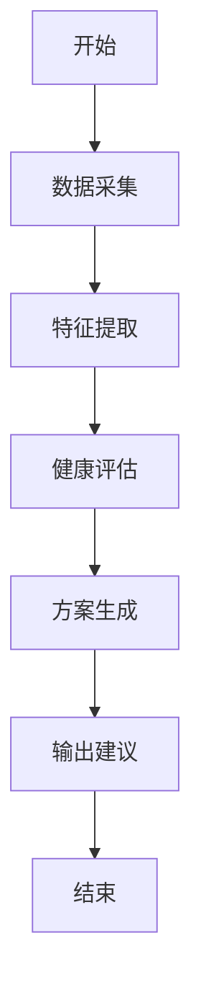

                 


```markdown
# AI Agent在智能镜框中的面部护理建议

> 关键词：AI Agent, 智能镜框, 面部护理, 机器学习, 深度学习, 算法原理

> 摘要：本文深入探讨了AI Agent在智能镜框中的应用，特别是在面部护理建议方面。通过分析AI Agent的核心原理、算法模型和系统架构，结合实际案例和项目实战，展示了如何利用AI技术提升面部护理的智能化水平。文章从背景介绍、核心概念、算法原理、系统设计到项目实现，层层剖析，为读者提供了一套完整的解决方案和实施路径。

---

## 第一部分：AI Agent与智能镜框的背景介绍

### 第1章：AI Agent的基本概念
#### 1.1 AI Agent的定义
AI Agent（人工智能代理）是指能够感知环境、自主决策并执行任务的智能实体。它可以基于规则或机器学习模型，通过传感器获取信息，利用计算能力进行分析，并通过执行器实现目标。

#### 1.2 AI Agent的核心特征
1. **自主性**：能够独立运行，无需人工干预。
2. **反应性**：能够实时感知环境并做出反应。
3. **目标导向**：基于目标进行决策和行动。
4. **学习能力**：能够通过数据优化自身的算法。

#### 1.3 AI Agent与传统算法的区别
传统算法依赖于预定义的规则，而AI Agent具备学习和自适应能力，能够根据环境变化动态调整行为。

---

### 第2章：智能镜框的基本概念
#### 2.1 智能镜框的功能特点
1. **面部特征识别**：通过摄像头和AI算法，识别面部特征如皮肤状况、表情等。
2. **健康监测**：实时监测面部健康状况，如皮肤水分、油分含量。
3. **个性化建议**：根据面部数据，提供个性化的护肤建议。

#### 2.2 智能镜框的市场现状
智能镜框市场近年来迅速发展，广泛应用于医疗、美容和健康监测领域。

#### 2.3 智能镜框的技术发展趋势
随着AI和计算机视觉技术的进步，智能镜框的功能将更加智能化和个性化。

---

## 第二部分：AI Agent在面部护理中的核心概念与联系

### 第3章：AI Agent的核心原理
#### 3.1 AI Agent的感知能力
通过摄像头和传感器获取面部数据，如图像、颜色和纹理信息。

#### 3.2 AI Agent的决策机制
基于获取的面部数据，结合预训练的模型进行分析，生成护理建议。

#### 3.3 AI Agent的执行能力
通过反馈机制优化建议，实现动态调整。

---

### 第4章：面部护理的核心要素
#### 4.1 面部特征的提取
利用图像处理技术提取关键面部特征，如皱纹、斑点和肤色。

#### 4.2 面部健康状态的评估
通过分析面部特征，评估皮肤健康状况，如水分含量、弹性等。

#### 4.3 面部护理方案的生成
基于评估结果，生成个性化的护肤方案，包括产品推荐和护理步骤。

---

## 第三部分：AI Agent的算法原理与数学模型

### 第5章：AI Agent的基本算法
#### 5.1 基于规则的AI Agent
通过预定义的规则进行决策，适用于简单场景。

#### 5.2 基于机器学习的AI Agent
利用训练数据进行模型训练，适用于复杂场景。

#### 5.3 基于深度学习的AI Agent
通过深度神经网络进行特征提取和分类，实现高精度的面部识别。

---

### 第6章：面部护理的算法模型
#### 6.1 面部特征提取的数学模型
$$ y = f(x) $$
其中，x是输入的面部图像，y是提取的特征向量。

#### 6.2 面部健康评估的数学模型
$$ y = g(x) $$
通过模型评估皮肤健康状况。

#### 6.3 面部护理方案生成的数学模型
$$ y = h(x) $$
根据评估结果生成护理建议。

---

## 第四部分：系统分析与架构设计

### 第7章：系统功能设计
#### 7.1 面部特征识别模块
实现面部特征的提取和识别。

#### 7.2 面部健康评估模块
评估皮肤健康状况并生成报告。

#### 7.3 个性化护理建议模块
根据评估结果，生成个性化的护肤方案。

---

### 第8章：系统架构设计


---

## 第五部分：项目实战与案例分析

### 第9章：项目实战
#### 9.1 需求分析
根据实际需求设计系统功能。

#### 9.2 系统实现
实现各个模块的功能，并进行测试和优化。

#### 9.3 测试与部署
进行功能测试和性能优化，确保系统稳定运行。

#### 9.4 案例分析
通过实际案例分析，验证系统的有效性和可行性。

---

## 第六部分：最佳实践与总结

### 第10章：最佳实践
#### 10.1 注意事项
确保数据安全和隐私保护。

#### 10.2 小结
总结文章的主要内容和关键点。

#### 10.3 未来趋势
展望AI Agent在智能镜框中的未来发展。

#### 10.4 拓展阅读
推荐相关书籍和资源，供读者深入学习。

---

## 参考文献
1. 《人工智能入门》
2. 《深度学习实战》
3. 《计算机视觉算法解析》
4. 《系统架构设计方法》

---

通过以上目录结构和内容，我们可以系统地了解AI Agent在智能镜框中的应用，特别是在面部护理建议方面。文章不仅从理论层面进行了深入分析，还结合实际案例进行了详细讲解，为读者提供了一套完整的解决方案和实施路径。
```

