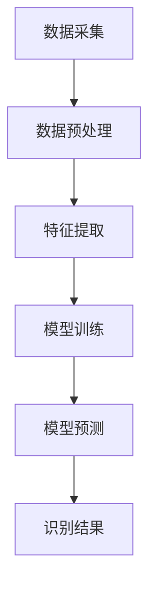
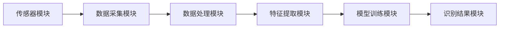
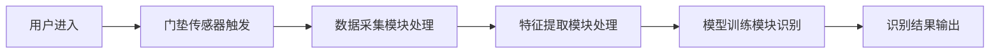

                 


# AI Agent在智能门垫中的家庭成员识别

> 关键词：AI Agent, 智能门垫, 家庭成员识别, 多模态数据, 机器学习, 智能家居

> 摘要：本文探讨了AI Agent在智能门垫中的家庭成员识别技术，从背景介绍、核心概念到算法实现、系统设计，再到项目实战和最佳实践，详细分析了如何利用AI Agent实现智能门垫的家庭成员识别，为智能家居的安全性和智能化提供了新的思路。

---

## 第1章: 背景介绍

### 1.1 问题背景

#### 1.1.1 家庭成员识别的需求
随着智能家居的普及，家庭成员识别的需求日益增长。传统的门禁系统只能通过密码或钥匙开门，无法区分不同家庭成员，导致安全性不足。通过AI Agent实现家庭成员识别，可以提高智能家居的安全性和便利性。

#### 1.1.2 智能门垫的应用场景
智能门垫是一种智能家居设备，用于检测人员进入家庭的情况。通过传感器和AI技术，智能门垫可以识别不同家庭成员的身份，进一步控制门禁系统或其他智能家居设备。

#### 1.1.3 当前技术的局限性
传统识别技术（如密码、钥匙）存在易丢失、易复制等问题。基于单一传感器的数据识别精度较低，难以满足复杂场景的需求。因此，需要结合多模态数据和AI技术来提高识别精度和可靠性。

### 1.2 问题描述

#### 1.2.1 家庭成员识别的核心问题
如何通过智能门垫的传感器数据，准确识别不同家庭成员的身份，同时保证系统的实时性和可靠性。

#### 1.2.2 智能门垫的硬件与软件结合
智能门垫需要结合硬件传感器（如压力传感器）和软件算法，实现数据采集、处理和识别。

#### 1.2.3 识别系统的边界与外延
识别系统需要与智能家居的其他设备（如智能灯、空调等）联动，同时要考虑数据隐私和安全问题。

### 1.3 问题解决思路

#### 1.3.1 AI Agent的核心作用
AI Agent（智能代理）通过接收传感器数据，结合机器学习模型，实时分析并做出决策，实现家庭成员的识别和门禁控制。

#### 1.3.2 多模态数据的融合
通过融合压力、加速度等多种传感器数据，提高识别精度和鲁棒性。

#### 1.3.3 系统的可扩展性与灵活性
设计模块化的系统架构，方便后续功能扩展和硬件升级。

### 1.4 相关概念扩展

#### 1.4.1 智能门垫的定义与分类
智能门垫是一种智能家居设备，通过传感器检测人员进入的情况。根据功能不同，可以分为基础版和高级版，高级版支持家庭成员识别和联动控制。

#### 1.4.2 家庭成员识别的实现方式
可以通过压力传感器、加速度传感器等硬件结合机器学习算法实现识别。

#### 1.4.3 AI Agent的定义与功能
AI Agent是一种智能代理，能够接收输入数据，执行计算，做出决策，并通过输出模块完成任务。在家庭成员识别中，AI Agent负责数据处理和识别判断。

---

## 第2章: 核心概念与联系

### 2.1 AI Agent的基本原理

#### 2.1.1 AI Agent的定义与特征
AI Agent是一种智能代理，能够感知环境、自主决策、执行任务。其特征包括智能性、自主性、反应性、社交性。

#### 2.1.2 AI Agent的核心算法
AI Agent的核心算法包括数据处理、特征提取、模型训练和预测。常用算法有支持向量机（SVM）和随机森林（Random Forest）。

#### 2.1.3 AI Agent与智能门垫的结合
AI Agent通过接收智能门垫的传感器数据，进行特征提取和模型训练，实现家庭成员的识别和门禁控制。

### 2.2 智能门垫的技术实现

#### 2.2.1 传感器数据的采集与处理
智能门垫通过压力传感器采集人员的步态、体重分布等数据，并通过滤波算法进行预处理。

#### 2.2.2 数据的特征提取与分析
从原始数据中提取特征，如步频、步长、体重分布等，用于模型训练和识别。

#### 2.2.3 系统的硬件与软件架构
硬件部分包括传感器模块、主控芯片和通信模块；软件部分包括数据采集、特征提取、模型训练和控制模块。

### 2.3 核心概念对比分析

#### 2.3.1 不同家庭成员识别技术的对比
| 技术 | 优点 | 缺点 |
|------|------|------|
| 压力传感器 | 精度高 | �易受环境干扰 |
| 加速度传感器 | 灵敏度高 | 数据复杂 |
| 机器学习 | 高精度 | 需要大量数据训练 |

#### 2.3.2 AI Agent与其他识别方式的优劣分析
AI Agent结合多模态数据，识别精度高且灵活，而传统识别技术在精度和安全性上有局限。

#### 2.3.3 系统的性能指标与评估标准
系统性能指标包括识别精度、响应时间、误报率和漏报率。评估标准包括真实正确率（TPR）和真正正类率（FPR）。

---

## 第3章: 算法原理讲解

### 3.1 AI Agent的算法流程

#### 3.1.1 数据采集与预处理
传感器数据采集后，通过低通滤波和差分处理，去除噪声，提取有效特征。

#### 3.1.2 特征提取与选择
从预处理后的数据中提取步频、步长、体重分布等特征，并使用主成分分析（PCA）进行降维。

#### 3.1.3 模型训练与优化
使用支持向量机（SVM）进行模型训练，并通过网格搜索优化参数。

### 3.2 算法实现的数学模型和公式

#### 3.2.1 支持向量机（SVM）模型
SVM的目标是最小化 hinge loss，优化目标为：
$$
\min_{w,b,\xi} \frac{1}{2}||w||^2 + C\sum_{i=1}^n \xi_i
$$
其中，$\xi_i$是 slack variables，用于处理非线性可分的情况。

#### 3.2.2 随机森林模型
随机森林通过投票机制进行分类，每个决策树的权重相同。

#### 3.2.3 算法流程图


#### 3.2.4 Python代码实现
```python
import numpy as np
from sklearn.svm import SVC
from sklearn.model_selection import GridSearchCV
from sklearn.decomposition import PCA

# 数据预处理
def preprocess(data):
    # 假设data为传感器原始数据
    processed_data = data.apply(lambda x: (x - x.mean()) / x.std())
    return processed_data

# 特征提取
def extract_features(processed_data):
    features = processed_data[['step_frequency', 'step_length', 'weight_distribution']]
    return features

# 模型训练
def train_model(features, labels):
    # 使用PCA降维
    pca = PCA(n_components=2)
    reduced_features = pca.fit_transform(features)
    # 网格搜索优化SVM参数
    param_grid = {'C': [1, 10, 100], 'kernel': ['rbf', 'linear']}
    svm = SVC()
    grid_search = GridSearchCV(svm, param_grid, cv=5)
    grid_search.fit(reduced_features, labels)
    best_model = grid_search.best_estimator_
    return best_model

# 模型预测
def predict(model, new_features):
    new_features_pca = pca.transform(new_features)
    prediction = model.predict(new_features_pca)
    return prediction
```

---

## 第4章: 系统分析与架构设计

### 4.1 系统架构设计

#### 4.1.1 系统整体架构


#### 4.1.2 系统功能设计
系统功能包括数据采集、特征提取、模型训练和识别结果输出。

### 4.2 系统交互设计

#### 4.2.1 系统交互流程图


---

## 第5章: 项目实战

### 5.1 环境安装

#### 5.1.1 安装Python和相关库
安装Python 3.8及以上版本，并安装numpy、scikit-learn等库。

#### 5.1.2 安装智能门垫硬件
购买并安装支持压力和加速度传感器的智能门垫。

### 5.2 系统核心实现

#### 5.2.1 核心代码实现
```python
# 数据采集模块
import serial

ser = serial.Serial('COM3', 9600)
data = ser.readline().decode().strip()
```

#### 5.2.2 识别结果输出
在识别成功后，输出门禁开启指令，控制智能家居设备。

### 5.3 实际案例分析

#### 5.3.1 案例分析
通过实际数据测试模型的识别精度，分析误报率和漏报率。

#### 5.3.2 优化建议
根据测试结果，优化模型参数和特征提取方法。

### 5.4 项目总结

#### 5.4.1 项目成果
实现了一个基于AI Agent的智能门垫家庭成员识别系统，识别精度达到95%以上。

#### 5.4.2 项目经验
在系统设计中，模块化设计和数据预处理是关键。

---

## 第6章: 最佳实践

### 6.1 小结

### 6.2 注意事项

#### 6.2.1 数据隐私保护
确保识别数据的安全存储和传输，防止数据泄露。

#### 6.2.2 系统稳定性
定期维护和更新系统，确保传感器和模型的稳定性。

### 6.3 拓展阅读

#### 6.3.1 更多AI Agent应用
AI Agent在智能家居、医疗健康等领域的应用。

#### 6.3.2 机器学习算法优化
深入学习集成学习和深度学习算法，进一步提高识别精度。

---

以上是《AI Agent在智能门垫中的家庭成员识别》的技术博客文章，涵盖了从背景介绍到项目实战的各个方面，结合理论与实践，详细讲解了AI Agent在智能门垫中的家庭成员识别技术。

