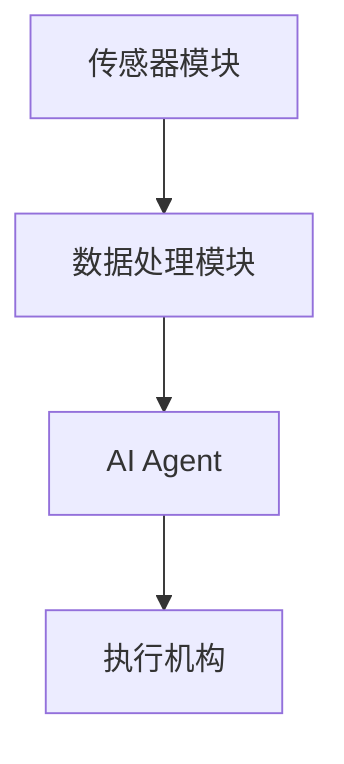
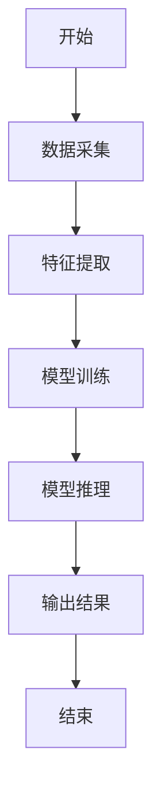
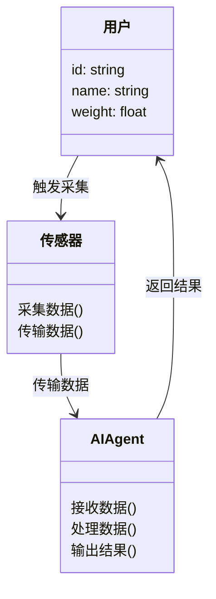
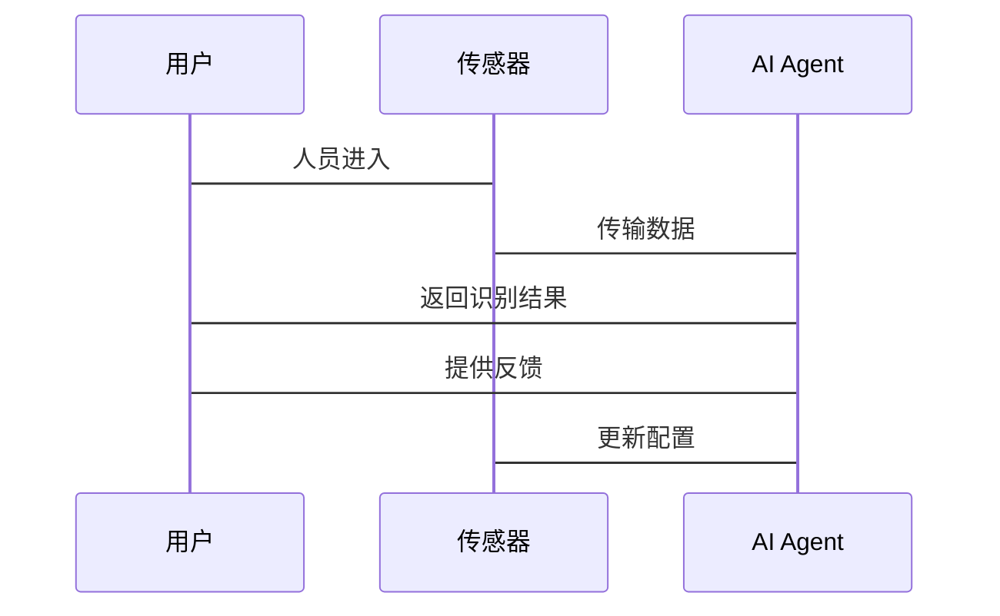

                 


# AI Agent在智能门垫中的访客识别系统

> 关键词：AI Agent, 智能门垫, 访客识别, 深度学习, 系统架构, 算法原理

> 摘要：本文详细探讨了AI Agent在智能门垫中的应用，重点分析了访客识别系统的实现过程，包括算法原理、系统架构、项目实战及最佳实践。通过深度学习算法，结合AI Agent的智能决策机制，提出了一种高效的访客识别解决方案。

---

# 第1章: 背景介绍

## 1.1 问题背景
### 1.1.1 智能门垫的定义与应用场景
智能门垫是一种智能家居设备，通过感应压力或重量变化来检测人员的进入或离开。其应用场景包括家庭、办公室、酒店等场所，主要用于访客识别、安全监控、智能门禁控制等。

### 1.1.2 访客识别系统的需求与挑战
访客识别系统需要能够准确识别合法用户和非法入侵者。传统方法依赖于钥匙、密码或刷卡，存在易丢失、遗忘或被复制的风险。随着人工智能技术的发展，基于AI的访客识别系统逐渐成为研究热点。

### 1.1.3 AI Agent在访客识别中的作用
AI Agent（智能代理）是一种能够自主决策和执行任务的智能体。在访客识别系统中，AI Agent可以通过分析传感器数据、历史行为模式和环境信息，实现高效的访客识别和安全监控。

## 1.2 问题描述
### 1.2.1 智能门垫访客识别的核心问题
智能门垫需要实时检测人员的重量和步态特征，结合AI算法进行身份识别。核心问题包括数据采集、特征提取、模型训练和实时推理。

### 1.2.2 现有技术的局限性
传统访客识别系统依赖于固定的密码或物理钥匙，存在维护成本高、安全性差的问题。此外，传统算法在复杂环境下的识别精度有限。

### 1.2.3 AI Agent的优势与解决方案
AI Agent具有学习和自适应能力，能够根据环境变化优化识别策略。通过深度学习算法，AI Agent可以实时分析传感器数据，提高识别精度和安全性。

## 1.3 问题解决
### 1.3.1 AI Agent的基本原理
AI Agent通过感知环境信息，利用预训练模型进行推理，做出决策并执行任务。在访客识别系统中，AI Agent负责数据处理、特征提取和身份判断。

### 1.3.2 智能门垫的数据采集与处理
智能门垫通过压力传感器采集人员的重量分布特征，结合加速度传感器获取步态信息。数据经过预处理后，提取关键特征用于模型训练。

### 1.3.3 访客识别系统的整体架构
访客识别系统由硬件设备、数据采集模块、AI Agent和执行机构组成。AI Agent负责数据处理和决策，执行机构包括门禁系统和报警装置。

## 1.4 边界与外延
### 1.4.1 系统的边界定义
智能门垫系统的边界包括传感器、数据处理模块和AI Agent。系统与外部环境的交互通过网络接口完成。

### 1.4.2 相关领域的外延
访客识别系统涉及人工智能、物联网、传感器技术和网络安全等多个领域。AI Agent的应用范围还可扩展到智能家居、医疗健康和工业自动化。

### 1.4.3 系统与外部环境的交互
智能门垫通过网络接口与智能家居系统、云平台和其他设备交互，实现信息共享和协同工作。

## 1.5 概念结构与核心要素
### 1.5.1 系统的核心要素组成
- 传感器模块：采集人员的重量和步态特征
- 数据处理模块：预处理和特征提取
- AI Agent：模型训练和实时推理
- 执行机构：门禁控制和报警

### 1.5.2 要素之间的关系
传感器模块向数据处理模块发送原始数据，数据处理模块提取特征后传递给AI Agent。AI Agent根据特征进行推理，输出决策结果，驱动执行机构动作。

### 1.5.3 系统的整体结构


---

# 第2章: 核心概念与联系

## 2.1 AI Agent的基本原理
### 2.1.1 AI Agent的定义与分类
AI Agent是一种智能代理，能够感知环境、自主决策并执行任务。根据智能水平，AI Agent可以分为反应式和认知式两类。

### 2.1.2 AI Agent的核心算法
AI Agent的核心算法包括监督学习、无监督学习和强化学习。在访客识别系统中，主要使用监督学习算法进行模型训练。

### 2.1.3 AI Agent与智能门垫的结合
AI Agent通过分析传感器数据，判断访客身份并做出相应决策。例如，当检测到非法入侵时，AI Agent会触发报警装置。

## 2.2 智能门垫的技术细节
### 2.2.1 智能门垫的数据采集方式
智能门垫使用压力传感器和加速度传感器采集人员的重量分布和步态特征。数据采集频率通常为100Hz。

### 2.2.2 数据处理与特征提取
数据处理包括噪声消除和信号增强。特征提取主要关注步频、步幅和重心位置等关键指标。

### 2.2.3 智能门垫的硬件与软件架构
硬件架构包括传感器模块、MCU和通信模块。软件架构分为数据采集层、特征提取层和决策层。

## 2.3 核心概念的对比分析
### 2.3.1 AI Agent与传统算法的对比
AI Agent具有学习和自适应能力，能够处理复杂场景下的访客识别问题。传统算法在简单场景下表现较好，但缺乏灵活性。

### 2.3.2 智能门垫与传统门禁系统的对比
智能门垫具有非接触式识别和实时监控功能，而传统门禁系统依赖于物理钥匙或密码，维护成本高。

### 2.3.3 访客识别系统的性能对比
基于AI Agent的系统具有更高的识别精度和安全性，但硬件成本和计算资源需求较高。

## 2.4 ER实体关系图
```mermaid
er
  actor: 用户
  agent: AI Agent
  system: 智能门垫系统
  relation: 实现
  actor -[通过AI Agent实现访客识别]-> agent
  agent -[驱动智能门垫系统]-> system
  system -[返回识别结果]-> actor
```

---

# 第3章: 算法原理讲解

## 3.1 算法原理
### 3.1.1 基于深度学习的访客识别
深度学习模型通过多层神经网络提取数据特征，实现高精度的访客识别。常用的模型包括卷积神经网络（CNN）和长短期记忆网络（LSTM）。

### 3.1.2 AI Agent的决策机制
AI Agent通过分析历史数据和实时传感器信息，结合上下文推理，做出最优决策。决策过程包括特征匹配、行为分析和风险评估。

### 3.1.3 算法的优化与改进
通过数据增强、模型剪枝和迁移学习等技术，优化模型的训练效率和识别精度。例如，使用迁移学习可以减少数据需求，提高模型泛化能力。

## 3.2 算法流程图


## 3.3 算法实现
### 3.3.1 数据预处理
```python
import numpy as np

def preprocess(data):
    # 去除噪声
    filtered = np.convolve(data, np.ones(3)/3, mode='same')
    # 归一化
    normalized = (filtered - np.mean(filtered)) / np.std(filtered)
    return normalized
```

### 3.3.2 模型训练
```python
import tensorflow as tf
from tensorflow.keras import layers

model = tf.keras.Sequential([
    layers.Conv2D(32, (3,3), activation='relu', input_shape=(64,64,1)),
    layers.MaxPooling2D((2,2)),
    layers.Flatten(),
    layers.Dense(64, activation='relu'),
    layers.Dense(1, activation='sigmoid')
])

model.compile(optimizer='adam', loss='binary_crossentropy', metrics=['accuracy'])
model.fit(X_train, y_train, epochs=10, batch_size=32)
```

### 3.3.3 模型推理
```python
def predict(model, data):
    processed_data = preprocess(data)
    prediction = model.predict(processed_data)
    return prediction[0][0] > 0.5
```

---

# 第4章: 数学模型分析

## 4.1 算法的数学模型
### 4.1.1 卷积操作
卷积操作用于提取图像特征，公式如下：
$$ (f * g)(i,j) = \sum_{k,l} f(i+k,j+l) \cdot g(k,l) $$

### 4.1.2 损失函数
交叉熵损失函数用于分类任务，公式如下：
$$ L = -\sum_{i} y_i \log(p_i) + (1-y_i)\log(1-p_i) $$

### 4.1.3 模型训练
模型训练通过最小化损失函数，更新权重参数。使用随机梯度下降算法：
$$ \theta = \theta - \eta \nabla_\theta L $$

## 4.2 模型的优化与改进
通过Dropout层防止过拟合，增加模型的泛化能力。Dropout概率通常设置为0.5。

---

# 第5章: 系统分析与架构设计

## 5.1 系统架构设计
### 5.1.1 领域模型


### 5.1.2 系统架构


### 5.1.3 系统接口设计
系统接口包括传感器数据接口、模型训练接口和用户反馈接口。接口采用RESTful API设计，使用JSON格式传输数据。

### 5.1.4 系统交互流程图


---

# 第6章: 项目实战

## 6.1 环境安装
### 6.1.1 安装Python环境
```bash
python --version
pip install numpy tensorflow keras
```

### 6.1.2 安装硬件设备
购买智能门垫传感器套件，包括压力传感器和加速度传感器。

## 6.2 系统核心实现
### 6.2.1 传感器数据采集
```python
import serial

ser = serial.Serial('COM3', 9600)
data = ser.readline().decode().strip()
print(data)
```

### 6.2.2 模型训练与推理
```python
model = tf.keras.Sequential([
    layers.Conv2D(32, (3,3), activation='relu', input_shape=(64,64,1)),
    layers.MaxPooling2D((2,2)),
    layers.Flatten(),
    layers.Dense(64, activation='relu'),
    layers.Dense(1, activation='sigmoid')
])

model.load_weights('model.h5')
prediction = model.predict(preprocess(data))
```

### 6.2.3 系统集成
将AI Agent与智能门垫系统集成，实现访客识别和门禁控制功能。

## 6.3 代码应用解读
### 6.3.1 数据预处理
数据预处理是访客识别系统的关键步骤，包括去噪和归一化处理。

### 6.3.2 模型训练
模型训练使用深度学习框架TensorFlow，训练数据来自真实用户的传感器数据。

### 6.3.3 模型推理
模型推理阶段，AI Agent实时分析传感器数据，判断访客身份并做出决策。

## 6.4 实际案例分析
通过实际案例分析，验证系统的识别精度和稳定性。例如，系统在不同负载和环境下的表现。

## 6.5 项目小结
项目小结部分总结了系统的核心功能和实现过程，分析了系统的优势和局限性。

---

# 第7章: 最佳实践与总结

## 7.1 最佳实践
### 7.1.1 系统优化
通过模型剪枝和量化技术优化模型性能，减少计算资源消耗。

### 7.1.2 安全注意事项
确保系统数据的安全性，防止未授权访问和数据泄露。

### 7.1.3 拓展阅读
推荐阅读相关领域的最新论文和技术报告，了解AI Agent和智能门垫的最新进展。

## 7.2 项目总结
### 7.2.1 核心知识点回顾
回顾了AI Agent的基本原理、智能门垫的技术细节、深度学习算法的实现和系统架构设计。

### 7.2.2 经验与教训
通过项目实践，总结了数据预处理的重要性、模型调优的技巧和系统集成的经验。

### 7.2.3 未来展望
展望了AI Agent在智能门垫中的应用前景，提出了进一步研究的方向，例如多模态特征融合和边缘计算优化。

---

# 结语

通过本文的详细讲解，读者可以全面了解AI Agent在智能门垫中的访客识别系统的实现过程。从算法原理到系统架构，从项目实战到最佳实践，本文为读者提供了丰富的知识和实用的指导。未来，随着人工智能技术的不断发展，访客识别系统将更加智能化和高效化。

