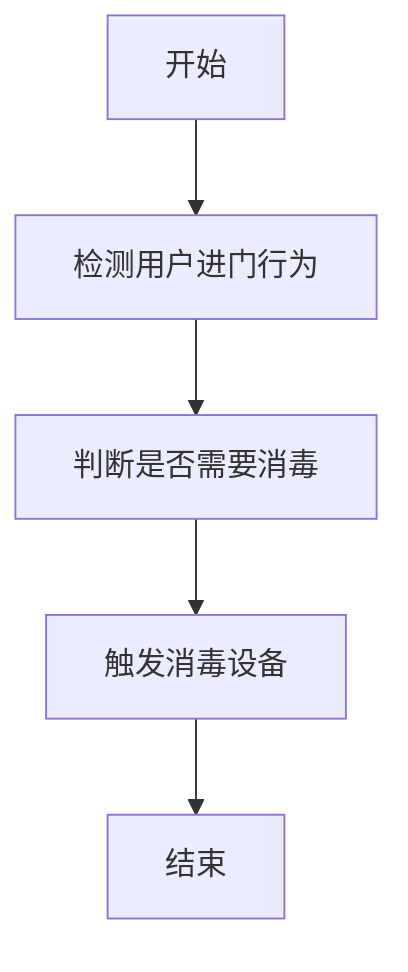

                 


# AI Agent在智能门垫中的鞋底消毒功能

## 关键词
AI Agent, 智能门垫, 鞋底消毒, 物联网, 消毒技术, 传感器

## 摘要
本文将深入探讨AI Agent在智能门垫中的鞋底消毒功能，从背景介绍到系统设计，从算法原理到项目实战，全面解析如何利用AI Agent优化智能门垫的消毒功能。通过详细的技术分析和实际案例，本文将展示AI Agent在智能门垫中的应用场景、实现原理和实际效果，为相关领域的研究和应用提供参考。

---

## 第1章: 智能门垫与鞋底消毒功能的背景介绍

### 1.1 智能门垫的发展现状
#### 1.1.1 智能门垫的基本概念
智能门垫是一种集成传感器和物联网技术的智能家居设备，主要用于检测用户的进门行为。通过传感器采集数据，智能门垫可以与智能家居系统联动，实现开门、灯光控制等多种功能。

#### 1.1.2 智能门垫的主要功能与应用场景
智能门垫的主要功能包括：
- 检测用户进门行为
- 联动智能家居设备（如智能灯、空调等）
- 记录用户进门数据（如时间、频率等）
- 提供智能化的用户交互体验

应用场景包括家庭、办公室、酒店等场所。

#### 1.1.3 智能门垫的技术发展趋势
智能门垫的技术发展趋势主要体现在以下几个方面：
- 高精度传感器的集成
- AI技术的应用（如用户行为识别、智能联动）
- 云计算与边缘计算的结合
- 多设备联动的无缝集成

### 1.2 鞋底消毒功能的必要性
#### 1.2.1 鞋底消毒的背景与意义
鞋底消毒功能的必要性主要体现在以下方面：
- 防止细菌、病毒通过鞋底传播
- 保持家庭或办公环境的卫生
- 提供健康的生活环境

#### 1.2.2 鞋底消毒的主要技术手段
目前，鞋底消毒的主要技术手段包括紫外线消毒、臭氧消毒、化学喷雾消毒等。

#### 1.2.3 鞋底消毒在智能门垫中的应用价值
在智能门垫中集成鞋底消毒功能，可以实现以下价值：
- 自动化消毒，无需手动操作
- 节省时间和精力
- 提供智能化的卫生保障

### 1.3 AI Agent在智能门垫中的作用
#### 1.3.1 AI Agent的基本概念与特点
AI Agent是一种智能代理，能够感知环境、自主决策并执行任务。其特点包括：
- 智能性：能够理解环境并做出决策
- 自主性：能够在没有人工干预的情况下运行
- 反应性：能够实时感知环境变化并做出反应

#### 1.3.2 AI Agent在智能门垫中的应用场景
AI Agent在智能门垫中的应用场景包括：
- 用户行为识别与分析
- 自动消毒控制
- 智能联动其他智能家居设备

#### 1.3.3 AI Agent与鞋底消毒功能的结合
AI Agent可以通过以下方式实现鞋底消毒功能的优化：
- 自动检测用户进门行为
- 根据检测结果触发消毒设备
- 实时监控消毒效果并进行反馈

### 1.4 本章小结
本章主要介绍了智能门垫的发展现状、鞋底消毒功能的必要性以及AI Agent在智能门垫中的作用。通过本章的分析，我们可以看到，AI Agent在智能门垫中的应用具有重要意义，能够显著提升消毒功能的智能化水平。

---

## 第2章: AI Agent与智能门垫的核心概念与联系

### 2.1 AI Agent的核心原理
#### 2.1.1 AI Agent的定义与分类
AI Agent可以根据功能和应用场景分为以下几类：
- 简单反射型AI Agent
- 基于规则的AI Agent
- 基于模型的AI Agent
- 学习型AI Agent

#### 2.1.2 AI Agent的基本工作原理
AI Agent的基本工作原理包括以下步骤：
1. 感知环境：通过传感器或其他输入设备获取环境数据。
2. 分析数据：利用算法对数据进行分析和处理。
3. 决策与规划：根据分析结果做出决策并制定执行计划。
4. 执行任务：通过执行机构完成任务。
5. 反馈与优化：根据执行结果进行反馈并优化后续操作。

#### 2.1.3 AI Agent与智能门垫的结合方式
AI Agent与智能门垫的结合方式主要体现在以下方面：
- AI Agent作为核心控制器，负责协调智能门垫的各项功能。
- AI Agent通过传感器数据实现用户行为识别与分析。
- AI Agent根据检测结果触发消毒设备并进行实时监控。

### 2.2 智能门垫的系统架构
#### 2.2.1 智能门垫的硬件组成
智能门垫的硬件组成包括：
- 传感器模块（如压力传感器、红外传感器）
- 控制模块（如微控制器）
- 无线通信模块（如Wi-Fi、蓝牙）
- 消毒模块（如紫外线灯）

#### 2.2.2 智能门垫的软件架构
智能门垫的软件架构包括：
- 底层驱动程序
- 应用逻辑程序
- 用户界面程序

#### 2.2.3 智能门垫与AI Agent的交互机制
智能门垫与AI Agent的交互机制包括：
- 数据采集与传输
- 命令接收与执行
- 状态反馈与更新

### 2.3 AI Agent与鞋底消毒功能的实体关系分析
#### 2.3.1 实体关系图（ER图）分析
通过ER图可以清晰地看到AI Agent、智能门垫、消毒模块以及用户之间的关系。

```mermaid
er
    entity 用户 {
        用户ID (PK)
        用户名称
        用户权限
    }
    entity 智能门垫 {
        门垫ID (PK)
        传感器状态
        连接设备
    }
    entity 消毒模块 {
        消毒模块ID (PK)
        消毒状态
        消毒模式
    }
    entity AI Agent {
        AgentID (PK)
        当前状态
        执行任务
    }
    用户 --> 智能门垫: 使用
    用户 --> AI Agent: 控制
    AI Agent --> 智能门垫: 检测
    AI Agent --> 消毒模块: 触发
    智能门垫 --> 消毒模块: 状态反馈
```

#### 2.3.2 AI Agent与消毒模块的关系
AI Agent与消毒模块之间的关系主要体现在：
- AI Agent根据检测结果触发消毒模块。
- 消毒模块向AI Agent反馈消毒状态。

#### 2.3.3 AI Agent与用户交互的关系
AI Agent与用户之间的交互主要体现在：
- 用户通过智能门垫或手机APP与AI Agent进行互动。
- AI Agent根据用户指令执行相应的操作。

### 2.4 本章小结
本章主要分析了AI Agent的核心原理、智能门垫的系统架构以及AI Agent与鞋底消毒功能的实体关系。通过ER图和流程图的展示，我们可以清晰地看到各实体之间的关系和交互机制。

---

## 第3章: AI Agent在鞋底消毒功能中的算法原理

### 3.1 算法选择与实现
#### 3.1.1 算法选择
在智能门垫的鞋底消毒功能中，我们可以选择基于规则的AI Agent算法，这种算法简单易懂，适用于场景相对固定的消毒功能。

#### 3.1.2 算法实现
以下是基于规则的AI Agent算法实现的流程图：



#### 3.1.3 算法实现代码
以下是基于规则的AI Agent算法的Python代码示例：

```python
class AIAgent:
    def __init__(self):
        self.status = "idle"  # 状态：空闲、运行、停止

    def detect_user(self):
        # 模拟传感器检测用户行为
        return True  # 返回检测结果

    def decide消毒(self):
        # 根据规则判断是否需要消毒
        return True  # 返回是否需要消毒的判断结果

    def trigger消毒设备(self):
        # 触发消毒设备
        return True  # 返回操作结果

# 创建AI Agent实例
agent = AIAgent()

# 执行消毒功能
agent.detect_user()
agent.decide消毒()
agent.trigger消毒设备()
```

### 3.2 算法原理的数学模型
#### 3.2.1 算法的数学模型
在基于规则的AI Agent算法中，我们可以将规则表示为逻辑条件：

$$ \text{如果 } \text{用户进门} \text{ 并且 } \text{需要消毒} \text{，则触发消毒设备} $$

#### 3.2.2 算法的数学表达式
以下是基于规则的AI Agent算法的数学表达式：

$$ \text{消毒} = \begin{cases} 
\text{触发} & \text{如果 } \text{用户进门} \text{ 并且 } \text{需要消毒} \\
\text{不触发} & \text{其他情况}
\end{cases} $$

### 3.3 算法实现的案例分析
#### 3.3.1 案例背景
假设用户进入智能门垫区域，系统检测到用户行为并触发消毒功能。

#### 3.3.2 案例分析
1. 检测用户进门行为：传感器检测到用户的脚步。
2. 判断是否需要消毒：根据预设规则，需要消毒。
3. 触发消毒设备：紫外线灯开启进行消毒。
4. 消毒完成：紫外线灯关闭，反馈消毒结果。

### 3.4 本章小结
本章主要介绍了AI Agent在鞋底消毒功能中的算法原理，包括算法选择、实现代码、数学模型和案例分析。通过具体的案例分析，我们可以更好地理解算法在实际应用中的工作流程。

---

## 第4章: 智能门垫鞋底消毒功能的系统分析与架构设计方案

### 4.1 系统功能设计
#### 4.1.1 功能模块划分
智能门垫鞋底消毒功能的主要模块包括：
- 用户检测模块
- 消毒控制模块
- 状态反馈模块

#### 4.1.2 功能模块的交互流程
以下是功能模块的交互流程图：

```mermaid
graph TD
    用户 --> 检测模块: 用户进门
    检测模块 --> AI Agent: 通知用户进门
    AI Agent --> 消毒模块: 触发消毒
    消毒模块 --> AI Agent: 反馈消毒状态
    AI Agent --> 用户: 提供反馈
```

### 4.2 系统架构设计
#### 4.2.1 系统架构的组成部分
智能门垫鞋底消毒系统的架构包括：
- 传感器模块
- AI Agent控制器
- 消毒模块
- 用户交互界面

#### 4.2.2 系统架构的实现方式
以下是系统架构的实现方式：

```mermaid
graph TD
    AI Agent --> 传感器模块: 获取用户行为数据
    AI Agent --> 消毒模块: 控制消毒设备
    传感器模块 --> AI Agent: 提供反馈数据
    消毒模块 --> AI Agent: 提供消毒状态反馈
```

### 4.3 系统接口设计
#### 4.3.1 系统接口的定义
智能门垫鞋底消毒系统的接口包括：
- 用户检测接口
- 消毒控制接口
- 状态反馈接口

#### 4.3.2 系统接口的实现
以下是系统接口的实现示例：

```python
# 用户检测接口
def detect_user():
    return True  # 返回用户检测结果

# 消毒控制接口
def trigger消毒设备():
    return True  # 返回消毒设备操作结果

# 状态反馈接口
def get消毒状态():
    return "完成"  # 返回消毒状态
```

### 4.4 本章小结
本章主要分析了智能门垫鞋底消毒功能的系统架构设计，包括功能模块划分、系统架构实现和接口设计。通过系统的分析与设计，我们可以更好地理解AI Agent在智能门垫中的实现方式。

---

## 第5章: AI Agent在智能门垫鞋底消毒功能中的项目实战

### 5.1 项目实战环境安装
#### 5.1.1 系统需求
- 操作系统：Windows/Mac/Linux
- 开发工具：Python、PyCharm
- 传感器模块：支持I2C或UART接口的传感器
- 消毒设备：支持GPIO控制的紫外线灯

#### 5.1.2 环境搭建
- 安装Python和必要的库（如GPIO控制库、传感器驱动）
- 下载并安装AI Agent算法代码

### 5.2 系统核心实现代码
#### 5.2.1 核心代码实现
以下是AI Agent在智能门垫鞋底消毒功能中的核心代码：

```python
import RPi.GPIO as GPIO
import time

# 初始化GPIO
GPIO.setmode(GPIO.BCM)

# 定义消毒灯的GPIO引脚
DISINFECTION_LED = 17

# 初始化消毒灯
GPIO.setup(DISINFECTION_LED, GPIO.OUT)

class AIAgent:
    def __init__(self):
        self.status = "idle"

    def detect_user(self):
        # 模拟传感器检测用户行为
        # 这里可以连接实际传感器，此处仅作示例
        return True

    def decide消毒(self):
        # 根据规则判断是否需要消毒
        return True

    def trigger消毒设备(self):
        # 控制消毒灯
        GPIO.output(DISINFECTION_LED, GPIO.HIGH)
        time.sleep(5)  # 消毒5秒
        GPIO.output(DISINFECTION_LED, GPIO.LOW)
        return True

# 创建AI Agent实例
agent = AIAgent()

# 执行消毒功能
agent.detect_user()
agent.decide消毒()
agent.trigger消毒设备()
```

#### 5.2.2 代码功能解读
- `detect_user()`：检测用户进门行为，返回检测结果。
- `decide消毒()`：根据规则判断是否需要消毒，返回判断结果。
- `trigger消毒设备()`：触发消毒设备，控制紫外线灯的开启与关闭。

### 5.3 项目实战案例分析
#### 5.3.1 案例背景
假设用户进入智能门垫区域，系统检测到用户行为并触发消毒功能。

#### 5.3.2 案例分析
1. 用户进入智能门垫区域，传感器检测到用户行为。
2. AI Agent接收到检测结果，判断是否需要消毒。
3. AI Agent触发消毒设备，紫外线灯开启进行消毒。
4. 消毒完成后，AI Agent关闭紫外线灯并反馈消毒状态。

### 5.4 项目小结
本章通过项目实战的方式，详细介绍了AI Agent在智能门垫鞋底消毒功能中的实现过程，包括环境搭建、代码实现和案例分析。通过实际操作，我们可以更好地理解AI Agent在智能门垫中的应用。

---

## 第6章: AI Agent在智能门垫鞋底消毒功能中的最佳实践

### 6.1 小结
通过本文的分析与实践，我们可以看到，AI Agent在智能门垫鞋底消毒功能中的应用具有重要意义。AI Agent不仅可以提升消毒功能的智能化水平，还可以实现与其他智能家居设备的无缝联动。

### 6.2 注意事项
在实际应用中，需要注意以下几点：
- 确保传感器的准确性，避免误触发
- 定期维护消毒设备，确保其正常运行
- 注意数据安全，防止用户隐私泄露

### 6.3 拓展阅读
对于感兴趣的研究者，可以进一步阅读以下内容：
- AI Agent在智能家居中的其他应用
- 基于深度学习的消毒效果优化
- 智能门垫与其他智能家居设备的联动优化

---

## 附录
### 附录A: 术语表
- AI Agent：人工智能代理
- 智能门垫：Smart Mat
- 鞋底消毒：Sole Disinfection

### 附录B: 参考文献
- [1] 《人工智能导论》
- [2] 《智能门垫设计与实现》
- [3] 《AI Agent算法与应用》

---

通过以上章节的详细分析与实践，我们可以全面了解AI Agent在智能门垫鞋底消毒功能中的应用。从理论到实践，从设计到实现，本文为相关领域的研究和应用提供了详尽的参考。

