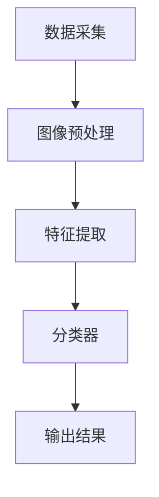
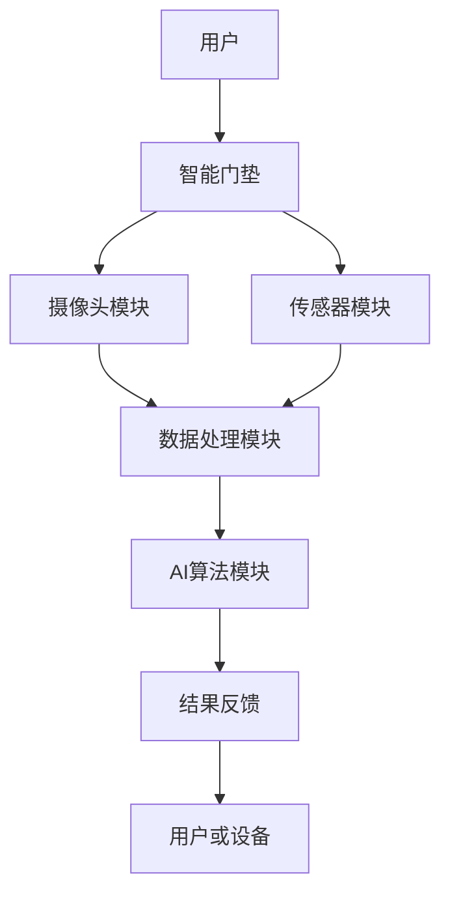
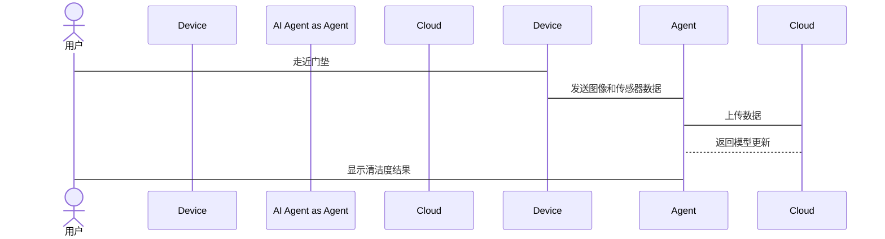

                 


# AI Agent在智能门垫中的鞋底清洁度检测

> 关键词：智能门垫，鞋底清洁度，AI Agent，图像识别，深度学习，传感器技术

> 摘要：本文探讨了AI Agent在智能门垫中的应用，重点分析了鞋底清洁度检测的技术实现。通过传感器数据和图像识别技术，AI Agent能够实时监测鞋底的清洁状态，并提供相应的反馈。本文详细介绍了系统的背景、核心概念、算法原理、系统架构、项目实现和总结展望。

---

## 第1章: 背景介绍与问题定义

### 1.1 智能门垫的发展背景
智能门垫作为一种智能家居设备，近年来随着物联网技术的发展逐渐普及。它不仅可以监测访客的到来，还能通过传感器和摄像头捕捉更多数据，为家庭安全和健康管理提供更多功能。鞋底清洁度检测是智能门垫的一个重要应用场景，尤其在家庭清洁服务和公共场所管理中具有重要意义。

### 1.2 鞋底清洁度检测的重要性
鞋底清洁度检测可以帮助用户了解鞋子的卫生状况，提醒用户及时清洁，避免细菌传播和交叉感染。特别是在家庭环境中，儿童和宠物的卫生问题尤为重要。此外，公共场所如酒店、医院等也需要鞋底清洁检测，以确保环境的洁净。

### 1.3 AI Agent在智能门垫中的作用
AI Agent（人工智能代理）通过整合传感器数据和图像识别技术，能够实时分析鞋底的清洁状态。AI Agent不仅可以自动检测清洁度，还能通过云端数据进行学习和优化，提供更精准的检测结果和个性化建议。

---

## 第2章: AI Agent与智能门垫的核心概念

### 2.1 AI Agent的基本原理
AI Agent是一种能够感知环境、执行任务并做出决策的智能系统。在鞋底清洁度检测中，AI Agent通过分析图像数据，识别鞋底的污渍类型和程度，从而判断清洁度。AI Agent的核心功能包括数据采集、特征提取、分类识别和结果反馈。

### 2.2 智能门垫的系统架构
智能门垫的系统架构通常包括传感器模块、摄像头模块、主控模块和云端模块。传感器用于检测压力和湿度，摄像头用于捕捉鞋底图像，主控模块负责数据处理和AI算法运行，云端模块则用于数据存储和分析。

### 2.3 AI Agent与智能门垫的实体关系
以下是AI Agent与智能门垫的实体关系图（ER图）：

```mermaid
er
actor: 用户
agent: AI Agent
device: 智能门垫
camera: 摄像头模块
sensor: 传感器模块
cloud: 云端服务

actor --> agent: 发起请求
agent --> device: 控制设备
agent --> camera: 获取图像数据
agent --> sensor: 获取传感器数据
agent --> cloud: 上传数据
cloud --> agent: 下载模型更新
```

---

## 第3章: AI Agent的算法原理

### 3.1 数据采集与预处理
鞋底图像的采集需要高分辨率的摄像头，通常使用RGB摄像头拍摄。预处理步骤包括图像增强、去噪和归一化处理。数据增强技术如旋转、翻转和裁剪，可以提高模型的泛化能力。

### 3.2 AI Agent的算法实现
基于深度学习的图像分类算法是鞋底清洁度检测的核心。以下是算法流程图：



以下是Python代码实现：

```python
import cv2
import numpy as np
from tensorflow.keras.models import load_model

def preprocess_image(image_path):
    image = cv2.imread(image_path)
    image = cv2.resize(image, (224, 224))
    image = image / 255.0  # 归一化
    return image

def predict_cleanliness(image_path, model_path):
    model = load_model(model_path)
    preprocessed_image = preprocess_image(image_path)
    preprocessed_image = np.expand_dims(preprocessed_image, axis=0)
    prediction = model.predict(preprocessed_image)
    return np.argmax(prediction[0])

# 示例使用
image_path = 'shoe_sole.jpg'
model_path = 'cleanliness_model.h5'
result = predict_cleanliness(image_path, model_path)
print(f'鞋底清洁度：{result}')
```

### 3.3 数学模型与公式
图像分类模型通常使用卷积神经网络（CNN）。以下是常用的损失函数公式：

$$
\text{损失函数} = -\sum_{i=1}^{n} y_i \log(p_i) + (1 - y_i) \log(1 - p_i)
$$

其中，$y_i$是真实标签，$p_i$是预测概率。

---

## 第4章: 系统分析与架构设计方案

### 4.1 系统功能设计
智能门垫的系统功能模块包括：

1. 数据采集模块：负责采集鞋底图像和传感器数据。
2. 数据处理模块：对图像进行预处理和特征提取。
3. AI算法模块：运行图像分类算法，判断清洁度。
4. 反馈模块：将结果反馈给用户或设备。

### 4.2 系统架构设计
以下是系统架构图：



### 4.3 系统接口设计
系统接口包括摄像头接口、传感器接口和云端接口。摄像头接口用于获取图像数据，传感器接口用于获取压力和湿度数据，云端接口用于数据上传和模型更新。

### 4.4 系统交互流程
以下是系统交互流程图：



---

## 第5章: 项目实战

### 5.1 环境安装
需要安装以下库：
- OpenCV
- TensorFlow/Keras
- Mermaid
- Pandas

### 5.2 系统核心实现
以下是核心代码：

```python
import cv2
import numpy as np
from tensorflow.keras.models import load_model

def load_model(model_path):
    return load_model(model_path)

def preprocess_image(image_path):
    image = cv2.imread(image_path)
    image = cv2.resize(image, (224, 224))
    image = image / 255.0
    return image

def predict_cleanliness(image_path, model):
    preprocessed_image = preprocess_image(image_path)
    preprocessed_image = np.expand_dims(preprocessed_image, axis=0)
    prediction = model.predict(preprocessed_image)
    return np.argmax(prediction[0])

# 加载模型
model = load_model('cleanliness_model.h5')

# 测试图像
image_paths = ['test1.jpg', 'test2.jpg', 'test3.jpg']
results = []
for path in image_paths:
    result = predict_cleanliness(path, model)
    results.append((path, result))

# 输出结果
for path, res in results:
    print(f'图像 {path} 的清洁度为：{res}')
```

### 5.3 实际案例分析
以下是一个实际案例的分析：

1. **图像采集**：拍摄鞋底图像。
2. **预处理**：对图像进行归一化处理。
3. **模型预测**：使用训练好的模型进行预测。
4. **结果反馈**：输出清洁度结果。

---

## 第6章: 总结与展望

### 6.1 技术优势与不足
AI Agent在智能门垫中的应用具有高效、精准和自动化的优势，但目前仍存在模型训练成本高、传感器精度有限等问题。

### 6.2 未来展望
未来，随着深度学习和物联网技术的发展，AI Agent在智能门垫中的应用将更加智能化和便捷化。可能的方向包括多模态数据融合、实时反馈优化和个性化服务定制。

---

### 总结
本文详细探讨了AI Agent在智能门垫中的鞋底清洁度检测技术，从背景介绍到项目实战，全面分析了系统的实现和优化方法。通过本文的学习，读者可以深入了解如何利用AI技术提升智能家居设备的功能和用户体验。

