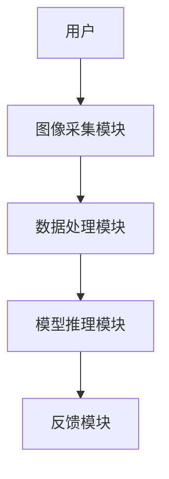

                 


# AI Agent在智能门垫中的鞋底清洁度检测

## 关键词：AI Agent, 智能门垫, 鞋底清洁度检测, 图像处理, 深度学习, 系统架构设计

## 摘要：本文详细探讨了AI Agent在智能门垫中的应用，重点分析了鞋底清洁度检测的技术原理、算法实现、系统架构设计以及实际应用场景。通过结合图像处理技术和深度学习模型，本文展示了如何利用AI技术实现高效、准确的鞋底清洁度检测，为智能门垫的设计和优化提供了理论支持和实践指导。

---

# 第一部分: AI Agent在智能门垫中的鞋底清洁度检测背景与概念

## 第1章: AI Agent与智能门垫概述

### 1.1 AI Agent的核心概念

#### 1.1.1 AI Agent的定义与特点
AI Agent（人工智能代理）是指能够感知环境、自主决策并执行任务的智能实体。它具有以下特点：
- **自主性**：能够独立决策，无需人工干预。
- **反应性**：能够实时感知环境变化并做出响应。
- **学习能力**：通过数据和经验不断优化自身性能。
- **社交能力**：能够与其他系统或用户进行交互。

#### 1.1.2 智能门垫的基本原理
智能门垫是一种集成传感器和AI技术的智能设备，主要用于监测和分析用户鞋底的清洁度。其基本原理包括：
1. **数据采集**：通过压力传感器或摄像头采集用户鞋底的图像或压力数据。
2. **数据处理**：利用AI算法对采集的数据进行分析，识别鞋底的清洁程度。
3. **反馈与提醒**：根据分析结果，向用户发送清洁提醒或建议。

#### 1.1.3 鞋底清洁度检测的背景与意义
鞋底清洁度检测在日常生活和商业场景中具有重要意义：
- **健康卫生**：清洁的鞋底有助于减少细菌传播，保障用户健康。
- **环境维护**：在公共场所，清洁鞋底可以减少灰尘和污垢，维护环境整洁。
- **用户体验**：通过实时反馈，用户可以及时了解鞋底清洁状态，提升使用体验。

### 1.2 鞋底清洁度检测的问题描述

#### 1.2.1 问题背景与目标
鞋底清洁度检测的主要目标是通过技术手段准确判断鞋底的清洁程度，并提供相应的反馈。常见的问题包括：
- 如何高效采集鞋底图像数据？
- 如何准确识别鞋底的污渍类型和程度？
- 如何优化算法以提高检测准确率？

#### 1.2.2 检测指标与标准
鞋底清洁度检测的主要指标包括：
1. **污渍面积**：鞋底上污渍的覆盖面积。
2. **污渍类型**：污渍的种类，如灰尘、泥渍、油渍等。
3. **清洁度评分**：根据污渍情况，给出的清洁度评分（如1-5分）。

#### 1.2.3 检测系统的边界与外延
鞋底清洁度检测系统的边界包括：
- 输入：用户鞋底的图像或压力数据。
- 输出：鞋底清洁度评分及清洁建议。
- 外延：与用户的交互界面，如手机APP或智能门垫的显示屏。

### 1.3 AI Agent在鞋底检测中的应用价值

#### 1.3.1 提高检测效率
AI Agent能够快速处理大量鞋底图像数据，显著提高检测效率。

#### 1.3.2 降低人工成本
通过自动化检测，减少人工检查的需要，降低人力成本。

#### 1.3.3 提升用户体验
实时反馈清洁状态，帮助用户更好地管理鞋底清洁。

### 1.4 本章小结
本章介绍了AI Agent的核心概念和智能门垫的基本原理，阐述了鞋底清洁度检测的背景、目标和意义，并总结了AI Agent在该领域的应用价值。

---

# 第二部分: AI Agent的核心原理与技术

## 第2章: AI Agent的核心原理

### 2.1 AI Agent的感知机制

#### 2.1.1 图像采集与处理
鞋底图像采集的关键步骤包括：
1. **图像采集**：使用高分辨率摄像头获取鞋底图像。
2. **图像预处理**：包括去噪、增强和归一化处理。
3. **特征提取**：提取鞋底的关键特征，如颜色、纹理和形状。

#### 2.1.2 特征提取与识别
特征提取是鞋底检测的关键步骤，常用的算法包括：
- **主成分分析（PCA）**：用于降维和特征提取。
- **深度学习模型**：如卷积神经网络（CNN）用于提取高层次特征。

#### 2.1.3 数据预处理与清洗
数据预处理包括：
- **去噪**：去除图像中的噪声和背景干扰。
- **归一化**：统一图像尺寸和格式。

### 2.2 AI Agent的推理机制

#### 2.2.1 模型训练与优化
模型训练的关键步骤：
1. **数据标注**：对鞋底图像进行标注，标记污渍区域。
2. **模型选择**：选择合适的深度学习模型，如ResNet、VGG等。
3. **模型训练**：使用标注数据训练模型，调整超参数以优化性能。

#### 2.2.2 算法选择与对比
常见的图像分类算法包括：
- **支持向量机（SVM）**：适用于小规模数据。
- **随机森林（RF）**：适用于特征较多的情况。
- **深度学习模型**：如AlexNet、VGGNet等。

#### 2.2.3 模型评估与验证
模型评估指标包括：
- **准确率**：分类正确的比例。
- **召回率**：识别出的污渍数量与实际污渍数量的比例。
- **F1分数**：准确率和召回率的调和平均数。

### 2.3 AI Agent的执行机制

#### 2.3.1 动作规划与决策
AI Agent根据检测结果做出决策，如：
- 提醒用户清洁鞋底。
- 自动启动清洁设备。

#### 2.3.2 执行反馈与调整
系统根据执行结果调整后续操作，优化检测算法。

#### 2.3.3 系统自适应优化
通过反馈机制，系统不断优化算法模型和决策策略。

### 2.4 本章小结
本章详细介绍了AI Agent的核心原理，包括感知、推理和执行三个主要环节，并讨论了模型训练、算法选择和系统优化的关键点。

---

## 第3章: 图像处理技术在鞋底检测中的应用

### 3.1 图像采集与预处理

#### 3.1.1 图像采集设备的选择
推荐使用高分辨率摄像头，确保图像清晰度。

#### 3.1.2 图像分辨率与光照条件
- **分辨率**：建议使用1080p及以上分辨率。
- **光照**：均匀光照，避免阴影干扰。

#### 3.1.3 图像增强与噪声消除
常用的图像增强方法包括：
- **直方图均衡化**：增强图像对比度。
- **中值滤波**：去除噪声。

### 3.2 鞋底区域的分割与识别

#### 3.2.1 图像分割算法
常用的图像分割算法：
- **阈值分割**：基于灰度值的分割。
- **边缘检测**：如Canny边缘检测。

#### 3.2.2 鞋底特征提取
特征提取的关键点包括颜色、纹理和形状。

#### 3.2.3 目标检测与识别
使用YOLO或Faster R-CNN等目标检测算法，识别鞋底区域。

### 3.3 清洁度评估的图像分析

#### 3.3.1 图像特征与清洁度的关系
- **颜色变化**：污渍区域颜色与背景颜色差异显著。
- **纹理变化**：污渍区域纹理复杂度增加。

#### 3.3.2 清洁度评分模型
基于特征的线性回归模型：
$$ \text{评分} = a \cdot \text{颜色特征} + b \cdot \text{纹理特征} + c $$

#### 3.3.3 图像分析的误差控制
通过交叉验证和调参优化模型性能。

### 3.4 本章小结
本章探讨了图像处理技术在鞋底检测中的应用，重点介绍了图像预处理、分割和特征提取的关键步骤，并讨论了清洁度评分模型的设计与优化。

---

## 第4章: 深度学习模型在鞋底检测中的应用

### 4.1 深度学习模型的选择

#### 4.1.1 CNN在图像识别中的应用
卷积神经网络（CNN）是图像识别任务的主流模型。

#### 4.1.2 模型的输入输出设计
- **输入**：鞋底图像（如224x224像素）。
- **输出**：清洁度评分和分类结果。

#### 4.1.3 模型训练数据的准备
- 数据集划分：训练集、验证集和测试集。
- 数据增强：旋转、翻转、缩放等。

### 4.2 模型训练与优化

#### 4.2.1 模型训练流程
1. 数据预处理与增强。
2. 模型构建与编译。
3. 模型训练与验证。

#### 4.2.2 模型调参与优化
- 调整学习率、批量大小和正则化参数。
- 使用早停法防止过拟合。

#### 4.2.3 模型评估与验证
- 使用测试集评估模型性能。
- 计算准确率、召回率和F1分数。

### 4.3 模型部署与应用
将训练好的模型部署到智能门垫系统中，实时检测鞋底清洁度。

### 4.4 本章小结
本章介绍了深度学习模型在鞋底检测中的应用，重点讨论了模型选择、训练优化和部署应用的关键步骤。

---

# 第三部分: 系统架构设计与项目实战

## 第5章: 系统架构设计

### 5.1 问题场景介绍
智能门垫系统需要实时检测鞋底清洁度，并向用户反馈结果。

### 5.2 系统功能设计
- **图像采集模块**：采集用户鞋底图像。
- **数据处理模块**：预处理和特征提取。
- **模型推理模块**：运行深度学习模型进行检测。
- **反馈模块**：向用户发送清洁建议。

### 5.3 系统架构设计
使用微服务架构，模块间通过API进行通信。

#### 5.3.1 系统功能模块
- **图像采集模块**：摄像头采集图像。
- **数据处理模块**：预处理和特征提取。
- **模型推理模块**：运行深度学习模型。
- **反馈模块**：显示结果或发送通知。

#### 5.3.2 系统架构图


### 5.4 系统接口设计
- **图像采集接口**：提供API获取图像数据。
- **模型推理接口**：提供API运行模型并返回结果。

### 5.5 系统交互流程
1. 用户踏上智能门垫，触发图像采集。
2. 数据处理模块对图像进行预处理。
3. 模型推理模块运行深度学习模型，输出清洁度评分。
4. 反馈模块向用户显示结果或发送通知。

### 5.6 本章小结
本章详细设计了智能门垫系统的架构，包括功能模块、接口设计和交互流程。

---

## 第6章: 项目实战

### 6.1 环境安装与配置

#### 6.1.1 系统环境
- 操作系统：Linux（推荐）或Windows。
- 开发工具：PyCharm或VS Code。
- 依赖库：安装TensorFlow、Keras、OpenCV等。

#### 6.1.2 数据集准备
- 数据集获取：自行采集或使用公开数据集。
- 数据标注：使用LabelImg工具标注图像。

### 6.2 系统核心实现

#### 6.2.1 图像采集模块实现
使用OpenCV库进行图像采集：
```python
import cv2

cap = cv2.VideoCapture(0)
while True:
    ret, frame = cap.read()
    if not ret:
        break
    cv2.imshow('Camera', frame)
    if cv2.waitKey(1) == ord('q'):
        break
cap.release()
cv2.destroyAllWindows()
```

#### 6.2.2 数据处理模块实现
图像预处理代码：
```python
import cv2

def preprocess_image(image):
    # 去除噪声
    denoised = cv2.medianBlur(image, 3)
    # 调整对比度
    contrast_image = cv2.equalizeHist(denoised)
    return contrast_image
```

#### 6.2.3 模型推理模块实现
使用预训练的ResNet模型进行推理：
```python
import tensorflow as tf
from tensorflow.keras import models

model = models.load_model('shoe_cleanliness_model.h5')
def predict_cleanliness(image):
    image = image.resize((224, 224))
    image = np.array(image, dtype=np.float32) / 255.0
    prediction = model.predict(tf.expand_dims(image, axis=0))
    return prediction[0][0]  # 假设输出为概率值
```

#### 6.2.4 反馈模块实现
向用户显示检测结果：
```python
print(f"鞋底清洁度评分：{score:.2f}")
```

### 6.3 实际案例分析
通过实际测试案例，展示系统在不同场景下的表现，分析检测准确率和性能优化。

### 6.4 本章小结
本章通过实际项目展示了智能门垫系统的实现过程，包括环境配置、模块实现和案例分析。

---

## 第7章: 总结与展望

### 7.1 本章小结
本文详细探讨了AI Agent在智能门垫中的鞋底清洁度检测技术，从背景到实现，全面分析了系统的各个方面。

### 7.2 注意事项与最佳实践
- 数据质量：确保数据标注准确，避免偏差。
- 模型优化：通过数据增强和调参优化模型性能。
- 系统设计：合理设计模块和接口，确保系统可扩展性。

### 7.3 未来展望
- **算法优化**：探索更高效的深度学习模型。
- **多模态检测**：结合压力传感器和图像检测，提高准确性。
- **用户体验优化**：开发更直观的交互界面。

### 7.4 拓展阅读
推荐阅读以下文献：
1. LeCun, Y., Bengio, Y., & Hinton, G. (2015). Deep learning. Nature, 521(7555), 436-444.
2. Redmon, J., Farhadi, A., & Darrell, T. (2016). YOLO9000: Better, faster, stronger. arXiv preprint arXiv:1612.05881.

---

通过以上思考过程，我们可以系统地撰写一篇结构清晰、内容详实的技术博客文章，全面探讨AI Agent在智能门垫中的鞋底清洁度检测技术。

