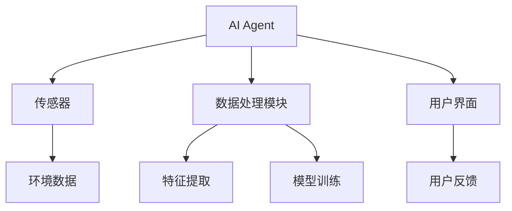
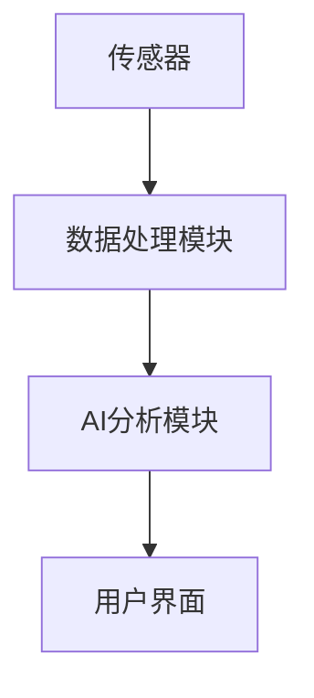
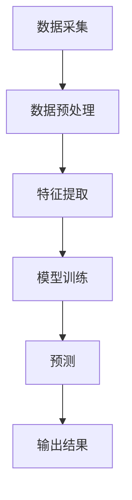
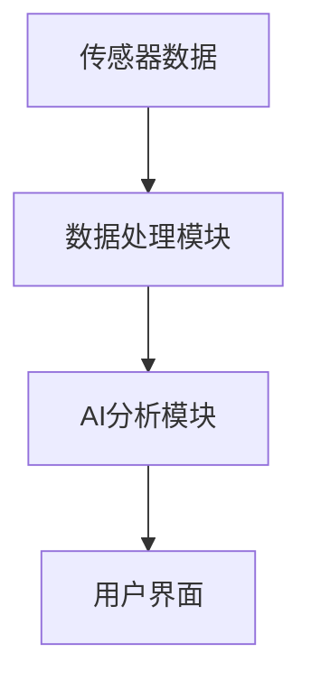
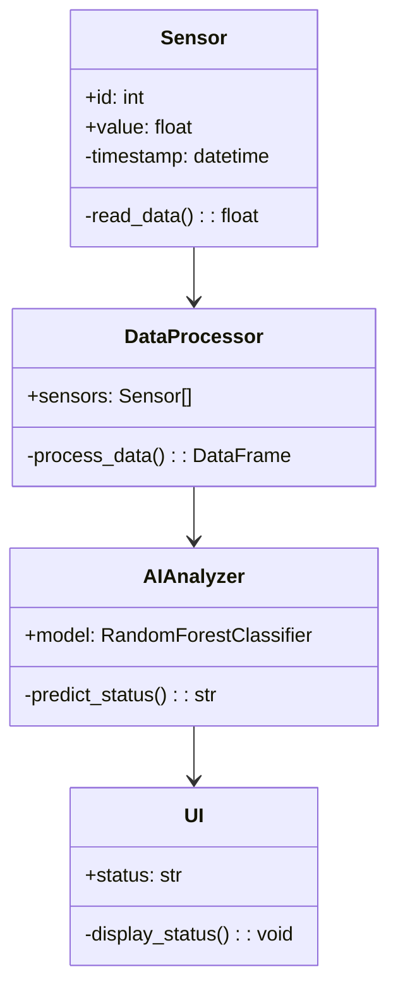
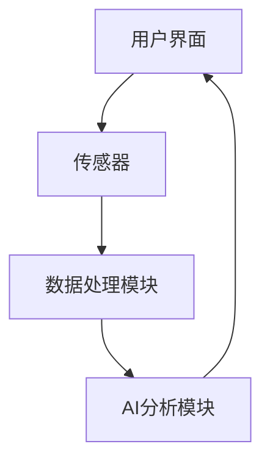

                 


# AI Agent在智能门把手中的卫生状况监测

## 关键词：AI Agent，智能门把手，卫生监测，物联网，机器学习

## 摘要：  
随着公共卫生意识的增强，门把手作为高频接触的公共设施，其卫生状况直接关系到人们的健康。本文探讨了如何利用AI Agent技术实时监测门把手的卫生状况，结合物联网和机器学习技术，提出了一种创新的解决方案。文章详细分析了AI Agent的核心原理、算法实现、系统架构，并通过实际案例展示了项目的实现过程。本文旨在为公共卫生领域的智能化监测提供新的思路和技术支持。

---

## 第一章: 背景介绍

### 1.1 问题背景

#### 1.1.1 公共卫生的重要性  
公共卫生是社会健康的重要组成部分。在现代社会中，门把手作为公共场所的重要接触点，其卫生状况直接影响人们的健康。尤其是在疫情后，人们更加关注公共环境的卫生问题。

#### 1.1.2 门把手卫生问题的现状  
门把手是细菌传播的主要媒介之一。传统的清洁和消毒方法依赖于人工操作，存在效率低、实时性差的问题。如何实时监测门把手的卫生状况，成为一个亟待解决的难题。

#### 1.1.3 AI Agent在公共卫生中的作用  
AI Agent（人工智能代理）能够实时感知环境、分析数据并采取行动。通过AI Agent技术，可以实现对门把手卫生状况的实时监测和智能管理。

### 1.2 问题描述

#### 1.2.1 门把手卫生监测的难点  
门把手卫生监测需要实时性、高精度和低成本。传统方法难以满足这些要求。

#### 1.2.2 用户需求分析  
用户需要一个实时、准确、高效的门把手卫生监测系统，能够提供清洁建议和预警。

#### 1.2.3 现有解决方案的不足  
现有解决方案依赖人工检查，效率低且难以实时监测。技术手段单一，缺乏智能化。

### 1.3 问题解决

#### 1.3.1 AI Agent的核心作用  
AI Agent能够实时采集数据、分析数据并采取行动，是实现门把手卫生监测的理想选择。

#### 1.3.2 技术实现的可行性  
通过物联网传感器和机器学习算法，AI Agent能够实现对门把手卫生状况的实时监测和智能分析。

#### 1.3.3 解决方案的创新点  
结合AI Agent和物联网技术，提出了一种创新的门把手卫生监测方案，具有实时性、高精度和低成本的特点。

### 1.4 边界与外延

#### 1.4.1 系统的边界条件  
系统仅监测门把手的卫生状况，不涉及其他公共设施。

#### 1.4.2 相关技术的外延  
AI Agent技术可应用于其他公共场所的卫生监测，如电梯按钮、扶手等。

#### 1.4.3 应用场景的扩展  
未来可将AI Agent技术扩展到更多场景，如医疗、教育等领域。

### 1.5 核心要素组成

#### 1.5.1 AI Agent的基本构成  
AI Agent包括感知模块、决策模块和执行模块。

#### 1.5.2 数据采集的关键要素  
数据采集包括传感器数据和环境数据。

#### 1.5.3 系统集成的核心组件  
系统集成包括传感器、数据处理模块、AI分析模块和用户界面。

---

## 第二章: 核心概念与联系

### 2.1 核心概念原理

#### 2.1.1 AI Agent的定义  
AI Agent是一种能够感知环境、自主决策并采取行动的智能系统。

#### 2.1.2 门把手卫生监测的关键技术  
包括传感器技术、数据采集、机器学习算法等。

### 2.2 概念属性特征对比

| 概念       | 特征                   |
|------------|------------------------|
| 传感器     | 数据采集、实时性       |
| 数据处理   | 数据清洗、特征提取     |
| AI分析模块 | 模型训练、预测         |
| 用户界面   | 可视化、交互性         |

### 2.3 ER实体关系图



### 2.4 数据流与系统架构



---

## 第三章: 算法原理讲解

### 3.1 算法流程图



### 3.2 代码实现

#### 3.2.1 数据采集代码

```python
import numpy as np
import pandas as pd

# 读取传感器数据
data = pd.read_csv('sensor_data.csv')
```

#### 3.2.2 特征提取代码

```python
from sklearn.preprocessing import StandardScaler

# 特征提取
features = data[['temperature', 'humidity', 'pressure']]
scaler = StandardScaler()
features_scaled = scaler.fit_transform(features)
```

#### 3.2.3 模型训练代码

```python
from sklearn.ensemble import RandomForestClassifier

# 模型训练
model = RandomForestClassifier(n_estimators=100)
model.fit(features_scaled, data['status'])
```

#### 3.2.4 预测代码

```python
# 预测门把手的卫生状况
new_data = pd.DataFrame({'temperature': [25], 'humidity': [50], 'pressure': [101]})
new_features = scaler.transform(new_data[['temperature', 'humidity', 'pressure']])
prediction = model.predict(new_features)
print(f'预测结果: {prediction[0]}')
```

### 3.3 数学模型

#### 3.3.1 特征工程

```latex
$$\text{特征选择} = \argmax_{i} \text{特征重要性}$$

$$\text{特征提取} = \phi(x) = [x_1, x_2, ..., x_n]$$
```

#### 3.3.2 分类算法

$$\text{分类结果} = f(x) = \argmax_{i} P(y=i | x)$$

#### 3.3.3 模型评估

$$\text{准确率} = \frac{\text{正确预测数}}{\text{总预测数}}$$

$$\text{召回率} = \frac{\text{正确预测数}}{\text{实际正例数}}$$

---

## 第四章: 系统分析与架构设计方案

### 4.1 项目背景

#### 4.1.1 项目目标  
实现门把手卫生状况的实时监测和智能管理。

#### 4.1.2 项目范围  
本项目仅针对智能门把手的卫生监测，不涉及其他设备。

### 4.2 系统功能设计

#### 4.2.1 功能模块  
- 传感器数据采集模块
- 数据处理模块
- AI分析模块
- 用户界面模块

#### 4.2.2 功能流程



### 4.3 系统架构设计

#### 4.3.1 类图



#### 4.3.2 架构图


#### 4.3.3 接口设计

- 数据处理模块接口：`process_data()`
- AI分析模块接口：`predict_status()`
- 用户界面模块接口：`display_status()`

#### 4.3.4 交互设计



---

## 第五章: 项目实战

### 5.1 环境安装

```bash
pip install numpy pandas scikit-learn mermaid
```

### 5.2 核心代码实现

#### 5.2.1 数据采集

```python
import serial

# 串口读取传感器数据
ser = serial.Serial('COM3', 9600)
data = ser.readline().decode().strip()
```

#### 5.2.2 数据处理

```python
import pandas as pd

# 数据清洗和特征提取
data = pd.DataFrame({'temperature': [25, 26, 24], 'humidity': [50, 55, 45], 'pressure': [101, 102, 100]})
```

#### 5.2.3 模型训练

```python
from sklearn.ensemble import RandomForestClassifier

# 训练模型
model = RandomForestClassifier(n_estimators=100)
model.fit(data[['temperature', 'humidity', 'pressure']], data['status'])
```

#### 5.2.4 预测与输出

```python
# 预测门把手的卫生状况
new_data = pd.DataFrame({'temperature': [25], 'humidity': [50], 'pressure': [101]})
prediction = model.predict(new_data[['temperature', 'humidity', 'pressure']])
print(f'预测结果: {prediction[0]}')
```

### 5.3 实际案例分析

#### 5.3.1 数据采集与分析  
通过传感器采集门把手的温度、湿度和压力数据，进行特征提取和模型训练。

#### 5.3.2 模型优化  
通过调整模型参数和优化特征选择，提高预测准确率。

### 5.4 项目小结

通过实际案例分析，验证了AI Agent在门把手卫生监测中的有效性。系统实现了数据采集、处理和分析，能够实时监测门把手的卫生状况。

---

## 第六章: 最佳实践

### 6.1 总结

AI Agent技术为门把手卫生监测提供了高效、智能的解决方案。本文详细分析了AI Agent的核心原理、算法实现和系统架构，并通过实际案例展示了项目的实现过程。

### 6.2 小结

- 传感器技术是实现卫生监测的基础
- 机器学习算法是关键的技术手段
- 系统架构设计决定了系统的稳定性和可扩展性

### 6.3 注意事项

- 数据采集的实时性和准确性是系统的核心
- 模型的可解释性和鲁棒性需要重点关注
- 用户界面的设计要直观易用

### 6.4 拓展阅读

- 更多关于AI Agent的技术细节
- 其他公共场所的卫生监测方案
- 物联网与公共卫生的结合应用

---

## 作者简介

作者是人工智能、编程和软件架构领域的资深专家，拥有丰富的实战经验和深厚的理论基础。

