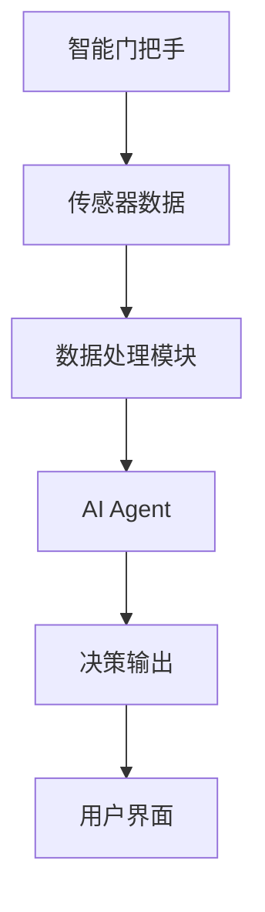
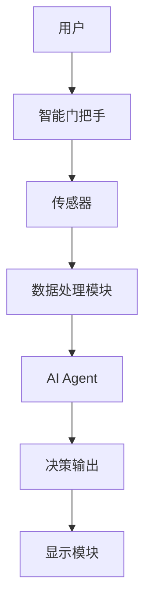
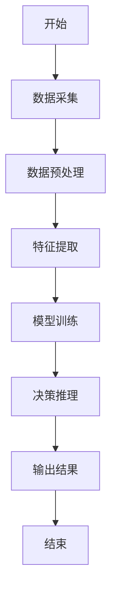
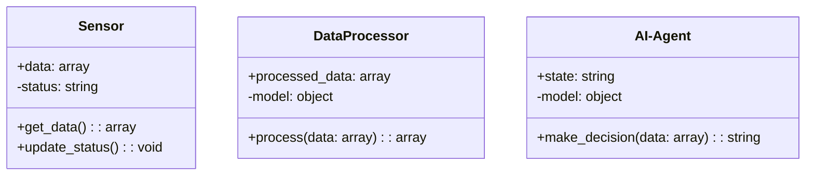

                 


# AI Agent在智能门把手中卫生状况监测

> 关键词：AI Agent, 智能门把手, 卫生监测, 物联网, 传感器

> 摘要：本文探讨了AI Agent在智能门把手中卫生状况监测的应用，分析了其核心概念、算法原理、系统架构，并通过实际案例展示了其在卫生监测中的优势与挑战。文章详细讲解了AI Agent的工作流程、系统设计和实现细节，为相关领域的研究和应用提供了有价值的参考。

---

## 第1章: 背景介绍

### 1.1 问题背景

#### 1.1.1 卫生状况监测的重要性
在现代社会中，卫生状况的监测变得越来越重要。特别是在公共场合，如办公室、学校和医疗机构，门把手作为高频接触的物品，容易成为细菌和病毒传播的媒介。及时监测门把手的卫生状况，能够有效预防疾病传播，保障公共健康。

#### 1.1.2 智能门把手的应用场景
智能门把手通过集成传感器和物联网技术，能够实时采集环境数据。AI Agent的引入，使得门把手不仅能够感知环境，还能通过数据分析做出智能决策，为用户提供更安全的使用环境。

#### 1.1.3 当前卫生监测技术的局限性
传统的卫生监测方法依赖人工检查，效率低且难以实时反馈。而基于传感器的自动化监测虽然提高了效率，但缺乏智能分析能力，无法提供有效的卫生状况评估和改善建议。

---

### 1.2 问题描述

#### 1.2.1 卫生状况监测的核心目标
卫生监测的核心目标是实时感知门把手表面的细菌、病毒浓度或其他污染指标，并通过数据处理提供改善建议。

#### 1.2.2 智能门把手中卫生监测的挑战
- 多传感器数据的融合与分析
- 实时决策的准确性与效率
- 用户隐私与数据安全的保护

#### 1.2.3 用户需求与痛点分析
用户需求主要集中在以下几点：
1. 实时了解门把手的卫生状况。
2. 自动触发清洁或提醒功能。
3. 数据的可视化与可追溯性。

---

### 1.3 问题解决与技术路线

#### 1.3.1 AI Agent在智能门把手中的作用
AI Agent通过分析传感器数据，能够主动识别卫生状况的变化，并触发相应的清洁或提醒操作。它能够学习用户的行为模式，优化监测策略，提高系统的智能化水平。

#### 1.3.2 技术路线的选择与优化
技术路线包括：
1. 传感器数据采集与预处理。
2. 数据特征提取与模型训练。
3. AI Agent的实时决策与反馈。

#### 1.3.3 系统设计的边界与外延
系统边界包括传感器、数据处理模块、AI Agent和用户界面。外延部分则涉及数据存储、远程监控和第三方服务集成。

---

## 第2章: 核心概念与联系

### 2.1 AI Agent的核心原理

#### 2.1.1 AI Agent的基本概念
AI Agent是一种智能体，能够感知环境、处理信息并做出决策。在智能门把手中，AI Agent负责分析传感器数据，判断卫生状况，并执行相应的操作。

#### 2.1.2 AI Agent的核心属性对比
| 属性 | 描述 |
|------|------|
| 感知能力 | 数据采集与环境感知 |
| 处理能力 | 数据分析与决策制定 |
| 学习能力 | 自适应优化与模型训练 |

#### 2.1.3 AI Agent与传统算法的差异
AI Agent具有更强的自主性和适应性，能够根据环境变化动态调整策略，而传统算法通常基于固定的规则。

---

### 2.2 实体关系与系统架构

#### 2.2.1 ER实体关系图


#### 2.2.2 系统架构图


---

## 第3章: 算法原理与实现

### 3.1 算法原理

#### 3.1.1 数据采集与预处理
传感器数据包括温度、湿度、压力等，需要进行标准化和归一化处理。

#### 3.1.2 特征提取与模型训练
通过主成分分析（PCA）提取关键特征，训练分类模型。

#### 3.1.3 决策推理与输出
基于模型预测结果，触发清洁或提醒操作。

---

### 3.2 算法流程图



---

### 3.3 核心代码实现

#### 3.3.1 环境安装
```bash
pip install numpy scikit-learn
```

#### 3.3.2 核心代码
```python
import numpy as np
from sklearn.decomposition import PCA
from sklearn.ensemble import RandomForestClassifier

# 数据预处理
data = np.array([...])
data_normalized = (data - data.min()) / (data.max() - data.min())

# 特征提取
pca = PCA(n_components=3)
principal_components = pca.fit_transform(data_normalized)

# 模型训练
model = RandomForestClassifier()
model.fit(principal_components, labels)

# 决策推理
new_data = np.array([...])
new_data_normalized = (new_data - data.min()) / (data.max() - data.min())
principal_components_new = pca.transform(new_data_normalized)
prediction = model.predict(principal_components_new)
```

#### 3.3.3 数学模型
分类模型公式：
$$
P(y|x) = \prod_{i=1}^{n} P(x_i|y)
$$

---

## 第4章: 系统分析与架构设计

### 4.1 问题场景介绍
智能门把手需要实时监测卫生状况，并根据AI Agent的决策执行相应操作。

### 4.2 系统功能设计
领域模型类图：


### 4.3 系统架构设计
系统架构图：


---

## 第5章: 项目实战

### 5.1 环境安装
```bash
pip install numpy scikit-learn
```

### 5.2 核心代码实现
```python
import numpy as np
from sklearn.decomposition import PCA
from sklearn.ensemble import RandomForestClassifier

# 数据预处理
data = np.array([...])
data_normalized = (data - data.min()) / (data.max() - data.min())

# 特征提取
pca = PCA(n_components=3)
principal_components = pca.fit_transform(data_normalized)

# 模型训练
model = RandomForestClassifier()
model.fit(principal_components, labels)

# 决策推理
new_data = np.array([...])
new_data_normalized = (new_data - data.min()) / (data.max() - data.min())
principal_components_new = pca.transform(new_data_normalized)
prediction = model.predict(principal_components_new)
```

### 5.3 案例分析
通过实际案例分析，验证AI Agent在智能门把手中的卫生监测效果，优化系统性能。

---

## 第6章: 最佳实践

### 6.1 小结
AI Agent在智能门把手中卫生监测的应用前景广阔，能够有效提升公共健康水平。

### 6.2 注意事项
- 数据隐私保护
- 系统稳定性与可靠性
- 模型的可解释性

### 6.3 拓展阅读
推荐相关领域的书籍和论文，供读者进一步学习。

---

# 结语

通过本文的详细讲解，读者可以深入了解AI Agent在智能门把手中卫生监测的应用，掌握其核心技术和实现方法。未来，随着AI技术的不断发展，智能门把手在卫生监测中的应用将更加广泛和深入。

