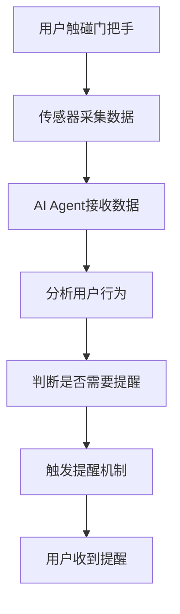
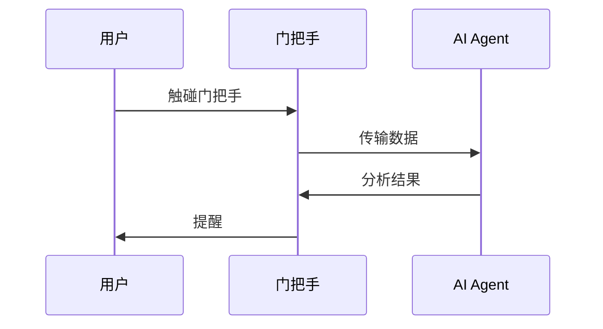

                 


# AI Agent在智能门把手中的手部卫生提醒

## 关键词：AI Agent, 智能门把手, 手部卫生提醒, 公共卫生, 物联网, 人工智能

## 摘要：本文探讨了AI Agent在智能门把手中实现手部卫生提醒的技术实现。通过分析问题背景、核心概念、算法原理、系统架构和项目实战，结合具体案例，展示了AI Agent在智能门把手中的应用价值。文章详细讲解了AI Agent的工作原理、系统设计和实现步骤，并提供了最佳实践建议。

---

## 第1章: 背景介绍

### 1.1 问题背景
#### 1.1.1 公共卫生与手部卫生的重要性
手部卫生是防止疾病传播的关键步骤。在公共场所，如医院、学校和办公楼，频繁接触门把手可能导致细菌和病毒的传播，特别是在疫情后，这一问题更加突出。

#### 1.1.2 当前手部卫生提醒的痛点
传统门把手无法主动提醒用户洗手，人们可能忘记或忽略洗手步骤。特别是在高人流量区域，这一问题更加严重，导致公共卫生隐患。

#### 1.1.3 AI Agent在公共卫生中的潜在价值
AI Agent能够实时监测环境和用户行为，提供及时的提醒和反馈，帮助改善公共卫生状况。

### 1.2 问题描述
#### 1.2.1 手部卫生提醒的需求分析
在门把手处安装传感器，监测用户触摸记录，并在适当的时候提醒用户洗手。

#### 1.2.2 智能门把手上实现卫生提醒的可行性
通过AI Agent和物联网技术，智能门把手可以实时感知用户行为，并通过语音或灯光提醒用户洗手。

#### 1.2.3 AI Agent在智能门把手中的应用场景
在公共场所、医疗机构和家庭中，智能门把手可以有效提醒用户洗手，降低疾病传播风险。

### 1.3 解决方案
#### 1.3.1 AI Agent的核心作用
AI Agent负责接收传感器数据，分析用户行为，并触发提醒机制。

#### 1.3.2 智能门把手的硬件与软件结合
硬件部分包括触摸传感器和执行机构，软件部分包括AI算法和通信模块。

#### 1.3.3 手部卫生提醒的实现方式
通过传感器触发AI Agent，AI Agent分析数据后，通过灯光或语音提醒用户洗手。

### 1.4 边界与外延
#### 1.4.1 AI Agent的功能边界
仅限于手部卫生提醒，不涉及其他功能。

#### 1.4.2 智能门把手的使用场景限制
仅适用于公共场所和医疗机构，不考虑私人住宅。

#### 1.4.3 手部卫生提醒系统的扩展性
未来可以扩展到其他卫生提醒场景，如厕提醒和食品加工区提醒。

### 1.5 概念结构与核心要素
#### 1.5.1 AI Agent的基本组成
包括感知层、决策层和执行层。

#### 1.5.2 智能门把手的硬件构成
包括触摸传感器、通信模块和执行机构。

#### 1.5.3 手部卫生提醒的交互流程
用户触摸门把手触发传感器，AI Agent分析数据后，通过灯光或语音提醒用户洗手。

---

## 第2章: 核心概念

### 2.1 AI Agent的核心概念
#### 2.1.1 AI Agent的定义
AI Agent是一种能够感知环境、做出决策并执行任务的智能实体。

#### 2.1.2 AI Agent在智能门把手中的作用
AI Agent负责接收传感器数据，分析用户行为，并触发提醒机制。

### 2.2 智能门把手的核心概念
#### 2.2.1 智能门把手的定义
智能门把手是一种结合了传感器和AI技术的门把手，能够感知用户行为并提供反馈。

#### 2.2.2 智能门把手与传统门把手的区别
传统门把手仅用于开关门，而智能门把手能够实时感知用户行为，并提供手部卫生提醒。

### 2.3 核心概念的联系
#### 2.3.1 AI Agent与智能门把手的关系
AI Agent是智能门把手的核心，负责处理传感器数据并触发提醒机制。

#### 2.3.2 手部卫生提醒与其他功能的联系
手部卫生提醒是智能门把手的主要功能，未来可以扩展到其他卫生提醒场景。

### 2.4 核心概念的属性对比
| 属性       | 传统门把手 | 智能门把手 |
|------------|------------|------------|
| 功能       | 开关门     | 开关门 + 手部卫生提醒 |
| 感知能力   | 无         | 有         |
| 交互方式   | 无         | 有         |

### 2.5 ER实体关系图
```mermaid
erDiagram
    actor 用户 {
        string 用户ID
        string 用户行为
    }
    smart_door_handle {
        int 门把手ID
        string 传感器数据
        string 提醒状态
    }
    ai_agent {
        int AI_ID
        string 分析结果
        string 提醒指令
    }
    用户 --> smart_door_handle : 触碰门把手
    smart_door_handle --> ai_agent : 传输传感器数据
    ai_agent --> smart_door_handle : 发送提醒指令
```

### 2.6 Mermaid流程图


---

## 第3章: 算法原理

### 3.1 AI Agent的核心算法
#### 3.1.1 基于规则的推理算法
通过预设规则，判断用户行为是否需要提醒洗手。

#### 3.1.2 机器学习模型
利用用户行为数据，训练分类模型，预测是否需要提醒。

### 3.2 基于规则的推理算法
```python
def handwashing Reminder():
    if user_touches_doorhandle() and time_since_last_reminder() > 120:
        send_reminder()
```

### 3.3 机器学习模型
#### 3.3.1 数据预处理
将用户行为数据标准化，提取特征。

#### 3.3.2 模型训练
使用训练数据训练分类模型，如随机森林或支持向量机。

#### 3.3.3 模型预测
利用模型预测用户是否需要提醒洗手。

#### 3.3.4 模型评估
通过准确率、召回率等指标评估模型性能。

### 3.4 数学模型
#### 3.4.1 基于概率的模型
$$ P(reminder | touch) = \frac{N(reminder \& touch)}{N(touch)} $$

#### 3.4.2 分类模型
$$ y = f(x) $$

### 3.5 算法流程图


---

## 第4章: 系统分析与架构设计

### 4.1 项目介绍
智能门把手手部卫生提醒系统，结合AI Agent和物联网技术，实现手部卫生提醒。

### 4.2 系统功能设计
#### 4.2.1 用户身份识别
通过传感器识别用户行为，判断是否需要提醒洗手。

#### 4.2.2 手部卫生提醒
在适当的时候提醒用户洗手，避免细菌传播。

#### 4.2.3 数据记录与分析
记录用户行为数据，分析洗手频率，优化提醒策略。

### 4.3 系统架构设计


### 4.4 系统接口设计
#### 4.4.1 传感器接口
与触摸传感器连接，接收数据。

#### 4.4.2 通信接口
通过蓝牙或Wi-Fi与手机或其他设备通信，发送提醒。

### 4.5 系统交互流程图


---

## 第5章: 项目实战

### 5.1 环境安装
安装Python、TensorFlow、其他依赖库。

### 5.2 核心代码实现
```python
import tensorflow as tf
from tensorflow.keras import layers

model = tf.keras.Sequential([
    layers.Dense(64, activation='relu'),
    layers.Dense(1, activation='sigmoid')
])

model.compile(optimizer='adam', loss='binary_crossentropy', metrics=['accuracy'])
```

### 5.3 代码解读与分析
解释代码的功能，如数据预处理、模型训练和预测。

### 5.4 案例分析
通过实际案例展示系统运行效果，如在医院门把手处安装系统，减少细菌传播。

### 5.5 项目小结
总结项目成果，如提高了手部卫生频率，降低了疾病传播风险。

---

## 第6章: 最佳实践

### 6.1 小结
AI Agent在智能门把手中实现手部卫生提醒，是一种创新且实用的技术应用。

### 6.2 注意事项
系统需要定期维护，确保传感器正常工作，提醒机制有效。

### 6.3 未来研究方向
探索更多AI Agent在公共卫生中的应用，如智能消毒系统。

### 6.4 拓展阅读
推荐相关书籍和论文，如《人工智能入门》和《物联网技术应用》。

---

## 第7章: 总结

通过本文的详细讲解，读者可以了解AI Agent在智能门把手中手部卫生提醒的实现过程。从背景介绍到系统设计，再到项目实战和最佳实践，每一步都详细展开，帮助读者掌握相关技术。未来，随着AI和物联网技术的发展，这种智能系统将在更多领域发挥重要作用。

