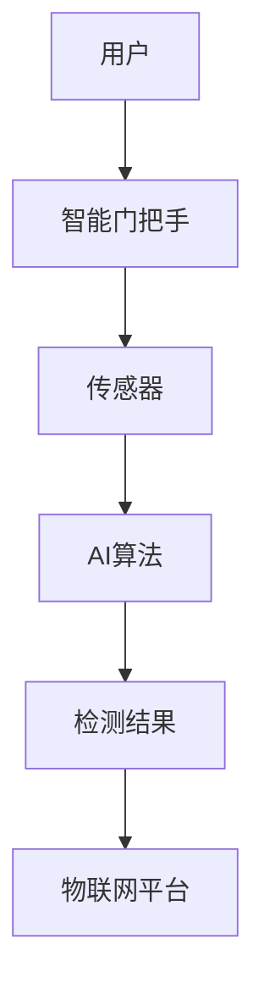
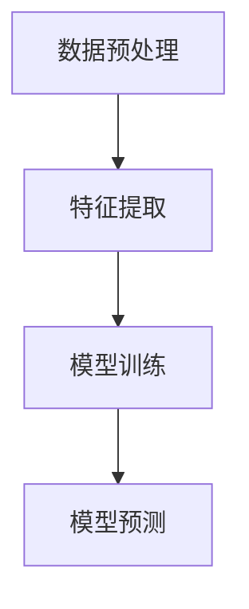
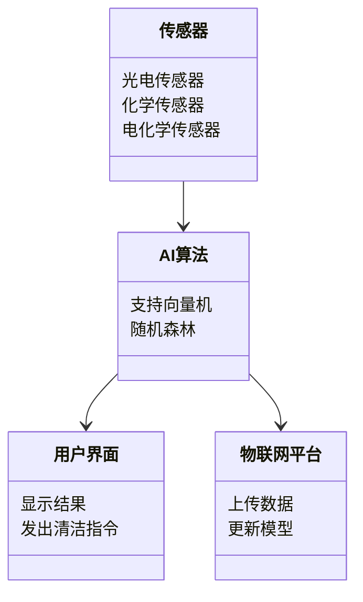
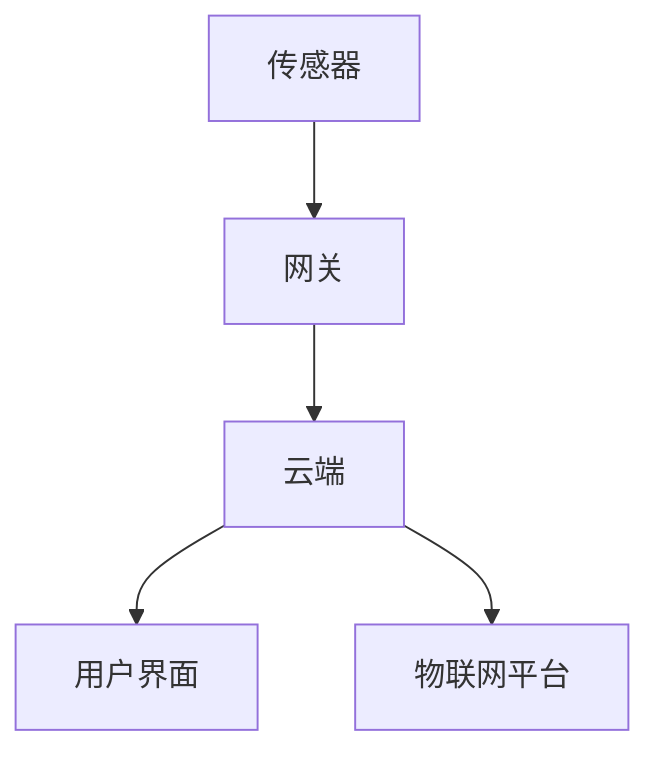
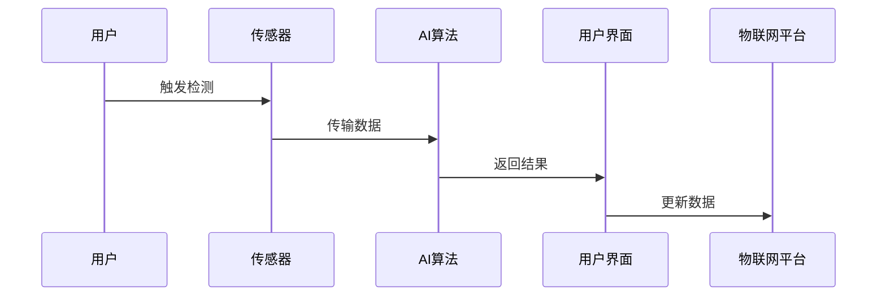

                 


# AI Agent在智能门把手中的细菌检测

> 关键词：智能门把手，AI Agent，细菌检测，物联网，传感器技术，数据处理，算法优化

> 摘要：本文探讨了在智能门把手中应用AI Agent进行细菌检测的技术细节。通过分析现有技术的局限性，介绍了AI Agent的核心原理，并详细讲解了其在细菌检测中的应用场景。文章从背景介绍、核心概念、算法原理、系统架构到项目实战，全面解析了AI Agent在智能门把手中的实现过程，并提供了实际案例和最佳实践。

---

## 第一章：背景介绍

### 1.1 问题背景
智能门把手作为智能家居的重要组成部分，其卫生状况直接影响家庭成员的健康。传统的细菌检测方法依赖人工采样和实验室分析，耗时长且效率低。因此，如何在智能门把手中实现快速、精准的细菌检测成为亟待解决的问题。

#### 1.1.1 智能门把手的发展现状
智能门把手已广泛应用于家庭和公共场所，具备远程控制、指纹识别等功能。然而，其卫生问题尚未得到有效解决，细菌检测仍依赖传统方法。

#### 1.1.2 现有细菌检测技术的局限性
传统检测方法存在耗时长、成本高、难以实时监测等缺点，难以满足用户对快速、便捷检测的需求。

#### 1.1.3 AI Agent在智能门把手中的应用潜力
AI Agent通过实时数据分析和智能决策，能够显著提升细菌检测的效率和准确性，为智能门把手的功能扩展提供了新的可能性。

### 1.2 问题描述
细菌检测需要快速、准确地识别细菌类型和浓度，这对智能门把手的硬件和算法提出了更高的要求。

#### 1.2.1 细菌检测的基本概念
细菌检测是通过传感器采集数据，结合AI算法进行分析，以识别细菌种类和浓度的过程。

#### 1.2.2 智能门把手细菌检测的难点
传感器精度不足、数据处理复杂、算法实时性要求高等因素增加了细菌检测的难度。

#### 1.2.3 用户需求与痛点分析
用户希望门把手具备实时检测功能，能够快速反馈检测结果，并提供清洁建议。

### 1.3 问题解决思路
AI Agent通过整合传感器数据和机器学习算法，能够有效解决细菌检测的难点。

#### 1.3.1 AI Agent的核心优势
AI Agent具备实时数据分析、自主决策和学习能力，能够显著提升检测效率和准确性。

#### 1.3.2 智能门把手与AI Agent的结合方式
通过在门把手上集成传感器和AI算法，实现细菌检测的实时监测和智能反馈。

#### 1.3.3 系统设计的总体思路
系统设计包括传感器选型、数据采集、算法优化和用户反馈等环节，确保检测结果的准确性和实时性。

### 1.4 系统边界与外延
系统设计需要明确输入输出边界，确保各组件之间的高效协同。

#### 1.4.1 系统的输入输出边界
系统输入包括传感器数据和用户指令，输出包括检测结果和清洁建议。

#### 1.4.2 系统与外部环境的交互
系统通过物联网平台与云端连接，实现数据上传和模型更新。

#### 1.4.3 系统功能的扩展性分析
系统可扩展的功能包括环境监测、健康数据分析等，为未来的功能升级提供了空间。

### 1.5 概念结构与核心要素
系统由传感器、AI算法、用户界面等核心要素组成，各要素协同工作实现细菌检测。

#### 1.5.1 系统组成要素
传感器、AI算法、用户界面、物联网平台。

#### 1.5.2 各要素之间的关系
传感器采集数据，AI算法进行分析，用户界面反馈结果，物联网平台支持数据传输。

---

## 第二章：核心概念与联系

### 2.1 核心概念原理
AI Agent通过传感器数据和机器学习算法实现细菌检测。

#### 2.1.1 传感器类型与检测原理
- 光电传感器：通过光反射变化检测细菌。
- 化学传感器：通过化学反应检测细菌。
- 电化学传感器：通过电流变化检测细菌。

#### 2.1.2 AI算法的核心原理
- 机器学习：训练模型识别细菌特征。
- 深度学习：通过神经网络提取复杂特征。

#### 2.1.3 各传感器的优缺点对比

| 传感器类型 | 优点 | 缺点 |
|------------|------|------|
| 光电传感器 | 高灵敏度 | 易受环境干扰 |
| 化学传感器 | 选择性好 | 成本较高 |
| 电化学传感器 | 稳定性好 | 维护复杂 |

#### 2.1.4 传感器与AI算法的关系
传感器负责数据采集，AI算法负责数据分析和分类，两者协同实现检测功能。

### 2.2 概念属性特征对比
通过对比不同传感器的属性，选择最适合智能门把手的传感器类型。

### 2.3 实体关系图
Mermaid 实体关系图展示系统各组件之间的关系：



---

## 第三章：算法原理

### 3.1 算法原理概述
AI Agent采用机器学习算法对传感器数据进行分类。

#### 3.1.1 算法选择
支持向量机（SVM）和随机森林（RF）是常用的分类算法。

#### 3.1.2 算法流程
数据预处理、特征提取、模型训练、结果预测。

### 3.2 算法实现步骤
详细讲解算法实现的每一步骤。

#### 3.2.1 数据预处理
- 数据清洗：去除噪声数据。
- 数据归一化：统一数据尺度。

#### 3.2.2 特征提取
提取传感器数据中的关键特征，如光强变化、电流值等。

#### 3.2.3 模型训练
使用训练数据训练机器学习模型。

#### 3.2.4 模型预测
对新数据进行分类，输出检测结果。

### 3.3 算法优化
通过调整参数和优化模型提升检测准确率。

#### 3.3.1 参数优化
调整SVM的核函数和惩罚系数。

#### 3.3.2 模型优化
使用交叉验证选择最优模型。

### 3.4 算法流程图
Mermaid 算法流程图展示算法实现步骤：



### 3.5 代码实现
Python代码示例：

```python
import numpy as np
from sklearn import svm

# 数据预处理
X = np.array([[1, 2], [3, 4], [5, 6]])
y = np.array([0, 1, 0])

# 模型训练
model = svm.SVC()
model.fit(X, y)

# 模型预测
new_data = np.array([[2, 3]])
print(model.predict(new_data))  # 输出：array([0])
```

### 3.6 数学公式
AI算法的核心公式，如SVM的优化目标：

$$ \text{minimize} \frac{1}{2} \|w\|^2 + C \sum_{i=1}^{n} \xi_i $$
$$ \text{subject to} \quad y_i (w \cdot x_i + b) \geq 1 - \xi_i $$
$$ \xi_i \geq 0 $$

---

## 第四章：系统分析与架构设计

### 4.1 问题场景介绍
智能门把手细菌检测系统需要解决数据采集、处理和反馈问题。

### 4.2 系统介绍
系统由传感器、AI算法、用户界面和物联网平台组成。

#### 4.2.1 领域模型
Mermaid 领域模型类图：



#### 4.2.2 系统架构
Mermaid 系统架构图：



#### 4.2.3 接口设计
系统接口包括传感器数据接口、AI算法接口和用户反馈接口。

#### 4.2.4 交互序列图
Mermaid 交互序列图：



---

## 第五章：项目实战

### 5.1 环境安装
安装必要的Python库，如TensorFlow、Scikit-learn。

#### 5.1.1 安装Python环境
使用Anaconda安装Python 3.8及以上版本。

#### 5.1.2 安装依赖库
运行命令：
```bash
pip install numpy scikit-learn
```

### 5.2 核心代码实现
实现AI Agent的核心算法和系统交互。

#### 5.2.1 数据采集代码
传感器数据采集示例：

```python
import serial

# 连接传感器
ser = serial.Serial('COM3', 9600)
data = ser.readline().decode().strip()
print(data)  # 输出传感器数据
```

#### 5.2.2 数据处理代码
数据预处理和特征提取：

```python
import numpy as np

# 读取传感器数据
data = np.loadtxt('sensor_data.csv', delimiter=',')
# 数据归一化
data_normalized = (data - data.min()) / (data.max() - data.min())
```

#### 5.2.3 模型训练代码
训练AI算法模型：

```python
from sklearn.model_selection import train_test_split
from sklearn.svm import SVC

# 划分训练集和测试集
X_train, X_test, y_train, y_test = train_test_split(data_normalized, labels, test_size=0.2)
# 训练模型
model = SVC()
model.fit(X_train, y_train)
# 评估模型
print("Accuracy:", model.score(X_test, y_test))
```

#### 5.2.4 系统交互代码
用户界面与物联网平台交互：

```python
import requests

# 发送数据到物联网平台
response = requests.post('http://api.example.com/update', json=data)
print(response.status_code)
```

### 5.3 代码解读与分析
详细解释每部分代码的功能和实现原理。

#### 5.3.1 数据采集部分
传感器数据采集是整个系统的基础，确保数据的准确性和实时性。

#### 5.3.2 数据处理部分
数据预处理和特征提取是模型训练的关键步骤，直接影响检测结果的准确性。

#### 5.3.3 模型训练部分
选择合适的算法和优化参数是提升检测效率和准确率的核心。

### 5.4 实际案例分析
通过具体案例展示系统的实际应用和效果。

#### 5.4.1 案例背景
某家庭智能门把手的细菌检测项目。

#### 5.4.2 数据分析
传感器数据采集和处理结果。

#### 5.4.3 检测结果
AI算法输出的细菌检测结果和清洁建议。

#### 5.4.4 系统反馈
物联网平台更新数据，用户界面显示结果。

### 5.5 项目小结
总结项目的实现过程和取得的成果。

---

## 第六章：最佳实践

### 6.1 小结
AI Agent在智能门把手中实现了快速、精准的细菌检测，显著提升了用户体验。

### 6.2 注意事项
- 数据采集的准确性
- 算法的实时性和稳定性
- 系统的可扩展性和维护性

### 6.3 拓展阅读
建议读者深入研究边缘计算、实时检测等技术，探索更多应用场景。

---

## 总结

通过本文的详细讲解，读者可以全面了解AI Agent在智能门把手中细菌检测的技术实现。从背景分析到系统设计，再到项目实战，每一步都经过精心安排和详细解读，为读者提供了丰富的知识和实践指导。未来，随着技术的不断发展，AI Agent在智能门把中的应用将更加广泛，为用户带来更智能、更便捷的体验。

--- 

**全文完**

