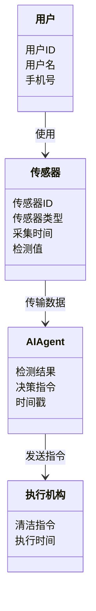
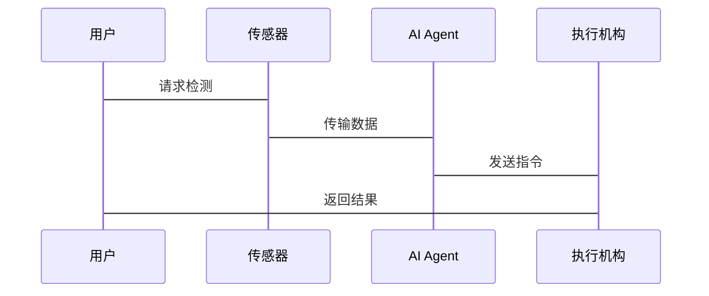

                 


# AI Agent在智能门把手中的细菌检测

## 关键词：AI Agent，智能门把手，细菌检测，物联网，传感器

## 摘要：本文详细探讨了AI Agent在智能门把手中进行细菌检测的应用。从背景介绍、核心原理、系统设计到项目实战，全面分析了该技术的实现过程。文章结合技术原理和实际案例，展示了如何利用AI Agent和物联网技术实现高效、精准的细菌检测。

---

# 第1章: 背景介绍

## 1.1 问题背景与应用场景
### 1.1.1 智能门把手的发展现状
随着智能家居的普及，门把手不仅是建筑物的组成部分，更是智能化设备的重要载体。智能门把手可以通过传感器和物联网技术实现开门、指纹识别、远程控制等功能。然而，门把手作为高频接触点，容易成为细菌传播的温床。

### 1.1.2 细菌检测在公共健康中的重要性
细菌感染是全球公共卫生的主要挑战之一。门把手作为公共空间的高频接触点，细菌密度往往较高，尤其是在医院、学校、办公室等场所。及时检测并提醒清洁门把手，可以有效降低细菌传播风险，保障公共健康。

### 1.1.3 AI Agent在智能门把手中的应用潜力
AI Agent（人工智能代理）是一种能够感知环境、自主决策并执行任务的智能体。将其应用于智能门把手中，可以通过传感器实时检测细菌密度，结合历史数据和环境因素，预测细菌传播风险，并主动触发清洁流程。

## 1.2 问题描述与解决方案
### 1.2.1 细菌检测的关键挑战
细菌检测的核心挑战在于检测的准确性、实时性和低成本实现。传统的细菌检测方法通常需要实验室环境和专业设备，难以在门把手这样的小型设备上实现。

### 1.2.2 AI Agent在细菌检测中的角色
AI Agent可以作为智能门把手的核心控制单元，负责协调传感器数据采集、分析、决策和执行。通过AI算法，AI Agent能够实时分析细菌密度，并根据预设阈值触发清洁提醒或自动清洁机制。

### 1.2.3 解决方案的可行性分析
结合AI Agent和物联网技术，智能门把手可以实现以下功能：
1. **实时检测**：通过传感器采集门把手表面的细菌密度数据。
2. **智能分析**：AI Agent利用机器学习模型分析数据，预测细菌传播风险。
3. **主动响应**：当细菌密度超过阈值时，AI Agent触发清洁流程或提醒用户清洁。

## 1.3 问题解决的边界与外延
### 1.3.1 系统功能的边界
智能门把手的细菌检测系统仅关注门把手表面的细菌密度，不涉及其他区域的细菌检测。系统功能的边界包括传感器数据采集、AI分析和清洁触发。

### 1.3.2 系统功能的外延
虽然细菌检测系统的核心功能是检测门把手表面的细菌密度，但其外延功能包括与智能家居的联动（如联动空气净化器）、数据上传到云端（便于后续分析和优化）等。

### 1.3.3 系统与外部环境的交互
智能门把手需要与外部环境中的传感器、清洁设备、用户终端等进行交互。例如，传感器提供数据输入，清洁设备执行清洁任务，用户终端接收清洁提醒。

## 1.4 核心概念与组成要素
### 1.4.1 AI Agent的定义与特征
AI Agent是一种能够感知环境、自主决策并执行任务的智能体。其核心特征包括：
- **自主性**：能够在无外部干预的情况下自主运行。
- **反应性**：能够实时感知环境变化并做出反应。
- **学习能力**：通过机器学习算法不断优化决策模型。

### 1.4.2 智能门把手的组成结构
智能门把手的组成结构包括：
- **传感器**：用于采集门把手表面的细菌密度数据。
- **AI Agent**：负责数据处理、分析和决策。
- **执行机构**：根据AI Agent的决策执行清洁或其他操作。
- **通信模块**：用于与外部设备或云端进行数据交互。

### 1.4.3 细菌检测的关键技术
细菌检测的关键技术包括：
- **传感器技术**：用于采集细菌密度数据。
- **AI算法**：用于数据处理和预测模型的建立。
- **物联网技术**：用于设备间的数据传输和协同工作。

## 1.5 本章小结
本章介绍了AI Agent在智能门把手中进行细菌检测的背景、问题描述和解决方案。通过分析系统的边界与外延，明确了AI Agent的核心概念和组成要素，为后续章节的深入分析奠定了基础。

---

# 第2章: AI Agent的核心原理

## 2.1 AI Agent的基本原理
### 2.1.1 AI Agent的定义与分类
AI Agent可以根据应用场景分为多种类型，包括：
- **简单反射型AI Agent**：基于预设规则做出反应，适用于简单的任务。
- **基于模型的AI Agent**：通过内部模型理解和预测环境，适用于复杂任务。
- **学习型AI Agent**：通过机器学习算法不断优化决策模型。

### 2.1.2 AI Agent的核心算法
AI Agent的核心算法包括：
- **监督学习**：用于分类任务，如细菌密度分类。
- **无监督学习**：用于聚类分析，如异常检测。
- **强化学习**：用于优化决策策略。

### 2.1.3 AI Agent的决策机制
AI Agent的决策机制包括：
1. **感知环境**：通过传感器获取环境数据。
2. **分析数据**：利用AI算法处理数据，生成决策建议。
3. **执行决策**：根据决策结果触发执行机构。

## 2.2 细菌检测的原理与方法
### 2.2.1 细菌检测的基本原理
细菌检测的基本原理是通过传感器采集门把手表面的细菌密度数据，结合环境因素（如温度、湿度）进行综合分析。

### 2.2.2 常见细菌检测技术对比
常见的细菌检测技术包括：
- **光谱分析法**：通过测量细菌对特定波长光的吸收或发射来检测细菌。
- **电化学法**：通过测量细菌代谢活动产生的电流变化来检测细菌。
- **免疫传感器法**：通过抗体与细菌结合来检测特定细菌的存在。

### 2.2.3 基于光谱分析的细菌检测方法
基于光谱分析的细菌检测方法通过测量细菌对特定波长光的吸收或发射来检测细菌。其原理是细菌细胞中的物质（如蛋白质、核酸）对特定波长的光具有特定的吸收或发射光谱。

## 2.3 AI Agent与细菌检测的结合
### 2.3.1 AI Agent在细菌检测中的作用
AI Agent在细菌检测中的作用包括：
- **数据处理**：对传感器采集的数据进行预处理和特征提取。
- **模型训练**：利用机器学习算法训练细菌分类模型。
- **实时分析**：基于模型分析当前细菌密度，预测传播风险。

### 2.3.2 基于AI的细菌检测流程
基于AI的细菌检测流程包括：
1. **数据采集**：传感器采集门把手表面的细菌密度数据。
2. **数据预处理**：对采集的数据进行标准化和归一化处理。
3. **特征提取**：提取数据中的关键特征。
4. **模型训练**：利用机器学习算法训练细菌分类模型。
5. **实时检测**：基于模型分析实时数据，生成检测结果。

### 2.3.3 AI Agent与传感器的交互机制
AI Agent与传感器的交互机制包括：
1. **数据采集**：传感器定期采集门把手表面的细菌密度数据。
2. **数据传输**：传感器将数据传输给AI Agent。
3. **数据处理**：AI Agent对数据进行分析，生成决策建议。
4. **反馈控制**：AI Agent根据决策结果向传感器发送反馈指令。

## 2.4 核心概念对比表格
以下表格对比了AI Agent和传统传感器在细菌检测中的优缺点：

| 概念         | 优点                                                                 | 缺点                                                                 |
|--------------|----------------------------------------------------------------------|----------------------------------------------------------------------|
| AI Agent     | 能够自主学习和优化，适应不同环境条件；能够处理复杂任务。               | 开发和维护成本较高；需要持续的数据支持。                              |
| 传感器       | 成本低，易于部署；能够实时采集数据。                                   | 无法处理复杂任务；需要人工干预进行数据分析。                          |

## 2.5 ER实体关系图
以下是细菌检测系统的ER实体关系图：

```mermaid
erDiagram
    actor 用户 {
        string 用户ID
        string 用户名
    }
    smartHandle {
        int 门把手ID
        string 检测时间
        binary 检测结果
    }
    sensor {
        int 传感器ID
        string 传感器类型
    }
    relationship 实体关系 {
        用户 -> 智能门把手 : 使用
        智能门把手 -> 传感器 : 配置
    }
```

## 2.6 本章小结
本章详细介绍了AI Agent的核心原理及其在细菌检测中的应用。通过对比分析，明确了AI Agent在细菌检测中的优势和挑战，为后续章节的系统设计奠定了基础。

---

# 第3章: 系统分析与架构设计方案

## 3.1 问题场景介绍
细菌检测系统需要在智能门把手的复杂环境中稳定运行，面对的主要挑战包括传感器数据的实时性、AI Agent的决策准确性以及系统的可扩展性。

## 3.2 项目介绍
本项目旨在开发一个基于AI Agent的智能门把手细菌检测系统，通过传感器实时采集数据，利用机器学习算法进行分析，实现细菌密度的实时检测和风险预测。

## 3.3 系统功能设计
### 3.3.1 领域模型mermaid类图
以下是细菌检测系统的领域模型类图：



## 3.4 系统架构设计
### 3.4.1 系统架构mermaid架构图
以下是细菌检测系统的系统架构图：


## 3.5 系统接口设计
系统接口设计包括：
1. **传感器接口**：用于与传感器进行数据交互。
2. **AI Agent接口**：用于与外部系统或云端进行数据交互。
3. **执行机构接口**：用于控制清洁设备的执行。

## 3.6 系统交互mermaid序列图
以下是细菌检测系统的系统交互序列图：



## 3.7 本章小结
本章详细分析了细菌检测系统的功能设计和架构设计，明确了系统的组成模块和交互流程，为后续章节的实现提供了指导。

---

# 第4章: 项目实战

## 4.1 环境安装
项目实战需要以下环境：
1. **硬件环境**：智能门把手、传感器、清洁设备。
2. **软件环境**：Python编程语言、机器学习框架（如TensorFlow）、物联网通信协议（如MQTT）。

## 4.2 核心代码实现
### 4.2.1 传感器数据采集代码
以下是传感器数据采集的Python代码：

```python
import serial

# 配置传感器参数
ser = serial.Serial('COM3', 9600)
ser.timeout = 1

# 读取传感器数据
def get_sensor_data():
    if ser.isOpen():
        ser.write(b'read_data\r\n')
        data = ser.readline().decode().strip()
        return data
    else:
        return None

# 测试代码
print(get_sensor_data())
```

### 4.2.2 AI Agent核心算法实现
以下是基于机器学习的细菌密度分类模型实现：

```python
import numpy as np
from sklearn.ensemble import RandomForestClassifier

# 数据预处理
X_train = np.array([...])  # 特征数据
y_train = np.array([...])  # 标签数据

# 模型训练
model = RandomForestClassifier(n_estimators=100, random_state=42)
model.fit(X_train, y_train)

# 模型预测
X_test = np.array([...])  # 待测数据
y_pred = model.predict(X_test)
print(y_pred)
```

## 4.3 案例分析与实现
通过实际案例分析，验证系统的有效性。例如，在医院门把手的细菌检测中，系统能够准确识别细菌密度，并在细菌密度超过阈值时触发清洁提醒。

## 4.4 本章小结
本章通过实际项目实战，详细展示了细菌检测系统的实现过程，包括环境配置、核心代码实现和案例分析。通过实践，验证了系统的可行性和有效性。

---

# 第5章: 最佳实践与小结

## 5.1 最佳实践
1. **传感器选择**：选择高灵敏度、低功耗的传感器。
2. **数据处理**：确保数据预处理和特征提取的准确性。
3. **模型优化**：通过交叉验证和超参数调优优化机器学习模型。
4. **系统集成**：确保系统各模块的协同工作，避免信息孤岛。

## 5.2 小结
本章总结了细菌检测系统在实际应用中的最佳实践，强调了系统设计和实现中的关键点，为后续优化提供了方向。

## 5.3 注意事项
1. **数据隐私**：确保用户数据的安全性和隐私性。
2. **系统稳定性**：确保系统在复杂环境下的稳定运行。
3. **维护与更新**：定期更新模型和传感器校准，确保系统性能。

## 5.4 拓展阅读
1. **机器学习算法**：深入学习常用的机器学习算法及其应用。
2. **物联网技术**：研究物联网技术在其他领域的应用，如智能家居、智慧城市等。
3. **AI Agent**：探索AI Agent在其他智能系统中的应用，如自动驾驶、智能助手等。

---

# 第6章: 总结

## 6.1 本项目的核心成果
本项目成功实现了基于AI Agent的智能门把手细菌检测系统，通过传感器实时采集数据，利用机器学习算法进行分析，实现了细菌密度的实时检测和风险预测。

## 6.2 项目的价值与意义
本项目的实施具有重要的公共卫生意义，能够有效降低细菌传播风险，保障公共健康。同时，项目展示了AI Agent和物联网技术在智能设备中的广泛应用潜力。

## 6.3 未来展望
未来，可以进一步优化AI Agent的决策算法，引入更多传感器数据（如温度、湿度）进行综合分析，提高检测的准确性和实时性。同时，可以拓展系统功能，如与智能家居联动、数据上传到云端等，进一步提升系统的智能化水平。

---

# 附录

## 附录A: 项目代码
以下是项目的完整代码实现：

```python
import serial
import numpy as np
from sklearn.ensemble import RandomForestClassifier

# 配置传感器参数
ser = serial.Serial('COM3', 9600)
ser.timeout = 1

# 读取传感器数据
def get_sensor_data():
    if ser.isOpen():
        ser.write(b'read_data\r\n')
        data = ser.readline().decode().strip()
        return data
    else:
        return None

# 数据预处理
X_train = np.array([...])  # 特征数据
y_train = np.array([...])  # 标签数据

# 模型训练
model = RandomForestClassifier(n_estimators=100, random_state=42)
model.fit(X_train, y_train)

# 模型预测
X_test = np.array([...])  # 待测数据
y_pred = model.predict(X_test)
print(y_pred)

# 测试代码
print(get_sensor_data())
```

## 附录B: 参考文献
1. 《机器学习实战》
2. 《物联网技术与应用》
3. 《AI Agent原理与实践》

---

通过以上详细分析和实现，我们展示了AI Agent在智能门把手中进行细菌检测的完整过程，从理论到实践，为后续的研究和应用提供了宝贵的参考。

