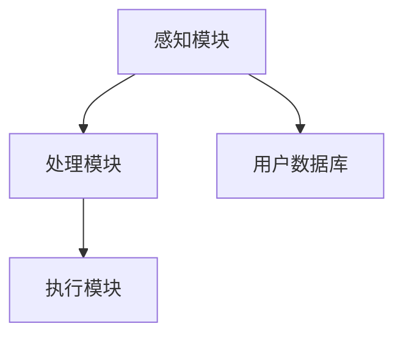
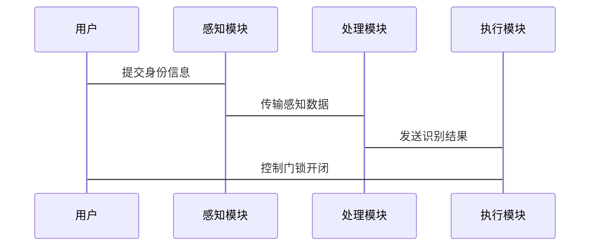
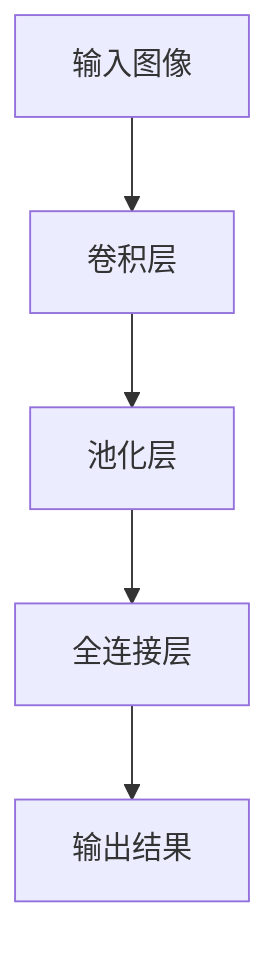
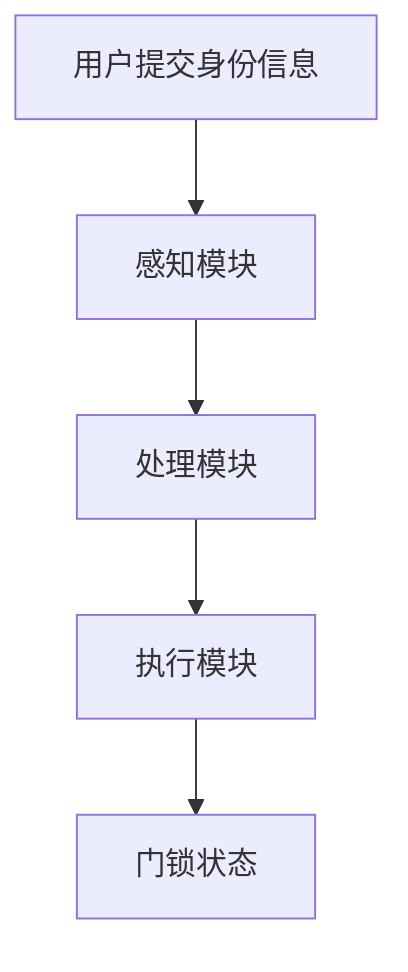

                 


# AI Agent在智能门把手中的访客识别

> 关键词：AI Agent, 智能门锁, 访客识别, 人脸识别, 深度学习

> 摘要：本文将详细介绍AI Agent在智能门把手中的访客识别技术，从背景介绍到系统架构设计，再到项目实战，全面解析这一技术的核心原理和实现方法。通过分析AI Agent的工作流程，结合实际案例，展示如何利用先进算法实现智能门锁的高效访客识别。

---

# 第一部分: AI Agent在智能门把手中的访客识别概述

## 第1章: AI Agent与智能门锁的背景介绍

### 1.1 AI Agent的基本概念
#### 1.1.1 AI Agent的定义
AI Agent（人工智能代理）是一种能够感知环境、做出决策并执行操作的智能实体。它能够通过传感器获取信息，利用算法处理数据，并通过执行器与环境交互。

#### 1.1.2 AI Agent的核心特征
| 特性 | 描述 |
|------|------|
| 感知能力 | 能够通过传感器获取环境信息（如图像、声音、温度等）。 |
| 决策能力 | 能够根据感知信息做出合理决策。 |
| 执行能力 | 能够通过执行器（如电机、电磁阀）完成特定任务。 |
| 学习能力 | 能够通过机器学习算法不断优化自身的识别和决策能力。 |

#### 1.1.3 AI Agent与传统门锁的区别
- **传统门锁**：依赖物理钥匙或密码，安全性低，功能单一。
- **AI Agent智能门锁**：通过AI技术实现智能化识别和控制，支持多种识别方式（如人脸识别、指纹识别、语音识别），安全性高，功能多样化。

### 1.2 智能门锁的发展历程
#### 1.2.1 传统门锁的功能与局限
传统门锁主要依赖机械结构，钥匙丢失或被盗容易导致安全隐患，且功能单一，无法与现代智能家居系统兼容。

#### 1.2.2 智能门锁的出现与演变
随着物联网技术的发展，智能门锁应运而生。它通过与智能家居系统的结合，实现了远程控制、访客识别等功能。

#### 1.2.3 当前智能门锁的市场现状
当前市场上的智能门锁种类繁多，主要分为基于指纹识别、人脸识别、语音识别等多种方式的智能门锁。这些门锁不仅支持本地开门，还可以通过手机APP远程控制。

### 1.3 访客识别的必要性
#### 1.3.1 访客识别的核心需求
访客识别的主要目的是通过身份验证确保只有授权人员才能进入，从而提高安全性。这在智能家居、办公楼、酒店等领域尤为重要。

#### 1.3.2 智能门锁中的访客识别场景
访客识别可以应用于以下场景：
- **家庭访客**：家人或朋友来访时，无需携带钥匙，通过人脸识别即可开门。
- **商务访客**：企业客户来访时，通过人脸识别或指纹识别开门，提升访客体验。
- **紧急情况**：在紧急情况下，访客识别系统可以快速响应，确保紧急人员能够及时进入。

#### 1.3.3 访客识别的边界与外延
访客识别的边界包括：
- **授权范围**：仅限于授权的访客。
- **时间范围**：仅在特定时间段内有效。
- **访问权限**：根据访客的身份和权限，决定其可以访问的区域。

---

## 第2章: AI Agent在智能门锁中的核心概念

### 2.1 AI Agent的感知层
#### 2.1.1 感知层的功能与作用
感知层是AI Agent的“眼睛和耳朵”，负责采集环境中的各种信息。在智能门锁中，感知层通常包括摄像头、指纹传感器和麦克风等设备。

#### 2.1.2 常见的感知方式
- **人脸识别**：通过摄像头采集人脸图像，利用深度学习算法进行识别。
- **指纹识别**：通过指纹传感器采集指纹信息，利用特征提取算法进行识别。
- **语音识别**：通过麦克风采集语音信息，利用语音识别算法进行识别。

#### 2.1.3 感知层的实现原理
- **图像采集**：使用摄像头获取高清图像。
- **数据处理**：将图像数据传输到处理器进行特征提取。
- **特征匹配**：将提取的特征与数据库中的特征进行匹配，判断是否为授权访客。

### 2.2 AI Agent的决策层
#### 2.2.1 决策层的逻辑与算法
决策层是AI Agent的“大脑”，负责根据感知层获取的信息做出决策。在智能门锁中，决策层通常采用基于深度学习的算法，如卷积神经网络（CNN）进行图像识别。

#### 2.2.2 决策层的核心要素
- **特征提取**：通过CNN等算法提取图像中的关键特征。
- **模式匹配**：将提取的特征与数据库中的特征进行匹配，判断是否为授权访客。
- **优化策略**：根据匹配结果动态调整识别阈值，提高识别准确率。

#### 2.2.3 决策层的优化策略
- **模型优化**：通过数据增强、迁移学习等技术优化深度学习模型。
- **动态调整**：根据识别结果动态调整阈值，减少误识别率。

### 2.3 AI Agent的执行层
#### 2.3.1 执行层的功能与作用
执行层是AI Agent的“四肢”，负责根据决策层的指令执行具体操作。在智能门锁中，执行层主要负责控制电磁锁的开闭。

#### 2.3.2 执行层的实现方式
- **机械臂**：用于物理钥匙的插入和拔出。
- **电磁锁**：通过电磁铁的通断电控制门锁的开闭。

#### 2.3.3 执行层的控制机制
- **本地控制**：通过门锁上的按钮直接控制门锁的开闭。
- **远程控制**：通过手机APP或智能家居系统远程控制门锁的开闭。

---

## 第3章: AI Agent与智能门锁的系统架构

### 3.1 系统整体架构
#### 3.1.1 系统模块划分
AI Agent智能门锁系统通常包括以下模块：
- **感知模块**：负责采集环境信息。
- **处理模块**：负责对采集的信息进行处理和分析。
- **执行模块**：负责根据处理结果执行相应的操作。

#### 3.1.2 各模块之间的关系
感知模块通过传感器采集信息，传输到处理模块进行特征提取和识别，最后由执行模块根据识别结果控制门锁的开闭。

#### 3.1.3 系统的可扩展性与灵活性
系统采用模块化设计，各个模块之间通过标准接口进行通信，便于后续的功能扩展和升级。

### 3.2 系统功能设计
#### 3.2.1 系统功能模块划分
- **用户管理模块**：负责管理用户的身份信息。
- **识别模块**：负责对访客的身份进行识别。
- **控制模块**：负责根据识别结果控制门锁的开闭。

#### 3.2.2 系统功能实现流程
1. **用户注册**：用户通过系统注册，录入身份信息。
2. **访客识别**：访客通过人脸识别、指纹识别或语音识别等方式进行身份验证。
3. **门锁控制**：根据识别结果，控制门锁的开闭。

### 3.3 系统架构设计
#### 3.3.1 系统架构图


#### 3.3.2 系统接口设计
- **用户数据库接口**：用于存储和查询用户身份信息。
- **识别模块接口**：用于与感知模块进行通信，接收感知数据并进行识别。
- **控制模块接口**：用于与执行模块进行通信，接收识别结果并控制门锁的开闭。

### 3.4 系统交互流程
#### 3.4.1 系统交互流程图


#### 3.4.2 交互流程详细说明
1. **用户提交身份信息**：用户通过摄像头、指纹传感器或麦克风提交身份信息。
2. **感知模块传输数据**：感知模块将采集到的数据传输到处理模块。
3. **处理模块进行识别**：处理模块对感知数据进行特征提取和识别，判断是否为授权访客。
4. **执行模块控制门锁**：根据识别结果，执行模块控制门锁的开闭。

---

## 第4章: AI Agent在智能门锁中的算法实现

### 4.1 基于深度学习的人脸识别算法
#### 4.1.1 算法概述
基于深度学习的人脸识别算法通常采用卷积神经网络（CNN）进行图像特征提取和分类。

#### 4.1.2 算法流程图


#### 4.1.3 算法实现代码
```python
import tensorflow as tf
from tensorflow.keras import layers

# 构建CNN模型
model = tf.keras.Sequential([
    layers.Conv2D(32, (3,3), activation='relu', input_shape=(64, 64, 3)),
    layers.MaxPooling2D((2,2)),
    layers.Conv2D(64, (3,3), activation='relu'),
    layers.MaxPooling2D((2,2)),
    layers.Flatten(),
    layers.Dense(128, activation='relu'),
    layers.Dense(1, activation='sigmoid')
])

# 编译模型
model.compile(optimizer='adam', loss='binary_crossentropy', metrics=['accuracy'])
```

#### 4.1.4 算法优化
- **数据增强**：通过旋转、缩放、添加噪声等方式增加训练数据的多样性。
- **迁移学习**：利用预训练的深度学习模型进行迁移学习，提高识别准确率。

### 4.2 算法的数学模型
#### 4.2.1 深度学习模型的数学表示
深度学习模型通常采用多层神经网络进行特征提取和分类。模型的损失函数可以表示为：
$$ L = -\frac{1}{N} \sum_{i=1}^{N} y_i \log(p_i) + (1 - y_i) \log(1 - p_i) $$
其中，$y_i$ 是真实标签，$p_i$ 是模型预测的概率。

#### 4.2.2 优化器的实现
常用的优化器包括Adam优化器，其更新规则为：
$$ \theta_{t+1} = \theta_t - \eta \frac{\partial L}{\partial \theta_t} $$
其中，$\eta$ 是学习率，$\frac{\partial L}{\partial \theta_t}$ 是损失函数对参数的梯度。

---

## 第5章: AI Agent智能门锁的系统实现

### 5.1 系统设计
#### 5.1.1 系统功能模块
- **用户管理模块**：负责管理用户的注册和身份信息。
- **识别模块**：负责对访客的身份进行识别。
- **控制模块**：负责根据识别结果控制门锁的开闭。

#### 5.1.2 系统实现流程
1. **用户注册**：用户通过摄像头、指纹传感器或麦克风录入身份信息。
2. **访客识别**：访客通过人脸识别、指纹识别或语音识别等方式进行身份验证。
3. **门锁控制**：根据识别结果，控制门锁的开闭。

### 5.2 系统实现代码
#### 5.2.1 环境安装
```bash
pip install tensorflow==2.4.0 keras==2.4.0 numpy==1.21.0 matplotlib==3.4.2
```

#### 5.2.2 系统实现代码
```python
import tensorflow as tf
from tensorflow.keras import layers
import cv2
import numpy as np

# 构建CNN模型
model = tf.keras.Sequential([
    layers.Conv2D(32, (3,3), activation='relu', input_shape=(64, 64, 3)),
    layers.MaxPooling2D((2,2)),
    layers.Conv2D(64, (3,3), activation='relu'),
    layers.MaxPooling2D((2,2)),
    layers.Flatten(),
    layers.Dense(128, activation='relu'),
    layers.Dense(1, activation='sigmoid')
])

# 编译模型
model.compile(optimizer='adam', loss='binary_crossentropy', metrics=['accuracy'])

# 训练模型
model.fit(x_train, y_train, epochs=10, batch_size=32)

# 识别人脸
def recognize_face(image):
    image = cv2.resize(image, (64, 64))
    image = np.array([image])
    prediction = model.predict(image)
    return prediction[0][0] > 0.5
```

#### 5.2.3 系统实现代码解读
- **模型构建**：使用Keras构建一个卷积神经网络模型，用于人脸识别。
- **模型训练**：使用训练数据训练模型，提高识别准确率。
- **人脸识别**：将输入图像 resize 为 64x64，并通过模型进行预测，判断是否为授权访客。

### 5.3 系统实现流程图


---

## 第6章: AI Agent智能门锁的项目实战

### 6.1 项目背景
本项目旨在通过AI Agent技术实现智能门锁的访客识别功能，提高门锁的安全性和智能化水平。

### 6.2 项目实现
#### 6.2.1 环境安装
```bash
pip install tensorflow==2.4.0 keras==2.4.0 numpy==1.21.0 matplotlib==3.4.2
```

#### 6.2.2 系统核心实现代码
```python
import tensorflow as tf
from tensorflow.keras import layers
import cv2
import numpy as np

# 构建CNN模型
model = tf.keras.Sequential([
    layers.Conv2D(32, (3,3), activation='relu', input_shape=(64, 64, 3)),
    layers.MaxPooling2D((2,2)),
    layers.Conv2D(64, (3,3), activation='relu'),
    layers.MaxPooling2D((2,2)),
    layers.Flatten(),
    layers.Dense(128, activation='relu'),
    layers.Dense(1, activation='sigmoid')
])

# 编译模型
model.compile(optimizer='adam', loss='binary_crossentropy', metrics=['accuracy'])

# 训练模型
model.fit(x_train, y_train, epochs=10, batch_size=32)

# 识别人脸
def recognize_face(image):
    image = cv2.resize(image, (64, 64))
    image = np.array([image])
    prediction = model.predict(image)
    return prediction[0][0] > 0.5
```

#### 6.2.3 系统实现代码解读
- **模型构建**：使用Keras构建一个卷积神经网络模型，用于人脸识别。
- **模型训练**：使用训练数据训练模型，提高识别准确率。
- **人脸识别**：将输入图像 resize 为 64x64，并通过模型进行预测，判断是否为授权访客。

### 6.3 项目小结
通过本项目的实现，我们成功地将AI Agent技术应用到智能门锁的访客识别中，提高了门锁的安全性和智能化水平。

---

## 第7章: AI Agent智能门锁的最佳实践

### 7.1 小结
AI Agent技术在智能门锁中的应用前景广阔，通过不断优化算法和系统设计，可以进一步提高识别准确率和系统的稳定性。

### 7.2 注意事项
- **数据安全**：确保用户数据的安全存储和传输。
- **系统稳定性**：确保系统的高可用性和稳定性，避免因系统故障导致门锁无法正常工作。
- **用户体验**：优化用户体验，确保访客识别过程快速、准确。

### 7.3 拓展阅读
- **深度学习**：进一步学习深度学习技术，了解更多的模型和算法。
- **智能门锁**：了解更多的智能门锁设计方案和技术实现。

---

# 总结
通过本文的详细介绍，我们深入探讨了AI Agent在智能门把手中的访客识别技术，从背景介绍到系统架构设计，再到项目实战，全面解析了这一技术的核心原理和实现方法。希望本文能够为读者提供有价值的技术参考，帮助他们在实际应用中更好地利用AI Agent技术提升智能门锁的性能和安全性。

