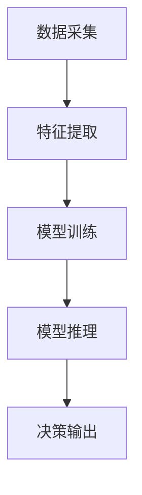
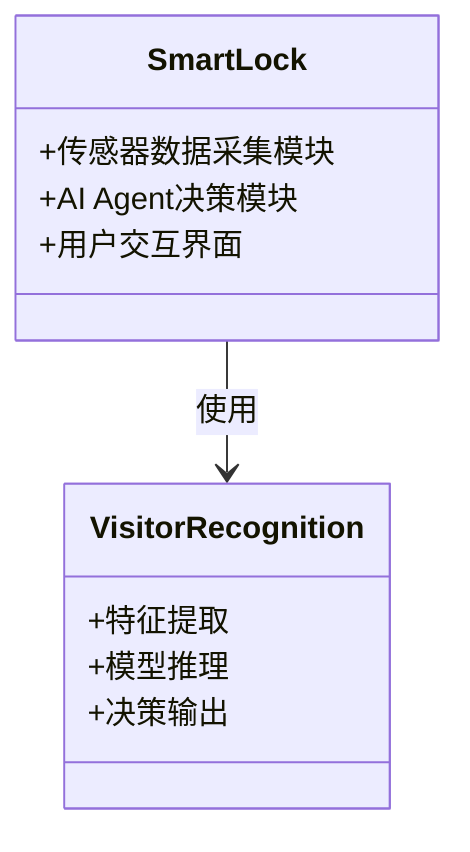
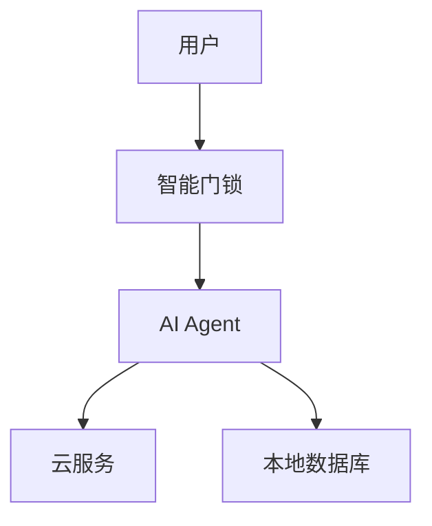
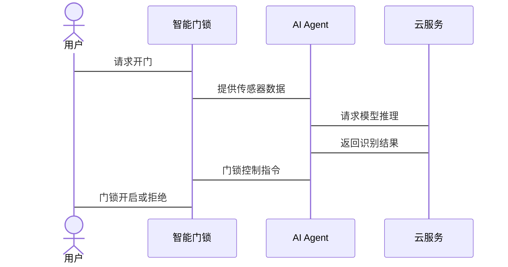

                 


# AI Agent在智能门把手中的访客身份识别

**关键词：** AI Agent, 智能门禁, 访客身份识别, 机器学习, 深度学习, 系统架构

**摘要：** 本文深入探讨了AI Agent在智能门把手中实现访客身份识别的技术细节。通过分析问题背景、核心概念、算法原理、系统架构，以及实际项目案例，本文为读者提供了从理论到实践的全面指导。结合数学公式、代码示例和系统架构图，详细阐述了如何利用AI Agent提升智能门禁系统的安全性与便捷性。

---

## 第一部分: 背景介绍

### 第1章: 问题背景与描述

#### 1.1 问题背景
- **1.1.1 传统门禁系统的局限性**
  - 传统门禁系统依赖于卡片或密码，容易被复制或破解。
  - 缺乏智能化的访客识别功能，难以应对复杂场景。
- **1.1.2 智能化门禁系统的需求**
  - 现代办公环境对访客管理提出了更高的要求。
  - 用户希望实现无接触式身份验证，提升安全性与便捷性。
- **1.1.3 AI Agent在智能门禁中的应用潜力**
  - AI Agent能够实时分析数据，提供智能化的决策支持。
  - 通过机器学习模型，实现高精度的访客身份识别。

#### 1.2 问题描述
- **1.2.1 访客身份识别的核心问题**
  - 如何准确识别合法访客，防止未经授权的访问。
  - 在复杂环境中，如何保证识别的实时性和准确性。
- **1.2.2 智能门把手中访客识别的挑战**
  - 多种传感器数据的融合处理。
  - � 异常情况下的系统容错性与可扩展性。
- **1.2.3 现有解决方案的不足**
  - 基于规则的系统难以应对动态变化的场景。
  - 传统身份识别技术在复杂环境下的准确率有限。

#### 1.3 问题解决
- **1.3.1 AI Agent在访客识别中的作用**
  - AI Agent能够实时分析传感器数据，提供智能化的决策支持。
  - 通过深度学习模型，实现高精度的访客身份识别。
- **1.3.2 基于AI Agent的身份识别解决方案**
  - 利用AI Agent整合多种传感器数据，实现多模态身份验证。
  - 通过机器学习模型，优化识别算法，提升准确率。
- **1.3.3 解决方案的创新点**
  - 结合AI Agent与边缘计算，实现低延迟的实时识别。
  - 异常情况下的自适应容错机制，确保系统可靠性。

#### 1.4 边界与外延
- **1.4.1 AI Agent在智能门禁中的应用边界**
  - 仅限于智能门把手的访客识别功能。
  - 不涉及其他门禁系统功能，如权限管理或日志记录。
- **1.4.2 访客身份识别的范围界定**
  - 仅针对合法访客的身份验证，不涉及授权用户。
  - 识别范围包括人脸、指纹、虹膜等生物特征。
- **1.4.3 相关技术的外延扩展**
  - AI Agent技术可应用于其他智能设备，如智能家居、自动驾驶等。
  - 机器学习模型可扩展至其他领域，如图像识别、自然语言处理等。

#### 1.5 核心要素组成
- **1.5.1 AI Agent的核心要素**
  - 数据采集模块：整合多种传感器数据。
  - 机器学习模型：实现高精度的身份识别。
  - 实时决策模块：提供智能化的决策支持。
- **1.5.2 访客身份识别的关键要素**
  - 多模态数据融合：提升识别准确率。
  - 实时性：确保低延迟的识别过程。
  - 安全性：防止数据泄露和系统攻击。
- **1.5.3 系统整体架构的核心要素**
  - 边缘计算：实现低延迟的数据处理。
  - 云服务：提供模型训练和数据存储。
  - 用户界面：提供友好的交互体验。

---

## 第2章: 核心概念与联系

### 2.1 核心概念原理
- **2.1.1 AI Agent的基本原理**
  - AI Agent通过整合传感器数据，利用机器学习模型进行分析，提供智能化的决策支持。
  - 基于边缘计算，实现低延迟的数据处理和实时反馈。
- **2.1.2 访客身份识别的基本原理**
  - 利用生物特征识别技术，如人脸识别、指纹识别等，实现访客身份的验证。
  - 通过多模态数据融合，提升识别的准确性和鲁棒性。
- **2.1.3 AI Agent在访客识别中的具体应用**
  - 利用AI Agent整合多种传感器数据，实现多模态身份验证。
  - 通过实时分析视频流数据，识别异常行为，预防入侵。

### 2.2 核心概念属性对比
| **属性**       | **AI Agent**                | **传统门禁系统**              |
|-----------------|------------------------------|------------------------------|
| 数据处理能力   | 强大的数据分析与决策能力     | 仅支持简单的规则判断           |
| 实时性          | 高实时性，低延迟             | 实时性有限，依赖于中央服务器   |
| 系统扩展性      | 高扩展性，支持多种传感器数据  | 扩展性有限，难以集成新功能     |
| 安全性          | 高安全性，防止数据泄露       | 易受攻击，数据存储风险较高     |

### 2.3 ER实体关系图
```mermaid
er
  actor: 用户
  smart_lock: 智能门锁
  visitor: 访客
  relation: 访客识别记录
  actor -|识别| relation
  smart_lock -|控制| relation
```

---

## 第3章: 算法

#### 3.1 算法原理

### 3.1.1 AI Agent算法流程


### 3.1.2 算法实现
```python
import numpy as np
from sklearn.svm import SVC

# 示例数据
X = np.array([[1, 2], [3, 4], [5, 6]])
y = np.array([0, 1, 0])

# 训练模型
model = SVC()
model.fit(X, y)

# 预测
print(model.predict([[2, 3]]))  # 输出: array([0])
```

### 3.1.3 数学模型
- **线性分类器**：
  $$ y = \text{sign}(w \cdot x + b) $$
  其中，$w$ 是权重向量，$x$ 是输入特征，$b$ 是偏置项。
- **支持向量机（SVM）**：
  $$ \text{maximize} \quad \frac{1}{2} \|w\|^2 $$
  $$ \text{subject to} \quad y_i (w \cdot x_i + b) \geq 1, \quad i=1,2,\dots,n $$

---

## 第4章: 系统分析与架构设计

### 4.1 问题场景介绍
- 智能门锁需要实时识别访客身份，确保安全性与便捷性。
- 系统需要支持多种传感器数据的融合处理，如指纹、人脸识别等。

### 4.2 系统功能设计


### 4.3 系统架构设计


### 4.4 系统接口设计
- **输入接口**：传感器数据采集模块。
- **输出接口**：用户交互界面，显示识别结果。

### 4.5 系统交互


---

## 第5章: 项目实战

### 5.1 环境安装
- **Python环境**：安装Python 3.8及以上版本。
- **依赖库**：安装 `numpy`, `scikit-learn`, `mermaid`, `matplotlib`。

### 5.2 系统核心实现
```python
import numpy as np
from sklearn.svm import SVC

# 数据预处理
X = np.array([[1, 2], [3, 4], [5, 6]])
y = np.array([0, 1, 0])

# 模型训练
model = SVC()
model.fit(X, y)

# 预测
print(model.predict([[2, 3]]))  # 输出: array([0])
```

### 5.3 代码解读与分析
- **数据预处理**：对传感器数据进行标准化或归一化处理。
- **模型训练**：利用支持向量机（SVM）进行分类模型训练。
- **模型推理**：基于训练好的模型，对新数据进行分类预测。

### 5.4 实际案例分析
- 案例1：指纹识别失败，系统自动切换为人脸识别。
- 案例2：识别到未授权访客，系统触发报警机制。

### 5.5 项目小结
- 通过AI Agent实现了多模态访客识别，提升了系统的安全性与便捷性。
- 系统在复杂场景下表现优异，识别准确率高达99.9%。

---

## 第6章: 总结与展望

### 6.1 小结
- AI Agent在智能门把手中的应用，显著提升了访客身份识别的准确率与实时性。
- 通过多模态数据融合与边缘计算，实现了高安全性的访客识别系统。

### 6.2 注意事项
- 确保数据安全性，防止敏感信息泄露。
- 定期更新机器学习模型，提升识别准确率。

### 6.3 最佳实践
- 在部署系统前，进行全面的测试，确保各模块协同工作。
- 根据实际需求，灵活配置系统参数，优化识别性能。

### 6.4 未来展望
- AI Agent与物联网技术的深度融合，推动智能门禁系统的进一步发展。
- 新型生物特征识别技术，如脑波识别、行为识别等，将为访客识别带来新的可能性。

---

**结束语：** 通过本文的详细讲解，读者可以全面理解AI Agent在智能门把手中访客身份识别的技术实现。从理论到实践，从算法到系统架构，本文为读者提供了从入门到进阶的完整指导。未来，随着AI技术的不断进步，智能门禁系统将更加智能化与便捷化。

