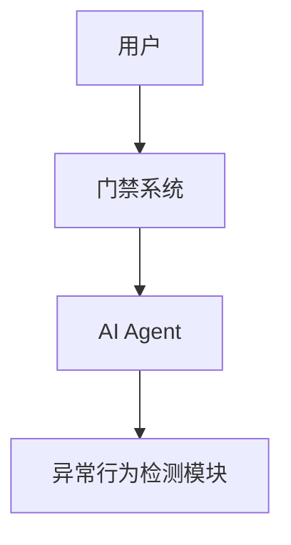
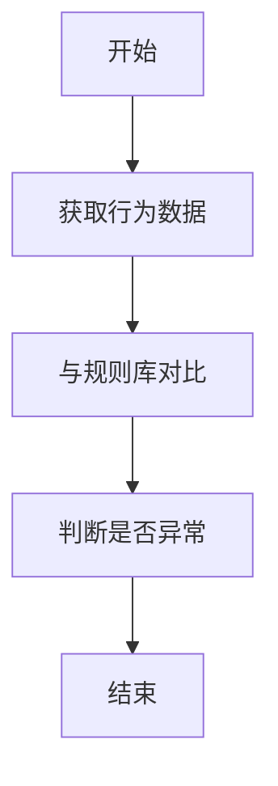
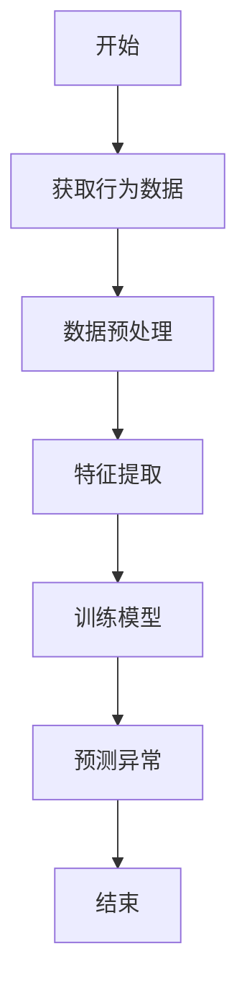
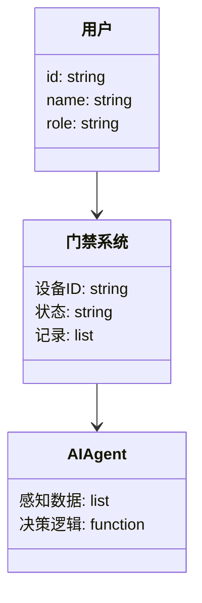
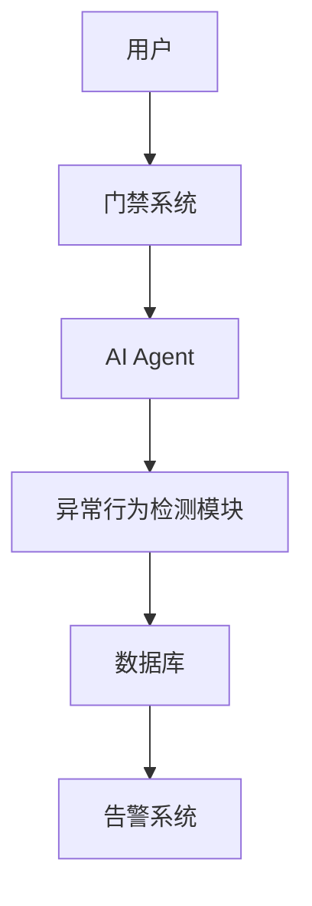

                 


# AI Agent在智能门禁中的异常行为检测

> 关键词：AI Agent, 智能门禁, 异常行为检测, 机器学习, 门禁系统, 异常检测, 系统架构

> 摘要：本文深入探讨AI Agent在智能门禁系统中的应用，特别是在异常行为检测方面的创新与实践。通过系统化的分析和设计，结合具体案例，阐述如何利用AI技术提升门禁系统的安全性和智能化水平。

---

# 第一部分: AI Agent与智能门禁系统概述

## 第1章: 异常行为检测的背景与问题描述

### 1.1 AI Agent的基本概念

#### 1.1.1 AI Agent的定义与特点

AI Agent（人工智能代理）是指能够感知环境并采取行动以实现目标的智能体。其特点包括自主性、反应性、目标导向和学习能力。

#### 1.1.2 智能门禁系统的工作原理

智能门禁系统通过传感器、摄像头和生物识别技术采集数据，利用AI Agent进行分析和决策，实现对出入口的智能化管理。

### 1.2 异常行为检测的背景与问题背景

#### 1.2.1 传统门禁系统的局限性

传统门禁系统依赖固定的规则，难以应对复杂多变的异常情况，缺乏灵活性和自适应能力。

#### 1.2.2 异常行为检测的必要性

随着安全威胁的增加，传统的基于规则的检测方法已不足以应对复杂的异常行为，引入AI Agent进行实时分析成为必要。

#### 1.2.3 智能门禁中的异常行为类型

常见的异常行为包括尾随、非法闯入、物品遗留等。

### 1.3 问题描述与目标设定

#### 1.3.1 异常行为检测的核心目标

实现对异常行为的实时检测、预警和响应，提升门禁系统的安全性。

#### 1.3.2 问题解决的边界与外延

明确异常行为检测的范围和边界，确保在特定场景下有效工作。

#### 1.3.3 核心概念的结构与组成

分析AI Agent与智能门禁系统的交互结构，明确各组成部分的功能。

---

# 第二部分: AI Agent与智能门禁的核心概念

## 第2章: AI Agent与智能门禁的关系

### 2.1 AI Agent在智能门禁中的角色

#### 2.1.1 AI Agent的感知与决策能力

AI Agent通过多模态传感器感知环境，并基于感知数据进行决策。

#### 2.1.2 AI Agent与门禁系统的交互机制

描述AI Agent与门禁系统之间的数据流和控制逻辑。

### 2.2 实体关系与系统架构

#### 2.2.1 ER实体关系图



### 2.3 核心概念对比分析

#### 2.3.1 AI Agent与传统门禁系统的对比

| 特性 | AI Agent | 传统门禁系统 |
|------|----------|--------------|
| 检测能力 | 强大的异常检测 | 基于规则的检测 | 
| 决策能力 | 自主决策 | 依赖人工干预 | 
| 学习能力 | 可动态优化 | 静态规则 | 

---

# 第三部分: 异常行为检测的算法原理

## 第3章: 异常行为检测的算法原理

### 3.1 基于规则的异常检测

#### 3.1.1 算法流程图



### 3.2 基于机器学习的异常检测

#### 3.2.1 算法流程图



---

# 第四部分: 系统分析与架构设计

## 第4章: 系统分析与架构设计

### 4.1 问题场景介绍

描述智能门禁系统中的异常行为检测场景，如出入口监控、人员行为分析等。

### 4.2 系统功能设计

#### 4.2.1 领域模型



### 4.3 系统架构设计

#### 4.3.1 系统架构图



---

# 第五部分: 项目实战

## 第5章: 项目实战

### 5.1 环境安装

安装必要的库和工具，如Python、TensorFlow、OpenCV等。

### 5.2 核心代码实现

#### 5.2.1 异常检测模块的实现

```python
import tensorflow as tf
from tensorflow.keras import layers

model = tf.keras.Sequential([
    layers.Conv2D(32, (3,3), activation='relu', input_shape=(64,64,3)),
    layers.MaxPooling2D((2,2)),
    layers.Flatten(),
    layers.Dense(64, activation='relu'),
    layers.Dense(2, activation='softmax')
])

model.compile(optimizer='adam', loss='sparse_categorical_crossentropy', metrics=['accuracy'])
model.fit(x_train, y_train, epochs=10)
```

### 5.3 案例分析与总结

通过实际案例分析，验证算法的有效性，并总结经验。

---

# 第六部分: 最佳实践与总结

## 第6章: 最佳实践与总结

### 6.1 小结

总结全文内容，强调AI Agent在智能门禁中的重要性。

### 6.2 注意事项

在实际应用中需要注意数据隐私、模型鲁棒性等问题。

### 6.3 拓展阅读

推荐相关领域的书籍和论文，供读者深入学习。

---

通过以上目录大纲，我们可以系统地学习和实践AI Agent在智能门禁中的异常行为检测，从理论到实际应用，全面掌握相关技术和方法。

