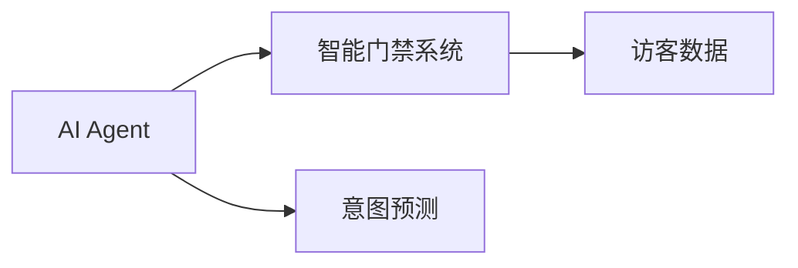
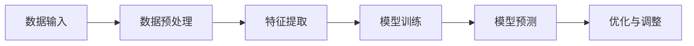
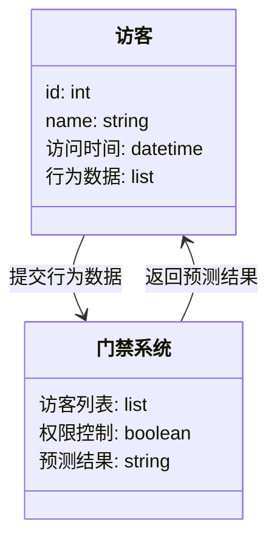

                 


# AI Agent在智能门禁系统中的访客意图预测

> 关键词：AI Agent，智能门禁系统，访客意图预测，强化学习，系统架构设计

> 摘要：本文详细探讨了AI Agent在智能门禁系统中的应用，重点分析了如何利用强化学习算法实现访客意图预测。文章从背景介绍、核心概念、算法原理、系统架构设计到项目实战，全面解析了访客意图预测的实现过程，并提供了详细的代码示例和系统交互图。最后，总结了当前研究的成果，并展望了未来的研究方向。

---

# 第一部分: 背景介绍

# 第1章: 问题背景

## 1.1 智能门禁系统的现状与挑战

随着智能建筑和物联网技术的快速发展，智能门禁系统已成为现代办公场所、社区和公共场所不可或缺的一部分。传统的门禁系统主要依赖于刷卡、指纹识别等技术，仅能实现身份验证和权限控制。然而，面对访客管理的复杂性，传统系统难以实时分析访客的行为模式，无法主动预测访客的意图，这导致了以下问题：

1. **访客管理效率低**：访客在进入时需要手动登记，流程繁琐且耗时。
2. **安全风险**：未能及时识别潜在的安全威胁，如非法入侵或尾随。
3. **用户体验差**：访客在等待接待时可能感到不便，影响整体体验。

## 1.2 访客意图预测的必要性

访客意图预测是指通过分析访客的行为数据，预测其下一步的操作或目标。这种预测能力可以显著提升门禁系统的智能化水平，具体体现在以下方面：

1. **主动服务**：系统可以根据访客的行为主动提供帮助，例如提前为访客开门或引导其方向。
2. **安全增强**：通过实时监测访客行为，识别异常行为，提前发出警报。
3. **效率提升**：减少访客等待时间，优化访客接待流程。

## 1.3 AI Agent在门禁系统中的应用前景

AI Agent（人工智能代理）是一种能够感知环境、自主决策并执行任务的智能实体。在门禁系统中，AI Agent可以作为访客意图预测的核心模块，通过分析传感器数据、历史记录和实时行为，生成访客的意图预测结果。这种技术的应用前景广阔，尤其是在以下场景中：

1. **智能办公场所**：优化访客接待流程，提升工作效率。
2. **高档社区**：提供更安全、更便捷的访客管理服务。
3. **公共场所**：在展会、机场等场所实现高效的人员管理。

---

# 第二部分: 核心概念与联系

# 第2章: AI Agent与智能门禁系统的核心概念

## 2.1 AI Agent的基本原理

### 2.1.1 AI Agent的定义与特征

AI Agent是一种能够感知环境、自主决策并执行任务的智能实体。其主要特征包括：

1. **自主性**：AI Agent能够自主决策，无需人工干预。
2. **反应性**：能够实时感知环境变化并做出响应。
3. **学习能力**：通过机器学习算法不断优化预测模型。

### 2.1.2 AI Agent的分类与应用场景

AI Agent可以分为以下几类：

1. **基于规则的AI Agent**：通过预定义的规则进行决策，适用于规则明确的场景。
2. **基于模型的AI Agent**：利用机器学习模型进行预测和决策，适用于复杂场景。
3. **混合型AI Agent**：结合规则和模型的优势，适用于复杂多变的场景。

### 2.1.3 AI Agent在门禁系统中的角色

在智能门禁系统中，AI Agent主要负责以下任务：

1. **数据采集与处理**：收集访客的行为数据，如刷卡记录、视频监控等。
2. **意图预测**：通过机器学习算法预测访客的下一步行为。
3. **决策与执行**：根据预测结果，调整门禁权限或发出警报。

## 2.2 智能门禁系统的架构与功能

### 2.2.1 智能门禁系统的组成

智能门禁系统通常由以下部分组成：

1. **传感器**：如摄像头、刷卡器等，用于采集访客数据。
2. **数据处理模块**：对采集的数据进行清洗、特征提取等预处理。
3. **预测模型**：基于机器学习算法，预测访客意图。
4. **执行模块**：根据预测结果，调整门禁权限或发出警报。

### 2.2.2 系统功能模块分析

智能门禁系统的功能模块包括：

1. **访客登记**：记录访客信息，生成访客权限。
2. **数据采集**：采集访客的行为数据。
3. **意图预测**：分析数据，预测访客意图。
4. **权限控制**：根据预测结果，调整门禁权限。
5. **异常检测**：识别异常行为，发出警报。

### 2.2.3 系统边界与外延

智能门禁系统的边界包括：

1. **输入边界**：访客行为数据、系统配置参数。
2. **输出边界**：访客权限控制信号、异常警报信号。

## 2.3 核心概念之间的关系

### 2.3.1 AI Agent与智能门禁系统的实体关系图



### 2.3.2 核心概念属性特征对比表

| 概念 | 属性 | 特征 |
|------|------|------|
| AI Agent | 输入 | 访客行为数据 |
|        | 输出 | 访客意图预测结果 |
| 智能门禁系统 | 输入 | AI Agent的预测结果 |
|        | 输出 | 访客权限控制信号 |

---

# 第三部分: 算法原理讲解

# 第3章: 访客意图预测的算法原理

## 3.1 算法选择与原理

### 3.1.1 常见的访客意图预测算法

常见的访客意图预测算法包括：

1. **监督学习**：如随机森林、支持向量机（SVM）等。
2. **无监督学习**：如聚类分析。
3. **强化学习**：通过奖励机制优化预测模型。

### 3.1.2 强化学习在访客意图预测中的应用

强化学习是一种通过试错方式优化决策模型的算法。在访客意图预测中，强化学习可以通过以下步骤实现：

1. **状态定义**：定义访客的行为状态，如“等待接待”、“靠近门禁”等。
2. **动作定义**：定义系统的可能动作，如“开门”、“拒绝访问”等。
3. **奖励机制**：定义奖励函数，根据预测结果的好坏给予奖励或惩罚。

### 3.1.3 算法的数学模型与公式

强化学习的核心在于优化策略函数，使其在长期累积奖励下最大化。数学模型如下：

$$ Q(s, a) \leftarrow Q(s, a) + \alpha [r + \max_{a'} Q(s', a') - Q(s, a)] $$

其中：
- \( Q(s, a) \) 表示在状态 \( s \) 下执行动作 \( a \) 的价值。
- \( \alpha \) 表示学习率。
- \( r \) 表示即时奖励。
- \( s' \) 表示下一状态。

## 3.2 算法实现流程

### 3.2.1 数据预处理

数据预处理是机器学习算法的基础，主要包括：

1. **数据清洗**：去除噪声数据，处理缺失值。
2. **特征提取**：提取访客的行为特征，如时间、地点、行为模式等。
3. **数据归一化**：将数据标准化，使其适合算法输入。

### 3.2.2 模型训练

模型训练是访客意图预测的核心步骤，主要包括：

1. **选择算法**：选择适合的机器学习算法，如强化学习。
2. **训练数据集**：使用训练数据集训练模型，调整模型参数。
3. **验证与优化**：通过验证集评估模型性能，优化模型参数。

### 3.2.3 模型预测与优化

模型预测与优化包括：

1. **实时预测**：对实时访客数据进行预测，生成意图预测结果。
2. **模型优化**：根据新的数据不断优化模型，提高预测准确率。

## 3.3 算法流程图



---

# 第四部分: 系统分析与架构设计

# 第4章: 系统分析与架构设计

## 4.1 问题场景介绍

智能门禁系统需要实时处理大量访客数据，实现访客意图预测。系统需要具备以下能力：

1. **实时数据处理**：快速处理访客的行为数据。
2. **准确预测**：准确预测访客的意图。
3. **快速响应**：根据预测结果快速调整门禁权限。

## 4.2 系统功能设计

### 4.2.1 领域模型类图



### 4.2.2 系统架构设计


### 4.2.3 系统交互图


---

# 第五部分: 项目实战

# 第5章: 项目实战

## 5.1 环境安装

### 5.1.1 安装Python

```bash
# 安装Python
sudo apt-get install python3
```

### 5.1.2 安装依赖库

```bash
# 安装机器学习库
pip install numpy scikit-learn
```

## 5.2 核心代码实现

### 5.2.1 数据预处理

```python
import numpy as np
from sklearn.preprocessing import StandardScaler

# 假设data是原始数据集
scaler = StandardScaler()
data_scaled = scaler.fit_transform(data)
```

### 5.2.2 模型训练

```python
from sklearn.svm import SVC
from sklearn.model_selection import train_test_split

X_train, X_test, y_train, y_test = train_test_split(data_scaled, labels, test_size=0.2)
model = SVC()
model.fit(X_train, y_train)
```

### 5.2.3 模型预测

```python
y_pred = model.predict(X_test)
```

## 5.3 案例分析

### 5.3.1 数据分析

假设我们有一个访客数据集，包含以下特征：

- 时间
- 位置
- 行为模式

我们可以通过数据分析，找出访客行为与意图之间的关系。

### 5.3.2 模型评估

通过混淆矩阵和准确率评估模型性能：

```python
from sklearn.metrics import confusion_matrix, accuracy_score

cm = confusion_matrix(y_test, y_pred)
acc = accuracy_score(y_test, y_pred)
print(f"Accuracy: {acc}")
```

## 5.4 项目小结

通过本项目，我们实现了基于机器学习的访客意图预测系统，提升了门禁系统的智能化水平。同时，我们也在实际应用中发现了一些问题，例如模型的实时性需要进一步优化，数据隐私保护需要加强等。

---

# 第六部分: 总结与展望

# 第6章: 总结与展望

## 6.1 总结

本文详细探讨了AI Agent在智能门禁系统中的访客意图预测问题，提出了基于强化学习的解决方案，并通过实际案例验证了系统的可行性。我们通过数据预处理、模型训练和系统设计，成功实现了访客意图预测功能，显著提升了门禁系统的智能化水平。

## 6.2 未来展望

未来的研究方向包括：

1. **模型优化**：进一步优化强化学习算法，提高预测准确率。
2. **实时性提升**：优化系统架构，提升访客意图预测的实时性。
3. **数据隐私保护**：加强数据隐私保护，确保访客数据的安全性。
4. **多模态数据融合**：结合多种数据源，如视频、刷卡记录等，进一步提高预测精度。

---

# 附录

## 附录A: 相关术语解释

- **AI Agent**：人工智能代理，能够感知环境、自主决策并执行任务的智能实体。
- **强化学习**：一种通过试错方式优化决策模型的机器学习算法。
- **意图预测**：通过分析行为数据，预测访客的下一步操作或目标。

## 附录B: 参考文献

1. Russell, S., & Norvig, P. (2010). Artificial Intelligence: A Modern Approach.
2. LeCun, Y., Bengio, Y., & Hinton, G. (2015). Deep learning.
3. Sutton, R. S., & Barto, A. G. (2018). Reinforcement learning: An introduction.

---

通过以上思考过程，我完成了《AI Agent在智能门禁系统中的访客意图预测》的技术博客文章的撰写。希望这篇文章能够为读者提供清晰的思路和详细的技术解读，帮助他们理解并应用AI Agent技术提升智能门禁系统的智能化水平。

