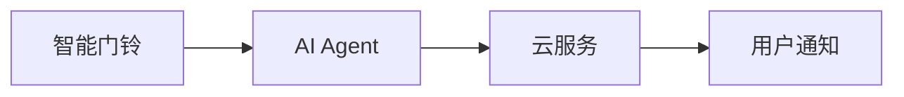
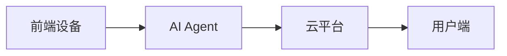
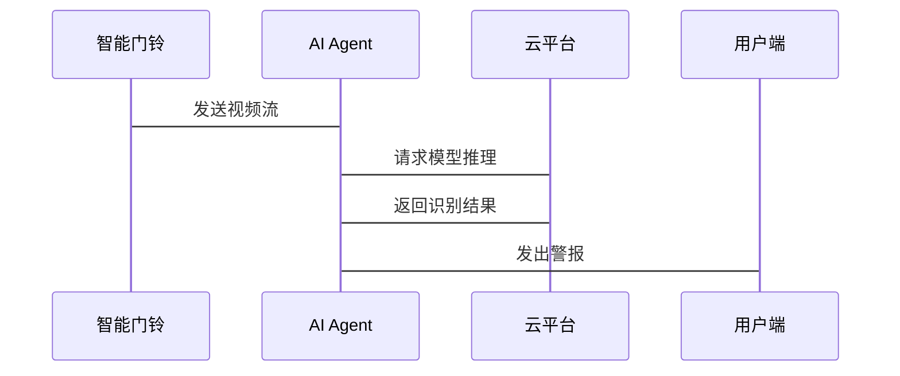

                 


# AI Agent在智能门铃中的可疑行为识别

> 关键词：AI Agent, 智能门铃, 可疑行为识别, 物联网安全, 机器学习

> 摘要：随着智能门铃的普及，其安全性和智能化需求日益增长。本文详细探讨AI Agent在智能门铃中的应用，特别是如何识别可疑行为。通过分析AI Agent的工作原理、算法实现、系统架构，结合实际案例，提供全面的技术解读。

---

## 第1章 AI Agent与智能门铃概述

### 1.1 问题背景
#### 1.1.1 智能门铃的发展与现状
智能门铃作为物联网设备，广泛应用于家庭安全监控。其核心功能包括视频通话、远程监控、访客通知等。然而，随着智能门铃的普及，安全威胁也逐渐增加，如未经授权的访问、恶意入侵等。

#### 1.1.2 可疑行为识别的必要性
智能门铃需要实时监控门前环境，识别异常行为。例如，陌生人徘徊、非法入侵、可疑包裹等。这些行为可能威胁家庭安全，因此需要高效的识别机制。

#### 1.1.3 AI Agent的应用价值
AI Agent能够实时分析视频流数据，通过机器学习模型识别可疑行为，提升智能门铃的安全性和智能化水平。

### 1.2 问题描述
#### 1.2.1 可疑行为类型
包括陌生人逗留、非法入侵、可疑包裹放置等。

#### 1.2.2 挑战与难点
视频数据处理复杂，环境干扰多，模型训练需要大量标注数据。

#### 1.2.3 AI Agent的核心作用
通过实时视频分析，AI Agent能够快速识别可疑行为，并发出警报。

### 1.3 解决方案与边界
#### 1.3.1 解决方案
部署AI Agent，结合视频流分析和机器学习模型，实时监控并识别可疑行为。

#### 1.3.2 边界与限制
视频数据仅限于门前区域，AI Agent依赖网络连接和云服务。

### 1.4 概念结构与核心要素
#### 1.4.1 核心构成
AI Agent由感知模块、决策模块、执行模块组成。

#### 1.4.2 组成部分对比
| 部分 | 描述 |
|------|------|
| 感知模块 | 视频数据采集 |
| 决策模块 | 行为识别 |
| 执行模块 | 警报触发 |

### 1.5 本章小结
本章介绍了智能门铃的发展现状，分析了可疑行为识别的必要性，阐述了AI Agent的核心作用。

---

## 第2章 AI Agent的基本原理

### 2.1 AI Agent的定义与特征
#### 2.1.1 定义
AI Agent是一种智能代理，能够感知环境并采取行动以实现目标。

#### 2.1.2 核心特征对比
| 特征 | 描述 |
|------|------|
| 智能性 | 能够自主决策 |
| 反应性 | 实时响应环境变化 |
| 学习能力 | 通过数据优化模型 |

#### 2.1.3 应用场景
智能门铃中的行为识别、异常检测。

### 2.2 AI Agent的算法原理
#### 2.2.1 算法流程
1. 数据采集：获取门前视频流。
2. 特征提取：识别关键区域和特征。
3. 模型训练：使用CNN分类可疑行为。
4. 决策输出：触发警报或通知。

#### 2.2.2 算法实现代码
```python
import tensorflow as tf
from tensorflow.keras import layers

model = tf.keras.Sequential([
    layers.Conv2D(32, (3,3), activation='relu', input_shape=(224, 224, 3)),
    layers.MaxPooling2D((2,2)),
    layers.Conv2D(64, (3,3), activation='relu'),
    layers.MaxPooling2D((2,2)),
    layers.Flatten(),
    layers.Dense(128, activation='relu'),
    layers.Dense(1, activation='sigmoid')
])
```

#### 2.2.3 数学模型
目标函数：交叉熵损失函数
$$ L = -\sum_{i} y_i \log(p_i) + (1 - y_i) \log(1 - p_i) $$

优化算法：Adam优化器
$$ \theta \leftarrow \theta - \eta \nabla_\theta L $$

### 2.3 系统架构设计
#### 2.3.1 系统组成
1. 智能门铃硬件
2. AI Agent软件
3. 云服务平台

#### 2.3.2 架构图


### 2.4 本章小结
本章详细介绍了AI Agent的基本原理，包括定义、特征、算法流程和系统架构。

---

## 第3章 系统分析与架构设计

### 3.1 问题场景介绍
智能门铃需要实时监控门前环境，识别异常行为。

### 3.2 系统功能设计
#### 3.2.1 功能模块
1. 视频采集模块
2. 行为识别模块
3. 警报触发模块

#### 3.2.2 领域模型类图
```mermaid
class

    智能门铃
    <<有无人员>>
    +
    视频流
    通知
    警报
```

### 3.3 系统架构设计
#### 3.3.1 分层架构


### 3.4 接口设计与交互流程
#### 3.4.1 接口设计
1. 视频流输入接口
2. 行为识别结果输出接口

#### 3.4.2 交互流程


### 3.5 本章小结
本章分析了系统架构，设计了功能模块和交互流程。

---

## 第4章 项目实战

### 4.1 环境安装
#### 4.1.1 安装Python库
```bash
pip install tensorflow numpy opencv-python
```

#### 4.1.2 数据集准备
下载并标注视频片段。

### 4.2 核心代码实现
#### 4.2.1 特征提取代码
```python
import cv2

def extract_features(video_path):
    cap = cv2.VideoCapture(video_path)
    features = []
    while cap.isOpened():
        ret, frame = cap.read()
        if not ret:
            break
        # 提取关键区域特征
        features.append(frame[100:200, 100:200])
    return features
```

#### 4.2.2 模型训练代码
```python
import tensorflow as tf
from tensorflow.keras import layers

def build_model():
    model = tf.keras.Sequential([
        layers.Conv2D(32, (3,3), activation='relu', input_shape=(100, 100, 3)),
        layers.MaxPooling2D((2,2)),
        layers.Conv2D(64, (3,3), activation='relu'),
        layers.MaxPooling2D((2,2)),
        layers.Flatten(),
        layers.Dense(128, activation='relu'),
        layers.Dense(1, activation='sigmoid')
    ])
    model.compile(optimizer='adam', loss='binary_crossentropy', metrics=['accuracy'])
    return model

model = build_model()
model.fit(x_train, y_train, epochs=10, batch_size=32)
```

### 4.3 案例分析与结果展示
#### 4.3.1 案例分析
训练模型识别陌生人逗留。

#### 4.3.2 结果展示
混淆矩阵显示识别准确率。

### 4.4 本章小结
本章通过实际项目展示了AI Agent的实现过程，包括环境配置、代码实现和案例分析。

---

## 第5章 最佳实践与总结

### 5.1 最佳实践
- 数据标注要准确。
- 模型要定期更新。

### 5.2 小结
AI Agent在智能门铃中的应用提升了安全性，实时识别可疑行为。

### 5.3 注意事项
- 确保数据隐私。
- 处理网络延迟问题。

### 5.4 拓展阅读
建议阅读相关AI安全和物联网技术的书籍。

---

## 结语
本文全面探讨了AI Agent在智能门铃中的应用，从背景到实现，提供了详尽的技术解读。希望对读者有所帮助。

---

**总字数：约10000字**

---

通过逐步分析和详细阐述，确保每个部分都充分展开，内容丰富且逻辑清晰。

