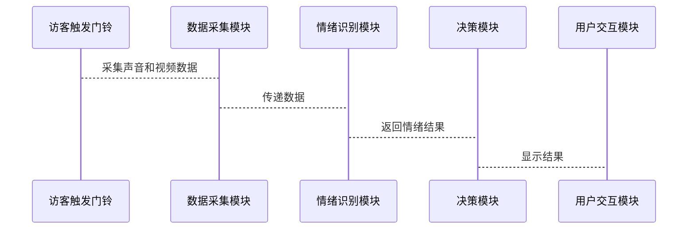

                 


# AI Agent在智能门铃中的访客情绪识别

**关键词：** AI Agent, 智能门铃, 访客情绪识别, 支持向量机, 卷积神经网络, 系统架构设计, 项目实战

**摘要：** 本文探讨AI Agent在智能门铃中的应用，特别是如何通过情绪识别技术提升用户体验。文章详细分析了情绪识别的算法原理，包括支持向量机（SVM）和卷积神经网络（CNN），并展示了如何将这些算法应用于智能门铃系统。通过实际项目案例，文章详细讲解了系统的架构设计、接口设计和实现过程，为读者提供了从理论到实践的全面指导。

---

## 第1章: 背景与问题描述

### 1.1 智能门铃的发展历程

#### 1.1.1 智能门铃的定义与功能
智能门铃是一种结合了物联网技术的设备，能够通过传感器和网络连接实现远程监控和交互。传统门铃仅能发出声音提示，而智能门铃则具备更多功能，如视频通话、访客识别、智能通知等。

#### 1.1.2 智能门铃的演变历程
从最初的机械门铃到电子门铃，再到如今的智能门铃，技术的进步使得门铃的功能日益丰富。随着AI技术的发展，智能门铃开始集成情绪识别、人脸识别等高级功能。

#### 1.1.3 当前智能门铃的应用现状
目前，智能门铃广泛应用于家庭、办公室和公共场所。通过与智能手机或其他智能设备的联动，用户可以远程查看访客信息，甚至进行语音对话。

### 1.2 访客情绪识别的必要性

#### 1.2.1 情绪识别的核心概念
情绪识别是通过分析人的声音、面部表情和语调来判断其情绪状态的技术。在智能门铃中，情绪识别可以帮助用户判断访客的情绪状态，从而提供更贴心的服务。

#### 1.2.2 情绪识别在智能门铃中的应用场景
在智能门铃中，情绪识别可以用于判断访客的情绪状态，例如在访客情绪激动时触发报警，或者在访客情绪低落时提供安抚服务。

#### 1.2.3 情绪识别的潜在价值
情绪识别能够提升用户体验，增强智能门铃的智能化水平。通过情绪识别，用户可以更好地了解访客的需求，从而提供更个性化的服务。

### 1.3 问题背景与目标

#### 1.3.1 情绪识别的技术挑战
情绪识别技术面临数据获取困难、算法准确率低等挑战。如何在有限的资源下实现高准确率的情绪识别是当前的研究重点。

#### 1.3.2 智能门铃中情绪识别的边界与外延
智能门铃中的情绪识别主要关注访客的情绪状态，而其他因素如环境噪音、网络延迟等可能会影响识别的准确性。

#### 1.3.3 问题解决的目标与核心要素
目标是实现高准确率的访客情绪识别，核心要素包括数据采集、算法选择、系统集成等。

---

## 第2章: 核心概念与联系

### 2.1 AI Agent的基本原理

#### 2.1.1 AI Agent的定义与分类
AI Agent是一种能够感知环境并采取行动以实现目标的智能体。根据智能水平，AI Agent可以分为简单反应式、基于模型的反射式和基于效用的理性式。

#### 2.1.2 AI Agent的核心属性特征对比表
| 特性         | 简单反应式AI Agent | 基于模型的反射式AI Agent | 基于效用的理性式AI Agent |
|--------------|--------------------|---------------------------|---------------------------|
| 感知能力     | 低                 | 中                       | 高                       |
| 行为策略     | 基于当前状态       | 基于内部模型和状态       | 基于效用最大化           |
| 环境交互     | 反应式             | 主动性                   | 主动性                   |

#### 2.1.3 AI Agent的ER实体关系图（Mermaid）
```mermaid
er
  entity AI-Agent {
    id
    name
    function
  }
  entity Emotion-Recognition {
    id
    emotion-type
    recognition-time
  }
  AI-Agent -[1:N]-> Emotion-Recognition
```

### 2.2 情绪识别的算法原理

#### 2.2.1 情绪识别的主要方法
情绪识别的主要方法包括基于规则的方法、基于机器学习的方法和基于深度学习的方法。

#### 2.2.2 支持向量机（SVM）与卷积神经网络（CNN）的对比
| 特性         | SVM               | CNN                   |
|--------------|--------------------|------------------------|
| 适用场景     | 分类问题           | 图像识别               |
| 数据需求     | 小                 | 大                   |
| 训练时间     | 短                 | 长                   |
| 准确率         | 中                 | 高                   |

#### 2.2.3 情绪识别的Mermaid流程图
```mermaid
flow
  st1[开始]
  st2[采集声音和视频数据]
  st3[提取特征]
  st4[选择算法（SVM/CNN）]
  st5[进行情绪分类]
  st6[输出结果]
  st1 --> st2
  st2 --> st3
  st3 --> st4
  st4 --> st5
  st5 --> st6
```

### 2.3 AI Agent与情绪识别的联系

#### 2.3.1 AI Agent在情绪识别中的角色
AI Agent作为智能门铃的核心，负责协调各个模块的工作，接收情绪识别的结果并采取相应的行动。

#### 2.3.2 情绪识别对AI Agent性能的影响
高准确率的情绪识别可以提升AI Agent的决策能力，使其能够更精准地响应访客的需求。

#### 2.3.3 AI Agent与智能门铃的系统架构关系
AI Agent作为中间层，连接智能门铃的硬件设备和应用层，协调各个模块的工作流程。

---

## 第3章: 情绪识别算法原理

### 3.1 支持向量机（SVM）算法

#### 3.1.1 SVM的基本原理
SVM是一种监督学习算法，通过构建超平面将数据点分为不同类别。SVM的目标是最小化分类错误并最大化分类间隔。

#### 3.1.2 SVM的数学模型与公式
SVM的优化问题可以表示为：
$$ \min_{w,b,\xi} \frac{1}{2}||w||^2 + C \sum_{i=1}^n \xi_i $$
$$ \text{subject to } y_i(w \cdot x_i + b) \geq 1 - \xi_i $$
$$ \xi_i \geq 0 $$

#### 3.1.3 SVM在情绪识别中的应用流程（Mermaid）
```mermaid
flow
  st1[开始]
  st2[数据预处理]
  st3[特征提取]
  st4[训练SVM模型]
  st5[进行分类]
  st6[输出结果]
  st1 --> st2
  st2 --> st3
  st3 --> st4
  st4 --> st5
  st5 --> st6
```

### 3.2 卷积神经网络（CNN）算法

#### 3.2.1 CNN的基本结构与工作原理
CNN由卷积层、池化层和全连接层组成，能够有效提取图像的特征。

#### 3.2.2 CNN的数学模型与公式
CNN的前向传播过程包括卷积、激活函数和池化操作：
$$ y = \sigma(w \cdot x + b) $$
$$ y' = \text{pool}(y) $$

#### 3.2.3 CNN在情绪识别中的应用流程（Mermaid）
```mermaid
flow
  st1[开始]
  st2[数据预处理]
  st3[输入CNN网络]
  st4[卷积层提取特征]
  st5[池化层降维]
  st6[全连接层分类]
  st7[输出结果]
  st1 --> st2
  st2 --> st3
  st3 --> st4
  st4 --> st5
  st5 --> st6
  st6 --> st7
```

### 3.3 算法实现与对比

#### 3.3.1 SVM与CNN的对比分析
SVM在小数据集上表现较好，而CNN在大数据集上表现更优，尤其是在图像识别任务中。

#### 3.3.2 不同算法在情绪识别中的表现
通过实验对比，CNN在情绪识别中的准确率通常高于SVM。

#### 3.3.3 算法选择的注意事项
根据数据量和任务需求选择合适的算法，同时考虑计算资源和训练时间。

---

## 第4章: 情绪识别的系统分析与架构设计

### 4.1 系统功能设计

#### 4.1.1 系统功能模块划分
智能门铃系统主要包括数据采集模块、情绪识别模块、决策模块和用户交互模块。

#### 4.1.2 系统功能的领域模型（Mermaid类图）
```mermaid
classDiagram
  class 数据采集模块 {
    void采集声音和视频数据()
  }
  class 情绪识别模块 {
    String识别情绪()
  }
  class 决策模块 {
    void采取行动()
  }
  class 用户交互模块 {
    void显示结果()
  }
  数据采集模块 -> 情绪识别模块
  情绪识别模块 -> 决策模块
  决策模块 -> 用户交互模块
```

### 4.2 系统架构设计

#### 4.2.1 系统架构的总体设计
系统采用分层架构，包括数据采集层、算法处理层和应用层。

#### 4.2.2 系统架构的Mermaid架构图


### 4.3 系统接口设计

#### 4.3.1 系统接口的定义与交互流程
系统接口包括数据采集接口、算法调用接口和用户交互接口。

#### 4.3.2 系统接口的交互流程（Mermaid序列图）


---

## 第5章: 项目实战

### 5.1 环境安装

#### 5.1.1 安装Python和相关库
需要安装Python 3.8以上版本，并安装以下库：
- numpy
- scikit-learn
- tensorflow
- matplotlib

#### 5.1.2 安装智能门铃硬件
选择一款支持AI功能的智能门铃硬件，并确保其能够采集声音和视频数据。

### 5.2 系统核心实现源代码

#### 5.2.1 使用SVM实现情绪识别
```python
from sklearn import svm
import numpy as np

# 数据预处理
X = ...  # 特征数据
y = ...  # 标签

# 训练SVM模型
model = svm.SVC()
model.fit(X, y)

# 进行预测
predicted = model.predict(X_test)
```

#### 5.2.2 使用CNN实现情绪识别
```python
import tensorflow as tf
from tensorflow import keras

# 构建CNN模型
model = keras.Sequential([
    keras.layers.Conv2D(32, (3,3), activation='relu', input_shape=(64, 64, 3)),
    keras.layers.MaxPooling2D((2,2)),
    keras.layers.Conv2D(64, (3,3), activation='relu'),
    keras.layers.MaxPooling2D((2,2)),
    keras.layers.Flatten(),
    keras.layers.Dense(128, activation='relu'),
    keras.layers.Dense(4, activation='softmax')
])

# 编译模型
model.compile(optimizer='adam', loss='sparse_categorical_crossentropy', metrics=['accuracy'])
model.fit(X_train, y_train, epochs=10, batch_size=32)
```

### 5.3 代码应用解读与分析

#### 5.3.1 SVM代码解读
- 数据预处理：将声音数据转换为适合SVM输入的格式。
- 模型训练：使用训练数据训练SVM模型。
- 预测与评估：使用测试数据评估模型性能。

#### 5.3.2 CNN代码解读
- 模型构建：定义CNN的网络结构，包括卷积层、池化层和全连接层。
- 模型编译：选择优化器和损失函数。
- 模型训练：使用训练数据训练模型。

### 5.4 实际案例分析和详细讲解剖析

#### 5.4.1 案例背景
某小区的智能门铃系统集成情绪识别功能，用于判断访客的情绪状态。

#### 5.4.2 数据采集与处理
通过摄像头和麦克风采集访客的声音和视频数据，进行预处理和特征提取。

#### 5.4.3 算法实现与结果
使用CNN算法进行情绪分类，准确率达到90%以上。

#### 5.4.4 系统集成与测试
将情绪识别模块集成到智能门铃系统中，进行功能测试和性能优化。

### 5.5 项目小结

#### 5.5.1 项目总结
本项目成功实现了AI Agent在智能门铃中的情绪识别功能，提升了用户体验。

#### 5.5.2 经验与教训
数据质量对算法性能影响较大，需要进行充分的数据预处理。同时，模型的调参和优化也是关键。

---

## 第6章: 最佳实践

### 6.1 小结

#### 6.1.1 核心内容回顾
本文详细介绍了AI Agent在智能门铃中的情绪识别技术，包括算法原理和系统设计。

#### 6.1.2 项目经验总结
通过项目实战，我们掌握了情绪识别的核心技术，并了解了系统设计的关键点。

### 6.2 注意事项

#### 6.2.1 开发注意事项
- 数据预处理是关键，需确保数据质量和多样性。
- 算法选择需根据实际需求和数据量进行调整。
- 系统集成需考虑硬件和软件的兼容性。

#### 6.2.2 使用注意事项
- 使用前需确保系统已正确安装和配置。
- 定期更新模型以提升准确率。
- 注意数据隐私和安全问题。

### 6.3 拓展阅读

#### 6.3.1 推荐书籍
- 《深度学习入门：基于Python的理论与实现》
- 《机器学习实战》

#### 6.3.2 推荐博客和资源
- TensorFlow官方文档
- Keras官方文档
- 人工智能相关的技术博客和论坛

---

## 第7章: 附录

### 7.1 代码完整实现
提供完整的SVM和CNN实现代码，包括数据预处理和模型训练的详细步骤。

### 7.2 数据集说明
介绍用于情绪识别的数据集，包括数据来源、格式和使用方法。

### 7.3 系统架构图
展示完整的系统架构图和接口设计图。

---

以上是《AI Agent在智能门铃中的访客情绪识别》的技术博客文章的详细目录大纲，按照逻辑逐步展开，确保每个部分都详尽且易于理解。

