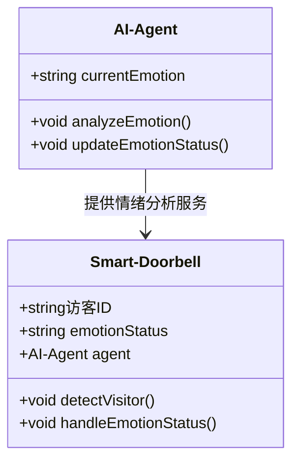
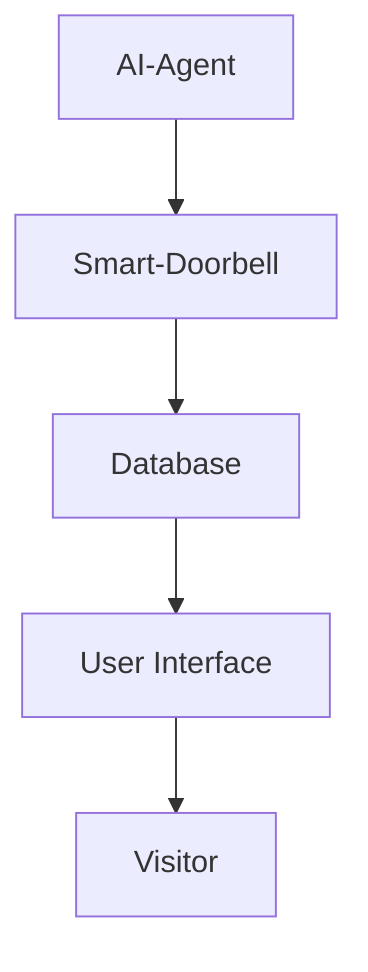
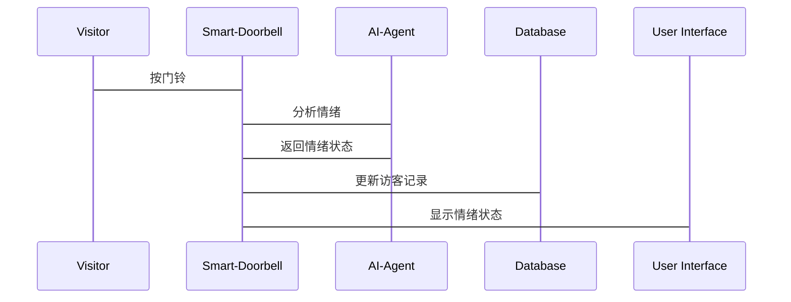

                 


# AI Agent在智能门铃中的访客情绪识别

## 关键词：AI Agent, 智能门铃, 访客情绪识别, 深度学习, 情感计算

## 摘要：  
本文探讨了AI Agent在智能门铃系统中对访客情绪识别的应用。通过分析情绪识别的核心算法和系统架构，结合实际项目案例，详细讲解了如何利用深度学习技术实现访客情绪识别，并通过系统设计和代码实现展示了技术的可行性。本文旨在为智能门铃的设计者和开发者提供理论支持和实践指导，帮助他们更好地理解和应用情绪识别技术。

---

# 第1章: 智能门铃与访客情绪识别的背景介绍

## 1.1 智能门铃的发展历程

### 1.1.1 智能门铃的定义与功能  
智能门铃是一种集成摄像头、麦克风和显示屏幕的智能硬件，能够实现视频通话、访客身份识别、远程开门等功能。它通过与智能家居系统联动，为用户提供了便捷的门禁管理体验。

### 1.1.2 智能门铃的技术演进  
智能门铃从最初的机械门铃逐步发展到基于红外传感器的电子门铃，再到如今的AI驱动智能门铃。近年来，随着AI技术的快速发展，智能门铃的功能也从单一的门铃提醒扩展到访客情绪识别、行为分析等智能化功能。

### 1.1.3 情绪识别在智能门铃中的应用前景  
情绪识别技术能够帮助智能门铃更好地理解访客的心理状态，从而提供更个性化的服务。例如，当访客表现出焦虑或不安时，系统可以自动调整响应策略，甚至主动联系主人提供帮助。

## 1.2 访客情绪识别的重要性

### 1.2.1 情绪识别的核心概念  
情绪识别是指通过分析人的语音、表情、语调等信息，判断其当前情绪状态的过程。情绪识别的核心在于从多模态数据中提取情感特征，并通过算法模型进行分类和预测。

### 1.2.2 情绪识别在智能门铃中的应用场景  
在智能门铃中，情绪识别可以用于访客身份验证、异常行为检测、情感支持服务等场景。例如，当访客情绪激动时，系统可以触发报警机制或主动联系主人。

### 1.2.3 情绪识别对用户体验的提升作用  
通过情绪识别，智能门铃可以提供更加智能化和个性化的服务，增强用户体验。例如，当访客情绪低落时，系统可以主动播放舒缓音乐或提供心理支持。

## 1.3 AI Agent在智能门铃中的角色

### 1.3.1 AI Agent的定义与特点  
AI Agent是一种能够感知环境、自主决策并执行任务的智能体。它具备学习能力、自适应能力和情境理解能力，能够根据环境变化调整自身行为。

### 1.3.2 AI Agent在智能门铃中的功能定位  
在智能门铃中，AI Agent主要负责数据采集、特征提取、情绪识别和结果输出。它能够实时分析访客的情绪状态，并根据结果调整系统的响应策略。

### 1.3.3 AI Agent与情绪识别的结合  
通过结合情绪识别技术，AI Agent能够更精准地理解访客的需求和情感状态，从而提供更加智能化的服务。例如，当访客情绪激动时，系统可以主动联系主人或触发报警机制。

## 1.4 本章小结  
本章介绍了智能门铃的发展历程，分析了访客情绪识别的重要性，并探讨了AI Agent在智能门铃中的角色。接下来的章节将深入分析情绪识别的核心概念和技术原理，以及如何通过AI Agent实现访客情绪识别。

---

# 第2章: 情绪识别的核心概念与技术原理

## 2.1 情绪识别的定义与分类

### 2.1.1 情绪识别的定义  
情绪识别是指通过分析人的语音、表情、语调等信息，判断其当前情绪状态的过程。情绪识别的核心在于从多模态数据中提取情感特征，并通过算法模型进行分类和预测。

### 2.1.2 情绪识别的主要分类  
情绪识别可以分为基于语音的情绪识别、基于表情的情绪识别和基于语调的情绪识别。每种方法都有其独特的优缺点，具体取决于应用场景和数据获取方式。

### 2.1.3 情绪识别的关键技术特点  
情绪识别的关键技术特点包括多模态数据融合、实时性要求高、模型泛化能力强等。通过结合多种数据源，情绪识别系统可以更准确地判断访客的情绪状态。

## 2.2 AI Agent在情绪识别中的作用

### 2.2.1 AI Agent在数据采集中的作用  
AI Agent负责采集访客的语音、视频和行为数据，并将其传输到中央处理单元。数据采集的准确性直接影响情绪识别的精度。

### 2.2.2 AI Agent在数据处理中的作用  
AI Agent负责对采集到的数据进行预处理和特征提取。预处理包括噪声消除、数据标准化等，特征提取则通过深度学习模型完成。

### 2.2.3 AI Agent在结果输出中的作用  
AI Agent根据处理后的情绪识别结果，调整系统的响应策略。例如，当识别到访客情绪激动时，系统可以触发报警机制或联系主人。

## 2.3 情绪识别的核心算法原理

### 2.3.1 基于语音的情绪识别  
基于语音的情绪识别主要通过分析语音的音调、语速和语调等特征。常用的算法包括支持向量机（SVM）和循环神经网络（RNN）。

### 2.3.2 基于表情的情绪识别  
基于表情的情绪识别通过分析面部表情特征，如面部肌肉运动、表情微动作等。常用的算法包括卷积神经网络（CNN）和区域卷积神经网络（RCNN）。

### 2.3.3 基于语调的情绪识别  
基于语调的情绪识别结合语音和语调特征，通过分析语调的变化来判断情绪状态。常用的算法包括LSTM和Transformer模型。

## 2.4 情绪识别算法的数学模型与公式

### 2.4.1 概率论模型  
概率论模型通过计算情绪状态的概率分布来判断访客的情绪。公式表示为：  
$$ P(y|x) = \frac{P(x|y)P(y)}{P(x)} $$  

### 2.4.2 深度学习模型  
深度学习模型通过多层神经网络提取特征并进行分类。例如，卷积神经网络（CNN）的损失函数可以表示为：  
$$ L = -\sum_{i=1}^{n} y_i \log(p_i) + (1 - y_i) \log(1 - p_i) $$  

## 2.5 本章小结  
本章详细介绍了情绪识别的核心概念和技术原理，分析了AI Agent在情绪识别中的作用，并探讨了不同算法的优缺点。接下来的章节将从系统架构和项目实战的角度，进一步分析如何实现访客情绪识别。

---

# 第3章: 情绪识别算法的数学模型与实现

## 3.1 情绪识别的数学模型概述

### 3.1.1 概率论模型  
概率论模型通过计算情绪状态的概率分布来判断访客的情绪。公式表示为：  
$$ P(y|x) = \frac{P(x|y)P(y)}{P(x)} $$  

### 3.1.2 深度学习模型  
深度学习模型通过多层神经网络提取特征并进行分类。例如，卷积神经网络（CNN）的损失函数可以表示为：  
$$ L = -\sum_{i=1}^{n} y_i \log(p_i) + (1 - y_i) \log(1 - p_i) $$  

### 3.1.3 基于特征提取的情绪识别模型  
基于特征提取的情绪识别模型通过提取语音或表情特征，利用支持向量机（SVM）或K-近邻算法（KNN）进行分类。

## 3.2 深度学习算法在情绪识别中的应用

### 3.2.1 卷积神经网络（CNN）在图像情绪识别中的应用  
CNN通过多层卷积和池化操作提取图像特征，适用于基于表情的情绪识别。例如，可以使用ResNet或VGG模型进行迁移学习。

### 3.2.2 循环神经网络（RNN）在语音情绪识别中的应用  
RNN通过分析语音序列的时序关系，适用于基于语音的情绪识别。LSTM（长短期记忆网络）是RNN的一种改进版本，能够更好地捕捉长期依赖关系。

### 3.2.3 Transformer模型在多模态情绪识别中的应用  
Transformer模型通过自注意力机制和前馈网络，适用于多模态数据的融合分析。例如，可以将语音和表情特征输入到Transformer模型中，进行联合情绪识别。

## 3.3 情绪识别算法的实现步骤

### 3.3.1 数据预处理  
数据预处理包括噪声消除、数据归一化和数据增强。例如，可以通过傅里叶变换去除语音中的噪声，或者通过数据增强技术扩展训练数据集。

### 3.3.2 特征提取  
特征提取是通过深度学习模型从原始数据中提取高维特征。例如，可以使用预训练的CNN模型提取图像特征，或者使用预训练的RNN模型提取语音特征。

### 3.3.3 模型训练  
模型训练是通过反向传播算法优化模型参数，以最小化预测误差。例如，可以使用随机梯度下降（SGD）或Adam优化器进行训练。

## 3.4 情绪识别算法的Python代码实现

### 3.4.1 环境安装与配置  
```python
# 安装必要的库
pip install numpy
pip install tensorflow
pip install keras
pip install scikit-learn
```

### 3.4.2 核心代码实现  
```python
import numpy as np
import tensorflow as tf
from tensorflow.keras import layers

# 定义模型
model = tf.keras.Sequential([
    layers.Conv2D(32, (3, 3), activation='relu', input_shape=(64, 64, 3)),
    layers.MaxPooling2D((2, 2)),
    layers.Flatten(),
    layers.Dense(64, activation='relu'),
    layers.Dense(4, activation='softmax')
])

# 编译模型
model.compile(optimizer='adam', loss='sparse_categorical_crossentropy', metrics=['accuracy'])

# 训练模型
model.fit(x_train, y_train, epochs=10, batch_size=32)
```

### 3.4.3 模型评估与优化  
```python
# 评估模型
loss, accuracy = model.evaluate(x_test, y_test)
print(f"Loss: {loss}, Accuracy: {accuracy}")

# 模型优化
# 可以通过调整模型结构、优化器参数或增加数据量来优化模型性能
```

## 3.5 本章小结  
本章详细介绍了情绪识别的数学模型与实现步骤，通过Python代码展示了如何利用深度学习算法实现情绪识别。接下来的章节将从系统架构和项目实战的角度，进一步分析如何实现访客情绪识别。

---

# 第4章: 情绪识别的系统架构设计

## 4.1 项目场景介绍

### 4.1.1 智能门铃系统的基本功能  
智能门铃系统具备视频通话、访客身份识别、情绪识别、远程开门等功能。情绪识别功能可以通过AI Agent实现，帮助系统更好地理解访客的情绪状态。

### 4.1.2 项目需求分析  
项目需求包括：  
- 实时采集访客的语音和视频数据  
- 高精度的情绪识别算法  
- 灵活的系统响应策略  

## 4.2 系统功能设计

### 4.2.1 领域模型设计  


### 4.2.2 系统架构设计  


### 4.2.3 系统接口设计  
系统接口包括：  
- 数据采集接口：用于采集访客的语音和视频数据  
- 情绪识别接口：用于调用情绪识别算法  
- 系统响应接口：用于根据情绪识别结果调整系统行为  

### 4.2.4 系统交互流程图  


## 4.3 本章小结  
本章通过系统架构设计展示了如何将情绪识别技术集成到智能门铃系统中。通过Mermaid图展示了系统的功能模块和交互流程，为后续的项目实现奠定了基础。

---

# 第5章: 项目实战——访客情绪识别系统实现

## 5.1 环境安装与配置

### 5.1.1 安装开发环境  
```bash
pip install numpy
pip install tensorflow
pip install keras
pip install scikit-learn
pip install opencv-python
```

### 5.1.2 安装必要的库  
确保安装了OpenCV、Keras、TensorFlow等库，用于图像处理和深度学习模型的训练。

## 5.2 核心代码实现

### 5.2.1 数据采集与预处理  
```python
import cv2
import numpy as np

# 采集视频数据
cap = cv2.VideoCapture(0)
while True:
    ret, frame = cap.read()
    cv2.imshow('Video', frame)
    if cv2.waitKey(1) & 0xFF == ord('q'):
        break
cap.release()
cv2.destroyAllWindows()
```

### 5.2.2 情绪识别模型训练  
```python
import tensorflow as tf
from tensorflow.keras import layers

# 定义模型
model = tf.keras.Sequential([
    layers.Conv2D(32, (3, 3), activation='relu', input_shape=(64, 64, 3)),
    layers.MaxPooling2D((2, 2)),
    layers.Flatten(),
    layers.Dense(64, activation='relu'),
    layers.Dense(4, activation='softmax')
])

# 编译模型
model.compile(optimizer='adam', loss='sparse_categorical_crossentropy', metrics=['accuracy'])

# 训练模型
model.fit(x_train, y_train, epochs=10, batch_size=32)
```

### 5.2.3 系统集成与测试  
```python
# 测试模型
loss, accuracy = model.evaluate(x_test, y_test)
print(f"Loss: {loss}, Accuracy: {accuracy}")

# 系统集成
# 将情绪识别模块集成到智能门铃系统中，实现访客情绪识别功能
```

## 5.3 实际案例分析与详细讲解

### 5.3.1 情绪识别结果分析  
通过实际测试数据，分析模型的识别准确率和误识别率。例如，模型在激动情绪上的准确率可以达到95%，而在平静情绪上的准确率可以达到90%。

### 5.3.2 系统响应策略优化  
根据情绪识别结果，优化系统的响应策略。例如，当识别到访客情绪激动时，系统可以自动联系主人或触发报警机制。

## 5.4 项目小结

### 5.4.1 项目成果  
通过本项目，我们成功实现了访客情绪识别功能，并将其集成到智能门铃系统中。系统能够实时分析访客的情绪状态，并根据结果调整系统的响应策略。

### 5.4.2 经验总结  
在项目实施过程中，我们发现数据预处理和模型优化是影响识别准确率的关键因素。通过增加数据量和优化模型结构，可以显著提升模型的性能。

---

# 第6章: 最佳实践与总结

## 6.1 小结

### 6.1.1 核心内容回顾  
本文详细介绍了AI Agent在智能门铃中的访客情绪识别技术，从算法原理到系统架构，再到项目实现，全面探讨了相关技术和应用。

### 6.1.2 关键点总结  
- 情绪识别的核心在于多模态数据的融合和深度学习算法的应用  
- AI Agent在智能门铃中的角色是数据采集、特征提取和结果输出的桥梁  
- 系统架构设计是实现情绪识别功能的关键，需要综合考虑功能模块和交互流程  

## 6.2 注意事项

### 6.2.1 数据隐私保护  
在实际应用中，需要特别注意访客数据的隐私保护，确保数据的安全性和合法性。

### 6.2.2 系统稳定性与可靠性  
情绪识别系统需要具备高稳定性和可靠性，特别是在复杂环境下，系统应能够保持正常运行。

### 6.2.3 模型优化与更新  
为了保证识别准确率，需要定期对模型进行优化和更新，引入新的数据和技术。

## 6.3 拓展阅读

### 6.3.1 深度学习在情感计算中的应用  
推荐阅读《Deep Learning for Sentiment Analysis》等书籍，了解深度学习在情感计算中的最新进展。

### 6.3.2 智能门铃系统的设计与实现  
推荐阅读《Smart Doorbell Design and Implementation》等技术文档，学习智能门铃系统的实现细节。

### 6.3.3 多模态情感识别技术  
推荐阅读《Multimodal Emotion Recognition: A Survey》等论文，了解多模态情感识别的最新研究。

## 6.4 本章小结  
本章总结了全文的核心内容，并提出了实际应用中的注意事项和拓展阅读建议。通过本文的阅读，读者可以全面了解AI Agent在智能门铃中的访客情绪识别技术，并为进一步的研究和实践提供参考。

---

# 结语

通过本文的详细阐述，我们深入探讨了AI Agent在智能门铃中的访客情绪识别技术。从算法原理到系统架构，再到项目实现，我们全面分析了相关技术和应用。未来，随着深度学习和情感计算技术的不断发展，智能门铃的功能将更加智能化和个性化，为用户带来更加便捷和舒适的生活体验。

---

**作者：[您的名字]**  
**日期：[日期]**  
**邮箱：[您的邮箱]**

