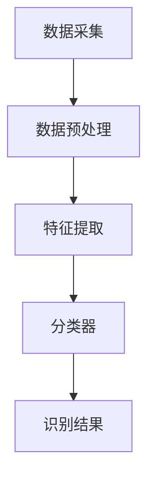
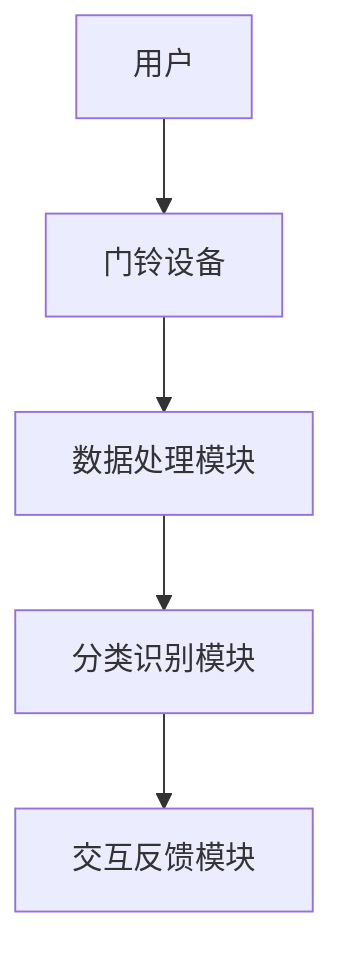

                 


# AI Agent在智能门铃中的访客识别

## 关键词：AI Agent，智能门铃，访客识别，算法原理，系统架构

## 摘要：本文详细探讨了AI Agent在智能门铃访客识别中的应用，从问题背景到系统架构，再到算法实现，全面解析了该技术的核心原理和实际应用。通过案例分析和项目实战，为读者提供了一套完整的解决方案。

---

# 第1章: 问题背景与概念解析

## 1.1 问题背景

### 1.1.1 智能门铃的发展历程
智能门铃作为智能家居的重要组成部分，经历了从机械门铃到电子门铃，再到如今的AI驱动智能门铃的演变。传统门铃仅能实现简单的铃声提醒，而现代智能门铃通过结合AI技术，能够实现访客识别、身份验证和智能交互等功能。

### 1.1.2 访客识别的挑战与需求
随着智能家居的普及，访客识别的需求日益增长。访客识别需要解决以下问题：
- **准确性**：如何准确识别访客的身份，避免误识别或漏识别。
- **实时性**：访客识别需要在短时间内完成，以提供实时反馈。
- **隐私保护**：在识别过程中，如何保护用户和访客的隐私数据。

### 1.1.3 AI Agent在访客识别中的作用
AI Agent（智能代理）通过结合计算机视觉、机器学习和自然语言处理技术，能够实现访客的高效识别和智能交互。AI Agent在访客识别中的作用包括：
- **数据采集**：通过摄像头、麦克风等传感器采集访客的图像和声音数据。
- **特征提取**：从采集的数据中提取关键特征，如人脸特征、声音特征等。
- **分类与识别**：基于提取的特征，利用机器学习模型进行分类和识别，判断访客的身份。

## 1.2 问题描述

### 1.2.1 访客识别的核心问题
访客识别的核心问题可以归结为以下几个方面：
1. **数据采集**：如何高效、准确地采集访客的图像和声音数据。
2. **特征提取**：如何从采集的数据中提取具有区分度的特征。
3. **分类与识别**：如何利用机器学习模型对提取的特征进行分类和识别。

### 1.2.2 AI Agent在访客识别中的任务分解
AI Agent在访客识别中的任务可以分解为以下几个步骤：
1. **数据采集**：通过摄像头采集访客的图像数据。
2. **数据预处理**：对采集的图像数据进行降噪、增强等预处理操作。
3. **特征提取**：从预处理后的图像中提取关键特征，如人脸特征。
4. **分类与识别**：利用机器学习模型对提取的特征进行分类，识别访客的身份。

### 1.2.3 边界与外延
访客识别的边界在于仅识别访客的身份，而不涉及其他行为分析。其外延则包括与访客识别相关的技术，如身份验证、智能交互等。

## 1.3 核心概念与系统架构

### 1.3.1 智能门铃系统的组成
智能门铃系统通常由以下几个部分组成：
- **门铃设备**：包括摄像头、麦克风、传感器等硬件设备。
- **AI Agent**：负责数据采集、特征提取和分类识别的智能代理。
- **用户界面**：用于展示识别结果和用户交互的界面。

### 1.3.2 AI Agent的功能模块
AI Agent的功能模块包括：
- **数据采集模块**：负责采集访客的图像和声音数据。
- **特征提取模块**：对采集的数据进行特征提取。
- **分类识别模块**：利用机器学习模型对特征进行分类和识别。
- **交互反馈模块**：根据识别结果提供反馈，如打开门锁、播放欢迎语等。

### 1.3.3 访客识别系统的实体关系图
以下是访客识别系统的实体关系图：
```mermaid
er
    actor 用户;
    actor 访客;
    entity 门铃设备;
    entity 访客数据;
    entity 识别结果;
    用户 --> 门铃设备: 操作门铃
    门铃设备 --> 访客数据: 采集数据
    访客数据 --> 识别结果: 进行识别
    访客 --> 识别结果: 查询结果
```

---

# 第2章: AI Agent的核心原理与算法

## 2.1 AI Agent的基本原理

### 2.1.1 AI Agent的定义
AI Agent是一种能够感知环境、自主决策并执行任务的智能实体。在智能门铃中，AI Agent通过感知环境中的数据（如图像、声音）来识别访客的身份，并根据识别结果执行相应的操作（如打开门锁、播放欢迎语等）。

### 2.1.2 AI Agent的核心算法
AI Agent的核心算法包括：
1. **数据预处理算法**：如图像降噪、增强等。
2. **特征提取算法**：如人脸检测、声音特征提取等。
3. **分类与识别算法**：如支持向量机（SVM）、卷积神经网络（CNN）等。

### 2.1.3 AI Agent与传统算法的区别
AI Agent与传统算法的区别在于其智能化和自主性。AI Agent能够通过学习和自适应优化算法性能，而传统算法通常需要人工调整参数。

## 2.2 访客识别的算法流程

### 2.2.1 数据采集与预处理
数据预处理的目的是提高数据的质量和一致性。常见的数据预处理方法包括：
- **图像降噪**：通过滤波等技术去除图像中的噪声。
- **图像增强**：通过调整亮度、对比度等改善图像质量。
- **图像裁剪**：将图像中的感兴趣区域（如人脸）提取出来。

### 2.2.2 特征提取与分类
特征提取是访客识别的关键步骤。常见的特征提取方法包括：
- **人脸特征提取**：利用CNN等深度学习模型提取人脸特征。
- **声音特征提取**：通过MFCC（Mel-Frequency Cepstral Coefficients）提取语音特征。

### 2.2.3 结果输出与反馈
识别结果输出后，系统会根据结果执行相应的操作。例如，如果识别到访客是已授权的用户，系统会自动打开门锁并播放欢迎语。

## 2.3 算法原理的数学模型

### 2.3.1 数据预处理的数学公式
数据预处理通常包括图像的灰度化和归一化。灰度化公式为：
$$ G = 0.299R + 0.587G + 0.114B $$
其中，$G$ 是灰度值，$R$、$G$、$B$ 是原图像的红、绿、蓝通道值。

### 2.3.2 特征提取的数学公式
特征提取通常使用深度学习模型，如卷积神经网络（CNN）。CNN的卷积层公式为：
$$ f(x) = \max(0, w \cdot x + b) $$
其中，$w$ 是权重，$b$ 是偏置，$x$ 是输入数据。

### 2.3.3 分类器的数学公式
分类器通常使用支持向量机（SVM）或随机森林（Random Forest）。SVM的损失函数为：
$$ L = \sum_{i=1}^{n} \max(0, 1 - y_i (w \cdot x_i + b)) $$
其中，$y_i$ 是标签，$w$ 是权重，$b$ 是偏置，$x_i$ 是输入数据。

## 2.4 算法流程的Mermaid图
以下是访客识别算法的流程图：


---

# 第3章: 智能门铃系统的架构设计

## 3.1 系统架构概述

### 3.1.1 系统组成模块
智能门铃系统通常由以下几个模块组成：
1. **数据采集模块**：负责采集访客的图像和声音数据。
2. **数据处理模块**：对采集的数据进行预处理和特征提取。
3. **分类识别模块**：利用机器学习模型对特征进行分类和识别。
4. **交互反馈模块**：根据识别结果提供反馈，如打开门锁、播放欢迎语等。

### 3.1.2 系统功能模块
系统功能模块包括：
- **用户界面**：用于展示识别结果和用户交互。
- **AI Agent**：负责数据处理和分类识别。
- **门铃设备**：包括摄像头、麦克风等硬件设备。

### 3.1.3 系统架构图
以下是智能门铃系统的架构图：


---

# 第4章: 项目实战

## 4.1 环境安装

### 4.1.1 安装Python
安装Python 3.8及以上版本：
```bash
sudo apt-get install python3
```

### 4.1.2 安装TensorFlow
安装TensorFlow：
```bash
pip install tensorflow
```

### 4.1.3 安装OpenCV
安装OpenCV：
```bash
pip install opencv-python
```

## 4.2 系统核心实现源代码

### 4.2.1 数据采集代码
```python
import cv2

def capture_image():
    cap = cv2.VideoCapture(0)
    ret, frame = cap.read()
    if ret:
        cv2.imwrite("visitor.jpg", frame)
    cap.release()
```

### 4.2.2 特征提取代码
```python
import tensorflow as tf
import cv2

def extract_features(image_path):
    img = cv2.imread(image_path)
    img = cv2.cvtColor(img, cv2.COLOR_BGR2RGB)
    img = tf.image.resize(img, (224, 224))
    img = tf.keras.applications.mobilenet.preprocess_input(img)
    return img
```

### 4.2.3 分类识别代码
```python
import tensorflow as tf

model = tf.keras.models.load_model("visitor_model.h5")

def classify_image(image):
    prediction = model.predict(image)
    return prediction
```

## 4.3 代码应用解读与分析
- **数据采集代码**：通过摄像头采集访客的图像数据，并保存为"visitor.jpg"。
- **特征提取代码**：将图像数据预处理为适合模型输入的格式。
- **分类识别代码**：利用预训练的模型对图像进行分类，识别访客的身份。

## 4.4 实际案例分析
假设我们有一个包含1000张已知访客图像的数据集，我们可以通过以下步骤进行训练：
1. **数据预处理**：将图像灰度化并归一化。
2. **特征提取**：利用CNN模型提取图像特征。
3. **模型训练**：使用随机森林算法进行训练。
4. **模型评估**：评估模型的准确率、召回率和F1分数。

## 4.5 项目小结
通过上述步骤，我们可以实现一个高效的访客识别系统。在实际应用中，需要注意数据的质量和模型的可解释性，以提高识别的准确性和用户的安全性。

---

# 第5章: 最佳实践

## 5.1 小结
- AI Agent在智能门铃中的访客识别是一项具有挑战性的任务，需要结合计算机视觉、机器学习和自然语言处理技术。
- 通过合理的系统架构设计和高效的算法实现，可以实现高效的访客识别。

## 5.2 注意事项
- 在实际应用中，需要注意数据隐私保护，避免用户数据泄露。
- 需要定期更新模型，以应对可能出现的新访客和环境变化。

## 5.3 拓展阅读
- 《深度学习实战：基于TensorFlow和Keras》
- 《计算机视觉入门：基于OpenCV的图像处理》

---

# 结语
通过本文的详细介绍，我们了解了AI Agent在智能门铃中的访客识别的核心原理和实现方法。希望本文能够为读者提供有价值的参考和启发，进一步推动智能门铃技术的发展。

--- 

# END

