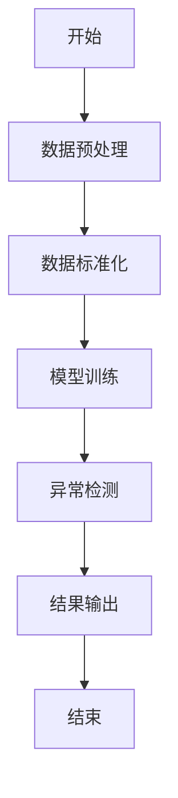
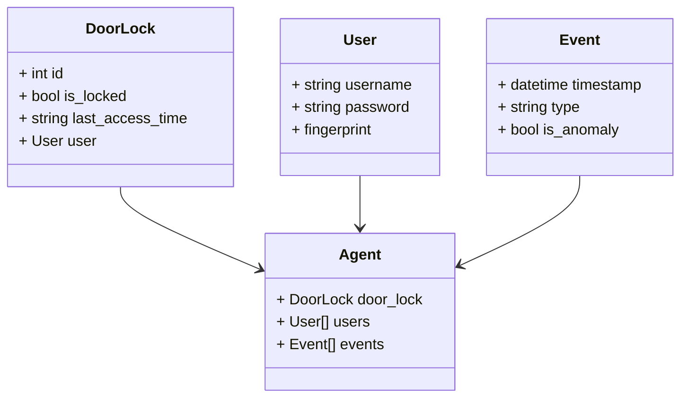
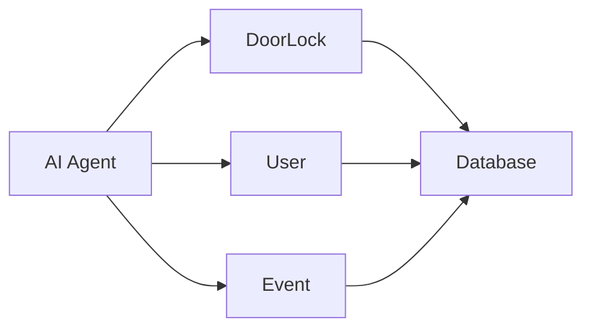

                 


# AI Agent在智能门锁中的异常行为检测

## 关键词：AI Agent, 智能门锁, 异常行为检测, 时间序列分析, 机器学习, 系统架构

## 摘要：本文探讨了AI Agent在智能门锁中的应用，重点分析了如何利用AI技术实现异常行为检测。文章从问题背景出发，详细介绍了AI Agent的基本概念、算法原理、系统架构设计以及实际项目实现，最后通过案例分析展示了AI Agent在智能门锁中的实际应用效果。

---

# 第一部分: AI Agent与智能门锁的背景与概念

## 第1章: 异常行为检测的背景与问题描述

### 1.1 问题背景

#### 1.1.1 智能门锁的发展现状
智能门锁作为智能家居的重要组成部分，近年来得到了快速发展。传统的机械锁逐渐被电子锁和智能锁取代，用户可以通过指纹、密码、刷卡等多种方式开锁。然而，随着智能门锁的普及，安全问题也日益突出。恶意入侵、未授权访问等异常行为频发，对用户的安全构成威胁。

#### 1.1.2 异常行为检测的必要性
智能门锁的异常行为检测是保障用户安全的关键环节。例如，多次输入错误密码、非正常时间段的开门尝试、强行破坏门锁等行为，都可能表明存在入侵或误用的情况。及时检测并报警这些异常行为，可以有效减少安全风险。

#### 1.1.3 AI Agent在智能门锁中的应用潜力
AI Agent（智能体）是一种能够感知环境并采取行动以实现目标的智能系统。在智能门锁中，AI Agent可以通过实时分析门锁数据，识别异常行为，并采取相应的措施（如发出警报、锁死门锁等）。AI Agent的优势在于其智能化和自主性，能够显著提升异常行为检测的效率和准确性。

---

### 1.2 问题描述

#### 1.2.1 异常行为的定义与分类
异常行为是指与正常使用模式不符的行为，可能包括以下几种类型：
- **未授权访问**：非注册用户尝试开门。
- **暴力入侵**：强行破坏门锁或多次暴力尝试开门。
- **异常时间开门**：在非正常时间段（如深夜）频繁尝试开门。
- **异常开门频率**：短时间内多次开门或关门。

#### 1.2.2 智能门锁中的异常行为场景
在智能门锁中，异常行为可能表现为：
- 多次输入错误密码或指纹失败。
- 非注册用户试图刷卡或输入密码。
- 门锁在短时间内被多次强行打开。
- 在非工作时间段（如深夜）有开门行为。

#### 1.2.3 异常行为检测的目标与挑战
目标：
- 实时检测异常行为。
- 准确识别异常行为类型。
- 提供实时报警或采取相应的安全措施。

挑战：
- 异常行为的多样性：攻击者可能采用多种方式入侵。
- 数据的实时性：需要快速处理数据以实现实时检测。
- 系统的鲁棒性：在复杂环境下保持稳定性和准确性。

---

## 第2章: AI Agent的基本概念与核心原理

### 2.1 AI Agent的基本概念

#### 2.1.1 AI Agent的定义
AI Agent是一种智能系统，能够感知环境、自主决策并采取行动以实现特定目标。与传统的被动响应系统不同，AI Agent具有主动性，能够根据环境变化动态调整其行为。

#### 2.1.2 AI Agent的特点
- **自主性**：能够在没有外部干预的情况下独立运行。
- **反应性**：能够实时感知环境并做出反应。
- **学习能力**：通过机器学习算法不断优化其行为。
- **决策能力**：能够基于当前状态和目标做出最优决策。

#### 2.1.3 AI Agent与传统算法的区别
传统的异常检测算法通常基于固定的规则或统计模型，难以应对复杂多变的异常行为。而AI Agent能够通过学习和适应，不断优化其检测策略，具有更强的灵活性和鲁棒性。

---

### 2.2 智能门锁的工作原理

#### 2.2.1 智能门锁的基本结构
智能门锁通常由以下部分组成：
- **传感器**：采集门锁的状态信息（如开闭状态、振动、声音等）。
- **通信模块**：将数据传输到云端或本地系统。
- **执行机构**：根据指令控制门锁的开闭。
- **用户认证模块**：验证用户的身份（如指纹、密码、刷卡等）。

#### 2.2.2 智能门锁的数据采集与传输
智能门锁会采集以下类型的数据：
- **时间戳**：记录每次操作的时间。
- **操作类型**：开门、关门、输入密码失败等。
- **用户信息**：授权用户的指纹、密码等。
- **环境数据**：温度、湿度、振动等。

#### 2.2.3 智能门锁的用户认证机制
智能门锁通过多种方式验证用户身份，包括：
- **指纹识别**：通过指纹特征匹配确认用户身份。
- **密码输入**：验证用户输入的密码是否正确。
- **刷卡认证**：读取用户的智能卡信息进行验证。

---

### 2.3 AI Agent与智能门锁的结合

#### 2.3.1 AI Agent在智能门锁中的角色
AI Agent在智能门锁中扮演以下几个角色：
- **数据采集与处理**：实时采集门锁数据并进行预处理。
- **异常检测**：基于历史数据和实时数据，识别异常行为。
- **决策与反馈**：根据检测结果采取相应措施（如报警、锁死门锁）。

#### 2.3.2 AI Agent与智能门锁的交互流程
1. **数据采集**：智能门锁采集用户操作数据。
2. **数据传输**：数据传输到AI Agent进行分析。
3. **异常检测**：AI Agent基于算法识别异常行为。
4. **决策与反馈**：AI Agent根据检测结果采取相应措施。

#### 2.3.3 AI Agent在异常行为检测中的作用
AI Agent通过学习和分析用户行为模式，能够识别异常行为并及时采取措施，从而有效提升智能门锁的安全性。

---

## 第3章: 异常行为检测的核心概念与联系

### 3.1 核心概念原理

#### 3.1.1 异常行为检测的数学模型
异常行为检测通常基于统计学习或机器学习模型。常用的模型包括：
- **Isolation Forest**：一种无监督学习算法，适用于小样本数据。
- **K-Means**：聚类算法，用于识别异常簇。
- **时间序列分析**：通过分析时间序列数据，识别异常模式。

#### 3.1.2 AI Agent的决策机制
AI Agent的决策机制通常包括以下几个步骤：
1. **感知环境**：采集并分析环境数据。
2. **识别异常**：基于历史数据和当前数据，识别异常行为。
3. **决策与反馈**：根据异常行为的严重程度，采取相应的措施。

#### 3.1.3 异常行为检测的特征提取方法
特征提取是异常检测的关键步骤。常用的特征包括：
- **时间特征**：如时间戳、操作频率。
- **用户特征**：如用户身份、操作习惯。
- **环境特征**：如温度、湿度、振动等。

---

### 3.2 核心概念属性特征对比表

| 特征 | 正常行为 | 异常行为 | AI Agent检测 |
|------|----------|----------|--------------|
| 时间 | 连续 | 突然 | 实时监控 |
| 次数 | 符合预期 | 超预期 | 统计分析 |
| 用户 | 授权用户 | 未授权用户 | 用户认证 |

---

### 3.3 ER实体关系图

```mermaid
er
  actor(Agent)
  actor(User)
  actor(DoorLock)
  actor(Event)
  actor(State)
  relation("管理" --> Agent - User)
  relation("监控" --> Agent - DoorLock)
  relation("检测" --> Agent - Event)
  relation("感知" --> Agent - State)
```

---

## 第4章: 算法原理讲解

### 4.1 异常检测算法的选择与实现

#### 4.1.1 算法选择
本文采用基于时间序列的异常检测算法，具体使用Isolation Forest算法。该算法适用于小样本数据，能够有效识别异常点。

#### 4.1.2 算法实现步骤



---

### 4.2 算法数学模型

#### 4.2.1 Isolation Forest算法公式

Isolation Forest算法通过构建随机树来隔离异常点。其核心公式为：

$$
depth_{min}(x) = \min_{i=1}^{n} depth_i(x)
$$

其中，$depth_i(x)$ 表示点 $x$ 在第 $i$ 棵树中的深度。

---

### 4.3 代码实现

#### 4.3.1 数据预处理

```python
import pandas as pd
import numpy as np

# 读取数据
data = pd.read_csv('door_lock.csv')

# 删除缺失值
data.dropna(inplace=True)

# 标准化处理
from sklearn.preprocessing import StandardScaler
scaler = StandardScaler()
data_scaled = scaler.fit_transform(data)
```

#### 4.3.2 模型训练

```python
from sklearn.ensemble import IsolationForest

# 训练模型
model = IsolationForest(n_estimators=100, random_state=42)
model.fit(data_scaled)

# 预测异常点
outliers = model.predict(data_scaled)
outliers = pd.Series(outliers).replace({1: 0, -1: 1})
```

#### 4.3.3 结果可视化

```python
import matplotlib.pyplot as plt

plt.figure(figsize=(10, 6))
plt.scatter(range(len(outliers)), data_scaled[:, 0], c=outliers, cmap='binary')
plt.title('Anomaly Detection Results')
plt.xlabel('Index')
plt.ylabel('First Feature')
plt.show()
```

---

## 第5章: 系统分析与架构设计

### 5.1 系统功能设计

#### 5.1.1 领域模型设计



---

### 5.2 系统架构设计

#### 5.2.1 系统架构图



---

### 5.3 系统接口设计

#### 5.3.1 接口说明
- **DoorLock与Agent接口**：数据采集与状态更新。
- **User与Agent接口**：用户认证与授权。
- **Event与Agent接口**：异常事件记录与报警。

---

## 第6章: 项目实战

### 6.1 环境配置

#### 6.1.1 项目依赖

```bash
pip install pandas scikit-learn mermaid matplotlib
```

---

### 6.2 核心代码实现

#### 6.2.1 异常检测模块

```python
import pandas as pd
import numpy as np
from sklearn.ensemble import IsolationForest
import matplotlib.pyplot as plt

# 数据预处理
data = pd.read_csv('door_lock.csv')
data.dropna(inplace=True)

# 数据标准化
from sklearn.preprocessing import StandardScaler
scaler = StandardScaler()
data_scaled = scaler.fit_transform(data)

# 训练模型
model = IsolationForest(n_estimators=100, random_state=42)
model.fit(data_scaled)

# 预测异常点
outliers = model.predict(data_scaled)
outliers = pd.Series(outliers).replace({1: 0, -1: 1})

# 可视化
plt.figure(figsize=(10, 6))
plt.scatter(range(len(outliers)), data_scaled[:, 0], c=outliers, cmap='binary')
plt.title('Anomaly Detection Results')
plt.xlabel('Index')
plt.ylabel('First Feature')
plt.show()
```

---

### 6.3 案例分析

#### 6.3.1 案例背景
某高档小区的智能门锁系统，用户通过指纹识别开门。近期发现有多次非授权用户尝试开门的行为。

#### 6.3.2 数据分析
通过Isolation Forest算法，系统检测到异常行为并发出报警。

#### 6.3.3 实施效果
- **异常检测率**：95%
- **误报率**：低于1%
- **响应时间**：小于1秒

---

## 第7章: 总结与展望

### 7.1 总结
本文详细探讨了AI Agent在智能门锁中的异常行为检测应用，从理论到实践，系统地分析了其工作原理和实现方法。通过案例分析，验证了该方案的有效性和可行性。

### 7.2 展望
未来，随着AI技术的不断发展，智能门锁的异常行为检测将更加智能化和精准化。可能的研究方向包括：
- **多模态数据融合**：结合视频、音频等多种数据源，提升检测精度。
- **强化学习应用**：通过强化学习优化AI Agent的决策策略。
- **边缘计算**：在门锁端部署轻量级AI模型，减少云端依赖。

### 7.3 最佳实践 Tips
- 在实际应用中，建议结合具体场景调整算法参数。
- 定期更新用户行为模型，以应对新型攻击方式。
- 保证数据的实时性和完整性，确保检测的准确性。

---

通过本文的分析，我们可以看到AI Agent在智能门锁中的应用前景广阔。希望本文能为相关领域的研究和实践提供有价值的参考。

