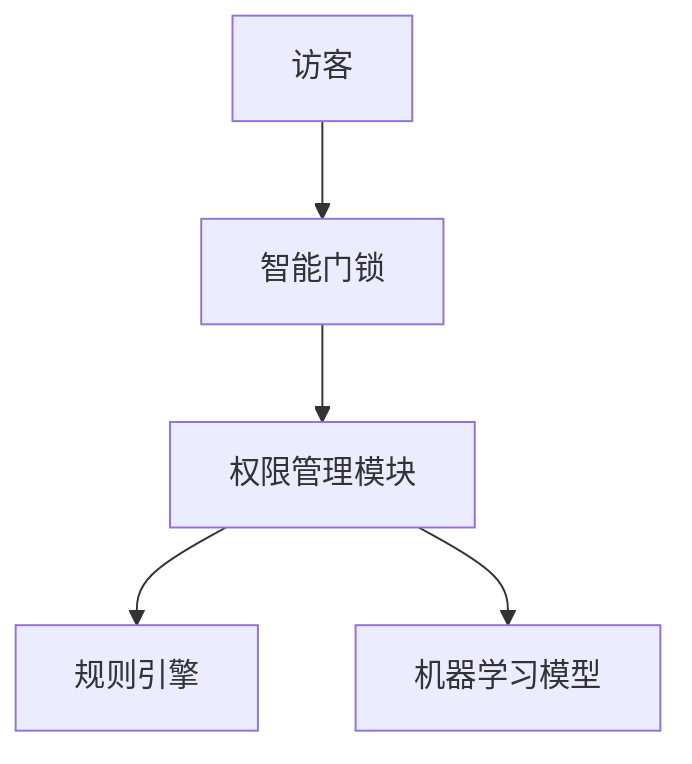
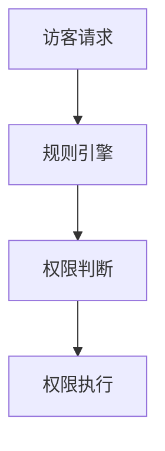
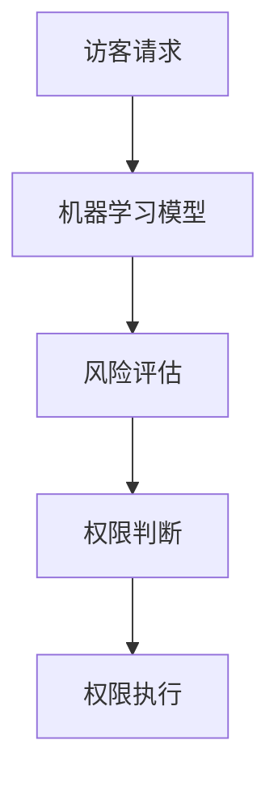
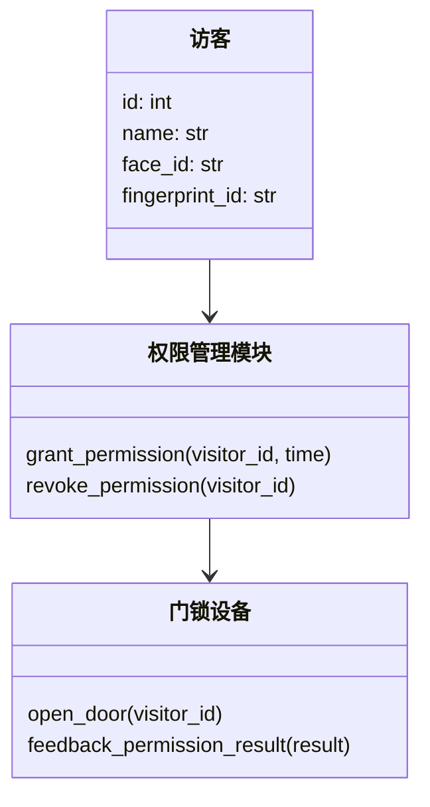
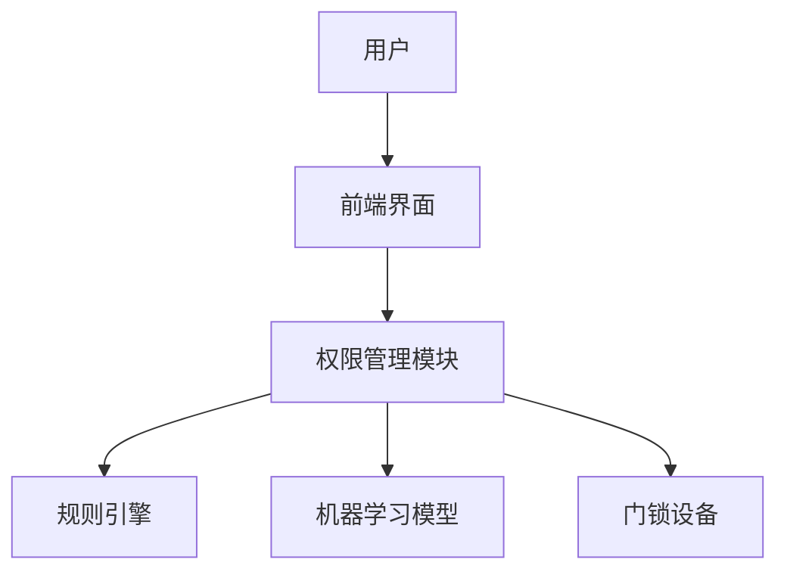

                 


# AI Agent在智能门锁中的访客权限管理

> 关键词：AI Agent, 智能门锁, 访客权限管理, 系统架构, 项目实战

> 摘要：本文详细探讨了AI Agent在智能门锁中的访客权限管理应用，从背景介绍、核心概念、算法原理、系统架构到项目实战，全面解析了AI Agent如何提升智能门锁的访客权限管理能力。通过实际案例分析和系统设计，展示了AI Agent在智能门锁中的实际应用价值，并提出了相关的实现方案和最佳实践。

---

# 第一部分: 背景介绍

## 第1章: 背景介绍

### 1.1 AI Agent与智能门锁的结合

#### 1.1.1 AI Agent的定义与特点
- AI Agent（人工智能代理）是一种能够感知环境、自主决策并执行任务的智能实体。
- 具备自主性、反应性、目标导向性和社会性的特点。
- 在智能门锁中的应用主要体现在访客身份识别、权限控制和动态调整等方面。

#### 1.1.2 智能门锁的发展历程
- 传统门锁：基于机械结构的钥匙开锁方式，安全性低，管理不便。
- 智能门锁：引入电子技术，支持刷卡、指纹、密码等多种开门方式。
- 智能门锁与AI Agent结合：通过AI技术实现访客权限的智能化管理。

#### 1.1.3 访客权限管理的重要性
- 访客权限管理是智能门锁的核心功能之一。
- 通过AI Agent实现动态权限管理，能够提升系统的安全性和便利性。

### 1.2 问题背景与问题描述

#### 1.2.1 传统门锁的权限管理痛点
- 传统门锁的权限管理依赖于物理钥匙，容易丢失和被盗。
- 权限管理缺乏灵活性，难以实现动态调整。
- 缺乏智能化的访客管理功能，无法满足多样化的使用需求。

#### 1.2.2 AI Agent在智能门锁中的应用场景
- 通过AI Agent实现访客身份的快速识别与权限分配。
- 支持远程权限管理，方便用户随时随地调整访客权限。
- 提供访客行为分析，优化权限管理策略。

#### 1.2.3 访客权限管理的核心问题
- 如何确保访客身份的真实性和合法性。
- 如何实现访客权限的动态调整与撤销。
- 如何保证权限管理的高效性和安全性。

### 1.3 问题解决与边界外延

#### 1.3.1 AI Agent如何解决访客权限管理问题
- 通过AI Agent实现访客身份的快速识别与认证。
- 支持基于规则和机器学习的动态权限分配。
- 提供访客行为分析，优化权限管理策略。

#### 1.3.2 访客权限管理的边界与限制
- 系统的边界：仅限于智能门锁的访客权限管理功能。
- 权限管理的限制：仅支持预授权的访客，不支持临时授权的访客。
- 系统的可扩展性：支持未来新增的访客管理功能。

#### 1.3.3 系统的可扩展性与兼容性
- 系统设计具备良好的可扩展性，支持未来新增的功能模块。
- 兼容性设计：支持多种身份识别方式（如指纹、人脸识别等）。

### 1.4 概念结构与核心要素组成

#### 1.4.1 AI Agent在访客权限管理中的角色
- AI Agent作为系统的核心组件，负责访客身份识别、权限分配和行为分析。
- 通过与智能门锁设备的交互，实现访客权限的动态管理。

#### 1.4.2 核心要素的定义与关系
- 核心要素包括：访客身份、权限、时间、设备状态等。
- 访客身份与权限的关系：访客权限基于身份和时间进行动态调整。
- 设备状态与权限的关系：设备状态影响权限的执行。

---

# 第二部分: 核心概念与联系

## 第2章: AI Agent的核心原理

### 2.1 AI Agent的核心原理

#### 2.1.1 AI Agent的基本工作流程
1. 感知环境：通过传感器或API获取环境信息（如访客身份、时间等）。
2. 分析决策：基于规则或机器学习模型，分析信息并做出决策。
3. 执行操作：根据决策结果，执行相应的操作（如授予或撤销权限）。

#### 2.1.2 基于规则的AI Agent
- 规则定义：通过预定义的规则进行权限管理。
- 例如：访客在特定时间内的访问权限。

#### 2.1.3 基于机器学习的AI Agent
- 使用机器学习模型分析访客行为，动态调整权限。
- 例如：基于访客的历史行为和当前行为，预测其潜在风险。

### 2.2 AI Agent与智能门锁的交互机制

#### 2.2.1 门锁设备的感知与反馈
- 感知：AI Agent通过门锁设备获取访客的身份信息（如指纹、人脸识别结果）。
- 反馈：门锁设备向AI Agent反馈权限执行结果（如开门成功或失败）。

#### 2.2.2 基于规则的权限分配
- 规则定义：通过预定义的规则进行权限分配。
- 例如：访客在特定时间段内具有访问权限。

#### 2.2.3 基于机器学习的动态权限分配
- 通过机器学习模型分析访客行为，动态调整权限。
- 例如：访客多次尝试非法开门，系统自动撤销其权限。

---

## 第3章: 核心概念与联系

### 3.1 核心概念的特征对比

| 概念       | 特征1：身份识别 | 特征2：权限分配 | 特征3：动态调整 |
|------------|----------------|----------------|----------------|
| 访客身份    | 基于AI技术识别  | 权限分配基于规则或机器学习 | 支持动态调整 |
| 权限        | 时间、地点、设备状态 | 基于规则或机器学习 | 支持动态调整 |

### 3.2 系统实体关系图



---

## 第4章: 算法原理

### 4.1 算法原理的讲解

#### 4.1.1 基于规则的访问控制算法



#### 4.1.2 基于机器学习的动态权限分配算法



### 4.2 算法实现的Python代码示例

#### 4.2.1 基于规则的访问控制算法

```python
def rule_based_access Control(visitor_id, time):
    # 访客身份检查
    if visitor_id not in authorized_visitors:
        return False
    # 时间检查
    if time < start_time and time > end_time:
        return False
    return True
```

#### 4.2.2 基于机器学习的动态权限分配算法

```python
from sklearn.ensemble import RandomForestClassifier

# 训练模型
model = RandomForestClassifier()
model.fit(X_train, y_train)

# 预测访客权限
def dynamic_access_control(visitor_features):
    prediction = model.predict(visitor_features)
    return prediction[0]
```

### 4.3 数学模型与公式

#### 4.3.1 基于规则的访问控制模型

$$ authorized = (visitor\_id \in authorized\_list) \land (time \in allowed\_time\_range) $$

#### 4.3.2 基于机器学习的动态权限分配模型

$$ prediction = \text{model.predict}(\text{visitor\_features}) $$

---

## 第5章: 系统分析与架构设计

### 5.1 系统分析

#### 5.1.1 项目介绍
- 项目目标：实现基于AI Agent的智能门锁访客权限管理功能。
- 项目范围：支持访客身份识别、权限分配和行为分析。

#### 5.1.2 系统功能设计

##### 5.1.2.1 领域模型



#### 5.1.2.2 系统架构设计



---

## 第6章: 项目实战

### 6.1 项目实战

#### 6.1.1 环境安装

```bash
pip install python-dotenv
pip install scikit-learn
pip install requests
```

#### 6.1.2 系统核心实现源代码

##### 6.1.2.1 访客权限管理模块

```python
from sklearn.ensemble import RandomForestClassifier
import requests

class VisitorPermissionManager:
    def __init__(self):
        self.model = RandomForestClassifier()
        self.authorized_visitors = []

    def train_model(self, X_train, y_train):
        self.model.fit(X_train, y_train)

    def grant_permission(self, visitor_id):
        self.authorized_visitors.append(visitor_id)

    def revoke_permission(self, visitor_id):
        if visitor_id in self.authorized_visitors:
            self.authorized_visitors.remove(visitor_id)

    def check_permission(self, visitor_id):
        return visitor_id in self.authorized_visitors
```

##### 6.1.2.2 门锁设备接口

```python
class DoorLock:
    def __init__(self):
        self.current_state = "locked"

    def open_door(self, visitor_id):
        if self.check_permission(visitor_id):
            self.current_state = "unlocked"
            return True
        else:
            return False

    def check_permission(self, visitor_id):
        # 假设权限管理模块已经处理过权限分配
        return True
```

---

## 第7章: 总结与展望

### 7.1 总结

#### 7.1.1 核心总结
- 本文详细探讨了AI Agent在智能门锁中的访客权限管理应用。
- 通过系统架构设计和项目实战，展示了AI Agent如何提升访客权限管理的效率和安全性。

#### 7.1.2 最佳实践 tips
- 在实际应用中，建议结合规则和机器学习模型进行动态权限管理。
- 系统设计时，需考虑数据安全和隐私保护。

### 7.2 展望

#### 7.2.1 未来技术发展
- 基于AI的访客行为分析将进一步优化权限管理策略。
- 结合区块链技术，实现更加安全的权限管理。

#### 7.2.2 未来应用方向
- 智能门锁与智能家居的深度融合。
- 基于AI的访客权限管理在更多场景中的应用。

---

通过以上结构化的内容，我们可以看到，AI Agent在智能门锁中的访客权限管理不仅是一种技术上的创新，更是提升智能门锁功能和安全性的关键。未来，随着AI技术的不断发展，访客权限管理将更加智能化、动态化和个性化。

