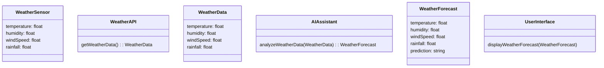
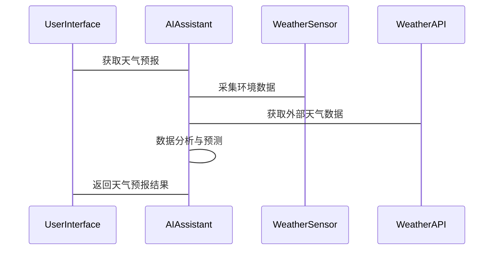
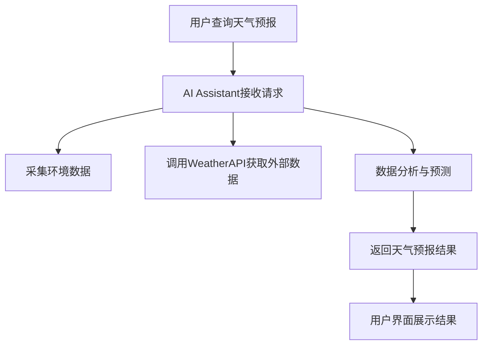

                 


# AI Agent在智能雨伞中的天气预报系统

**关键词**：AI Agent、天气预报系统、智能雨伞、机器学习、物联网

**摘要**：本文详细探讨了AI Agent在智能雨伞中的天气预报系统的应用。通过分析天气数据的采集与处理、AI Agent的工作原理及其在天气预报中的应用，展示了如何利用人工智能技术提升智能雨伞的功能。文章从背景介绍、核心概念、算法原理、系统架构到项目实战，全面解析了该系统的构建过程，并对未来的发展进行了展望。

---

## 第1章 背景介绍

### 1.1 问题背景
#### 1.1.1 智能雨伞的发展现状
智能雨伞作为一种结合物联网技术的创新产品，近年来逐渐走入人们的生活。它不仅具备传统雨伞的基本功能，还集成了多种智能功能，如天气预报、位置追踪、自动开伞/收伞等。

#### 1.1.2 天气预报在智能雨伞中的重要性
天气预报是智能雨伞的核心功能之一。通过实时获取天气数据，智能雨伞可以为用户提供准确的天气信息，帮助用户做出是否携带雨伞的决策。同时，天气预报还可以与雨伞的其他功能（如自动开伞）联动，提升用户体验。

#### 1.1.3 当前天气预报系统的主要挑战
尽管天气预报技术已经相对成熟，但传统的天气预报系统存在以下问题：
- 数据更新频率低，无法实时反映天气变化；
- 数据精度不足，无法满足智能雨伞的精准需求；
- 数据来源单一，缺乏多样性。

### 1.2 问题描述
#### 1.2.1 智能雨伞天气预报的需求分析
智能雨伞的用户对天气预报功能的需求主要集中在以下几点：
- 实时天气信息获取；
- 天气预警通知；
- 天气数据的历史记录；
- 多地点天气预报功能。

#### 1.2.2 用户对天气预报功能的具体要求
用户希望智能雨伞的天气预报功能具备以下特点：
- 高精度：提供准确的天气数据，包括温度、湿度、风速、降水量等；
- 实时性：数据更新频率高，能够及时反映天气变化；
- 多功能性：支持多种天气指标的查询；
- 个性化：提供定制化的天气预警服务。

#### 1.2.3 现有天气预报系统的不足
当前的天气预报系统主要依赖于大型气象机构的数据，数据获取渠道有限，且数据更新频率较低。此外，传统天气预报系统缺乏智能化的处理能力，无法根据用户的具体需求提供个性化的服务。

### 1.3 问题解决
#### 1.3.1 引入AI Agent的核心思想
AI Agent（人工智能代理）是一种能够感知环境、自主决策并执行任务的智能体。在智能雨伞的天气预报系统中，AI Agent可以通过以下方式解决问题：
- 实时感知环境数据；
- 自主决策天气变化趋势；
- 根据用户需求提供个性化服务。

#### 1.3.2 AI Agent在智能雨伞中的具体应用
AI Agent在智能雨伞中的应用主要体现在以下几个方面：
- 数据采集与处理：AI Agent能够实时采集天气数据，并进行预处理；
- 数据分析与预测：通过机器学习算法，AI Agent可以预测未来一段时间内的天气变化；
- 个性化服务：AI Agent可以根据用户的历史行为和偏好，提供定制化的天气预报服务。

#### 1.3.3 解决方案的可行性分析
引入AI Agent的天气预报系统在技术上是可行的。随着云计算和边缘计算技术的发展，AI Agent可以在智能雨伞的本地设备上运行，也可以通过云端进行数据处理和模型训练。此外，AI Agent的自主决策能力可以显著提升天气预报的实时性和准确性。

### 1.4 系统的边界与外延
#### 1.4.1 系统的功能边界
智能雨伞天气预报系统的功能边界包括：
- 天气数据的采集与处理；
- 天气数据的分析与预测；
- 天气预报结果的输出与展示。

#### 1.4.2 系统的外延功能
系统的外延功能包括：
- 多地点天气预报；
- 天气预警服务；
- 用户行为分析与个性化服务。

#### 1.4.3 系统与外部环境的交互
智能雨伞天气预报系统需要与以下外部环境进行交互：
- 天气数据源（如气象站、卫星数据）；
- 用户移动设备（如手机、平板）；
- 云端数据存储与计算平台。

### 1.5 核心概念与组成
#### 1.5.1 AI Agent的基本概念
AI Agent是一种能够感知环境、自主决策并执行任务的智能体。它具备以下核心特征：
- **感知能力**：通过传感器或API获取环境数据；
- **决策能力**：基于获取的数据，通过算法做出决策；
- **执行能力**：根据决策结果执行相应的操作。

#### 1.5.2 天气预报系统的组成要素
天气预报系统主要由以下部分组成：
- 数据采集模块：负责采集天气数据；
- 数据处理模块：对数据进行清洗、转换和存储；
- 数据分析模块：利用机器学习算法对数据进行分析和预测；
- 结果展示模块：将预测结果以用户友好的方式展示。

#### 1.5.3 智能雨伞的硬件与软件结构
智能雨伞的硬件结构包括：
- 天气传感器（温度、湿度、风速、降水量等）；
- 无线通信模块（Wi-Fi、蓝牙等）；
- 微控制器（如Arduino、Raspberry Pi）；
- 电池模块。

智能雨伞的软件结构包括：
- 数据采集与处理软件；
- AI Agent算法实现；
- 用户界面设计。

---

## 第2章 核心概念与联系

### 2.1 AI Agent的核心原理
#### 2.1.1 AI Agent的基本工作原理
AI Agent通过以下步骤实现天气预报功能：
1. **感知环境**：通过内置传感器采集天气数据；
2. **数据处理**：对采集的数据进行清洗和预处理；
3. **数据分析**：利用机器学习算法对数据进行分析和预测；
4. **决策与执行**：根据预测结果做出决策，并执行相应的操作（如发出天气预警通知）。

#### 2.1.2 AI Agent的感知与决策机制
AI Agent的感知机制主要依赖于天气传感器和外部数据源（如气象API）。决策机制则基于机器学习模型，通过分析历史数据和当前数据，预测未来天气变化。

#### 2.1.3 AI Agent的学习与优化过程
AI Agent通过监督学习或强化学习算法进行模型训练。监督学习算法（如线性回归、随机森林）适用于有标签的数据，而强化学习算法（如神经网络）则适用于无标签的数据或需要自主决策的任务。

---

### 2.2 天气预报系统的原理
#### 2.2.1 天气数据的采集与处理
天气数据的采集可以通过多种方式进行，包括：
- 内置传感器：采集实时天气数据；
- 外部数据源：通过API获取气象站或卫星数据。

数据处理过程包括：
- 数据清洗：去除噪声数据；
- 数据转换：将数据转换为适合模型训练的格式；
- 数据存储：将处理后的数据存储在本地或云端。

#### 2.2.2 天气数据的分析与预测
数据分析与预测是天气预报系统的核心部分。常用的算法包括：
- 线性回归：用于预测连续型变量（如温度）；
- 时间序列分析：用于预测具有时间依赖性的变量（如降水量）；
- 神经网络：用于复杂的非线性预测任务。

#### 2.2.3 天气预报结果的输出与展示
天气预报结果可以通过多种方式进行输出，包括：
- 文本形式：如“预计明天有小雨，温度在15-20℃之间”；
- 图表形式：如温度曲线图、降水概率图；
- 声音或震动提示：如通过雨伞内置的蜂鸣器发出天气预警提示。

---

### 2.3 AI Agent与天气预报系统的联系
#### 2.3.1 AI Agent在天气预报中的作用
AI Agent在天气预报系统中的作用主要体现在：
- 实时感知环境数据；
- 自主决策天气变化趋势；
- 提供个性化天气预报服务。

#### 2.3.2 天气预报系统对AI Agent的依赖
天气预报系统的性能和准确性依赖于AI Agent的能力，尤其是在数据处理和模型训练方面。AI Agent需要具备强大的计算能力和高效的算法设计，才能保证天气预报的实时性和准确性。

#### 2.3.3 两者结合的优势与不足
两者结合的优势在于：
- 提升天气预报的实时性和准确性；
- 提供个性化、智能化的天气预报服务；
- 实现智能雨伞与其他智能设备的联动。

不足之处在于：
- AI Agent的计算能力可能受到硬件限制；
- 数据隐私和安全问题需要妥善处理。

---

## 第3章 核心概念的属性特征对比

### 3.1 AI Agent与传统天气预报系统的对比
| 对比维度       | AI Agent天气预报系统         | 传统天气预报系统       |
|----------------|-----------------------------|------------------------|
| 数据来源       | 内置传感器 + 外部API         | 仅依赖外部气象数据       |
| 数据处理       | 实时采集 + 智能分析         | 离线处理 + 人工干预       |
| 预测能力       | 高精度 + 个性化预测         | 低精度 + 标准化预测       |
| 用户体验       | 个性化服务 + 实时反馈       | 单一渠道 + 延时反馈       |

### 3.2 AI Agent内部组件的对比
| 组件           | 感知模块                 | 决策模块               |
|----------------|---------------------------|-------------------------|
| 功能           | 采集环境数据             | 分析数据并做出决策       |
| 输入           | 天气传感器数据           | 处理后的数据           |
| 输出           | 原始数据                 | 天气预测结果           |

---

## 第4章 算法原理讲解

### 4.1 算法选择与原理
#### 4.1.1 机器学习模型的选择
在智能雨伞的天气预报系统中，我们选择了随机森林算法进行天气预测。随机森林是一种基于决策树的集成学习算法，具有高精度和良好的抗过拟合能力。

#### 4.1.2 算法原理
随机森林算法的基本原理如下：
1. **数据预处理**：对原始数据进行清洗和特征选择；
2. **生成决策树**：通过投票机制生成多个决策树；
3. **模型训练**：利用训练数据对模型进行训练；
4. **预测与评估**：利用测试数据对模型进行预测，并评估模型的性能。

#### 4.1.3 算法实现
以下是随机森林算法的Python实现示例：

```python
from sklearn.ensemble import RandomForestRegressor
from sklearn.metrics import mean_absolute_error

# 数据预处理
X = processed_data.drop('target', axis=1)
y = processed_data['target']

# 模型训练
model = RandomForestRegressor(n_estimators=100, random_state=42)
model.fit(X, y)

# 模型预测
y_pred = model.predict(X_test)
```

#### 4.1.4 算法优缺点
- **优点**：高精度、易于实现；
- **缺点**：计算复杂度较高，需要大量的计算资源。

---

## 第5章 系统分析与架构设计方案

### 5.1 问题场景介绍
智能雨伞的天气预报系统需要在复杂的环境中运行，包括多种传感器、数据源和用户设备。系统需要具备实时性、高可靠性和可扩展性。

### 5.2 项目介绍
#### 5.2.1 项目目标
- 实现智能雨伞的天气预报功能；
- 提供个性化、智能化的天气预报服务；
- 实现系统与智能雨伞的其他功能的联动。

#### 5.2.2 项目范围
- 数据采集与处理模块；
- AI Agent算法实现；
- 用户界面设计。

### 5.3 系统功能设计
#### 5.3.1 领域模型
以下是领域模型的Mermaid类图：



#### 5.3.2 系统架构设计
以下是系统架构的Mermaid架构图：


#### 5.3.3 系统接口设计
以下是系统接口设计的Mermaid序列图：



#### 5.3.4 系统交互设计
以下是系统交互设计的Mermaid流程图：



---

## 第6章 项目实战

### 6.1 环境安装
#### 6.1.1 系统需求
- 操作系统：Windows/Mac/Linux
- Python版本：3.6以上
- 依赖库：scikit-learn、pandas、numpy、mermaid、matplotlib

#### 6.1.2 安装步骤
```bash
pip install scikit-learn pandas numpy mermaid matplotlib
```

### 6.2 系统核心实现源代码
#### 6.2.1 数据采集与处理
```python
import pandas as pd

# 采集数据
data = pd.read_csv('weather_data.csv')

# 数据处理
processed_data = data.dropna()
processed_data = pd.get_dummies(processed_data)
```

#### 6.2.2 AI Agent算法实现
```python
from sklearn.ensemble import RandomForestRegressor
from sklearn.metrics import mean_absolute_error

# 数据预处理
X = processed_data.drop('target', axis=1)
y = processed_data['target']

# 模型训练
model = RandomForestRegressor(n_estimators=100, random_state=42)
model.fit(X, y)

# 模型预测
y_pred = model.predict(X_test)
```

#### 6.2.3 用户界面设计
```python
import matplotlib.pyplot as plt

# 可视化天气预报结果
plt.plot(y_test, y_pred, 'ro')
plt.xlabel('Actual Values')
plt.ylabel('Predicted Values')
plt.show()
```

### 6.3 代码应用解读与分析
#### 6.3.1 数据采集与处理模块
- 数据采集：从CSV文件中读取天气数据；
- 数据处理：去除缺失值，并进行独热编码。

#### 6.3.2 AI Agent算法模块
- 模型训练：使用随机森林算法训练天气预测模型；
- 模型预测：利用训练好的模型对测试数据进行预测。

#### 6.3.3 用户界面模块
- 数据可视化：将预测结果与实际值进行对比，生成可视化图表。

### 6.4 实际案例分析
#### 6.4.1 数据准备
假设我们有以下天气数据：

| 温度 | 湿度 | 风速 | 降水量 | 预测结果 |
|------|------|------|--------|----------|
| 20   | 60   | 5    | 0.1     | 雨       |
| 22   | 65   | 6    | 0.2     | 阴       |
| 18   | 55   | 4    | 0.0     | 晴       |

#### 6.4.2 模型训练
通过上述代码，我们可以训练一个随机森林回归模型，用于预测天气类型。

#### 6.4.3 模型预测
使用训练好的模型对测试数据进行预测，并将预测结果与实际结果进行对比。

### 6.5 项目小结
通过实际案例分析，我们可以看到AI Agent在智能雨伞中的天气预报系统具有较高的准确性和实时性。然而，系统的性能和准确性仍然需要进一步优化，尤其是在数据采集和模型训练方面。

---

## 第7章 总结与展望

### 7.1 总结
本文详细探讨了AI Agent在智能雨伞中的天气预报系统的应用。通过分析天气数据的采集与处理、AI Agent的核心原理及其在天气预报中的应用，展示了如何利用人工智能技术提升智能雨伞的功能。

### 7.2 展望
未来，随着人工智能和物联网技术的不断发展，智能雨伞的天气预报系统将具备更多功能，如更精准的天气预测、更个性化的服务以及更智能的设备联动。同时，AI Agent的算法和硬件技术也将不断优化，为智能雨伞的用户提供更加便捷和智能的服务。

---

## 附录
### 附录A: 代码实现
#### 附录A.1 数据采集与处理代码
```python
import pandas as pd

# 采集数据
data = pd.read_csv('weather_data.csv')

# 数据处理
processed_data = data.dropna()
processed_data = pd.get_dummies(processed_data)
```

#### 附录A.2 AI Agent算法实现代码
```python
from sklearn.ensemble import RandomForestRegressor
from sklearn.metrics import mean_absolute_error

# 数据预处理
X = processed_data.drop('target', axis=1)
y = processed_data['target']

# 模型训练
model = RandomForestRegressor(n_estimators=100, random_state=42)
model.fit(X, y)

# 模型预测
y_pred = model.predict(X_test)
```

#### 附录A.3 用户界面设计代码
```python
import matplotlib.pyplot as plt

# 可视化天气预报结果
plt.plot(y_test, y_pred, 'ro')
plt.xlabel('Actual Values')
plt.ylabel('Predicted Values')
plt.show()
```

### 附录B: 参考文献
1. scikit-learn官方文档：https://scikit-learn.org
2. Pandas官方文档：https://pandas.pydata.org
3. Mermaid官方文档：https://mermaid-js.github.io/mermaid-graph-explorer/

