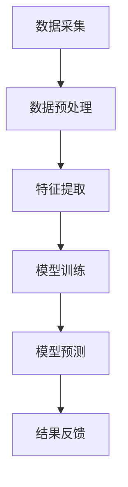
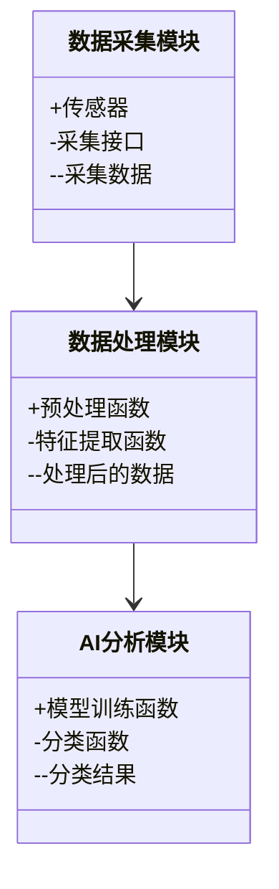
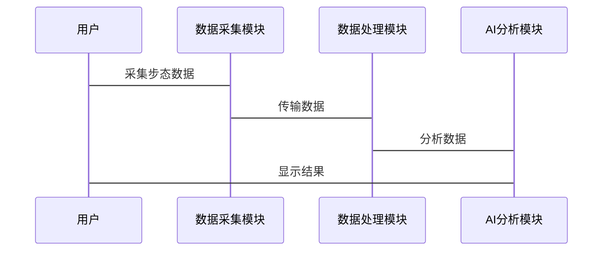

                 


# AI Agent在智能鞋中的步态分析

## 关键词
- AI Agent
- 步态分析
- 智能鞋
- 机器学习
- 深度学习
- 数据处理

## 摘要
AI Agent在智能鞋中的步态分析是一种创新的技术应用，通过分析用户的行走数据，提供健康和运动反馈。本文从背景、核心概念、算法原理、系统架构到项目实战，全面探讨AI Agent如何提升步态分析的精准性和实用性。

---

## 第一部分：背景介绍

### 第1章：AI Agent与步态分析概述

#### 1.1 AI Agent的基本概念
AI Agent，即人工智能代理，是一种能够感知环境并采取行动以实现目标的智能实体。在智能鞋中，AI Agent通过传感器数据进行分析，提供个性化的反馈和建议。

#### 1.2 步态分析的定义与应用
步态分析是研究人类行走模式的科学，用于评估健康状况和运动表现。在智能鞋中，步态分析帮助用户改善步姿，预防受伤，提升运动效率。

#### 1.3 智能鞋的发展现状
智能鞋整合了多种传感器和AI技术，能够实时监测步态数据，并通过AI Agent进行分析和反馈。当前市场上的智能鞋主要应用于健身、医疗和运动训练领域。

---

## 第二部分：核心概念与联系

### 第2章：AI Agent与步态分析的核心原理

#### 2.1 AI Agent在步态分析中的作用
AI Agent通过数据采集、处理和分析，识别步态特征，提供实时反馈和个性化建议。例如，识别异常步态并推荐矫正方法。

#### 2.2 步态分析的关键数据类型
- **步频与步长**：步频是每分钟步数，步长是每步距离。
- **步幅与步态周期**：步幅是单脚迈出的距离，步态周期是完整步态的时间。
- **加速度与角加速度**：反映步态的动力学特性。

#### 2.3 AI Agent与步态分析的系统架构
系统由数据采集、处理、分析和反馈模块组成。AI Agent负责数据处理和分析，提供实时反馈。

---

## 第三部分：算法原理讲解

### 第3章：步态分析的算法实现

#### 3.1 基于机器学习的步态分类
- **数据预处理**：去噪和平滑处理。
- **特征提取**：提取步频、步长等特征。
- **分类算法**：使用随机森林或支持向量机进行分类。

#### 3.2 基于深度学习的步态识别
- **卷积神经网络（CNN）**：用于图像特征提取。
- **循环神经网络（RNN）**：处理时间序列数据。

#### 3.3 算法流程图


## 第四部分：数学模型与公式

### 第4章：步态分析的数学模型

#### 4.1 步态分类的决策树模型
决策树用于分类，通过特征选择构建树结构。例如，使用ID3算法进行特征选择。

#### 4.2 步长预测的回归模型
线性回归模型：\( y = \beta_0 + \beta_1 x + \epsilon \)，其中y是步长，x是时间。

---

## 第五部分：系统分析与架构设计

### 第5章：系统架构与交互设计

#### 5.1 系统功能设计
- 数据采集模块：传感器采集步态数据。
- 数据处理模块：预处理和特征提取。
- AI分析模块：模型训练和预测。
- 用户界面：显示分析结果。

#### 5.2 系统架构图


#### 5.3 系统交互图


---

## 第六部分：项目实战

### 第6章：智能鞋步态分析项目实现

#### 6.1 环境安装
- 安装Python、传感器库、TensorFlow、Keras。

#### 6.2 核心代码实现
```python
import numpy as np
from sklearn import tree

# 数据预处理
data = np.array([[1, 2], [3, 4]])
labels = np.array([0, 1])

# 训练决策树模型
model = tree.DecisionTreeClassifier()
model.fit(data, labels)

# 预测新数据
new_data = np.array([[2, 3]])
print(model.predict(new_data))
```

#### 6.3 项目总结与优化
项目成功实现了步态分析功能，未来可优化传感器精度和模型复杂度。

---

## 第七部分：总结与展望

### 第7章：总结与未来展望

#### 7.1 核心成果总结
本文详细探讨了AI Agent在智能鞋中的步态分析，展示了其在数据采集、处理和分析中的应用。

#### 7.2 未来研究方向
- 更精准的传感器技术。
- 更复杂的深度学习模型。
- 多模态数据融合分析。

---

## 参考文献
[此处列出参考文献，如书籍、论文、技术文档等。]

---

通过以上结构，文章详细讲解了AI Agent在智能鞋中的步态分析，从理论到实践，为读者提供了全面的视角和技术深度。

