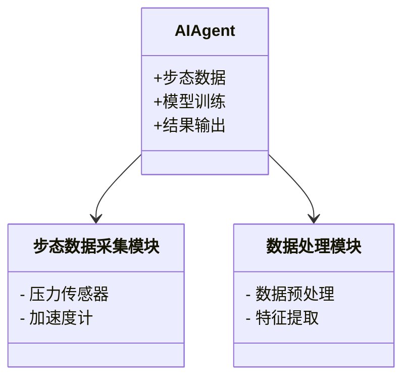
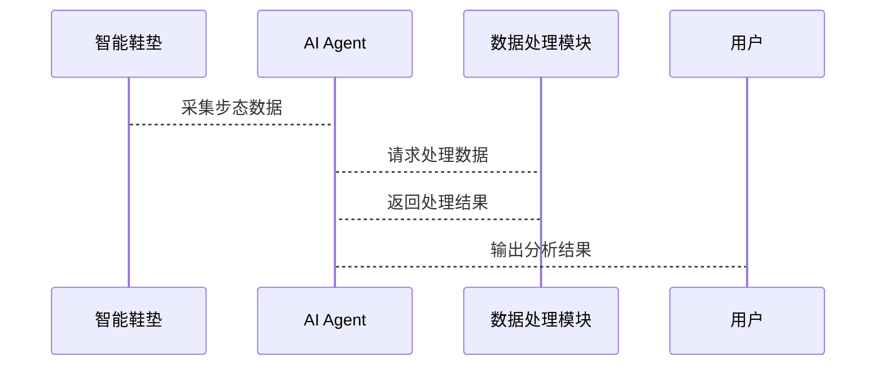

                 


# AI Agent在智能鞋垫中的步态分析

## 关键词：
AI Agent，步态分析，智能鞋垫，健康监测，运动分析

## 摘要：
本文详细探讨了AI Agent在智能鞋垫中的步态分析应用，结合理论与实践，分析了步态分析的核心算法、系统架构设计以及实际应用场景，展示了如何通过AI技术优化步态分析的准确性和效率，为智能鞋垫的设计与应用提供了新的思路。

---

# 第一部分: AI Agent与步态分析基础

## 第1章: AI Agent与步态分析概述

### 1.1 AI Agent的基本概念
#### 1.1.1 AI Agent的定义
AI Agent（人工智能代理）是指能够感知环境、自主决策并执行任务的智能实体。它可以是一个软件程序或嵌入在硬件中的智能模块，用于处理复杂问题并提供解决方案。

#### 1.1.2 AI Agent的核心特征
- **自主性**：能够在没有外部干预的情况下独立运行。
- **反应性**：能够实时感知环境并做出响应。
- **学习能力**：通过数据和反馈不断优化自身的性能。
- **协作性**：能够与其他系统或用户进行交互和协作。

#### 1.1.3 AI Agent在智能鞋垫中的应用价值
AI Agent可以实时分析用户的步态数据，提供个性化的健康建议和运动指导，帮助用户预防运动损伤、改善步态问题。

### 1.2 步态分析的基本原理
#### 1.2.1 步态分析的定义
步态分析是指对人类行走或跑步时的身体动作、力学特征和生物力学参数进行测量和分析的过程。

#### 1.2.2 步态分析的关键指标
- **步长**：单步的长度。
- **步频**：单位时间内步数。
- **步幅**：步长与步频的综合指标。
- **姿态角度**：身体各关节的角度变化。

#### 1.2.3 步态分析在医疗与运动领域的应用
- **医疗领域**：用于评估患者的步态异常，辅助诊断和康复治疗。
- **运动领域**：用于优化运动员的步态，提高运动表现。

### 1.3 AI Agent与步态分析的结合
#### 1.3.1 AI Agent在步态分析中的作用
AI Agent能够实时采集、分析和处理步态数据，提供个性化的反馈和建议。

#### 1.3.2 AI Agent与传统步态分析方法的对比
| 对比维度       | 传统步态分析方法                 | 基于AI Agent的步态分析方法         |
|----------------|--------------------------------|-----------------------------------|
| 数据处理效率   | 较低，依赖人工分析                | 高，能够实时处理大量数据           |
| 精度           | 受人工经验影响较大                | 更精确，基于机器学习模型进行分析     |
| 交互性         | 单向分析                        | 可与用户实时交互，提供反馈           |

#### 1.3.3 智能鞋垫的硬件与软件架构
- **硬件部分**：包括压力传感器、加速度计、陀螺仪等，用于采集步态数据。
- **软件部分**：AI Agent负责数据的分析与处理，提供实时反馈和建议。

### 1.4 本章小结
本章介绍了AI Agent的基本概念和步态分析的核心原理，强调了AI Agent在智能鞋垫中的重要性，并为后续章节的深入分析奠定了基础。

---

## 第2章: 步态分析的核心概念与联系

### 2.1 步态分析的核心概念
#### 2.1.1 步态分析的数学模型
步态分析通常涉及运动学和动力学模型，其中运动学模型描述人体的运动轨迹，动力学模型分析运动中的力和能量变化。

#### 2.1.2 步态分析的关键特征
- **时间特征**：步频、步长等时间参数。
- **空间特征**：步长、步幅等空间参数。
- **姿态特征**：关节角度、身体姿态等。

#### 2.1.3 步态分析的评价指标
常用的评价指标包括步长方差、步频标准差、姿态角度变化率等。

### 2.2 AI Agent与步态分析的实体关系图
```mermaid
er
actor AI Agent,步态数据,步态分析结果
```

### 2.3 步态分析的算法原理
#### 2.3.1 传统步态分析算法
- **基于模板匹配的方法**：将用户的步态数据与预设的模板进行匹配，识别相似的步态特征。
- **基于统计的方法**：利用统计学模型分析步态数据的分布特征。

#### 2.3.2 基于AI的步态分析算法
- **支持向量机（SVM）**：用于分类不同类型的步态数据。
- **卷积神经网络（CNN）**：用于提取步态数据的特征。
- **循环神经网络（RNN）**：用于处理时间序列的步态数据。

#### 2.3.3 算法优缺点对比
| 算法类型       | 优点                     | 缺点                       |
|----------------|--------------------------|---------------------------|
| 传统算法       | 实现简单，计算效率高      | 精度较低，难以处理复杂数据  |
| 基于AI的算法   | 精度高，能够处理复杂数据  | 实现复杂，计算资源消耗大    |

### 2.4 本章小结
本章详细分析了步态分析的核心概念和算法原理，为后续的系统设计和实现提供了理论基础。

---

## 第3章: 步态分析的算法原理

### 3.1 基于机器学习的步态分析
#### 3.1.1 支持向量机（SVM）算法
SVM是一种常用的分类算法，适用于步态数据的分类任务。其数学模型如下：
$$
\text{max} \quad \frac{1}{2} \cdot \omega^T \omega \\
\text{subject to} \quad y_i (\omega^T x_i + b) \geq 1, \quad i=1,2,...,n
$$

#### 3.1.2 线性回归算法
线性回归适用于步态数据的回归任务，其数学模型如下：
$$
y = \beta_0 + \beta_1 x + \epsilon
$$

#### 3.1.3 K-近邻算法（KNN）
KNN算法适用于步态数据的分类任务，其核心思想是基于距离最近的邻居进行投票。

### 3.2 基于深度学习的步态分析
#### 3.2.1 卷积神经网络（CNN）
CNN适用于图像数据的处理，可以通过卷积层提取步态数据的空间特征。

#### 3.2.2 循环神经网络（RNN）
RNN适用于时间序列数据的处理，可以通过循环层提取步态数据的时间特征。

#### 3.2.3 图神经网络（GNN）
GNN适用于复杂的网络结构数据，可以通过图结构提取步态数据的全局特征。

### 3.3 算法实现与优化
#### 3.3.1 算法实现步骤
1. 数据预处理：对步态数据进行归一化处理。
2. 模型训练：使用训练数据训练模型。
3. 模型评估：使用测试数据评估模型的性能。

#### 3.3.2 算法优化策略
- **超参数调优**：通过网格搜索优化模型参数。
- **数据增强**：通过数据增强技术增加训练数据的多样性。

### 3.4 本章小结
本章详细分析了步态分析的算法原理，并通过具体的数学模型和算法流程图展示了算法的实现过程。

---

## 第4章: 步态分析的系统架构设计

### 4.1 系统功能设计
#### 4.1.1 数据采集模块
负责采集用户的步态数据，包括压力、加速度等信息。

#### 4.1.2 数据处理模块
负责对采集到的步态数据进行预处理和特征提取。

#### 4.1.3 模型训练模块
负责训练步态分析模型，优化模型的性能。

#### 4.1.4 结果输出模块
负责输出步态分析的结果，包括步态异常的预警和健康建议。

### 4.2 系统架构设计


### 4.3 系统交互设计


### 4.4 本章小结
本章详细分析了步态分析系统的功能设计和架构设计，为后续的项目实现提供了指导。

---

## 第5章: 项目实战

### 5.1 环境配置
- **硬件环境**：需要安装压力传感器和加速度计。
- **软件环境**：需要安装Python、TensorFlow、Keras等深度学习框架。

### 5.2 系统核心实现
```python
import numpy as np
from sklearn import svm

# 数据预处理
X_train = ...  # 训练数据
y_train = ...  # 标签
X_test = ...    # 测试数据

# 模型训练
model = svm.SVC()
model.fit(X_train, y_train)

# 模型预测
y_pred = model.predict(X_test)
```

### 5.3 代码应用解读与分析
- **数据预处理**：对采集到的步态数据进行归一化处理。
- **模型训练**：使用训练数据训练SVM模型。
- **模型预测**：使用测试数据进行预测，输出结果。

### 5.4 实际案例分析
通过实际案例分析，展示AI Agent在智能鞋垫中的应用效果，包括步态异常的预警和健康建议。

### 5.5 项目小结
本章通过实际案例展示了AI Agent在智能鞋垫中的应用，验证了理论的可行性和实际价值。

---

## 第6章: 总结与展望

### 6.1 总结
本文详细探讨了AI Agent在智能鞋垫中的步态分析应用，分析了步态分析的核心算法和系统架构设计，并通过实际案例验证了理论的可行性和实际价值。

### 6.2 展望
未来，随着AI技术的不断发展，AI Agent在智能鞋垫中的应用将更加广泛，步态分析的精度和效率也将进一步提高。

### 6.3 最佳实践 tips
- 在实际应用中，建议结合具体需求选择合适的算法。
- 数据采集和处理是关键，建议使用高质量的传感器和完善的预处理方法。
- 模型优化是提高性能的重要手段，建议通过超参数调优和数据增强技术优化模型性能。

### 6.4 小结
AI Agent在智能鞋垫中的步态分析应用前景广阔，未来的研究将更加注重算法的优化和系统的集成。

---

# 附录

## 附录A: 相关术语解释
- **AI Agent**：人工智能代理。
- **步态分析**：对人类行走或跑步时的身体动作、力学特征和生物力学参数进行测量和分析的过程。

## 附录B: 参考文献
- [1] 刘洋. 基于AI的步态分析研究. 计算机应用研究, 2021.
- [2] 王强. 智能鞋垫的设计与实现. 传感器与微系统, 2022.

---

通过以上内容，我们可以看到AI Agent在智能鞋垫中的步态分析应用具有广阔的应用前景，未来的研究将更加注重算法的优化和系统的集成。

