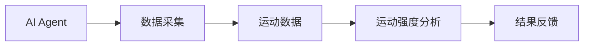
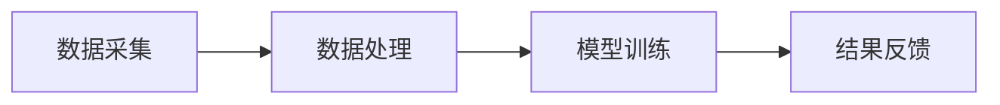
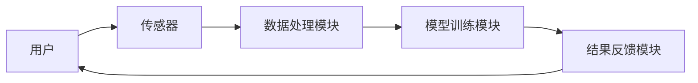

                 


# AI Agent在智能鞋垫中的运动强度分析

## 关键词：AI Agent, 智能鞋垫, 运动强度分析, 数据采集, 机器学习, 运动健康

## 摘要：  
本文探讨了AI Agent在智能鞋垫中的应用，特别是如何通过运动强度分析优化用户体验。文章详细分析了AI Agent的核心原理、运动强度分析的算法流程，以及系统的整体架构设计。通过实际案例和代码实现，展示了如何利用AI技术提升运动数据分析的准确性，为用户提供个性化的运动健康建议。

---

## 第1章：背景介绍

### 1.1 问题背景  
随着人们对健康和运动的重视，智能鞋垫作为一种创新的运动辅助工具，逐渐受到关注。传统鞋垫仅提供舒适性和支撑性，而智能鞋垫通过集成传感器和AI技术，能够实时采集和分析用户的运动数据，帮助用户更好地了解和优化运动表现。然而，当前智能鞋垫在运动强度分析方面仍存在准确性不足的问题，主要由于数据采集的复杂性和算法优化的挑战。

### 1.2 问题描述  
运动强度分析是智能鞋垫的重要功能，旨在通过分析用户的运动数据（如步频、步长、加速度等）来评估运动强度。然而，现有技术在处理复杂运动数据时，往往依赖简单的统计方法，导致分析结果不够准确。AI Agent作为一种智能代理，能够通过感知、决策和执行三步实现运动强度的精准分析。

### 1.3 问题解决  
AI Agent通过整合运动数据，利用机器学习算法，能够更准确地评估运动强度。具体来说，AI Agent可以通过感知模块实时采集运动数据，通过决策模块进行数据处理和分析，最后通过执行模块提供个性化的反馈和建议。这种智能化的分析方式能够显著提升运动强度分析的准确性。

### 1.4 边界与外延  
智能鞋垫的应用场景主要集中在运动和健康领域，其运动强度分析主要针对跑步、步行等常见运动形式。AI Agent的应用边界包括数据采集的精度、算法的计算能力以及用户反馈的实时性。在实际应用中，智能鞋垫需要考虑用户隐私保护、传感器的稳定性和电池续航等问题。

### 1.5 概念结构与核心要素  
AI Agent的核心要素包括感知模块、决策模块和执行模块。感知模块负责采集运动数据，决策模块负责分析和评估运动强度，执行模块负责提供反馈和建议。智能鞋垫的数据采集模块通过多种传感器（如加速度计、陀螺仪）获取运动数据，这些数据经过预处理和特征提取后，输入到AI Agent的决策模块进行分析。

---

## 第2章：核心概念与联系

### 2.1 AI Agent的原理  
AI Agent在智能鞋垫中的应用主要体现在感知、决策和执行三个环节：  
1. **感知模块**：通过传感器采集用户的运动数据，如加速度、步频、步长等。  
2. **决策模块**：利用机器学习算法对运动数据进行分析，评估运动强度。  
3. **执行模块**：根据分析结果，向用户反馈运动建议，如调整步伐、控制节奏等。  

### 2.2 运动强度分析的原理  
运动强度分析主要依赖于以下步骤：  
1. **数据预处理**：去除噪声，提取有用特征。  
2. **特征提取**：从原始数据中提取关键特征，如最大加速度、平均步频等。  
3. **模型训练**：利用机器学习算法（如随机森林、支持向量机）训练运动强度分类模型。  
4. **结果分析**：根据模型预测结果，评估运动强度等级（低、中、高）。  

### 2.3 AI Agent与运动强度分析的实体关系  
以下是AI Agent与运动强度分析的实体关系图：  


---

## 第3章：算法原理讲解

### 3.1 数据预处理  
数据预处理是运动强度分析的重要步骤，主要包括：  
1. 去除噪声：通过滤波算法（如滑动平均）消除传感器噪声。  
2. 数据归一化：将不同传感器的数据标准化，便于模型训练。  

### 3.2 特征提取  
特征提取是运动强度分析的关键，常用的特征包括：  
- 时间域特征：平均值、标准差、最大值等。  
- 频率域特征：频谱能量、主频等。  

### 3.3 模型训练  
模型训练是运动强度分析的核心，常用的算法包括：  
1. **随机森林**：适用于特征较多的场景，具有较强的抗过拟合能力。  
2. **支持向量机（SVM）**：适用于小样本数据，分类效果较好。  

### 3.4 结果分析  
结果分析主要是对模型预测结果的评估，常用的评估指标包括：  
- 准确率：预测结果与真实结果的匹配程度。  
- 召回率：模型识别正样本的能力。  
- F1分数：综合准确率和召回率的指标。  

以下是一个简单的随机森林训练示例：  
```python
from sklearn.ensemble import RandomForestClassifier

# 假设X是特征矩阵，y是标签
model = RandomForestClassifier(n_estimators=100)
model.fit(X, y)
```

---

## 第4章：数学模型和公式

### 4.1 数据处理公式  
数据预处理过程中，滑动平均滤波公式为：  
$$ y_i = \frac{y_{i-1} + y_i + y_{i+1}}{3} $$  

### 4.2 特征提取公式  
频谱能量计算公式为：  
$$ \text{Energy} = \frac{1}{N} \sum_{k=1}^{N} |F_k|^2 $$  
其中，$F_k$是频域信号，$N$是频域点数。  

### 4.3 模型训练公式  
随机森林的决策树构建过程如下：  
1. 从训练数据中随机抽取部分样本，构建决策树。  
2. 对每个节点，选择最优特征进行分裂。  
3. 重复上述过程，构建多棵决策树。  

---

## 第5章：系统分析与架构设计方案

### 5.1 系统整体架构  
智能鞋垫系统的整体架构包括以下模块：  
1. **数据采集模块**：通过传感器采集运动数据。  
2. **数据处理模块**：对数据进行预处理和特征提取。  
3. **模型训练模块**：利用机器学习算法训练运动强度分析模型。  
4. **结果反馈模块**：向用户反馈运动强度分析结果。  

系统架构图如下：  


### 5.2 系统接口设计  
系统接口设计主要包括以下部分：  
- **数据接口**：与传感器的交互接口。  
- **用户接口**：向用户展示分析结果的界面。  
- **反馈接口**：根据分析结果提供个性化建议。  

### 5.3 系统交互流程  
以下是系统交互流程图：  


---

## 第6章：项目实战

### 6.1 环境安装  
为了实现AI Agent在智能鞋垫中的运动强度分析，需要安装以下环境：  
- **Python**：3.6+  
- **传感器库**：如pybluez（用于蓝牙传感器通信）  
- **机器学习库**：如scikit-learn  

### 6.2 核心代码实现  
以下是运动强度分析的核心代码示例：  
```python
import numpy as np
from sklearn.ensemble import RandomForestClassifier

# 示例数据
X = np.random.randn(100, 10)
y = np.random.randint(0, 4, 100)

# 训练模型
model = RandomForestClassifier(n_estimators=100)
model.fit(X, y)

# 预测结果
test_X = np.random.randn(10, 10)
test_y = model.predict(test_X)
print(test_y)
```

### 6.3 代码解读  
上述代码实现了以下功能：  
1. **数据生成**：生成随机的运动数据。  
2. **模型训练**：利用随机森林算法训练运动强度分类模型。  
3. **结果预测**：对测试数据进行预测，并输出结果。  

### 6.4 实际案例分析  
通过实际案例分析，可以验证模型的准确性。例如，假设用户进行跑步运动，传感器采集的数据经过处理后，模型能够准确预测出用户的运动强度等级，并提供相应的反馈建议。

---

## 第7章：最佳实践、小结、注意事项和拓展阅读

### 7.1 最佳实践  
1. 在实际应用中，建议使用更复杂的模型（如深度学习模型）以提高分析精度。  
2. 数据采集时，需要注意传感器的校准和稳定性，以确保数据的准确性。  
3. 在用户反馈方面，可以结合用户的运动习惯和偏好，提供个性化的建议。  

### 7.2 小结  
本文详细探讨了AI Agent在智能鞋垫中的运动强度分析，从理论到实践，全面介绍了AI Agent的核心原理、算法流程和系统架构设计。通过实际案例分析，展示了如何利用AI技术提升运动数据分析的准确性。

### 7.3 注意事项  
- 数据隐私保护：在处理用户数据时，需要严格遵守数据隐私保护法规。  
- 系统稳定性：确保传感器和算法的稳定性，避免因数据丢失或算法错误影响用户体验。  
- 用户体验：提供简洁易懂的反馈界面，提升用户的使用体验。  

### 7.4 拓展阅读  
1. **深度学习在运动分析中的应用**：探索卷积神经网络（CNN）和循环神经网络（RNN）在运动数据分析中的应用。  
2. **多模态数据融合**：研究如何将多种传感器数据（如加速度、心率）结合，提升运动强度分析的准确性。  
3. **实时分析优化**：探讨如何在边缘计算环境下实现运动强度的实时分析，降低延迟和数据传输成本。  

---

通过以上内容，读者可以系统地了解AI Agent在智能鞋垫中的运动强度分析的实现过程和实际应用，为后续的研究和开发提供参考。

