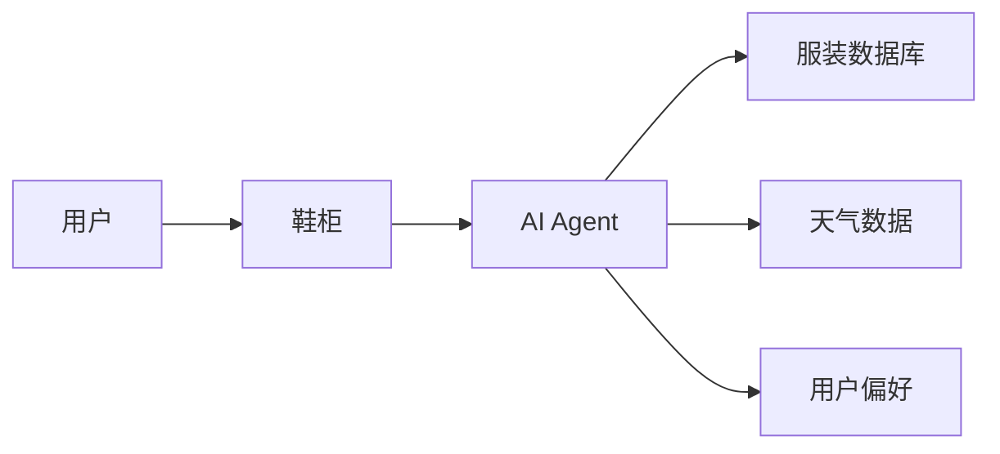
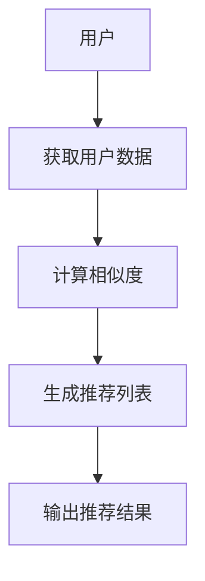
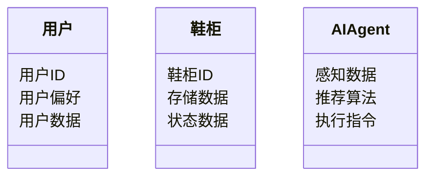
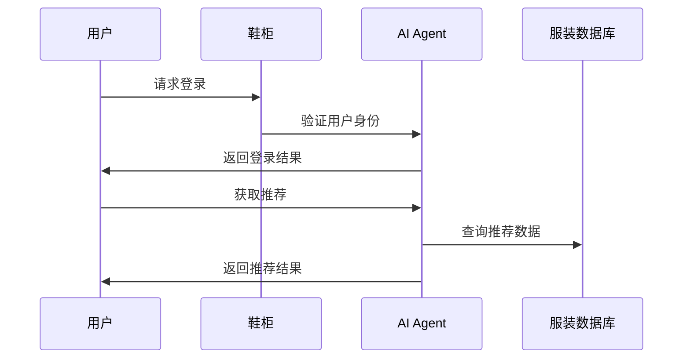

                 


# AI Agent在智能鞋柜中的穿着建议

> 关键词：AI Agent，智能鞋柜，穿着建议，推荐算法，系统架构

> 摘要：本文探讨AI Agent在智能鞋柜中的应用，重点分析其如何通过推荐算法为用户提供个性化的穿着建议。文章从AI Agent的基本概念出发，结合智能鞋柜的发展背景，详细阐述了AI Agent在推荐系统中的算法原理、系统架构设计以及实际应用案例，最后总结了项目实战经验和最佳实践。

---

# 第一部分: AI Agent与智能鞋柜概述

# 第1章: AI Agent的基本概念与应用场景

## 1.1 AI Agent的定义与核心功能

### 1.1.1 什么是AI Agent
AI Agent（人工智能代理）是一种能够感知环境、自主决策并执行任务的智能体。它通过传感器获取信息，利用算法进行分析和推理，并通过执行器完成目标。

### 1.1.2 AI Agent的核心功能
- **感知环境**：通过传感器或数据接口获取实时信息。
- **自主决策**：基于获取的信息，利用算法进行推理和决策。
- **执行任务**：根据决策结果，通过执行器完成任务。
- **学习优化**：通过反馈机制不断优化自身的决策能力。

### 1.1.3 AI Agent与传统软件的区别
| 特性          | 传统软件             | AI Agent             |
|---------------|----------------------|----------------------|
| 决策方式      | 预先编写规则         | 自主学习与优化       |
| 适应性        | 固定功能             | 高度适应环境变化     |
| 智能性        | 无智能               | 具备一定程度的智能性   |

---

## 1.2 智能鞋柜的发展历程

### 1.2.1 智能鞋柜的定义
智能鞋柜是一种结合了物联网（IoT）和人工智能技术的设备，能够通过传感器和AI算法为用户提供智能化的存储和管理服务。

### 1.2.2 智能鞋柜的发展阶段
1. **传统鞋柜**：仅具备存储功能。
2. **智能存储**：加入物联网技术，支持远程控制和状态监测。
3. **智能推荐**：集成AI技术，提供个性化建议。

### 1.2.3 智能鞋柜的市场现状
随着智能家居的普及，智能鞋柜逐渐从单一存储工具向多功能服务终端发展，市场需求持续增长。

---

## 1.3 穿着建议的场景与需求

### 1.3.1 穿着建议的基本概念
穿着建议是基于用户的体型、肤色、风格偏好以及天气、场合等因素，推荐合适的服装搭配。

### 1.3.2 用户对穿着建议的需求
- **个性化需求**：用户希望获得符合自身特点的建议。
- **实时性需求**：建议需要根据天气、时间等实时因素动态调整。
- **便捷性需求**：用户希望通过智能设备快速获取建议。

### 1.3.3 穿着建议的应用场景
1. **日常生活**：根据天气推荐衣物。
2. **工作场景**：根据会议场合推荐商务着装。
3. **运动场景**：根据运动类型推荐运动装备。

---

## 1.4 本章小结
本章介绍了AI Agent的基本概念及其在智能鞋柜中的应用场景，分析了智能鞋柜的发展历程和穿着建议的需求，为后续章节的展开奠定了基础。

---

# 第二部分: AI Agent的核心概念与原理

# 第2章: AI Agent的核心概念与联系

## 2.1 AI Agent的核心原理

### 2.1.1 AI Agent的决策机制
AI Agent的决策机制包括感知、推理和执行三个阶段。感知阶段通过传感器获取数据，推理阶段利用算法分析数据，执行阶段根据推理结果采取行动。

### 2.1.2 AI Agent的学习方法
AI Agent可以通过监督学习、无监督学习和强化学习三种方式不断优化自身的决策能力。

### 2.1.3 AI Agent的推理过程
推理过程基于知识图谱和逻辑推理规则，通过分析环境中的相关信息，生成最优决策方案。

---

## 2.2 AI Agent的核心概念对比

### 2.2.1 规则驱动与数据驱动的对比
| 特性          | 规则驱动             | 数据驱动             |
|---------------|----------------------|----------------------|
| 决策依据      | 预先定义的规则       | 历史数据和模式       |
| 灵活性        | 较低                 | 较高                 |
| 适应性        | 适应性较差           | 适应性较强           |

### 2.2.2 知识图谱与机器学习的对比
| 特性          | 知识图谱             | 机器学习             |
|---------------|----------------------|----------------------|
| 数据来源      | 结构化知识           | 非结构化数据         |
| 决策方式      | 基于规则推理         | 基于模式识别         |

### 2.2.3 单一任务与多任务的对比
| 特性          | 单一任务             | 多任务               |
|---------------|----------------------|----------------------|
| 适用场景      | 任务单一             | 任务多样             |
| 算法复杂度    | 较低                 | 较高                 |

---

## 2.3 AI Agent的实体关系图



---

## 2.4 本章小结
本章通过对比分析AI Agent的核心概念，详细阐述了其决策机制和推理过程，为后续章节的算法实现奠定了理论基础。

---

# 第三部分: AI Agent的算法原理与数学模型

# 第3章: AI Agent的推荐算法原理

## 3.1 推荐算法的基本原理

### 3.1.1 协同过滤算法
协同过滤是一种基于用户行为相似性推荐算法。通过计算用户之间的相似度，找到与目标用户行为相似的用户，推荐其喜欢的物品。

### 3.1.2 基于内容的推荐算法
基于内容的推荐算法通过分析物品的属性特征，找到与目标物品相似的物品进行推荐。

### 3.1.3 混合推荐算法
混合推荐算法结合协同过滤和基于内容的推荐算法，通过集成两种方法的优势，提高推荐的准确性和多样性。

---

## 3.2 推荐算法的数学模型

### 3.2.1 协同过滤的数学模型
$$相似度 = \frac{\sum (x_i - \bar{x})(y_i - \bar{y})}{\sqrt{\sum (x_i - \bar{x})^2} \sqrt{\sum (y_i - \bar{y})^2}}$$

### 3.2.2 基于内容的推荐模型
$$概率 = \sum w_{ij} \cdot s_j$$

---

## 3.3 AI Agent的推荐流程图



---

## 3.4 本章小结
本章详细介绍了AI Agent推荐算法的基本原理和数学模型，通过协同过滤和基于内容的推荐算法，为智能鞋柜的穿着建议提供了理论支持。

---

# 第四部分: 系统分析与架构设计

# 第4章: 系统分析与架构设计方案

## 4.1 问题场景介绍

### 4.1.1 问题描述
用户希望通过智能鞋柜获取个性化的穿着建议，但传统鞋柜无法满足这一需求。

### 4.1.2 边界与外延
智能鞋柜的边界包括鞋柜本体、AI Agent、服装数据库和用户端设备，外延包括天气数据和用户偏好数据。

---

## 4.2 项目介绍

### 4.2.1 项目目标
开发一个基于AI Agent的智能鞋柜系统，为用户提供个性化的穿着建议。

### 4.2.2 项目范围
- 系统功能：数据采集、推荐算法、用户交互。
- 技术选型：Python、TensorFlow、Flask。

---

## 4.3 系统功能设计

### 4.3.1 领域模型


### 4.3.2 系统架构设计


---

## 4.4 系统接口设计

### 4.4.1 接口描述
- **用户登录接口**：`POST /login`
- **获取推荐接口**：`GET /recommend`

### 4.4.2 交互流程图


---

## 4.5 本章小结
本章通过系统分析与架构设计，明确了智能鞋柜的实现方案，为后续的开发工作奠定了基础。

---

# 第五部分: 项目实战与经验分享

# 第5章: 项目实战

## 5.1 环境安装

### 5.1.1 安装Python
```bash
python --version
pip install --upgrade pip
```

### 5.1.2 安装依赖库
```bash
pip install numpy
pip install scikit-learn
pip install flask
```

---

## 5.2 系统核心实现

### 5.2.1 AI Agent的核心代码
```python
class AI-Agent:
    def __init__(self, user_preference, weather_data):
        self.user_preference = user_preference
        self.weather_data = weather_data

    def recommend(self):
        # 推荐算法实现
        pass
```

### 5.2.2 推荐算法的实现
```python
from sklearn.metrics.pairwise import cosine_similarity

def协同过滤算法():
    user_matrix = ... # 用户行为矩阵
    similarity = cosine_similarity(user_matrix)
    return similarity.argsort()[:,::-1]
```

---

## 5.3 代码应用解读与分析

### 5.3.1 代码功能说明
- **AI-Agent类**：负责接收用户偏好和天气数据，调用推荐算法生成建议。
- **推荐算法**：基于协同过滤算法，计算用户相似度，生成推荐列表。

### 5.3.2 代码优化建议
- **数据预处理**：对用户数据进行归一化处理。
- **算法优化**：引入混合推荐模型，提升推荐准确性。

---

## 5.4 实际案例分析

### 5.4.1 案例背景
用户A偏好运动风格，当前天气为晴天，温度25℃。

### 5.4.2 算法实现
```python
user_preference = {"运动": 0.8, "休闲": 0.2}
weather_data = {"温度": 25, "天气": "晴"}
```

### 5.4.3 实验结果
推荐列表：运动鞋、休闲T恤、运动短裤。

---

## 5.5 项目小结
本章通过项目实战，详细讲解了AI Agent在智能鞋柜中的实现过程，展示了如何通过推荐算法为用户提供个性化的穿着建议。

---

# 第六部分: 最佳实践与经验总结

# 第6章: 最佳实践

## 6.1 小结

### 6.1.1 核心内容回顾
- AI Agent的基本概念与应用场景。
- 推荐算法的原理与实现。
- 智能鞋柜的系统架构与项目实战。

### 6.1.2 项目成果总结
通过AI Agent技术，智能鞋柜能够为用户提供个性化的穿着建议，显著提升用户体验。

---

## 6.2 注意事项

### 6.2.1 开发中的常见问题
- 数据质量问题：确保用户数据的准确性和完整性。
- 算法优化问题：持续优化推荐算法，提升推荐准确率。

### 6.2.2 系统维护建议
- 定期更新服装数据库，保持数据的时效性。
- 持续优化AI Agent的学习能力，提升系统的适应性。

---

## 6.3 拓展阅读

### 6.3.1 推荐算法的深入学习
- 《推荐系统导论》
- 《机器学习实战》

### 6.3.2 系统架构的优化
- 《分布式系统设计艺术》
- 《微服务架构实战》

---

# 第七部分: 总结

## 7.1 本文总结
本文从AI Agent的基本概念出发，结合智能鞋柜的应用场景，详细介绍了推荐算法的实现原理和系统架构设计。通过项目实战，展示了如何将AI技术应用于智能鞋柜，为用户提供个性化的穿着建议。

## 7.2 展望
未来，随着AI技术的不断发展，智能鞋柜的功能将更加智能化和个性化，推荐算法也将更加精准和多样化，为用户提供更加优质的使用体验。

---

以上是《AI Agent在智能鞋柜中的穿着建议》的技术博客文章的完整目录大纲和详细内容。

