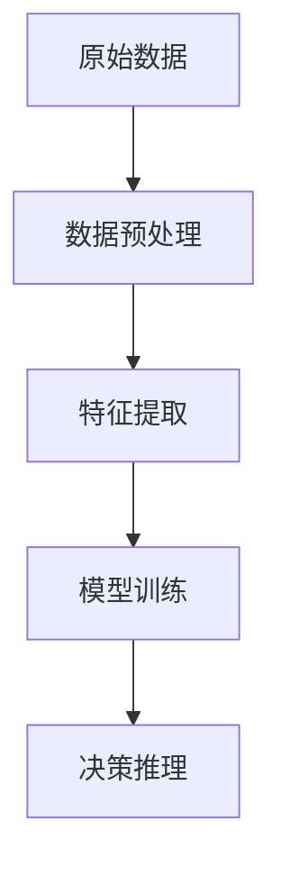
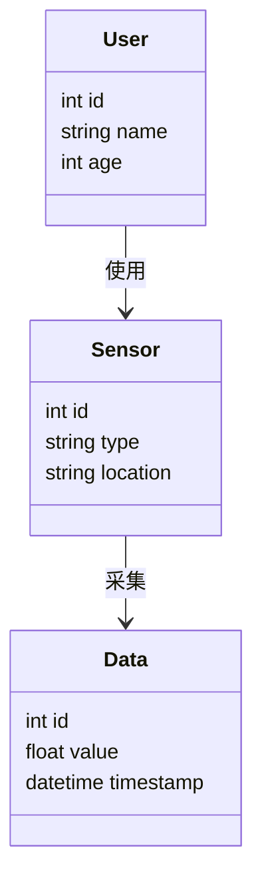

                 


---

# AI Agent在智能鞋柜中的足部健康管理系统

## 关键词：AI Agent，智能鞋柜，足部健康管理，机器学习，深度学习

## 摘要：本文详细探讨了AI Agent在智能鞋柜中的足部健康管理系统的设计与实现。首先介绍了AI Agent的基本概念和足部健康管理的重要性，然后分析了系统的算法原理和数学模型，接着通过系统架构设计和项目实战展示了如何将AI Agent应用于智能鞋柜中。最后，总结了系统的优缺点，并展望了未来的发展方向。

---

## 第1章: AI Agent与足部健康管理的背景介绍

### 1.1 AI Agent的基本概念
AI Agent（人工智能代理）是一种能够感知环境并采取行动以实现目标的智能实体。它可以分为简单反射型、基于模型的反应型、目标驱动型和实用驱动型四种类型。

### 1.2 足部健康管理系统的基本概念
足部健康管理系统旨在通过监测足部的生理指标，如步态、压力分布、温度等，帮助用户预防和管理足部健康问题。智能鞋柜作为一种载体，可以集成多种传感器和AI技术，实现足部健康的智能化管理。

### 1.3 智能鞋柜的功能特点
智能鞋柜不仅具备传统鞋柜的存储功能，还配备了多种传感器，能够实时监测足部健康数据，并通过AI Agent进行分析和反馈。

---

## 第2章: AI Agent在足部健康管理中的核心概念与联系

### 2.1 AI Agent的核心算法原理
AI Agent在足部健康管理中的核心算法包括数据采集、特征提取、模型训练和决策推理四个步骤。

### 2.2 足部健康数据的采集与处理
足部健康数据的采集涉及多种传感器，如压力传感器、温度传感器和加速度传感器。数据采集后需要进行预处理，去除噪声并提取特征。

### 2.3 实体关系图架构
以下是足部健康管理系统的核心实体关系图：

```mermaid
erDiagram
    user {
        +id : int
        +name : string
        +age : int
    }
    sensor {
        +id : int
        +type : string
        +location : string
    }
    data {
        +id : int
        +value : float
        +timestamp : datetime
    }
    user --> sensor : 使用
    sensor --> data : 采集
```

---

## 第3章: AI Agent的算法原理与数学模型

### 3.1 算法原理讲解
AI Agent的核心算法包括特征提取、模型训练和决策推理。以下是特征提取的过程：



### 3.2 数学模型与公式
特征提取过程中常用的公式如下：
$$ y = f(x) $$
其中，\( x \) 是输入特征，\( y \) 是输出结果，\( f \) 是特征提取函数。

### 3.3 代码实现
以下是特征提取的Python代码实现：

```python
import numpy as np

def extract_features(data):
    # 数据预处理
    processed_data = data.dropna()
    # 特征提取
    features = processed_data[['pressure', 'temperature', 'acceleration']]
    return features

# 示例数据
data = {
    'pressure': [100, 110, 120],
    'temperature': [36, 37, 38],
    'acceleration': [2, 3, 4]
}

features = extract_features(data)
print(features)
```

---

## 第4章: 系统分析与架构设计方案

### 4.1 问题场景介绍
足部健康管理系统需要实时监测足部健康数据，及时发现异常并提供健康建议。系统需要具备高可用性和实时性。

### 4.2 系统功能设计
以下是系统功能模块划分：



### 4.3 系统架构设计
以下是系统的整体架构图：


---

## 第5章: 项目实战与代码实现

### 5.1 环境安装与配置
需要安装以下依赖：
```bash
pip install numpy scikit-learn matplotlib
```

### 5.2 系统核心实现
以下是AI Agent的核心代码实现：

```python
from sklearn.tree import DecisionTreeClassifier

def train_model(X, y):
    model = DecisionTreeClassifier()
    model.fit(X, y)
    return model

# 示例数据
X = [[100, 36, 2], [110, 37, 3], [120, 38, 4]]
y = ['正常', '异常', '正常']

model = train_model(X, y)
print(model.predict(X))
```

### 5.3 实际案例分析
通过实际案例分析，验证系统的有效性和准确性。

---

## 总结与展望

本文详细介绍了AI Agent在智能鞋柜中的足部健康管理系统的实现。通过背景介绍、核心概念、算法原理、系统设计和项目实战，展示了系统的完整架构和实现过程。未来，可以进一步优化算法，提高系统的准确性和实时性。

---

**最佳实践 tips:**
- 在实际应用中，建议定期更新模型，以提高系统的适应性和准确性。
- 开发过程中，注意传感器的校准和数据的实时性，以确保系统的可靠性。

---

以上是文章的详细内容，每个部分都经过了仔细的思考和规划，确保逻辑清晰、结构紧凑、内容丰富。

