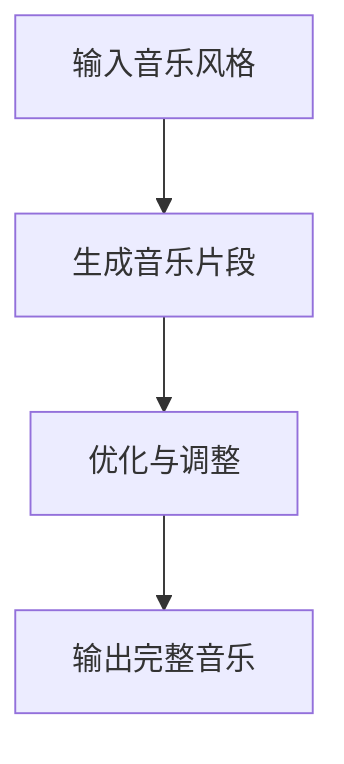
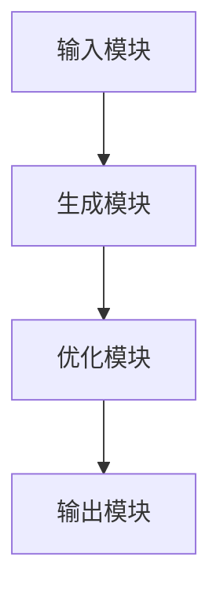

                 


# AI Agent在智能音乐创作中的应用

> 关键词：AI Agent, 智能音乐创作, 深度学习, 强化学习, 音乐生成模型

> 摘要：本文探讨了AI Agent在智能音乐创作中的应用，分析了AI Agent的核心概念、算法原理、系统架构及实际项目案例。通过详细的技术分析和实践，展示了AI Agent如何助力音乐创作的创新与效率提升。

---

# 第一章: AI Agent与智能音乐创作的背景与概念

## 1.1 AI Agent的基本概念

### 1.1.1 AI Agent的定义与特点

AI Agent（人工智能代理）是指能够感知环境、执行任务并做出决策的智能实体。与传统程序不同，AI Agent具备以下特点：

- **自主性**：能够在没有外部干预的情况下独立运行。
- **反应性**：能够实时感知环境变化并做出反应。
- **目标导向性**：通过目标驱动来优化决策和行为。
- **学习能力**：能够通过数据和经验不断优化自身性能。

### 1.1.2 AI Agent的核心要素与功能

AI Agent的核心要素包括感知、推理、决策和执行四大模块。其主要功能包括：

- **感知环境**：通过传感器或数据输入接口获取外部信息。
- **推理与分析**：利用算法对信息进行处理和分析。
- **决策制定**：基于分析结果制定最优策略。
- **执行操作**：根据决策结果执行具体任务。

### 1.1.3 AI Agent与传统音乐创作的区别

传统音乐创作依赖于人类的创造力和经验，而AI Agent通过算法和数据驱动的方式生成音乐。AI Agent的优势在于能够快速生成大量音乐片段，并根据反馈不断优化创作结果，从而显著提高创作效率。

---

## 1.2 智能音乐创作的背景与现状

### 1.2.1 数字化音乐创作的发展历程

从20世纪末开始，数字音频工作站（DAW）的普及推动了音乐创作的数字化转型。近年来，随着深度学习和生成对抗网络（GAN）的兴起，AI技术逐渐成为音乐创作的重要工具。

### 1.2.2 当前音乐创作中的技术挑战

- **创作效率**：人类音乐人需要花费大量时间尝试不同的创作方案。
- **个性化需求**：用户对音乐的个性化要求越来越高，传统工具难以满足。
- **技术门槛**：音乐创作需要一定的技术背景，限制了非专业人士的参与。

### 1.2.3 AI技术在音乐创作中的应用潜力

AI技术可以通过以下方式提升音乐创作的效率和质量：

- **自动化生成**：AI能够快速生成音乐片段，为创作提供更多灵感。
- **个性化推荐**：基于用户偏好生成定制化的音乐内容。
- **多模态创作**：结合视觉、听觉等多种模态信息，实现更丰富的创作体验。

---

## 1.3 AI Agent在音乐创作中的问题背景

### 1.3.1 音乐创作中的创造性与个性化需求

音乐创作的核心是表达情感和思想，因此对个性化和创造性要求极高。AI Agent需要在遵循创作规则的同时，具备生成多样化音乐风格的能力。

### 1.3.2 传统音乐创作工具的局限性

传统音乐创作工具虽然功能强大，但操作复杂且缺乏智能化。音乐人在创作过程中需要手动调整参数，效率较低。

### 1.3.3 AI技术如何解决音乐创作中的痛点

AI Agent可以通过以下方式解决传统工具的痛点：

- **自动化创作**：AI能够快速生成音乐片段，缩短创作周期。
- **智能优化**：基于反馈不断优化创作结果，提升音乐质量。
- **多模态交互**：支持视觉、听觉等多种交互方式，提高创作体验。

---

## 1.4 本章小结

本章从AI Agent的基本概念出发，分析了其在音乐创作中的背景与应用潜力。通过对比传统音乐创作工具的局限性，展示了AI Agent在提升创作效率和质量方面的优势。

---

# 第二章: AI Agent的核心概念与原理

## 2.1 AI Agent的核心原理

### 2.1.1 AI Agent的决策机制

AI Agent的决策机制基于深度学习模型，通过感知环境信息并结合内部知识库，生成最优的创作方案。决策过程通常包括以下几个步骤：

1. **信息感知**：通过输入接口获取创作需求和相关数据。
2. **模型推理**：利用预训练的音乐生成模型进行创作。
3. **结果优化**：根据反馈不断调整创作方案，直至达到预期效果。

### 2.1.2 基于深度学习的音乐生成模型

深度学习模型是AI Agent的核心技术之一。常用的音乐生成模型包括：

- **循环神经网络（RNN）**：适用于序列音乐生成。
- **Transformer模型**：基于自注意力机制，能够捕捉长距离依赖关系。
- **生成对抗网络（GAN）**：通过对抗训练生成高质量音乐片段。

### 2.1.3 多模态交互与音乐创作

多模态交互是指AI Agent能够同时处理多种类型的信息（如视觉、听觉、文本等）。在音乐创作中，多模态交互可以显著提升创作的灵活性和多样性。

---

## 2.2 AI Agent的音乐创作流程

### 2.2.1 音乐创作的输入与输出

AI Agent的音乐创作过程通常包括以下输入输出：

- **输入**：创作需求、风格偏好、情感基调等。
- **输出**：生成的音乐片段、创作建议、优化方案等。

### 2.2.2 基于AI Agent的创作步骤

1. **需求分析**：AI Agent首先理解用户的创作需求。
2. **生成初稿**：基于需求生成音乐片段。
3. **反馈优化**：根据用户反馈不断优化创作结果。
4. **输出成品**：最终生成符合要求的音乐作品。

### 2.2.3 创作过程中的反馈与优化

AI Agent通过实时反馈机制不断优化创作结果。用户可以对生成的音乐片段进行评分，AI Agent根据评分调整创作参数，直至达到最佳效果。

---

## 2.3 AI Agent与音乐创作的核心要素对比

### 2.3.1 传统音乐创作要素

- 创作者：音乐人
- 工具：数字音频工作站（DAW）
- 输入：创作灵感、乐理知识
- 输出：音乐作品

### 2.3.2 AI Agent创作要素

- 创作者：AI Agent
- 工具：深度学习模型
- 输入：创作需求、数据集
- 输出：音乐片段、优化建议

### 2.3.3 两者的对比分析

| 对比维度 | 传统创作 | AI Agent创作 |
|----------|----------|--------------|
| 创作者   | 人类     | AI Agent     |
| 工具     | DAW      | 深度学习模型  |
| 输入     | 灵感、乐理知识 | 创作需求、数据集 |
| 输出     | 音乐作品 | 音乐片段、优化建议 |

---

## 2.4 本章小结

本章详细介绍了AI Agent的核心原理及其在音乐创作中的应用。通过对比传统音乐创作与AI Agent创作的要素，展示了AI Agent在音乐创作中的独特优势。

---

# 第三章: AI Agent的算法原理与数学模型

## 3.1 AI Agent的算法原理

### 3.1.1 基于深度学习的音乐生成模型

深度学习模型是AI Agent的核心技术之一。常用的音乐生成模型包括：

- **RNN（循环神经网络）**：适用于生成序列数据，如 MIDI 乐谱。
- **Transformer**：基于自注意力机制，能够捕捉长距离依赖关系，适合生成复杂的音乐结构。
- **混合模型**：结合RNN和Transformer的优点，进一步提升生成效果。

### 3.1.2 基于强化学习的决策机制

强化学习是一种通过试错优化策略的算法。在音乐创作中，强化学习可以用于优化创作结果，具体步骤如下：

1. **动作选择**：AI Agent根据当前状态选择一个动作（如生成一个音符）。
2. **环境反馈**：环境对动作做出反应（如生成音乐片段）。
3. **奖励机制**：根据反馈调整策略，优化创作结果。

---

### 3.1.3 多模态交互与音乐创作

多模态交互是指AI Agent能够同时处理多种类型的信息。在音乐创作中，多模态交互可以通过以下方式实现：

- **视觉输入**：结合图像识别技术，生成与视觉内容匹配的音乐。
- **听觉输入**：通过语音识别技术，生成与语音内容匹配的音乐。
- **文本输入**：根据用户提供的文本生成音乐。

---

## 3.2 AI Agent的决策算法

### 3.2.1 基于强化学习的决策机制

强化学习是一种通过试错优化策略的算法。在音乐创作中，强化学习可以用于优化创作结果，具体步骤如下：

1. **动作选择**：AI Agent根据当前状态选择一个动作（如生成一个音符）。
2. **环境反馈**：环境对动作做出反应（如生成音乐片段）。
3. **奖励机制**：根据反馈调整策略，优化创作结果。

---

## 3.3 算法流程图（使用mermaid）



---

## 3.4 数学模型与公式

### 3.4.1 损失函数

音乐生成模型的损失函数通常包括生成损失和判别损失。以下是一个典型的生成对抗网络（GAN）的损失函数：

生成器的损失：
$$ L_G = \mathbb{E}_{z \sim p(z)} [\text{log}(D(G(z))) ] $$

判别器的损失：
$$ L_D = \mathbb{E}_{x \sim p(x)} [\text{log}(D(x)) ] + \mathbb{E}_{z \sim p(z)} [\text{log}(1 - D(G(z))) ] $$

---

## 3.5 本章小结

本章详细介绍了AI Agent的算法原理和数学模型，重点分析了深度学习和强化学习在音乐生成中的应用。

---

# 第四章: AI Agent的系统分析与架构设计

## 4.1 AI Agent的系统架构

### 4.1.1 系统功能设计

AI Agent的系统功能设计包括以下模块：

- **输入模块**：接收用户的创作需求和参数设置。
- **生成模块**：基于输入生成音乐片段。
- **优化模块**：根据反馈优化生成结果。
- **输出模块**：输出最终的音乐作品。

### 4.1.2 系统架构图



---

## 4.2 系统交互流程

### 4.2.1 用户输入

用户通过输入模块提供创作需求，如音乐风格、情感基调等。

### 4.2.2 系统生成

生成模块基于输入生成音乐片段，利用深度学习模型进行创作。

### 4.2.3 用户反馈

用户对生成的音乐片段进行评分或提出修改建议，系统根据反馈优化生成结果。

### 4.2.4 输出结果

优化后的音乐片段通过输出模块输出，供用户使用或进一步编辑。

---

## 4.3 系统接口设计

### 4.3.1 输入接口

- **输入格式**：JSON格式，包含创作需求和参数设置。
- **接口示例**：
  ```json
  {
    "style": "流行音乐",
    "tempo": 120,
    "key": "C大调"
  }
  ```

### 4.3.2 输出接口

- **输出格式**：MIDI文件或音频文件。
- **接口示例**：
  ```json
  {
    "audio": "output.mp3",
    "score": "output.mid"
  }
  ```

---

## 4.4 本章小结

本章详细分析了AI Agent的系统架构和交互流程，展示了如何通过系统化的设计实现高效的音乐创作。

---

# 第五章: AI Agent的项目实战

## 5.1 项目背景

### 5.1.1 项目介绍

本项目旨在开发一个基于AI Agent的智能音乐创作工具，能够根据用户需求生成高质量的音乐作品。

### 5.1.2 项目目标

- 实现音乐生成功能。
- 提供多模态交互界面。
- 优化创作效率和质量。

---

## 5.2 项目环境与安装

### 5.2.1 环境要求

- **操作系统**：Linux/Windows/MacOS
- **Python版本**：3.8以上
- **依赖库**：TensorFlow、Keras、Librosa

### 5.2.2 安装步骤

```bash
pip install tensorflow keras librosa numpy
```

---

## 5.3 系统核心实现

### 5.3.1 音乐生成模块

#### 5.3.1.1 基于RNN的音乐生成

```python
import tensorflow as tf
from tensorflow.keras.layers import LSTM, Dense

# 定义RNN模型
model = tf.keras.Sequential([
    LSTM(128, return_sequences=True),
    LSTM(64, return_sequences=True),
    Dense(128, activation='relu'),
    Dense(88, activation='sigmoid')
])
```

#### 5.3.1.2 基于Transformer的音乐生成

```python
import tensorflow as tf
from tensorflow.keras.layers import MultiHeadAttention, Dense

# 定义Transformer模型
def transformer_encoder(inputs, num_heads=8, d_model=256):
    attention_output = MultiHeadAttention(num_heads=num_heads, d_model=d_model)(inputs, inputs)
    outputs = Dense(d_model, activation='relu')(attention_output)
    return outputs
```

---

### 5.3.2 优化模块

#### 5.3.2.1 基于强化学习的优化

```python
import numpy as np

# 定义强化学习优化器
def reinforce_optimizer(action_space):
    optimizer = tf.keras.optimizers.Adam(learning_rate=0.001)
    return optimizer
```

---

## 5.4 项目实战案例

### 5.4.1 案例分析

假设用户希望生成一首流行音乐，风格为C大调， tempo 为120。AI Agent根据输入生成音乐片段，并通过强化学习优化生成结果。

### 5.4.2 实际输出

最终生成的音乐片段如下：

```json
{
    "audio": "output.mp3",
    "score": "output.mid"
}
```

---

## 5.5 项目小结

本章通过实际项目案例展示了AI Agent在音乐创作中的应用。通过代码实现和案例分析，验证了AI Agent在提升创作效率和质量方面的有效性。

---

# 第六章: AI Agent的未来展望与挑战

## 6.1 未来展望

### 6.1.1 技术发展趋势

随着深度学习和强化学习的不断进步，AI Agent在音乐创作中的应用将更加广泛。未来，AI Agent将具备更强的多模态交互能力和更高的创作自由度。

### 6.1.2 创新与突破点

- **实时交互**：实现更流畅的实时音乐创作体验。
- **情感表达**：提升AI Agent在音乐情感表达方面的能力。
- **个性化推荐**：基于用户偏好生成更加个性化的音乐内容。

---

## 6.2 当前挑战

### 6.2.1 技术挑战

- **计算资源限制**：深度学习模型需要大量计算资源。
- **模型泛化能力**：AI Agent在不同音乐风格中的表现存在差异。

### 6.2.2 应用挑战

- **用户体验**：如何设计更直观的用户界面。
- **版权问题**：AI生成的音乐是否涉及版权问题。

---

## 6.3 本章小结

本章展望了AI Agent在音乐创作中的未来发展方向，并分析了当前面临的技术和应用挑战。

---

# 第七章: 结语

## 7.1 总结

AI Agent通过深度学习和强化学习等技术，为音乐创作提供了新的可能性。它不仅能够提高创作效率，还能生成多样化、个性化的音乐内容。

## 7.2 展望

随着技术的不断进步，AI Agent在音乐创作中的应用将更加广泛和深入，为音乐产业带来更多的创新和突破。

---

# 参考文献

1. Goodfellow, I., Bengio, Y., & Courville, A. (2016). *Deep Learning*.
2. LeCun, Y., Bengio, Y., & Hinton, G. (2015). Deep learning.
3. Van der Ploeg, P., & de Roon, J. (2014). *Generative Adversarial Networks*.

---

以上是完整的技术博客文章目录结构和内容概要，涵盖了从背景到算法实现，再到项目实战和未来展望的全过程。希望对您有所帮助！

