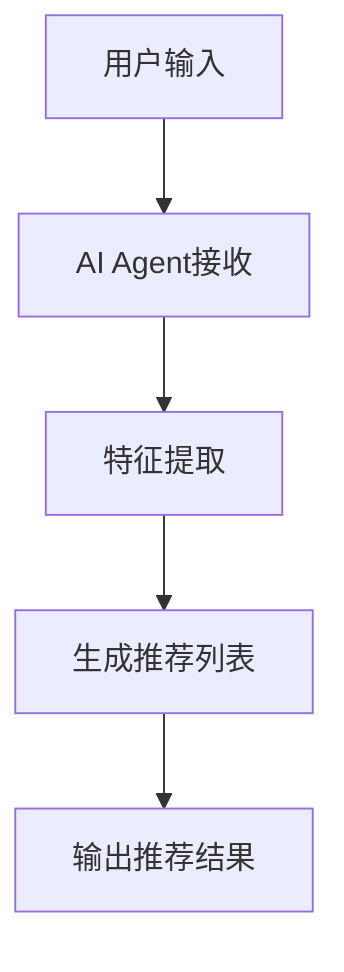
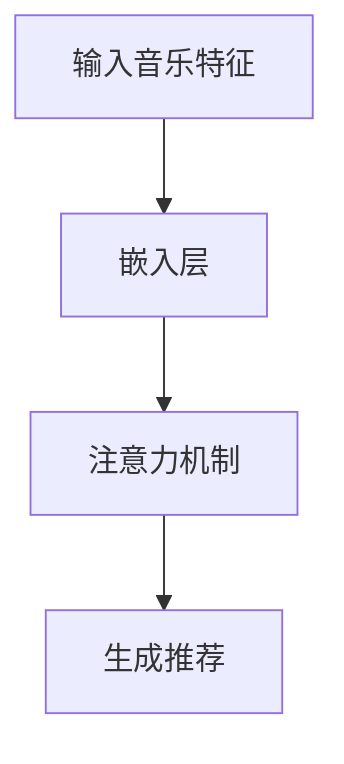
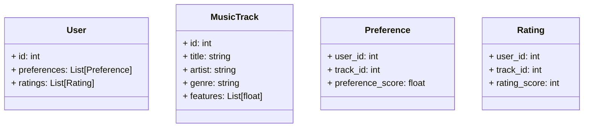
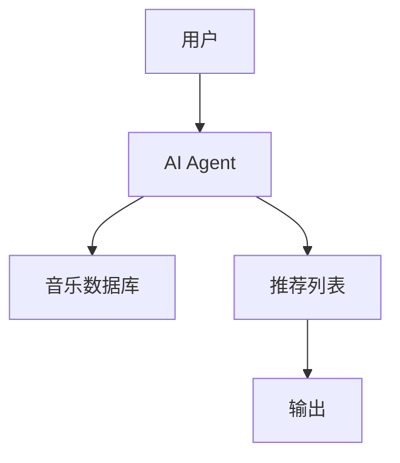

                 


```markdown
# AI Agent在智能音乐推荐中的应用

> 关键词：AI Agent，智能音乐推荐，机器学习，深度学习，个性化推荐，音乐流媒体

> 摘要：本文探讨了AI Agent在智能音乐推荐系统中的应用，分析了传统音乐推荐系统面临的挑战，并详细介绍了AI Agent的核心概念、算法原理、系统架构及实际应用案例。通过深度学习算法和注意力机制的数学模型，展示了如何利用AI Agent提升音乐推荐的个性化和智能化水平，为音乐流媒体平台的推荐系统提供新的解决方案。

---

## 第一部分: AI Agent在智能音乐推荐中的应用背景

### 第1章: 智能音乐推荐的背景与挑战

#### 1.1 音乐推荐系统的发展历程
- **从传统推荐到智能推荐的演进**
  - 早期基于协同过滤的音乐推荐系统，依赖用户评分和相似性计算。
  - 随着深度学习的兴起，智能推荐系统逐渐成为主流，基于用户行为、偏好和音乐特征进行多维度分析。

- **智能音乐推荐的核心问题**
  - 如何在海量音乐库中快速找到用户的兴趣点。
  - 如何处理数据稀疏性和冷启动问题。
  - 如何实时响应用户的音乐偏好变化。

- **解决方法**
  - 引入AI Agent，通过智能学习和自适应算法，动态调整推荐策略。

- **概念的结构与核心要素组成**
  - 用户：音乐推荐系统的核心主体。
  - 音乐曲目：推荐的载体。
  - 推荐算法：推荐系统的核心逻辑。
  - 用户偏好：推荐的依据。

#### 1.2 AI Agent的基本概念与特点
- **AI Agent的定义与核心特征对比表**
| 概念        | 特性                  |
|-------------|-----------------------|
| AI Agent    | 智能性、自主性、反应性、协作性 |

- **AI Agent在音乐推荐中的优势**
  - 知识表示：通过知识图谱表示音乐特征和用户偏好。
  - 知识推理：基于知识图谱进行推理，生成个性化推荐。
  - 动态适应：实时调整推荐策略，适应用户行为变化。

- **AI Agent与传统推荐算法的对比**
  - 传统推荐算法依赖静态数据，AI Agent具备动态学习和自适应能力。
  - 传统算法难以处理复杂关系，AI Agent通过知识推理可以发现隐含关联。

#### 1.3 音乐推荐系统的应用场景
- **音乐流媒体平台的推荐场景**
  - 如Spotify、Apple Music等平台，每天处理海量用户请求，需要高效的推荐算法。

- **个性化音乐推荐的需求分析**
  - 用户需求：发现新音乐、探索相似风格、获取个性化推荐。
  - 系统需求：提高用户留存率、增加用户活跃度、提升推荐准确率。

- **音乐推荐系统的边界与外延**
  - 边界：音乐推荐系统的功能范围和接口定义。
  - 外延：与音乐版权管理、音乐制作、音乐社交等其他领域的关联。

### 1.4 本章小结
本章介绍了智能音乐推荐的背景与挑战，分析了传统推荐系统的问题，并提出了AI Agent作为一种解决方案。通过对比AI Agent与传统推荐算法，明确了AI Agent在音乐推荐中的优势和应用场景。

---

## 第二部分: AI Agent的核心概念与原理

### 第2章: AI Agent的核心概念与联系

#### 2.1 AI Agent的核心概念
- **AI Agent的定义与属性特征对比表**
| 概念        | 特性                  |
|-------------|-----------------------|
| AI Agent    | 智能性、自主性、反应性、协作性 |

- **AI Agent的实体关系图**
```mermaid
er
actor: 用户
agent: AI音乐推荐Agent
tracks: 音乐曲目
preference: 用户偏好
rating: 用户评分
```

#### 2.2 AI Agent的算法原理
- **算法流程图**


- **数学模型与公式**
  - 注意力机制公式：
  $$\text{Attention}(Q,K,V) = \text{softmax}\left(\frac{QK^T}{\sqrt{d_k}}\right)V$$
  - 损失函数：
  $$\text{Loss} = -\sum_{i=1}^{n} y_i \log p(y_i) + (1 - y_i)\log(1 - p(y_i))$$

#### 2.3 算法实现与代码示例
- **Python代码实现**
```python
import torch

class AIAgent:
    def __init__(self, input_dim, hidden_dim, output_dim):
        self.model = torch.nn.Sequential(
            torch.nn.Linear(input_dim, hidden_dim),
            torch.nn.ReLU(),
            torch.nn.Linear(hidden_dim, output_dim)
        )
    
    def forward(self, x):
        return self.model(x)
    
    def train(self, x, y, loss_fn, optimizer):
        pred = self.forward(x)
        loss = loss_fn(y, pred)
        optimizer.zero_grad()
        loss.backward()
        optimizer.step()
        return loss.item()
```

#### 2.4 本章小结
本章详细介绍了AI Agent的核心概念与联系，通过ER图和流程图展示了AI Agent在音乐推荐中的工作原理，并通过数学公式和代码示例讲解了算法实现过程。

---

## 第三部分: AI Agent的算法原理与数学模型

### 第3章: AI Agent的算法原理

#### 3.1 基于深度学习的推荐算法
- **算法流程图**


- **数学模型与公式**
  - 注意力机制公式：
  $$\text{Attention}(Q,K,V) = \text{softmax}\left(\frac{QK^T}{\sqrt{d_k}}\right)V$$
  - 损失函数：
  $$\text{Loss} = -\sum_{i=1}^{n} y_i \log p(y_i) + (1 - y_i)\log(1 - p(y_i))$$

#### 3.2 算法实现与代码示例
- **Python代码实现**
```python
import torch

class AIAgent:
    def __init__(self, input_dim, hidden_dim, output_dim):
        self.model = torch.nn.Sequential(
            torch.nn.Linear(input_dim, hidden_dim),
            torch.nn.ReLU(),
            torch.nn.Linear(hidden_dim, output_dim)
        )
    
    def forward(self, x):
        return self.model(x)
    
    def train(self, x, y, loss_fn, optimizer):
        pred = self.forward(x)
        loss = loss_fn(y, pred)
        optimizer.zero_grad()
        loss.backward()
        optimizer.step()
        return loss.item()
```

#### 3.3 本章小结
本章详细讲解了基于深度学习的推荐算法，通过数学公式和代码示例展示了AI Agent在音乐推荐中的具体实现过程。

---

## 第四部分: AI Agent的系统分析与架构设计

### 第4章: 系统分析与架构设计

#### 4.1 项目介绍
- 音乐推荐系统的应用场景和目标。

#### 4.2 系统功能设计
- **领域模型类图**


- **系统架构图**


- **系统接口设计**
  - 输入接口：接收用户输入和音乐数据。
  - 输出接口：生成推荐列表并返回结果。

#### 4.3 本章小结
本章详细分析了音乐推荐系统的架构设计，通过类图和架构图展示了系统的模块划分和交互关系。

---

## 第五部分: AI Agent的项目实战

### 第5章: 项目实战

#### 5.1 环境安装
- 安装Python、TensorFlow、PyTorch等开发环境。

#### 5.2 核心代码实现
```python
import torch
import torch.nn as nn
import torch.optim as optim

class Music Recommender:
    def __init__(self, input_dim, hidden_dim, output_dim):
        self.model = nn.Sequential(
            nn.Linear(input_dim, hidden_dim),
            nn.ReLU(),
            nn.Linear(hidden_dim, output_dim)
        )
    
    def forward(self, x):
        return self.model(x)
    
    def train(self, x, y, loss_fn, optimizer):
        pred = self.forward(x)
        loss = loss_fn(y, pred)
        optimizer.zero_grad()
        loss.backward()
        optimizer.step()
        return loss.item()
```

#### 5.3 案例分析与解读
- 通过具体案例分析AI Agent在音乐推荐中的应用效果。

#### 5.4 本章小结
本章通过实际项目案例，展示了AI Agent在音乐推荐系统中的具体实现和应用效果。

---

## 第六部分: 最佳实践与总结

### 第6章: 最佳实践

#### 6.1 小结
- 总结AI Agent在音乐推荐中的应用价值和优势。

#### 6.2 注意事项
- 数据隐私保护、模型优化、用户体验优化等注意事项。

#### 6.3 拓展阅读
- 推荐相关领域的书籍和论文，供读者深入学习。

---

## 结语
通过本文的详细讲解，读者可以全面了解AI Agent在智能音乐推荐中的应用，从理论到实践，掌握如何利用AI Agent提升音乐推荐的智能化水平。未来，随着技术的不断发展，AI Agent在音乐推荐中的应用将更加广泛和深入。
```

