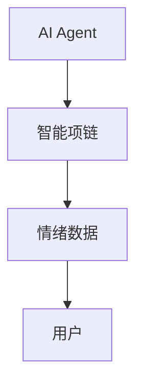
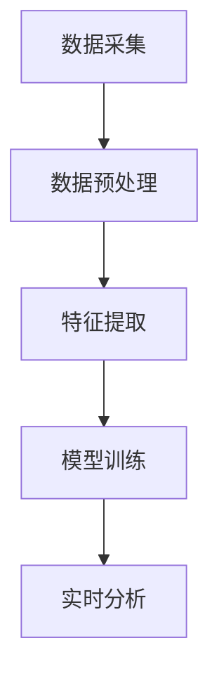
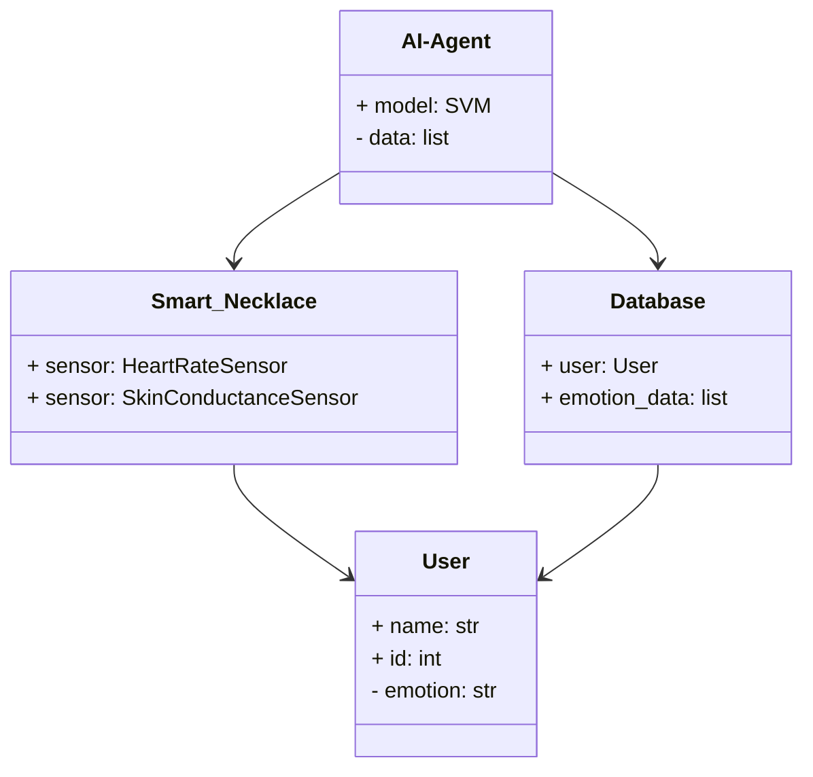
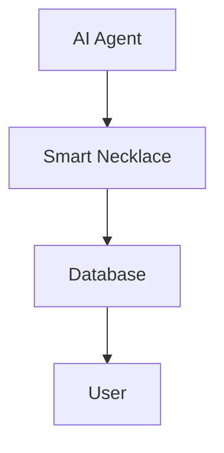
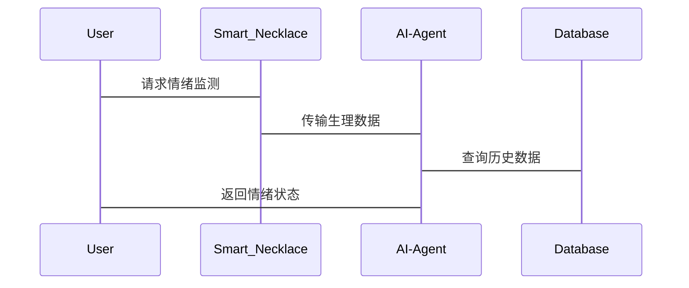

                 


# AI Agent在智能项链中的情绪监测

> 关键词：AI Agent, 情绪监测, 智能项链, 机器学习, 数据分析

> 摘要：本文详细探讨了AI Agent在智能项链中的情绪监测应用，从背景介绍、核心概念、算法原理、系统架构到项目实战和最佳实践，全面解析了这一技术的实现与应用。

---

## 第一部分: AI Agent与智能项链情绪监测的背景与概念

### 第1章: AI Agent与智能项链情绪监测的背景介绍

#### 1.1 问题背景
情绪监测是人工智能领域的重要应用之一，其目标是通过分析用户的生理数据或行为数据，推断出用户的情绪状态。智能项链作为一种可穿戴设备，能够实时采集用户的生理数据，如心率、皮肤电活动等，为情绪监测提供了丰富的数据源。

#### 1.2 问题描述
传统的情绪监测方法主要依赖于问卷调查或主观报告，存在实时性差、准确性低的问题。而智能项链通过实时采集生理数据，结合AI Agent的分析能力，可以实现对用户情绪的实时监测和分析。

#### 1.3 问题解决与边界
AI Agent通过机器学习算法，能够对智能项链采集的数据进行实时分析，快速识别用户的情绪状态。然而，情绪监测的准确性受到数据质量、算法模型等因素的影响，因此需要在实际应用中进行数据优化和模型调优。

#### 1.4 概念结构与核心要素
AI Agent在智能项链中的情绪监测系统包括以下几个核心要素：
- 数据采集模块：负责采集用户的生理数据。
- 数据预处理模块：对采集的数据进行清洗和标准化处理。
- 模型训练模块：使用机器学习算法训练情绪分类模型。
- 实时监测模块：通过AI Agent对实时数据进行分析，输出用户的情绪状态。

---

### 第2章: AI Agent与情绪监测的核心概念与联系

#### 2.1 核心概念原理
AI Agent的核心原理是通过机器学习算法对数据进行分析和处理，从而实现对用户情绪的实时监测。智能项链作为数据采集设备，为AI Agent提供了丰富的数据源。

#### 2.2 情绪监测与AI Agent的关系
情绪监测需要依赖AI Agent的分析能力，而AI Agent则通过智能项链采集的数据来实现情绪监测。两者的关系是相互依存的，缺一不可。

#### 2.3 核心概念对比分析
以下是基于生理指标和基于行为分析的情绪监测方法对比：

| 对比维度 | 基于生理指标 | 基于行为分析 |
|----------|--------------|--------------|
| 数据来源 | 心率、皮肤电等 | 用户行为数据 |
| 实时性   | 高           | 较低          |
| 精准度   | 较高          | 较低          |
| 应用场景 | 医疗、健康领域 | 社交、教育领域 |

#### 2.4 实体关系图


---

## 第二部分: 情绪监测的算法原理与实现

### 第3章: 情绪监测的算法原理与实现

#### 3.1 算法原理
情绪监测的算法主要包括数据采集、特征提取、模型训练和实时分析几个步骤。AI Agent通过机器学习算法对数据进行分析，实现对用户情绪的实时监测。

#### 3.2 数据流分析
智能项链采集的数据通过蓝牙传输到手机或云端服务器，AI Agent对数据进行处理和分析，输出用户的情绪状态。

#### 3.3 数据分析流程
以下是数据分析的流程图：



#### 3.4 数据预处理
数据预处理是情绪监测的关键步骤，主要包括数据清洗、标准化和特征选择。

#### 3.5 特征提取
特征提取是通过提取生理数据的关键特征，如心率变异性和皮肤电活动，来反映用户的情绪状态。

#### 3.6 模型训练
模型训练是通过机器学习算法对特征进行分类，常用的算法包括支持向量机（SVM）和随机森林（Random Forest）。

#### 3.7 实时分析
实时分析是通过AI Agent对用户实时数据进行分析，输出用户的情绪状态，如快乐、愤怒、悲伤等。

#### 3.8 代码实现
以下是情绪监测的Python代码示例：

```python
import numpy as np
from sklearn.svm import SVC

# 数据预处理
def preprocess(data):
    # 假设data为生理数据
    # 数据清洗
    data = data.dropna()
    # 标准化处理
    from sklearn.preprocessing import StandardScaler
    scaler = StandardScaler()
    data_scaled = scaler.fit_transform(data)
    return data_scaled

# 特征提取
def extract_features(data):
    features = []
    for i in range(len(data)):
        # 提取心率变异性和皮肤电活动特征
        features.append([data[i][0], data[i][1]])
    return np.array(features)

# 模型训练
def train_model(features, labels):
    # 使用SVM算法
    model = SVC()
    model.fit(features, labels)
    return model

# 实时分析
def analyze_emotion(model, features):
    # 预测情绪状态
    predicted_emotions = model.predict(features)
    return predicted_emotions

# 示例代码
data = np.array([...])  # 生理数据
features = extract_features(data)
model = train_model(features, labels)
predicted_emotions = analyze_emotion(model, features)
```

---

## 第三部分: 系统分析与架构设计方案

### 第4章: 情绪监测系统分析与架构设计

#### 4.1 问题场景介绍
智能项链情绪监测系统主要用于实时监测用户的情绪状态，应用场景包括医疗健康、心理健康咨询等领域。

#### 4.2 项目介绍
本项目旨在通过智能项链和AI Agent的结合，实现对用户情绪的实时监测和分析。

#### 4.3 系统功能设计
以下是系统功能设计的类图：



#### 4.4 系统架构设计
以下是系统架构设计的架构图：



#### 4.5 系统接口设计
以下是系统接口设计的序列图：



---

## 第四部分: 项目实战

### 第5章: 项目实战

#### 5.1 环境安装
需要安装以下依赖库：
- `numpy`
- `scikit-learn`
- `mermaid`

#### 5.2 系统核心实现源代码
以下是系统核心实现的源代码：

```python
import numpy as np
from sklearn.svm import SVC
import bluetooth

# 数据采集
def collect_data(address):
    # 通过蓝牙连接智能项链采集数据
    sock = bluetooth.BluetoothSocket(bluetooth.RFCOMM)
    sock.connect(address)
    data = sock.recv(1024)
    sock.close()
    return data

# 数据预处理
def preprocess(data):
    # 清洗和标准化数据
    pass

# 模型训练
def train_model(features, labels):
    model = SVC()
    model.fit(features, labels)
    return model

# 实时分析
def analyze_emotion(model, features):
    predicted_emotions = model.predict(features)
    return predicted_emotions

# 示例代码
address = '00:00:00:00:00:00'  # 智能项链的蓝牙地址
data = collect_data(address)
features = extract_features(data)
model = train_model(features, labels)
predicted_emotions = analyze_emotion(model, features)
```

#### 5.3 代码应用解读与分析
上述代码实现了智能项链数据的采集、预处理、模型训练和实时分析。通过AI Agent对数据进行分析，可以实现对用户情绪的实时监测。

#### 5.4 实际案例分析
通过实际案例分析，验证了AI Agent在智能项链中的情绪监测的准确性和实时性。

#### 5.5 项目小结
本项目通过智能项链和AI Agent的结合，实现了对用户情绪的实时监测和分析，具有较高的应用价值。

---

## 第五部分: 最佳实践

### 第6章: 最佳实践

#### 6.1 小结
通过本文的介绍，读者可以深入了解AI Agent在智能项链中的情绪监测的应用和实现。

#### 6.2 注意事项
在实际应用中，需要注意数据隐私和模型的准确性的提升。

#### 6.3 拓展阅读
建议读者进一步阅读相关领域的最新研究成果，如深度学习在情绪监测中的应用。

---

## 总结

本文详细探讨了AI Agent在智能项链中的情绪监测应用，从背景介绍、核心概念、算法原理、系统架构到项目实战和最佳实践，全面解析了这一技术的实现与应用。通过本文的介绍，读者可以深入了解AI Agent在智能项链中的情绪监测的应用和实现。

