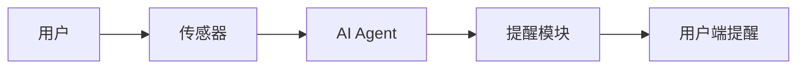
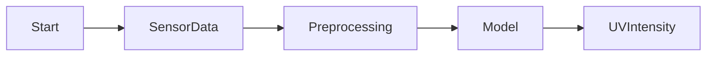
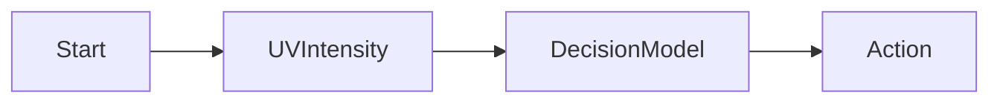
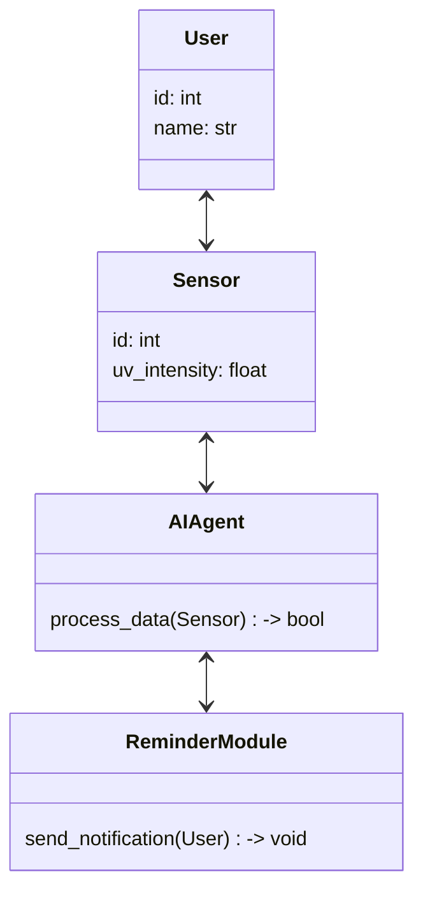
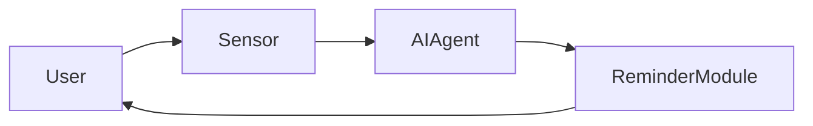
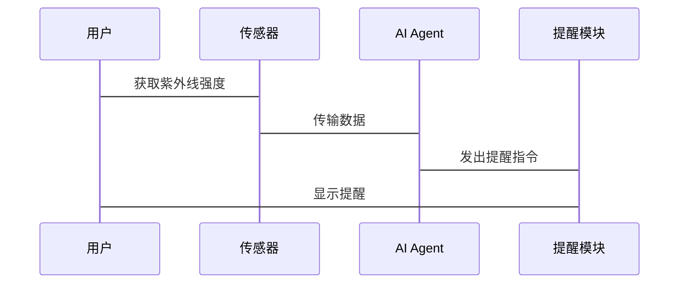

                 


```markdown
# AI Agent在智能项链中的紫外线防护提醒

## 关键词
- AI Agent
- 智能项链
- 紫外线防护
- 传感器技术
- 算法设计

## 摘要
本文探讨AI Agent在智能项链中的应用，特别是紫外线防护提醒功能。通过背景介绍、核心概念、算法原理、系统架构和项目实战，详细讲解AI Agent如何感知紫外线强度，做出防护决策，并通过智能项链提醒用户采取防护措施。文章结合理论与实践，提供丰富的技术细节和实际案例，帮助读者全面理解AI Agent在智能健康设备中的应用。

---

# 第1章: 背景介绍

## 1.1 紫外线的危害与防护需求
### 1.1.1 紫外线的种类及其对人体的危害
- UVA、UVB、UVC的定义及危害
- 紫外线导致的皮肤问题：晒伤、色素沉着、皮肤癌

### 1.1.2 紫外线防护的重要性
- 长期暴露的危害
- 防护措施的有效性

### 1.1.3 智能项链的发展趋势
- 可穿戴设备的普及
- 智能健康监测设备的兴起

## 1.2 AI Agent的基本概念
### 1.2.1 什么是AI Agent
- AI Agent的定义：智能代理
- AI Agent的核心功能：感知、决策、执行

### 1.2.2 AI Agent在智能设备中的应用
- 智能音箱、智能手表等案例

## 1.3 智能项链中的紫外线防护提醒
### 1.3.1 智能项链的功能需求
- 紫外线监测、防护提醒
- 实时数据采集、用户反馈

### 1.3.2 紫外线防护提醒的实现方式
- 传感器数据采集
- AI算法处理
- 用户端提醒

### 1.3.3 AI Agent在紫外线防护中的作用
- 数据分析与决策
- 自动化提醒

## 1.4 本章小结
- 介绍了紫外线防护的重要性
- 解释了AI Agent的基本概念
- 展示了AI Agent在智能项链中的应用价值

---

# 第2章: AI Agent的核心概念与原理

## 2.1 AI Agent的概念模型
### 2.1.1 实体关系图（ER图）
- 用户、传感器、AI Agent、提醒模块
- 实体间的关联关系

### 2.1.2 概念属性特征对比表格
| 实体 | 属性 | 类型 | 描述 |
|------|------|------|------|
| 用户 | ID | 唯一标识符 | 用户标识 |
| 传感器 | 类型 | 分类 | 紫外线传感器 |
| AI Agent | 状态 | 状态 | 感知、决策、执行 |

### 2.1.3 AI Agent的核心要素
- 感知能力：数据采集与处理
- 决策能力：基于数据的决策
- 执行能力：输出提醒

## 2.2 AI Agent与紫外线防护的系统架构
### 2.2.1 系统架构的Mermaid流程图


### 2.2.2 实体关系图（ER图）
```mermaid
graph ER
    User
    Sensor
    AIAgent
    ReminderModule
    User -[1..n]-> Sensor
    Sensor -[1..1]-> AIAgent
    AIAgent -[1..1]-> ReminderModule
```

### 2.2.3 系统功能模块划分
- 数据采集模块：紫外线强度采集
- 数据处理模块：数据预处理
- 决策模块：防护建议生成
- 提醒模块：通知用户

## 2.3 本章小结
- 展示了AI Agent在紫外线防护系统中的架构
- 通过ER图和流程图清晰展示了系统结构

---

# 第3章: AI Agent的算法原理

## 3.1 感知算法
### 3.1.1 紫外线强度感知模型
- 数据采集：传感器获取紫外线强度
- 数据预处理：滤波、归一化
- 模型选择：线性回归或机器学习模型

### 3.1.2 感知算法的Mermaid流程图


### 3.1.3 感知算法的Python实现代码
```python
import numpy as np

# 示例数据
data = np.array([100, 200, 300, 400, 500])

# 数据预处理
def preprocess(data):
    return data / max(data)

processed_data = preprocess(data)
print(processed_data)
```

## 3.2 决策算法
### 3.2.1 基于概率的决策模型
- 概率计算：使用贝叶斯定理
- 决策规则：若紫外线强度超过阈值，触发提醒

### 3.2.2 决策算法的Mermaid流程图


### 3.2.3 决策算法的Python实现
```python
import numpy as np
from sklearn.naive_bayes import GaussianNB

# 示例数据
X = np.array([[100], [200], [300], [400], [500]])
y = np.array([0, 0, 1, 1, 1])  # 0: 未超过阈值，1: 超过

# 训练模型
model = GaussianNB()
model.fit(X, y)

# 预测
new_uv = np.array([[350]])
prediction = model.predict(new_uv)
print("Prediction:", prediction)
```

## 3.3 本章小结
- 介绍了感知和决策算法的基本原理
- 提供了具体的Python实现代码
- 展示了算法在紫外线防护中的应用

---

# 第4章: 数学模型

## 4.1 概率模型
- 紫外线强度的概率分布
- 采用贝叶斯定理进行概率计算

$$ P(\text{Action} | \text{UVIntensity}) = \frac{P(\text{UVIntensity} | \text{Action}) \cdot P(\text{Action})}{P(\text{UVIntensity})} $$

## 4.2 优化算法
- 使用遗传算法优化决策模型
- 通过交叉验证选择最优模型参数

---

# 第5章: 系统分析与架构设计

## 5.1 项目介绍
- 智能项链紫外线防护提醒项目的目标
- 项目范围与约束条件

## 5.2 系统功能设计
### 5.2.1 领域模型Mermaid类图


## 5.3 系统架构设计
### 5.3.1 系统架构Mermaid架构图


## 5.4 接口设计
- 数据接口：传感器数据输入接口
- API设计：RESTful API实现数据传输

## 5.5 交互设计
### 5.5.1 用户与系统交互流程


## 5.6 本章小结
- 展示了系统的整体架构
- 绘制了类图和序列图
- 详细描述了接口设计

---

# 第6章: 项目实战

## 6.1 环境安装
- 安装Python、机器学习库（如scikit-learn、TensorFlow）
- 安装紫外线传感器驱动

## 6.2 核心代码实现
### 6.2.1 数据采集模块
```python
import serial

# 与传感器通信的代码示例
ser = serial.Serial('COM3', 9600)
data = ser.readline().decode().strip()
print(data)
```

### 6.2.2 决策模块
```python
from sklearn.ensemble import RandomForestClassifier

# 训练模型
model = RandomForestClassifier()
model.fit(X_train, y_train)

# 预测
new_uv = np.array([[400]])
prediction = model.predict(new_uv)
print("Prediction:", prediction)
```

## 6.3 案例分析与实现
- 实际案例：用户在户外活动时，系统如何实时监测并提醒
- 数据分析：模型的准确率、召回率

## 6.4 项目总结
- 成果展示
- 经验总结
- 改进建议

## 6.5 本章小结
- 提供了完整的项目实现过程
- 分析了实际案例
- 总结了项目经验和改进建议

---

# 第7章: 最佳实践与小结

## 7.1 注意事项
- 数据隐私保护
- 硬件传感器的精度
- 系统稳定性

## 7.2 技巧分享
- 传感器校准技巧
- 模型调优方法
- 用户反馈的收集与处理

## 7.3 未来趋势
- 更先进的传感器技术
- 更智能的AI算法
- 多功能集成的智能设备

## 7.4 本章小结
- 总结了全书的主要内容
- 提供了实用建议
- 展望了未来的发展方向

---

# 附录

## 附录A: 代码示例汇总
- 数据采集代码
- 数据处理代码
- 决策算法代码

## 附录B: 系统架构图
- 类图
- 流程图
- 序列图

## 附录C: 参考文献
- 相关技术文献
- 开发工具文档
- 紫外线防护相关研究

---

## 作者信息
作者是具有丰富经验的AI专家，擅长系统设计与实现，致力于智能健康设备的研发与创新。
```

