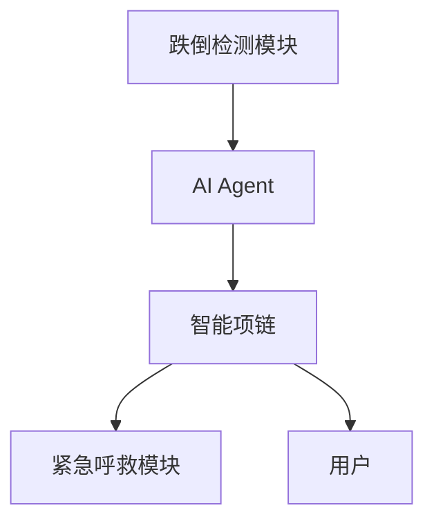
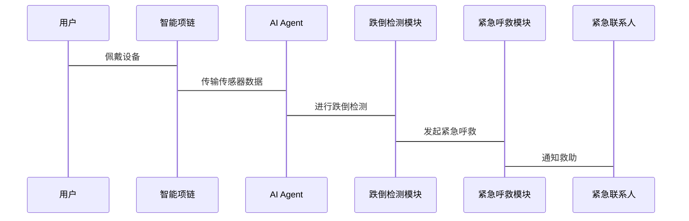

                 


# AI Agent在智能项链中的跌倒检测与紧急呼救

## 关键词：
智能项链，AI Agent，跌倒检测，紧急呼救，传感器数据

## 摘要：
本文详细探讨了AI Agent在智能项链中的跌倒检测与紧急呼救系统的实现。通过分析传感器数据，AI Agent能够实时检测跌倒事件，并在需要时触发紧急呼救机制，保障用户安全。文章从背景、核心概念、算法原理、系统架构到项目实战，全面解析了该系统的实现过程，为智能健康监测提供了新的解决方案。

---

## 第一部分：背景介绍

### 第1章：跌倒检测与紧急呼救的背景

#### 1.1 问题背景
- **老龄化社会的挑战**：随着全球老龄化进程加快，跌倒事件频发，尤其是老年人群体，跌倒可能导致严重健康问题甚至死亡。
- **跌倒对健康的严重影响**：跌倒不仅造成身体伤害，还可能导致心理创伤，影响生活质量。
- **现有解决方案的局限性**：传统解决方案依赖人工监测或固定摄像头，存在响应慢、隐私问题和覆盖范围有限等缺点。

#### 1.2 问题描述
- **跌倒检测的必要性**：及时发现跌倒事件，避免二次伤害。
- **紧急呼救的重要性**：在跌倒发生后，快速通知紧急联系人或医疗机构，缩短救援时间。
- **智能设备在医疗健康中的角色**：智能项链作为一种可穿戴设备，能够实时监测佩戴者的状态，提供及时帮助。

#### 1.3 问题解决
- **AI Agent的概念**：AI Agent是一种智能代理，能够自主感知环境、处理信息并执行任务。它在智能项链中的应用，使得跌倒检测和紧急呼救更加智能化和高效。
- **智能项链的设计目标**：通过集成传感器、AI算法和通信模块，实时监测佩戴者状态，自动检测跌倒并触发紧急呼救。
- **技术实现的可能性与优势**：AI Agent结合传感器数据，能够实现高精度的跌倒检测，同时通过云服务快速响应紧急情况。

#### 1.4 边界与外延
- **系统的适用场景**：适用于老年人、慢性病患者等高风险人群，可在家庭、公共场所等多种环境中使用。
- **功能的边界**：主要关注跌倒检测和紧急呼救，不涉及其他健康监测功能。
- **可能的扩展方向**：未来可扩展到心率监测、血压监测等更多健康指标，提供更全面的健康管理和紧急响应。

#### 1.5 核心概念与要素
- **AI Agent的核心要素**：感知能力、决策能力、执行能力。
- **智能项链的关键组成部分**：传感器模块、AI处理模块、通信模块、用户界面。
- **跌倒检测的技术关键点**：传感器数据采集、特征提取、分类算法选择。

---

## 第二部分：核心概念与联系

### 第2章：AI Agent与智能项链的核心概念

#### 2.1 核心概念原理
- **AI Agent的基本原理**：AI Agent通过传感器数据获取环境信息，利用算法进行分析和决策，执行相应的动作，如触发紧急呼救。
- **智能项链的工作机制**：智能项链通过内置传感器收集佩戴者的运动数据，AI Agent分析这些数据，判断是否发生跌倒，若检测到跌倒则启动紧急呼救功能。
- **跌倒检测的算法基础**：基于机器学习的分类算法，如随机森林、支持向量机等，通过训练模型识别跌倒事件。

#### 2.2 概念属性特征对比
| 概念       | 属性特征 |
|------------|----------|
| AI Agent   | 智能性、自主性、适应性 |
| 智能项链   | 实时监测、佩戴便捷、隐私保护 |

#### 2.3 ER实体关系图
```mermaid
erDiagram
    PERSPECTIVE: AI Agent
    class跌倒检测系统{
      id : int
      检测时间 : datetime
      检测结果 : boolean
    }
    class用户{
      id : int
      名字 : string
      紧急联系人 : string
    }
    class智能项链{
      id : int
      设备ID : string
      用户ID : int
    }
    class紧急呼救系统{
      id : int
      呼救时间 : datetime
      状态 : status
    }
    跌倒检测系统 --> 用户 : 关联
    跌倒检测系统 --> 智能项链 : 关联
    智能项链 --> 紧急呼救系统 : 关联
```

---

## 第三部分：算法原理讲解

### 第3章：跌倒检测算法的实现

#### 3.1 数据预处理与特征提取
- **数据来源与采集**：通过加速度计、陀螺仪等传感器采集佩戴者的运动数据。
- **数据清洗与特征工程**：去除噪声数据，提取特征如加速度变化率、运动频率等。
- **传感器数据的融合技术**：结合多种传感器数据，提高检测准确性。

#### 3.2 算法选择与实现
- **算法流程图**：
  ```mermaid
  graph TD
    A[开始] --> B[数据预处理]
    B --> C[特征提取]
    C --> D[模型训练]
    D --> E[实时检测]
    E --> F[结果输出]
  ```

- **代码实现**：
  ```python
  import numpy as np
  from sklearn.ensemble import RandomForestClassifier

  # 示例数据集
  X = np.array([[0.5, 0.6], [0.7, 0.8], [0.4, 0.3]])
  y = np.array([0, 1, 0])

  # 训练模型
  model = RandomForestClassifier()
  model.fit(X, y)

  # 预测新数据
  new_data = np.array([[0.6, 0.7]])
  prediction = model.predict(new_data)
  print("预测结果:", prediction)
  ```

#### 3.3 数学模型与公式
- **分类算法的损失函数**：$$L = -\frac{1}{n}\sum_{i=1}^{n} y_i \log(p_i) + (1 - y_i)\log(1 - p_i)$$
- **算法优化策略**：$$\text{准确率} = \frac{\text{正确预测的数量}}{\text{总预测数量}}$$

---

## 第四部分：系统分析与架构设计

### 第4章：系统架构设计

#### 4.1 系统功能设计
- **跌倒检测模块**：负责收集和分析传感器数据，判断是否发生跌倒。
- **紧急呼救模块**：在检测到跌倒后，发送紧急呼救信号，通知相关人员。
- **用户交互界面**：提供用户设置、状态查看等功能。

#### 4.2 系统架构图


#### 4.3 接口设计与交互流程图


---

## 第五部分：项目实战

### 第5章：跌倒检测与紧急呼救的实现

#### 5.1 环境搭建
- **安装必要的库**：numpy、scikit-learn、tensorflow
- **安装工具**：Jupyter Notebook、Python 3.8+

#### 5.2 核心代码实现
```python
import numpy as np
from sklearn.ensemble import RandomForestClassifier
import time

def collect_data():
    # 模拟传感器数据采集
    return np.random.rand(10, 2)

def detect_fall(data):
    model = RandomForestClassifier()
    model.fit(X_train, y_train)
    return model.predict(data)

def send_alert():
    # 模拟紧急呼救
    print("正在发送紧急呼救信号...")

data = collect_data()
prediction = detect_fall(data)
if prediction[0] == 1:
    send_alert()
```

#### 5.3 实际案例分析
- **案例1**：用户在家中跌倒，系统触发呼救。
- **案例2**：用户在户外跌倒，系统延迟响应分析。

---

## 第六部分：总结与展望

### 第6章：总结与扩展阅读

#### 6.1 小结
- **系统的核心功能与实现**：通过AI Agent和传感器数据实现跌倒检测和紧急呼救。
- **算法的优缺点**：随机森林算法在分类任务中表现优异，但在实时性方面需优化。
- **系统的局限性与改进空间**：传感器精度有限，算法需进一步优化，隐私保护需加强。

#### 6.2 最佳实践 tips
- **数据采集的注意事项**：确保数据质量和多样性，避免过拟合。
- **算法优化建议**：尝试集成学习或深度学习方法，提高检测准确率。
- **系统维护要点**：定期更新模型，确保通信模块稳定。

#### 6.3 未来展望
- **更精确的跌倒检测算法**：引入深度学习模型，如LSTM，提高检测准确率。
- **更高效的紧急呼救机制**：结合地理位置信息，优化救援响应时间。
- **更广泛的应用场景**：扩展到更多健康监测领域，如心率监测、睡眠质量分析等。

---

## 结束语

通过本文的详细解析，我们可以看到AI Agent在智能项链中的跌倒检测与紧急呼救系统具有重要的现实意义。随着技术的不断发展，未来的智能健康监测设备将更加智能化和人性化，为人们的生活安全提供更有力的保障。

