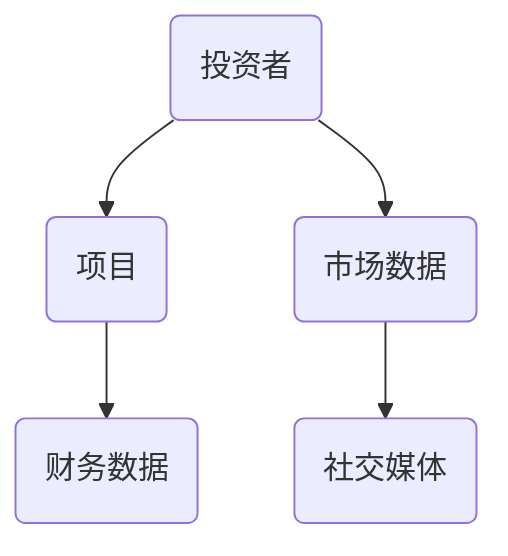
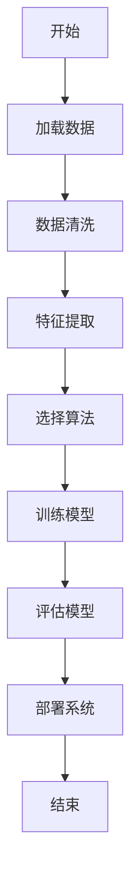
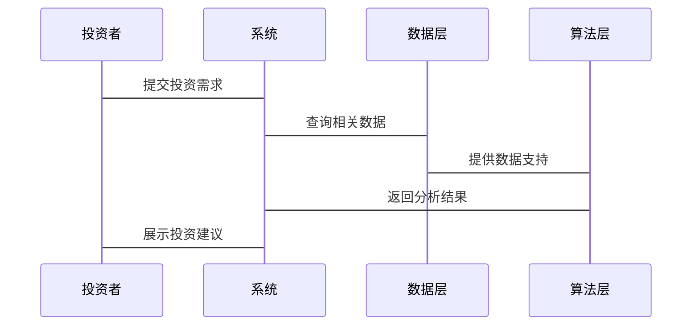

                 


# AI Agent在智能风险投资决策中的应用

## 关键词
AI Agent、风险投资、智能决策、机器学习、投资策略、金融数据、风险管理

## 摘要
随着人工智能技术的快速发展，AI Agent在金融领域的应用日益广泛。本文深入探讨了AI Agent在风险投资决策中的应用，分析了其核心原理、技术实现和系统设计。通过实际案例和项目实战，展示了AI Agent如何利用机器学习和大数据分析提升投资决策的效率和准确性，为风险投资行业带来了新的可能性。

---

## 第一部分: AI Agent在智能风险投资决策中的应用概述

### 第1章: AI Agent与风险投资的背景介绍

#### 1.1 AI Agent的基本概念
- **1.1.1 什么是AI Agent**
  AI Agent（人工智能代理）是指能够感知环境、自主决策并执行任务的智能实体。在风险投资中，AI Agent可以用于分析市场数据、评估投资项目并制定投资策略。

- **1.1.2 AI Agent的核心特征**
  - 智能性：能够理解和处理复杂信息。
  - 自主性：能够在无外部干预的情况下执行任务。
  - 适应性：能够根据环境变化调整决策。

- **1.1.3 AI Agent与传统投资决策的区别**
  AI Agent通过算法和大数据分析实现自动化决策，而传统投资决策依赖于人类经验和主观判断。

#### 1.2 风险投资的基本原理
- **1.2.1 风险投资的定义与特点**
  风险投资是指将资金投资于高风险、高回报的项目或企业，以期获得高额收益。

- **1.2.2 风险投资的核心决策过程**
  包括项目筛选、估值、投资组合优化和风险管理。

- **1.2.3 风险投资中的主要挑战**
  - 市场波动性大。
  - 数据不完全或不准确。
  - 项目风险难以量化。

#### 1.3 AI Agent在风险投资中的应用背景
- **1.3.1 数据量与复杂性增加**
  随着市场的复杂化，传统方法难以处理海量数据。

- **1.3.2 传统决策方法的局限性**
  人类投资者容易受到情绪影响，决策效率低。

- **1.3.3 市场波动与不确定性**
  AI Agent能够快速适应市场变化，降低不确定性对投资决策的影响。

### 第2章: AI Agent在风险投资中的应用背景

#### 2.1 当前风险投资中的技术挑战
- **2.1.1 数据量与复杂性增加**
  风险投资涉及大量数据，包括市场数据、财务数据和行业数据。

- **2.1.2 传统决策方法的局限性**
  传统方法依赖经验，难以处理复杂场景。

- **2.1.3 市场波动与不确定性**
  市场波动频繁，不确定性高，需要快速决策能力。

#### 2.2 AI技术在金融领域的应用现状
- **2.2.1 AI在金融分析中的应用**
  通过自然语言处理（NLP）分析新闻和报告，预测市场趋势。

- **2.2.2 AI在投资决策中的应用**
  使用机器学习模型进行股票筛选和投资组合优化。

- **2.2.3 AI在风险管理中的应用**
  利用深度学习模型预测风险并制定应对策略。

#### 2.3 AI Agent在风险投资中的独特优势
- **2.3.1 高效的数据处理能力**
  AI Agent能够快速处理大量数据，提取关键信息。

- **2.3.2 实时决策能力**
  通过实时数据分析，AI Agent可以做出快速决策。

- **2.3.3 智能化与自适应能力**
  AI Agent能够根据市场变化自适应调整策略。

---

## 第二部分: AI Agent的核心原理与技术实现

### 第3章: AI Agent的核心原理

#### 3.1 AI Agent的基本架构
- **3.1.1 感知层**
  通过传感器或数据接口获取环境信息。

- **3.1.2 决策层**
  使用算法对感知信息进行分析，制定决策。

- **3.1.3 执行层**
  执行决策并反馈结果。

#### 3.2 AI Agent的决策机制
- **3.2.1 基于规则的决策**
  根据预设规则做出决策，适用于简单场景。

- **3.2.2 基于学习的决策**
  通过机器学习模型进行预测和决策。

- **3.2.3 基于强化学习的决策**
  通过奖励机制优化决策策略。

#### 3.3 AI Agent的学习与优化
- **3.3.1 监督学习**
  使用带标签的数据进行训练，适用于分类和回归任务。

- **3.3.2 无监督学习**
  通过聚类分析发现数据中的潜在模式。

- **3.3.3 强化学习**
  通过试错和奖励机制优化决策策略。

### 第4章: AI Agent在风险投资中的技术实现

#### 4.1 数据采集与处理
- **4.1.1 数据来源**
  包括公开市场数据、新闻、社交媒体和公司财务数据。

- **4.1.2 数据清洗与预处理**
  去除噪声数据，标准化数据格式。

- **4.1.3 数据特征提取**
  提取关键特征，如市盈率、营收增长率等。

#### 4.2 模型训练与优化
- **4.2.1 选择合适的算法**
  根据任务需求选择回归、分类或聚类算法。

- **4.2.2 模型训练过程**
  使用训练数据训练模型，并验证模型性能。

- **4.2.3 模型评估与优化**
  通过交叉验证和调参优化模型性能。

#### 4.3 系统集成与部署
- **4.3.1 系统架构设计**
  包括数据层、算法层和用户界面层。

- **4.3.2 接口设计与实现**
  设计API接口，实现与其他系统的交互。

- **4.3.3 系统部署与维护**
  部署模型并监控系统运行状态。

---

## 第三部分: AI Agent在风险投资中的系统设计与实现

### 第5章: 系统分析与架构设计方案

#### 5.1 问题场景介绍
- **5.1.1 风险投资中的主要问题**
  数据复杂、决策效率低、风险难以量化。

- **5.1.2 系统目标**
  提供智能化的投资决策支持，提高投资效率和准确性。

- **5.1.3 系统边界**
  系统仅处理投资相关的数据和决策，不涉及交易执行。

#### 5.2 项目介绍
- **5.2.1 项目目标**
  开发一个基于AI Agent的风险投资决策支持系统。

- **5.2.2 项目范围**
  包括数据采集、模型训练和系统部署。

#### 5.3 系统功能设计
- **5.3.1 领域模型设计**
  使用Mermaid类图描述系统中的实体和关系。

- **5.3.2 系统架构设计**
  使用Mermaid架构图描述系统的整体架构。

- **5.3.3 系统接口设计**
  设计API接口，定义输入输出格式。

- **5.3.4 系统交互设计**
  使用Mermaid序列图描述用户与系统的交互流程。

#### 5.4 项目核心实现
- **5.4.1 环境安装**
  安装必要的开发工具和库，如Python、TensorFlow、PyTorch等。

- **5.4.2 系统核心实现**
  实现AI Agent的核心功能，包括数据处理、模型训练和决策逻辑。

- **5.4.3 代码实现**
  提供关键代码示例，解释代码的功能和实现细节。

#### 5.5 项目实战
- **5.5.1 实际案例分析**
  通过具体案例展示AI Agent在风险投资中的应用。

- **5.5.2 代码应用解读**
  解释代码在实际案例中的应用和效果。

- **5.5.3 项目小结**
  总结项目成果和经验教训。

### 第6章: 总结与展望

#### 6.1 总结
- AI Agent在风险投资中的应用潜力巨大，能够显著提升投资效率和准确性。

#### 6.2 未来展望
- 进一步优化算法，提升模型性能。
- 扩展应用场景，探索更多可能性。
- 加强风险管理，确保系统稳定运行。

---

## 附录: 最佳实践与注意事项

### 6.1 最佳实践
- 数据预处理是关键，确保数据质量和准确性。
- 模型选择要根据具体任务需求，避免盲目追求复杂性。
- 系统设计要注重可扩展性和可维护性。

### 6.2 注意事项
- 风险管理是系统设计中的重点，要充分考虑市场波动和不确定性。
- 系统部署要确保安全性，防止数据泄露和攻击。

### 6.3 小结
通过本文的详细分析和实际案例，读者可以全面了解AI Agent在风险投资中的应用，并为未来的实践提供参考。

---

## 代码实现示例

### 1. 数据处理代码
```python
import pandas as pd

# 加载数据
data = pd.read_csv('investment_data.csv')

# 数据清洗
data.dropna(inplace=True)
data = data[~data['sector'].isnull()]
```

### 2. 模型训练代码
```python
from sklearn.model import LinearRegression

# 训练模型
model = LinearRegression()
model.fit(X_train, y_train)

# 预测结果
y_pred = model.predict(X_test)
```

### 3. 决策逻辑代码
```python
def decide_investment机会(value):
    if value > 0.7:
        return "买入"
    elif value < 0.3:
        return "卖出"
    else:
        return "观望"
```

---

## 数学公式

### 1. 线性回归模型
$$ y = \beta_0 + \beta_1 x + \epsilon $$

### 2. 逻辑回归模型
$$ P(y=1|x) = \frac{1}{1 + e^{-(\beta_0 + \beta_1 x)}} $$

### 3. 强化学习奖励函数
$$ R(s, a) = r_1 + r_2 + \dots + r_n $$

---

## 实体关系图（ER图）



---

## 算法流程图（使用Mermaid）



---

## 类图（使用Mermaid）


---

## 序列图（使用Mermaid）



---

## 项目小结
通过本文的详细分析和实际案例，我们可以看到AI Agent在风险投资中的巨大潜力。未来，随着技术的不断进步，AI Agent将在金融领域发挥越来越重要的作用，为投资者提供更加智能化和个性化的决策支持。

