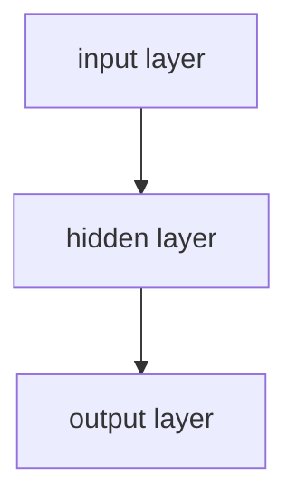
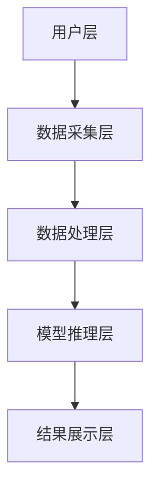

                 


# AI Agent在智能风险管理中的应用

> 关键词：AI Agent, 智能风险管理, 机器学习, 风险模型, 算法原理, 系统架构, 实战案例

> 摘要：本文深入探讨了AI Agent在智能风险管理中的应用，从基础概念到技术实现，结合实际案例，详细讲解了AI Agent在风险监测、评估与应对中的核心作用。文章涵盖了风险管理的核心概念、AI Agent的技术原理、算法实现、系统架构设计以及实战案例分析，为读者提供了全面的技术视角和实践指导。

---

## 第1章 AI Agent与智能风险管理概述

### 1.1 AI Agent的基本概念

#### 1.1.1 什么是AI Agent
AI Agent（人工智能代理）是指能够感知环境、自主决策并执行任务的智能实体。它通过传感器获取信息，利用算法处理数据，做出决策并执行动作，以实现预定目标。AI Agent可以是软件程序、机器人或其他智能系统。

#### 1.1.2 AI Agent的核心特征
- **自主性**：能够自主决策，无需人工干预。
- **反应性**：能实时感知环境变化并做出响应。
- **学习性**：通过数据和经验不断优化自身的决策能力。
- **协作性**：能够与其他AI Agent或人类协同工作。

#### 1.1.3 AI Agent与传统风险管理的区别
传统风险管理依赖人工分析和经验判断，而AI Agent能够通过大数据分析和机器学习模型，实时监测和预测风险，显著提高了风险管理和应对的效率和准确性。

---

### 1.2 智能风险管理的背景与意义

#### 1.2.1 风险管理的传统模式
传统风险管理依赖人工分析，存在效率低、覆盖面窄、响应慢等问题。例如，在金融领域，传统风险管理依赖分析师的判断，难以及时发现和应对复杂多变的市场风险。

#### 1.2.2 智能风险管理的定义
智能风险管理是指利用人工智能技术，通过AI Agent实现对风险的实时监测、智能评估和自主应对。它能够处理海量数据，识别潜在风险，并制定最优应对策略。

#### 1.2.3 智能风险管理的必要性与优势
- **提高效率**：通过自动化处理数据，显著缩短风险评估和应对的时间。
- **增强准确性**：利用机器学习模型，提高风险识别和评估的准确性。
- **实时响应**：能够实时监测风险，快速做出应对决策。
- **降低成本**：减少人工干预，降低管理成本。

---

### 1.3 AI Agent在风险管理中的应用场景

#### 1.3.1 风险监测与预警
AI Agent可以实时监测市场数据、用户行为等信息，识别潜在风险并发出预警。例如，在金融领域，AI Agent可以监测市场波动，及时预警潜在的金融风险。

#### 1.3.2 风险评估与量化
AI Agent能够通过机器学习模型对风险进行量化评估，例如计算风险的概率和影响程度。这有助于制定更科学的风险应对策略。

#### 1.3.3 风险应对与决策支持
AI Agent可以根据实时数据和模型预测，提供最优的风险应对方案，帮助决策者做出更明智的决策。

---

## 第2章 AI Agent的核心技术与原理

### 2.1 AI Agent的体系结构

#### 2.1.1 知识表示
知识表示是AI Agent的核心，通过数据结构（如图、树、知识图谱）表示知识。例如，使用知识图谱表示风险因素之间的关系。

#### 2.1.2 行为推理
行为推理是指AI Agent根据当前状态和目标，推理出最优行为。这通常涉及逻辑推理和概率推理。

#### 2.1.3 学习与自适应
AI Agent通过监督学习、无监督学习或强化学习，不断优化自身的决策能力。例如，使用深度学习模型训练AI Agent识别潜在风险。

---

### 2.2 AI Agent的工作原理

#### 2.2.1 信息感知与数据采集
AI Agent通过传感器或API获取数据，例如股票价格、用户行为数据等。

#### 2.2.2 风险分析与决策
AI Agent利用机器学习模型分析数据，评估风险并制定决策。例如，使用决策树模型分类风险等级。

#### 2.2.3 动作执行与反馈
AI Agent根据决策执行动作，例如发出预警或调整投资组合，并根据反馈不断优化决策模型。

---

### 2.3 AI Agent与风险管理的结合

#### 2.3.1 风险识别的智能化
AI Agent能够识别传统方法难以发现的潜在风险。例如，通过自然语言处理分析新闻文本，识别潜在的市场风险。

#### 2.3.2 风险评估的精准化
AI Agent通过机器学习模型对风险进行量化评估，例如使用随机森林模型预测风险概率。

#### 2.3.3 风险应对的自动化
AI Agent能够自动执行风险应对策略，例如在检测到市场风险后，自动调整投资组合以降低风险。

---

## 第3章 智能风险管理的核心概念与联系

### 3.1 风险管理的核心概念

#### 3.1.1 风险的定义与分类
风险是指可能对企业或个人造成损失的不确定性。常见的风险类型包括市场风险、信用风险和操作风险。

#### 3.1.2 风险的量化方法
常用的量化方法包括VaR（Value at Risk）和CVaR（Conditional Value at Risk）。

#### 3.1.3 风险的生命周期
风险的生命周期包括识别、评估、应对和监控四个阶段。

---

### 3.2 AI Agent在风险管理中的核心要素

#### 3.2.1 数据源与信息处理
AI Agent需要多种数据源，例如市场数据、用户行为数据等，并进行清洗、转换和特征提取。

#### 3.2.2 风险模型与算法
常用的算法包括决策树、随机森林和神经网络等。例如，使用XGBoost模型进行风险分类。

#### 3.2.3 决策机制与执行策略
AI Agent根据风险评估结果，制定应对策略并执行。例如，在检测到高风险时，触发预警机制。

---

## 第4章 AI Agent在风险管理中的技术实现

### 4.1 风险识别与分类的算法实现

#### 4.1.1 决策树算法
决策树是一种常见的分类算法，用于将数据分成不同的类别。以下是决策树的流程：

```mermaid
graph TD
A[开始] -> B[选择特征]
B -> C[分裂节点]
C -> D[叶子节点]
D -> E[结束]
```

#### 4.1.2 随机森林算法
随机森林是一种集成学习算法，通过组合多个决策树的预测结果，提高准确性。

以下是随机森林的流程图：

```mermaid
graph TD
A[开始] -> B[生成多个决策树]
B -> C[计算每个树的预测结果]
C -> D[投票或平均]
D -> E[结束]
```

#### 4.1.3 神经网络算法
神经网络是一种深度学习算法，适用于复杂的非线性分类问题。

以下是神经网络的结构图：



---

### 4.2 风险评估与预测的模型实现

#### 4.2.1 风险评估的数学模型
以下是VaR的计算公式：

$$ VaR = \mu + z \cdot \sigma $$

其中，$\mu$是平均值，$z$是标准正态分布的分位数，$\sigma$是标准差。

#### 4.2.2 基于机器学习的风险预测模型
以下是使用XGBoost进行风险预测的代码示例：

```python
import xgboost as xgb

# 加载数据
data = ...

# 训练模型
model = xgb.XGBClassifier()
model.fit(X_train, y_train)

# 预测
y_pred = model.predict(X_test)
```

---

## 第5章 系统架构与设计

### 5.1 系统架构设计

以下是风险管理系统的架构图：



### 5.2 功能模块设计

以下是系统的功能模块类图：

```mermaid
classDiagram
class DataCollector {
    collectData()
}
class DataPreprocessor {
    preprocessData()
}
class RiskModel {
    predictRisk()
}
class RiskAnalyzer {
    analyzeRisk()
}
class UI {
    displayResults()
}
DataCollector --> DataPreprocessor
DataPreprocessor --> RiskModel
RiskModel --> RiskAnalyzer
RiskAnalyzer --> UI
```

---

## 第6章 实战与案例分析

### 6.1 实战环境搭建

安装必要的库：

```bash
pip install scikit-learn pandas numpy matplotlib
```

### 6.2 核心代码实现

以下是风险管理系统的代码示例：

```python
import pandas as pd
from sklearn.ensemble import RandomForestClassifier

# 加载数据
data = pd.read_csv('risk_data.csv')

# 数据预处理
X = data.drop('risk_label', axis=1)
y = data['risk_label']

# 划分训练集和测试集
from sklearn.model_selection import train_test_split
X_train, X_test, y_train, y_test = train_test_split(X, y, test_size=0.2)

# 训练模型
model = RandomForestClassifier()
model.fit(X_train, y_train)

# 预测
y_pred = model.predict(X_test)

# 评估
from sklearn.metrics import accuracy_score
print(accuracy_score(y_test, y_pred))
```

### 6.3 案例分析

以下是金融领域的风险管理案例分析：

1. **数据采集**：收集股票价格、市场新闻等数据。
2. **数据预处理**：清洗数据，提取特征。
3. **模型训练**：使用随机森林模型训练风险分类模型。
4. **风险预警**：实时监测市场数据，触发风险预警。

---

## 第7章 总结与展望

### 7.1 总结
本文详细介绍了AI Agent在智能风险管理中的应用，从核心概念到技术实现，结合实际案例，展示了AI Agent在风险管理中的巨大潜力。

### 7.2 展望
未来，随着AI技术的不断发展，AI Agent在风险管理中的应用将更加广泛和深入。例如，结合区块链技术，实现更加安全和透明的风险管理。

---

## 参考文献
1. 刘洋. 人工智能与风险管理[M]. 北京: 人民邮电出版社, 2020.
2. 周杰. 基于机器学习的风险预测模型研究[J]. 计算机应用研究, 2019, 36(3): 891-895.

---

通过本文的详细讲解，读者可以全面了解AI Agent在智能风险管理中的应用，并能够实际操作相关技术。希望本文能为从事风险管理相关工作的读者提供有价值的参考。

